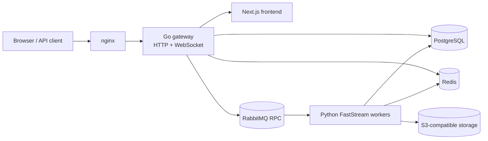

# OWT — Overwatch Tournament Platform

[](https://github.com/CraazzzyyFoxx/overwatch-tournaments/actions/workflows/lint-backend.yml)
[](https://github.com/CraazzzyyFoxx/overwatch-tournaments/actions/workflows/test-backend.yml)
[](https://github.com/CraazzzyyFoxx/overwatch-tournaments/actions/workflows/ci-gateway.yml)
[](https://github.com/CraazzzyyFoxx/overwatch-tournaments/actions/workflows/ci-frontend.yml)
[](https://github.com/CraazzzyyFoxx/overwatch-tournaments/actions/workflows/test-backend.yml)
[](./LICENSE)

OWT is a multi-tenant platform for running Overwatch tournaments from registration to post-tournament analytics. It combines public tournament history and player statistics with organizer tooling for workspaces, brackets, live drafts, map vetoes, match-log processing, achievements, streams, and access control.

- **Live platform:** <https://owt.craazzzyyfoxx.me>
- **API documentation:** <https://owt.craazzzyyfoxx.me/api/docs>
- **Documentation map:** [docs/README.md](./docs/README.md)
- **System architecture:** [docs/architecture.md](./docs/architecture.md)
- **Database model:** [docs/database_erd.md](./docs/database_erd.md)
- **Contributing:** [CONTRIBUTING.md](./CONTRIBUTING.md)

## What OWT does

### For players and spectators

- Browse tournaments, divisions, teams, matches, maps, heroes, and player performance.
- Register teams, complete check-in, and follow tournament progress.
- Watch bracket, standings, map-veto, draft, analytics-job, and stream updates in real time.
- Link Discord, Twitch, and Battle.net identities to one OWT account.
- Follow live Twitch channels attached to a tournament.

### For organizers

- Run isolated workspaces with custom branding, domains, memberships, API keys, and RBAC.
- Manage tournament registration, roster shapes, check-in, stages, brackets, standings, and lifecycle transitions.
- Synchronize tournament data with Challonge and Google Sheets.
- Build balanced teams with a native Rust multi-objective solver or run an interactive captain draft.
- Configure map pools and pick/ban veto sessions.
- Upload and parse Overwatch match logs, calculate statistics, evaluate achievements, and run post-tournament analytics.
- Gate registration or check-in through Discord/Twitch subscription requirements.
- Operate a Discord bot for log uploads, commands, and notifications.

## Architecture

OWT is a monorepo with one public edge and headless backend workers:



The Go gateway is the only HTTP/WebSocket backend entry point. It validates JWTs, applies edge policy, maps REST routes to request/reply RPC over RabbitMQ, proxies the frontend, serves API documentation, caches anonymous reads, and relays Redis-backed realtime events. Python services expose no HTTP API; they share SQLAlchemy models and cross-service infrastructure from `backend/shared/`.

Production places Traefik in front of the repository-managed nginx edge for TLS termination. See [docs/architecture.md](./docs/architecture.md) for request flow, messaging guarantees, multitenancy, realtime replay, and deployment topology.

### Backend services

| Directory                                                              | Runtime                             | Responsibility                                                                                                     |
| ---------------------------------------------------------------------- | ----------------------------------- | ------------------------------------------------------------------------------------------------------------------ |
| [`backend/app-service`](./backend/app-service/README.md)               | `app-svc`                           | Public data API, statistics, workspace administration, metadata, and binary assets                                 |
| [`backend/identity-service`](./backend/identity-service/README.md)     | `identity-svc`                      | JWT sessions, OAuth, RBAC, memberships, API keys, custom domains, and player linking                               |
| [`backend/tournament-service`](./backend/tournament-service/README.md) | `tournament-svc`                    | Tournament lifecycle, registration, brackets, standings, Challonge/Sheets sync, map veto, and transactional outbox |
| [`backend/parser-service`](./backend/parser-service/README.md)         | `parser-svc`                        | Match-log ingestion, parsing, rank synchronization, achievements, and backfills                                    |
| [`backend/balancer-service`](./backend/balancer-service/README.md)     | `balancer-svc`                      | Genetic team balancing, native Rust `tournament_balancer`, and live captain drafts                                            |
| [`backend/analytics-service`](./backend/analytics-service/README.md)   | `analytics-svc`, `analytics-worker` | Analytics RPC plus long-running ML training and inference jobs                                                     |
| [`backend/stream-service`](./backend/stream-service/README.md)         | `stream-svc`                        | Twitch live-status polling and public tournament stream state                                                      |
| [`backend/discord-service`](./backend/discord-service/README.md)       | `discord-worker`                    | Discord bot, match-log upload, notifications, and commands                                                         |
| [`backend/shared`](./backend/shared/README.md)                         | library                             | Shared ORM models, schemas, tenancy, RBAC, messaging, and observability                                            |

The edge implementation is documented separately in [`gateway/README.md`](./gateway/README.md). Frontend conventions and scripts live in [`frontend/README.md`](./frontend/README.md).

## Technology stack

| Layer                   | Technologies                                                                                                  |
| ----------------------- | ------------------------------------------------------------------------------------------------------------- |
| Frontend                | Next.js 16.2, React 19.2, TypeScript 5.9, Tailwind CSS 4, Radix/Shadcn, TanStack Query/Table, Zustand, Vitest |
| Gateway                 | Go 1.25, `net/http`, RabbitMQ, Redis, PostgreSQL/pgx, OpenTelemetry                                           |
| Backend                 | Python 3.14, FastStream, SQLAlchemy 2, Pydantic 2, Alembic, pytest                                            |
| Balancing and analytics | Rust `tournament_balancer`, OpenSkill, LightGBM/XGBoost, Bayesian and Monte Carlo workflows                              |
| Data and messaging      | PostgreSQL 16, Redis Stack, RabbitMQ 3.13, S3-compatible object storage                                       |
| Operations              | Docker Compose, nginx, Prometheus, Grafana, Loki, Tempo, OpenTelemetry Collector, Sentry                      |

## Repository layout

```text
.
├── frontend/                   # Next.js application
├── gateway/                    # Sole HTTP/WebSocket gateway
├── backend/
│   ├── shared/                 # Shared Python package and ORM source of truth
│   ├── *-service/              # Headless FastStream workers
│   ├── migrations/             # Alembic migrations
│   └── env/                    # Per-service environment templates
├── nginx/                      # Internal HTTP edge
├── monitoring/                 # Metrics, logs, traces, dashboards, and alerts
├── loadtests/                  # Locust scenarios
├── ops/backup/                 # Backup tooling
├── docs/                       # Architecture, data model, runbooks, and designs
├── docker-compose.yml          # Development stack
├── docker-compose.production.yml
└── Makefile                    # Common development and operations commands
```

## Quick start with Docker

### Prerequisites

- Git
- Docker Engine or Docker Desktop with Docker Compose v2
- `make` for the convenience commands below; every target is a thin wrapper around `docker compose`

Host toolchains are optional when using Docker. Direct development requires Python 3.14 with [uv](https://docs.astral.sh/uv/), Bun, and Go 1.25.

### 1. Clone the repository

```bash
git clone https://github.com/CraazzzyyFoxx/overwatch-tournaments.git
cd overwatch-tournaments
```

### 2. Create development environment files

Copy every maintained template without modifying the templates themselves:

```bash
for file in backend/env/*.env.example; do cp "$file" "${file%.example}"; done
cp frontend/.env.example frontend/.env.local
```

Create the root `.env` used by Docker Compose. These values are suitable only for local development; use generated secrets in any shared or production environment.

```dotenv
COMPOSE_PROFILES=db
APP_PORT=80
GATEWAY_HOST_PORT=8080

RABBITMQ_DEFAULT_USER=admin
RABBITMQ_DEFAULT_PASS=secure_password

POSTGRES_USER=postgres
POSTGRES_PASSWORD=your_secure_password_here
POSTGRES_DB=aqt_db
```

The RabbitMQ and PostgreSQL values must match `backend/env/common.env`. Replace `JWT_SECRET_KEY` in `backend/env/auth.env` with at least 32 random characters. OAuth, Challonge, Twitch, Discord, Battle.net, S3, analytics, and observability credentials are feature-specific; their templates explain when they are required.

### 3. Start the stack and migrate the database

```bash
make dev-up
make migrate
```

`COMPOSE_PROFILES=db` enables the local PostgreSQL container. Without it, the Compose file expects the database settings in `backend/env/common.env` to point at an external PostgreSQL instance.

Open:

- Application: <http://localhost>
- Public API docs: <http://localhost/api/docs>
- Gateway directly: <http://localhost:8080>
- RabbitMQ management: <http://localhost:15672>

Start optional long-running workers for ML jobs and Discord integration:

```bash
make dev-up-full
```

### 4. Inspect or stop the stack

```bash
make dev-health
make dev-logs
make dev-down
```

## Local development without rebuilding containers

### Backend

The backend is one uv workspace. Service code is bind-mounted into development containers and FastStream reloads it automatically.

```bash
cd backend
uv sync
```

Apply migrations and run the containerized backend suite from the repository root:

```bash
make migrate
make test
```

### Frontend

```bash
cd frontend
bun install --frozen-lockfile
bun run dev
```

The browser uses same-origin `/api/...` paths. Server-side Next.js requests use `NEXT_INTERNAL_API_URL`, which defaults to the gateway address configured in `frontend/.env.local`.

### Gateway

```bash
cd gateway
go test ./...
go run ./cmd/gateway
```

Gateway configuration is documented in `backend/env/gateway.env.example` and [`gateway/README.md`](./gateway/README.md).

## Common commands

| Command              | Purpose                                                     |
| -------------------- | ----------------------------------------------------------- |
| `make dev-build`     | Build development images                                    |
| `make dev-up`        | Start the core development stack                            |
| `make dev-up-full`   | Start the core stack plus `workers` profile                 |
| `make dev-rebuild`   | Rebuild and restart the core stack                          |
| `make dev-health`    | Show container state and health                             |
| `make dev-logs`      | Follow development logs                                     |
| `make migrate`       | Apply Alembic migrations in `app-svc`                       |
| `make test`          | Run backend pytest suite in `app-svc`                       |
| `make loadtest`      | Run headless Locust load tests                              |
| `make monitoring-up` | Start the separate monitoring stack                         |
| `make backup-run`    | Create and verify a database backup                         |
| `make prod-up`       | Start production (`PROD_SIZE=small\|medium\|large`)         |

Run `make help` for the complete command list. Component-specific log and restart targets are defined in the root [`Makefile`](./Makefile).

## Quality checks

```bash
make test                                          # backend pytest suite
cd backend && uv run bash scripts/lint.sh          # ruff check + format check
cd frontend && bun run typecheck && bun run lint
cd gateway && go test -race ./...
```

That is the fast local signal, not the full gate. The complete list — including the generated
artifacts CI verifies and the frontend's two test runners — is in
[`CONTRIBUTING.md`](./CONTRIBUTING.md#checks-before-you-push). GitHub Actions runs independent
backend lint/test, frontend, gateway, and production deployment workflows from
[`.github/workflows`](./.github/workflows).

## Operations

- **Production:** [`docker-compose.production.yml`](./docker-compose.production.yml) and `make prod-*`. Production scaling requires pgBouncer; the limits and non-replicable workers are documented in the [`Makefile`](./Makefile).
- **Monitoring:** [`monitoring/README.md`](./monitoring/README.md) covers Prometheus, Alertmanager, Grafana, Loki, Tempo, Promtail, exporters, and OpenTelemetry.
- **Backups:** [`docs/backup-rustfs.md`](./docs/backup-rustfs.md) covers PostgreSQL dumps, two-site S3 replication, verification, and restore.
- **Load testing:** [`loadtests/README.md`](./loadtests/README.md) documents Locust configuration, seeding, and reports.

Do not reuse development credentials in production. Keep secrets in untracked environment files, restrict the admin API documentation endpoint, configure allowed WebSocket origins, and place TLS termination in front of nginx. Security policy and vulnerability reporting: [`SECURITY.md`](./SECURITY.md).

## Credits

- [OverFast API](https://github.com/TeKrop/overfast-api) for Overwatch data.
- Special thanks to [Demogram](https://github.com/dmelackov), creator of the mix balancer and the inspiration behind OWT's tournament balancer.

## License

Copyright © 2024-2026 [CraazzzyyFoxx](https://github.com/CraazzzyyFoxx).

Licensed under the [GNU Affero General Public License v3.0](./LICENSE) with additional attribution terms under AGPL §7. Unmodified self-hosting is allowed. Modified network deployments must keep the work under the same license, publish the corresponding source to network users, and display the attribution required by the Additional Terms. The [`LICENSE`](./LICENSE) file is authoritative.
