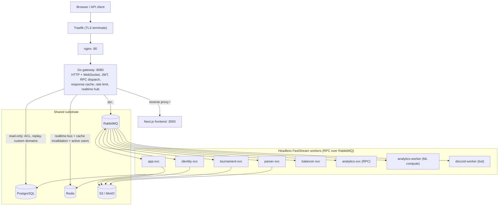

# OWT Architecture

This is the canonical, system-level overview of the Overwatch Tournament (OWT) platform:
its components, how a request flows through them, how services communicate, the data model,
multitenancy, and deployment topology. Per-component detail lives in the linked READMEs.

- Backend services: [`backend/README.md`](../backend/README.md)
- Gateway: [`gateway/README.md`](../gateway/README.md)
- Shared kernel: [`backend/shared/README.md`](../backend/shared/README.md)
- Frontend: [`frontend/README.md`](../frontend/README.md)
- Monitoring: [`monitoring/README.md`](../monitoring/README.md)
- Data model / ERD: [`docs/database_erd.md`](./database_erd.md)

## 1. The shape of the system

OWT is a **monorepo** with three tiers:

1. **Edge** — Traefik (TLS) → nginx → a **Go gateway**. The gateway is the only process that
   speaks HTTP and WebSocket to the outside world.
2. **Backend** — a set of **Python 3.13 headless workers** built on
   [FastStream](https://faststream.airt.ai/). They expose no HTTP; the gateway reaches them
   with **request/reply RPC over RabbitMQ**. All workers share one PostgreSQL database
   through a single ORM layer in [`backend/shared/`](../backend/shared/README.md).
3. **Frontend** — a [Next.js 16](https://nextjs.org/) app that talks to the backend through
   the gateway on a single origin.

The Go gateway is the single ingress. The Python services are headless workers driven
entirely by RabbitMQ; the only one that runs as a plain process rather than an RPC worker is
`discord-service`, a `discord.py` bot.

## 2. Request flow

1. **Traefik** terminates TLS (upstream of this repo).
2. **nginx** (`nginx/nginx.conf`) is the internal HTTP edge: it recovers the real client IP
   from Traefik's `X-Forwarded-For`, applies a defense-in-depth auth rate limit, allows
   WebSocket upgrades, caps body size at 12 MB (60 MB for match-log upload paths), and
   `proxy_pass`es to `gateway:8080` with runtime DNS re-resolution.
3. The **gateway** (`gateway/cmd/gateway/main.go`):
   - validates JWTs locally with the shared HS256 secret; for RBAC-gated routes it
     revalidates and enriches the principal via `rpc.identity.validate_token`;
   - dispatches typed REST routes to workers as **RabbitMQ request/reply RPC**
     (`rpc.app.*`, `rpc.identity.*`, `rpc.tournament.*`, `rpc.parser.*`, `rpc.balancer.*`,
     `rpc.analytics.*`), carrying an `x-deadline-ms` budget;
   - reverse-proxies non-API requests (`/`) to the Next.js frontend;
   - serves `/ws` and `/api/realtime/ws` from an in-process **Redis → WebSocket hub**,
     replaying missed events from `realtime.workspace_event`;
   - caches anonymous public reads in-process (30 s TTL), invalidated by the workers' Redis
     pub/sub;
   - enforces per-IP rate limits (auth / anonymous / WS custom-domain);
   - emits Prometheus metrics on `:9110` and OpenTelemetry spans to the collector.

## 3. Inter-service communication

Everything between the gateway and the workers, and between workers, runs on **RabbitMQ**
via FastStream. See [`backend/shared/README.md`](../backend/shared/README.md) for the code.

- **RPC (request/reply).** The gateway publishes to `rpc.<service>.<method>` with a
  `reply_to` + `correlation_id` and an `x-deadline-ms` header (matched by a per-message
  TTL). Workers return an `{ok, data, error}` envelope. Requests whose deadline has passed
  are dropped by `DeadlineDropMiddleware`; `prefetch_count` provides QoS backpressure;
  failures route to per-queue DLX/DLQ.
- **Domain events + transactional outbox.** State changes write an `event_outbox` row in the
  same DB transaction; a sweeper (in `tournament-svc`) drains it `FOR UPDATE SKIP LOCKED` and
  publishes with retry/backoff. For example, `balancer-svc` emits `balancer.balance.exported`
  → `analytics-worker` writes `analytics.balance_snapshot`.
- **Long jobs.** Durable queues decouple minutes-long compute: `balancer_jobs`,
  `analytics_job` / `analytics_train` / `analytics_infer`. Status/results live in Redis
  (balancer) or the `AnalyticsJob` table (analytics).
- **Realtime.** Workers publish to Redis topics (`tournament:{id}:bracket`,
  `encounter:{id}:map-veto`, `tournament:{id}:balancer`, `workspace:{id}:analytics_jobs`,
  workspace `logs.updated`) via `realtime.workspace_event` rows; the gateway relays them to
  WebSocket clients with replay.
- **Discord ingest.** The bot uploads match-log attachments as base64 to
  `UPLOAD_MATCH_LOG_QUEUE`; parser results return over a fanout `MATCH_LOG_RESULT_EXCHANGE`
  (per-replica exclusive queue) correlated by `ResultWaiter`.

## 4. Components

| Component | Kind | Responsibility |
| --- | --- | --- |
| [`gateway`](../gateway/README.md) | Go, HTTP/WS | Sole ingress: JWT, RPC dispatch, reverse proxy, realtime hub, response cache, rate limit, docs, metrics |
| [`app-service`](../backend/app-service/README.md) | RPC worker | Core read/data API (tournaments, players, teams, heroes, maps, matches, stats), workspace/user/metadata admin, binary assets, cache |
| [`identity-service`](../backend/identity-service/README.md) | RPC worker | JWT auth, Discord OAuth, RBAC, workspace membership, custom domains/subdomains, API keys, player linking, service tokens, SSO |
| [`tournament-service`](../backend/tournament-service/README.md) | RPC worker + scheduler | Tournament lifecycle, registration, brackets/standings, Challonge + Google Sheets sync, map veto, state machine, outbox sweeper |
| [`parser-service`](../backend/parser-service/README.md) | RPC worker + scheduler | Match-log ingestion/parsing, OverFast rank fetch, achievement evaluation, MVP-impact backfill |
| [`balancer-service`](../backend/balancer-service/README.md) | RPC worker | Genetic team balancing (native Rust `moo_core`) + live draft + draft clock |
| [`analytics-service`](../backend/analytics-service/README.md) | 2 workers | `analytics-svc` (RPC reads/mutations/job-control) + `analytics-worker` (heavy ML: v1 OpenSkill shifts, v2 ML pipeline) |
| [`discord-service`](../backend/discord-service/README.md) | bot | discord.py bot: match-log upload, notifications, commands |
| [`shared`](../backend/shared/README.md) | library | Single-source ORM + cross-service kernel (models, repository, services, rpc, messaging, tenancy, rbac, observability, clients) |
| [`frontend`](../frontend/README.md) | Next.js | User-facing app + white-label multidomain |

## 5. Data model & multitenancy

All services share **one PostgreSQL database** with **one SQLAlchemy metadata** defined in
`backend/shared/core/db.py`. Domain boundaries are **Postgres schemas**: `auth`, `players`,
`public`, `tournament`, `matches`, `overwatch`, `overwatch_rank`, `balancer`,
`achievements`, `analytics`, `log_processing`, `realtime`. Full entity diagrams are in
[`docs/database_erd.md`](./database_erd.md).

- **Multitenancy.** `public.workspace` is the tenant root. Nearly every business table
  carries `workspace_id` (directly or transitively via `tournament` / `workspace_member`);
  global rows allow `workspace_id NULL`. A request's workspace is resolved from the host: a
  **subdomain** or a **verified custom domain**, via `backend/shared/tenancy/hostnames.py`.
  Roster, registration, draft, and achievements are anchored on `public.workspace_member`
  (unique per `workspace_id + player_id`).
- **Dual identity.** `auth.user` (login account, owned by identity-svc) is distinct from
  `players.user` (domain player, owned by app-svc), linked 1:0..1 via `auth_user_id`. A
  player can exist without a login ("shadow player").
- **RBAC.** Grant-only permission catalog + workspace system roles, with a
  `user_permission_deny` overlay. Bootstrapped from `backend/shared/rbac/`.
- **Migrations.** A single Alembic project under `backend/migrations/`. Run `make migrate`
  (alembic `upgrade head` inside `app-svc`).

## 6. Deployment topology

Four Compose files layer the deployments (details in [`backend/README.md`](../backend/README.md)
and [`monitoring/README.md`](../monitoring/README.md)):

- `docker-compose.yml` — dev/base (hot reload, local Postgres via the `db` profile, gateway
  published for direct testing). Profiles: `db`, `workers`, `monitoring`.
- `docker-compose.production.yml` — `:latest` images, external Postgres, `restart: always`,
  resource limits, gateway reachable only through nginx.
- `docker-compose.monitoring.yml` — a separate `owt-monitoring` project (Prometheus,
  Alertmanager, Grafana, Loki, Promtail, Tempo, OTel Collector, exporters).
- `docker-compose.gpu.yml` — NVIDIA override for `analytics-worker`.

Shared substrate: **PostgreSQL** (optionally behind pgBouncer), **Redis** (cache + realtime
bus + active-user counters), **RabbitMQ** (all RPC/events/jobs), **S3/MinIO** (avatars,
icons, match-log files). Workers that call external APIs (Discord, OverFast, Challonge, S3)
egress through the outbound `proxy` container (xray/shadowsocks).

## 7. Observability

- **Metrics** — Prometheus scrapes the gateway (`:9110`) and each worker's
  `WORKER_METRICS_PORT`.
- **Tracing** — OpenTelemetry spans from gateway and workers → OTel Collector → Tempo.
- **Logs** — structured JSON logs to `logs/` → Promtail → Loki.
- **Dashboards & alerts** — Grafana (Application Logs, Workers & Queues, Gateway, Tracing,
  Infrastructure) and Alertmanager → Discord.

See [`monitoring/README.md`](../monitoring/README.md).
