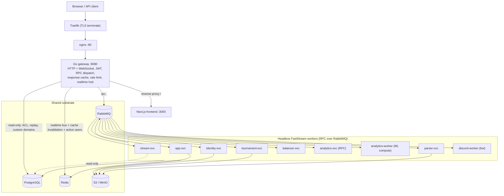

# OWT Architecture

This is the canonical, system-level overview of the Overwatch Tournament (OWT) platform:
its components, how a request flows through them, how services communicate, the data model,
multitenancy, and deployment topology. Per-component detail lives in the linked READMEs.

- Backend services: [`backend/README.md`](../backend/README.md)
- Gateway: [`gateway/README.md`](../gateway/README.md)
- Shared kernel: [`backend/shared/README.md`](../backend/shared/README.md)
- Frontend: [`frontend/README.md`](../frontend/README.md)
- Monitoring: [`monitoring/README.md`](../monitoring/README.md)
- Data model / ERD: [`docs/database_erd.md`](./database_erd.md)

## 1. The shape of the system

OWT is a **monorepo** with three tiers:

1. **Edge** — Traefik (TLS) → nginx → a **Go gateway**. The gateway is the only process that
   speaks HTTP and WebSocket to the outside world.
2. **Backend** — a set of **Python 3.14 headless workers** built on
   [FastStream](https://faststream.airt.ai/). They expose no HTTP; the gateway reaches them
   with **request/reply RPC over RabbitMQ**. All workers share one PostgreSQL database
   through a single ORM layer in [`backend/shared/`](../backend/shared/README.md).
3. **Frontend** — a [Next.js 16](https://nextjs.org/) app that talks to the backend through
   the gateway on a single origin.


```mermaid
flowchart TB
    Browser["Browser / API client"]
    Traefik["Traefik (TLS terminate)"]
    Nginx["nginx :80"]
    GW["Go gateway :8080\nHTTP + WebSocket, JWT, RPC dispatch,\nresponse cache, rate limit, realtime hub"]
    FE["Next.js frontend :3000"]

    subgraph Workers["Headless FastStream workers (RPC over RabbitMQ)"]
      APP["app-svc"]
      ID["identity-svc"]
      TOUR["tournament-svc"]
      PARSE["parser-svc"]
      BAL["balancer-svc"]
      ANARPC["analytics-svc (RPC)"]
      ANAW["analytics-worker (ML compute)"]
      STREAM["stream-svc"]
      DISC["discord-worker (bot)"]
    end

    subgraph Infra["Shared substrate"]
      PG[("PostgreSQL")]
      RD[("Redis")]
      MQ[("RabbitMQ")]
      S3[("S3 / MinIO")]
    end

    Browser --> Traefik --> Nginx --> GW
    GW -- "reverse proxy /" --> FE
    GW -- "rpc.<svc>.<method>" --> MQ
    MQ --> APP & ID & TOUR & PARSE & BAL & ANARPC & STREAM
    GW -- "read-only: ACL, replay, custom domains" --> PG
    GW -- "realtime bus + cache invalidation + active users" --> RD
    Workers --> PG
    Workers --> RD
    STREAM -. "read-only" .-> PG
    Workers --> MQ
    APP --> S3
    ID --> S3
    TOUR --> S3
    PARSE --> S3
    MQ --> ANAW
    MQ --> DISC
```

The Go gateway is the single ingress. The Python services are headless workers driven
entirely by RabbitMQ; the only one that runs as a plain process rather than an RPC worker is
`discord-service`, a `discord.py` bot.

## 2. Request flow

1. **Traefik** terminates TLS (upstream of this repo).
2. **nginx** (`nginx/nginx.conf`) is the internal HTTP edge: it recovers the real client IP
   from Traefik's `X-Forwarded-For`, enforces the per-IP DoS layer (`limit_req` / `limit_conn`
   zones for ordinary traffic, auth, WebSocket handshakes and the upload paths, with internal
   networks exempted via an empty zone key), applies anti-slowloris timeouts, allows
   WebSocket upgrades, caps body size at 12 MB (60 MB for match-log upload paths), and
   `proxy_pass`es to `gateway:8080` with runtime DNS re-resolution. It emits a JSON access log
   (`$uri` only — the WS token must never be logged) carrying `$limit_req_status`, which
   promtail turns into both Loki streams and Prometheus rejection counters. The limits ship in
   `limit_req_dry_run` mode pending calibration — see
   [`docs/superpowers/specs/2026-08-06-nginx-dos-hardening-design.md`](superpowers/specs/2026-08-06-nginx-dos-hardening-design.md).
   HTTP/2 attack surface belongs to Traefik (nginx only ever speaks HTTP/1.1 here) and
   L3/L4 to the hosting provider.
3. The **gateway** (`gateway/cmd/gateway/main.go`):
   - validates JWTs locally with the shared HS256 secret; for RBAC-gated routes it
     revalidates and enriches the principal via `rpc.identity.validate_token`;
   - dispatches typed REST routes to workers as **RabbitMQ request/reply RPC**
     (`rpc.app.*`, `rpc.identity.*`, `rpc.tournament.*`, `rpc.parser.*`, `rpc.balancer.*`,
     `rpc.analytics.*`), carrying an `x-deadline-ms` budget;
   - reverse-proxies non-API requests (`/`) to the Next.js frontend;
   - serves `/ws` and `/api/realtime/ws` from an in-process **Redis → WebSocket hub**,
     replaying missed events from `realtime.workspace_event`;
   - caches anonymous public reads in-process (30 s TTL), invalidated by the workers' Redis
     pub/sub;
   - enforces per-IP rate limits (auth / anonymous / WS custom-domain);
   - emits Prometheus metrics on `:9110` and OpenTelemetry spans to the collector.

## 3. Inter-service communication

Everything between the gateway and the workers, and between workers, runs on **RabbitMQ**
via FastStream. See [`backend/shared/README.md`](../backend/shared/README.md) for the code.

- **RPC (request/reply).** The gateway publishes to `rpc.<service>.<method>` with a
  `reply_to` + `correlation_id` and an `x-deadline-ms` header (matched by a per-message
  TTL). Workers return an `{ok, data, error}` envelope. Requests whose deadline has passed
  are dropped by `DeadlineDropMiddleware`; `prefetch_count` provides QoS backpressure;
  failures route to per-queue DLX/DLQ.
- **Domain events + transactional outbox.** State changes write an `event_outbox` row in the
  same DB transaction; a sweeper (in `tournament-svc`) drains it `FOR UPDATE SKIP LOCKED` and
  publishes with retry/backoff. For example, tournament mutations emit `tournament.changed`
  for cache invalidation and downstream workers.
- **Long jobs.** Durable queues decouple minutes-long compute: `balancer_jobs`,
  `analytics_job` / `analytics_train` / `analytics_infer`. Status/results live in Redis
  (balancer) or the `AnalyticsJob` table (analytics).
- **Realtime.** Workers publish to Redis topics (`tournament:{id}:bracket`,
  `encounter:{id}:map-veto`, `tournament:{id}:balancer`, `workspace:{id}:analytics_jobs`,
  workspace `logs.updated`) via `realtime.workspace_event` rows; the gateway relays them to
  WebSocket clients with replay. `workspace:{id}:subscriptions` is non-durable (no event row,
  no replay): one thin `subscription.updated` per resolve pass that actually moved a verdict,
  which the admin subscription views and the tournament hub refetch on.
  `tournament:{id}:streams` is likewise non-durable and, being spectator data, is
  publicly subscribable under the same `allowSpectateTournament` ("public unless hidden")
  rule as the bracket: `stream-svc` emits one thin `stream.updated` per tournament whose
  set of live channels actually changed — never one per channel, and never for a hidden
  tournament.
  `user:{id}:notifications` is non-durable in the same way — one thin `notification.created`
  per row `notify()` writes, with no event row and no replay, because a client that missed the
  signal refetches the inbox it is about to read anyway. Its ACL rule is self-only: the id in
  the topic must equal the caller's own, and unlike every other rule it grants the platform
  superuser no bypass — an operator's blanket read right over workspace data is not a licence
  to watch one person's inbox arrive.
- **Discord ingest.** The bot uploads match-log attachments as base64 to
  `UPLOAD_MATCH_LOG_QUEUE`; parser results return over a fanout `MATCH_LOG_RESULT_EXCHANGE`
  (per-replica exclusive queue) correlated by `ResultWaiter`.

## 4. Components

| Component | Kind | Responsibility |
| --- | --- | --- |
| [`gateway`](../gateway/README.md) | Go, HTTP/WS | Sole ingress: JWT, RPC dispatch, reverse proxy, realtime hub, response cache, rate limit, docs, metrics |
| [`app-service`](../backend/app-service/README.md) | RPC worker | Core read/data API (tournaments, players, teams, heroes, maps, matches, stats), workspace/user/metadata admin, binary assets, cache |
| [`identity-service`](../backend/identity-service/README.md) | RPC worker | JWT auth, Discord OAuth, RBAC, workspace membership, custom domains/subdomains, API keys, player linking, service tokens, SSO |
| [`tournament-service`](../backend/tournament-service/README.md) | RPC worker + scheduler | Tournament lifecycle, registration, brackets/standings, Challonge + Google Sheets sync, map veto, state machine, outbox sweeper |
| [`parser-service`](../backend/parser-service/README.md) | RPC worker + scheduler | Match-log ingestion/parsing, OverFast rank fetch, achievement evaluation, MVP-impact backfill |
| [`balancer-service`](../backend/balancer-service/README.md) | RPC worker | Genetic team balancing (native Rust `tournament_balancer`) + live draft + draft clock |
| [`analytics-service`](../backend/analytics-service/README.md) | 2 workers | `analytics-svc` (RPC reads/mutations/job-control) + `analytics-worker` (heavy ML: v1 OpenSkill shifts, v2 ML pipeline) |
| [`stream-service`](../backend/stream-service/README.md) | RPC worker + scheduler | Tournament stream live-status: Twitch Helix poll tick (app token), public `rpc.stream.*` reads. Owns no Postgres schema — live state is Redis-only |
| [`discord-service`](../backend/discord-service/README.md) | bot | discord.py bot: match-log upload, notifications, commands |
| [`shared`](../backend/shared/README.md) | library | Single-source ORM + cross-service kernel (models, repository, services, rpc, messaging, tenancy, rbac, observability, clients) |
| [`frontend`](../frontend/README.md) | Next.js | User-facing app + white-label multidomain |

## 5. Data model & multitenancy

All services share **one PostgreSQL database** with **one SQLAlchemy metadata** defined in
`backend/shared/core/db.py`. Domain boundaries are **Postgres schemas**: `auth`, `players`,
`public`, `tournament`, `matches`, `overwatch`, `overwatch_rank`, `balancer`,
`achievements`, `analytics`, `log_processing`, `realtime`. Full entity diagrams are in
[`docs/database_erd.md`](./database_erd.md).

- **Multitenancy.** `public.workspace` is the tenant root. Nearly every business table
  carries `workspace_id` (directly or transitively via `tournament` / `workspace_member`);
  global rows allow `workspace_id NULL`. A request's workspace is resolved from the host: a
  **subdomain** or a **verified custom domain**, via `backend/shared/tenancy/hostnames.py`.
  Roster, registration, draft, and achievements are anchored on `public.workspace_member`
  (unique per `workspace_id + player_id`).
- **Dual identity.** `auth.user` (login account, owned by identity-svc) is distinct from
  `players.user` (domain player, owned by app-svc), linked 1:0..1 via `auth_user_id`. A
  player can exist without a login ("shadow player"). Full reference: [`docs/users-identity.md`](./users-identity.md).
- **RBAC.** Grant-only permission catalog + workspace system roles, with a
  `user_permission_deny` overlay. Bootstrapped from `backend/shared/rbac/`.
- **Migrations.** A single Alembic project under `backend/migrations/`. `make migrate` runs
  `alembic upgrade head` inside a running dev `app-svc`; in production the release workflow
  (and `make prod-migrate`) runs it in a one-off container off the image being deployed, so
  the schema lands before the code that reads it.

## 6. Deployment topology

Four Compose files layer the deployments (details in [`backend/README.md`](../backend/README.md)
and [`monitoring/README.md`](../monitoring/README.md)):

- `docker-compose.yml` — dev/base (hot reload, local Postgres via the `db` profile, gateway
  published for direct testing). Profiles: `db`, `workers`, `monitoring`.
- `docker-compose.production.yml` — GHCR images (`ghcr.io/craazzzyyfoxx/owt-*`, tag
  `${IMAGE_TAG:-latest}`), external Postgres, `restart: always`, resource limits, gateway
  reachable only through nginx.
- `docker-compose.monitoring.yml` — a separate `owt-monitoring` project (Prometheus,
  Alertmanager, Grafana, Loki, Promtail, Tempo, OTel Collector, exporters).
- `docker-compose.gpu.yml` — NVIDIA override for `analytics-worker`.

Shared substrate: **PostgreSQL** (optionally behind pgBouncer), **Redis** (cache + realtime
bus + active-user counters), **RabbitMQ** (all RPC/events/jobs), **S3/MinIO** (avatars,
icons, match-log files). Workers that call external APIs (Discord, OverFast, Challonge, S3)
egress through the outbound `proxy` container (xray/shadowsocks).

**Releases.** Pushing a `v*` tag is the whole ritual:

```bash
git tag -a v1.2.0 -m "…" && git push origin v1.2.0
```

`.github/workflows/deploy-production.yml` then runs the four CI gates, builds all ten
images on GitHub-hosted runners and pushes them to GHCR (one runner per image,
registry-backed build cache), opens one ssh session to the production host that pulls the
tag, runs `alembic upgrade head` from the *new* image while the *old* containers still
serve, recreates the stack (`make prod-up`), and finally publishes the GitHub Release —
notes rendered from the Conventional Commit subjects since the previous tag by
[`ops/release/changelog.sh`](../ops/release/changelog.sh). The Release is written last on
purpose: it means "this is what production is running", not "somebody clicked publish".

Nothing builds on the server and no self-hosted runner takes part. `workflow_dispatch`
deploys a tag without the gates (an operator's call, and the only way out while CI is
red), and with `skip_build` it redeploys images that already exist — which is the
rollback. The remote half is [`ops/deploy/remote-deploy.sh`](../ops/deploy/remote-deploy.sh),
runnable by hand.

## 7. Observability

- **Metrics** — Prometheus scrapes the gateway (`:9110`) and each worker's
  `WORKER_METRICS_PORT`.
- **Tracing** — OpenTelemetry spans from gateway and workers → OTel Collector → Tempo
  *and* Sentry (Sentry Exporter). One OTLP stream, two backends: Grafana for the
  span-metrics/service-graph view, Sentry for traces sitting next to the Issues they
  caused. The Sentry SDKs emit no transactions of their own
  (`SENTRY_TRACES_SAMPLE_RATE=0`) and only link errors/logs to the OTel trace.
- **Logs** — structured JSON logs to `logs/` → Promtail → Loki.
- **Dashboards & alerts** — Grafana (Application Logs, Workers & Queues, Gateway, Tracing,
  Infrastructure) and Alertmanager → Discord.

See [`monitoring/README.md`](../monitoring/README.md).
