# ERD базы данных — anak-tournaments

Единая PostgreSQL-база, которую делят все Python-сервисы монорепы. ORM-модели
(SQLAlchemy) разложены по **доменным подпакетам** внутри
`backend/shared/models/<domain>/` — `identity/` (auth_user, rbac, oauth,
api_key, user, social, user_merge_audit), `tenancy/` (workspace, settings),
`catalog/` (hero, map, gamemode), `division_grid/`, `tournament/` (tournament,
stage, team, encounter, encounter_link, encounter_map, standings, computation,
challonge), `registration/`, `balancer/` (balance, draft), `matches/`,
`achievements/`, `analytics/`, `ranks/`, `ingestion/`, `preferences/`,
`platform/`. Физически таблицы разложены по **Postgres-схемам** — они же
служат границами доменов (имя подпакета не всегда совпадает с именем схемы:
напр. `ranks/` → схема `overwatch_rank`, `ingestion/` → `log_processing`).

Ниже — обзор схем, карта доменов и отдельная ER-диаграмма на каждый домен
(Mermaid `erDiagram`, рендерится в GitHub / VS Code / любом Mermaid-вьюере).

> **Актуальность.** Документ отражает финальное состояние после
> identity/workspace-рефактора и нормализаций Challonge / map-veto / draft /
> predictions. Alembic head — **`dbarch06`**. Сводка изменений — в конце
> файла («История изменений схемы»).

> Соглашение об именах на диаграммах: имя сущности = `SCHEMA_TABLE`, потому что
> одно и то же имя таблицы встречается в разных схемах (`auth.user` vs
> `players.user` vs `achievements.user`; `tournament.team` vs `balancer.team`;
> `tournament.tournament` vs `analytics.tournament`). Столбцы в диаграммах —
> это PK, FK, UK и ключевые бизнес-поля; широкие таблицы обрезаны (помечено
> `… прочие поля`). Пунктирные/серые сущности со звёздочкой `*` — «чужие»
> якорные таблицы из другого домена, показаны только для связи.

---

## Postgres-схемы

| Схема | Домен | Ключевые таблицы | Владелец (сервис) |
|-------|-------|------------------|-------------------|
| `auth` | Аутентификация и RBAC | `user`, `refresh_token`, `oauth_connections`, `api_key`, `roles`, `permissions`, `user_roles`, `role_permissions`, `user_permission_deny` | auth-service |
| `players` | Идентичность игрока | `user`, `social_account`, `social_account_visibility`, `user_merge_audit` | app-service |
| `public` | Воркспейсы, сетки дивизионов, инфра | `workspace`, `workspace_member`, `division_grid*`, `settings`, `event_outbox` | app-service |
| `tournament` | Структура турнира и сетка | `tournament`, `stage`, `stage_item`, `team`, `player`, `standing`, `encounter`, `encounter_link`, `challonge_*`, `computation_job` | tournament-service |
| `overwatch` | Справочник игры | `hero`, `map`, `gamemode` | app / parser |
| `overwatch_rank` | Телеметрия рангов OW | `rank_snapshot`, `battle_tag_state`, `fetch_log` | parser-service |
| `matches` | Разобранные матч-логи | `match`, `statistics`, `kill_feed`, `assists`, `mv_hero_global_stats` (MV) | parser-service |
| `balancer` | Регистрация и балансировка | `registration*`, `balance*`, `team*`, `tournament_config`, `draft_*` | balancer-service |
| `achievements` | Движок достижений | `rule`, `evaluation_result`, `override`, `evaluation_run` | parser / app |
| `analytics` | Аналитика и ML | `tournament`, `shifts`, `performance`, `standings_distribution`, `match_quality`, `ml_*`, `job`, … | analytics-service |
| `log_processing` | Загрузка/парсинг логов | `record`, `discord_channel` | parser / discord |
| `realtime` | Журнал realtime-событий | `workspace_event` | gateway (Go) |

Общие «хабы», к которым сходятся почти все домены:

- **`public.workspace`** — арендатор (мультитенантность). Почти всё скоупится по `workspace_id`.
- **`players.user`** — доменная идентичность игрока (может существовать без аккаунта — «shadow player» из логов/CSV).
- **`auth.user`** — учётная запись для входа; линк к `players.user` — `1:0..1`.
- **`workspace_member`** — якорь принадлежности игрока к воркспейсу (уникальность по `workspace_id + player_id`); на него по `workspace_member_id` ссылаются ростер (`tournament.player`), регистрации (`balancer.registration`), драфт (`draft_team`/`draft_player`/`draft_pick`) и достижения (`evaluation_result`/`override`). Денормализованной роли нет — роль выводится из RBAC.
- **`tournament.tournament`** — турнир; корень для стадий, команд, матчей, регистраций, аналитики.
- **`overwatch.hero`** — герой; на него ссылаются статистика, топ-герои регистрации, достижения.

---

## 0. Карта доменов (какие схемы на что ссылаются)

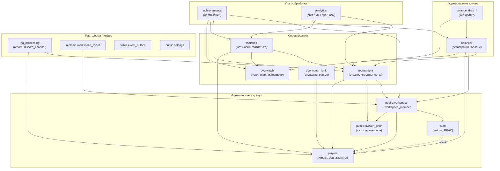

---

## 1. Аутентификация и RBAC (`auth`)

Учётные записи для входа, refresh-токены, OAuth-подключения, API-ключи и
ролевой доступ. RBAC — grant-only (роли → права) плюс **негативный overlay**
`user_permission_deny` (точечный запрет, перебивает даже суперюзера).

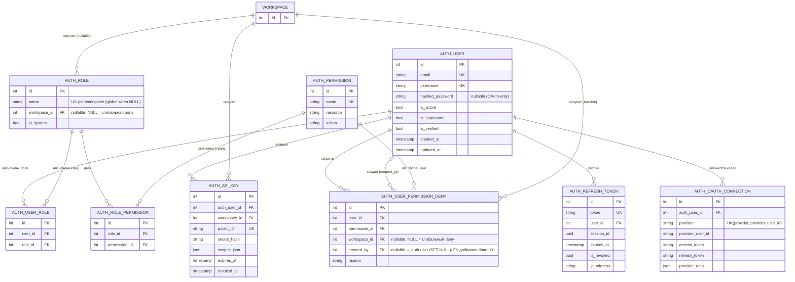

> **Гигиена индексов/FK (dbarch01).** Ассоциативные таблицы `auth.user_roles`
> и `auth.role_permissions` получили индексы на обе FK-колонки (раньше
> резолвинг прав и каскадные удаления делали seq-scan). FK `deny.created_by →
> auth.user` добавлен как `NOT VALID` + `VALIDATE` (SET NULL).

---

## 2. Идентичность игрока и воркспейсы (`players` + `public`)

`players.user` — доменный игрок (независим от `auth.user`, может быть без
аккаунта). Соц-идентичности (battlenet/discord/twitch/…) сведены в
`social_account` с overlay-видимостью по воркспейсам. `workspace_member`
привязывает игрока к арендатору и служит якорем для ростеров и достижений.

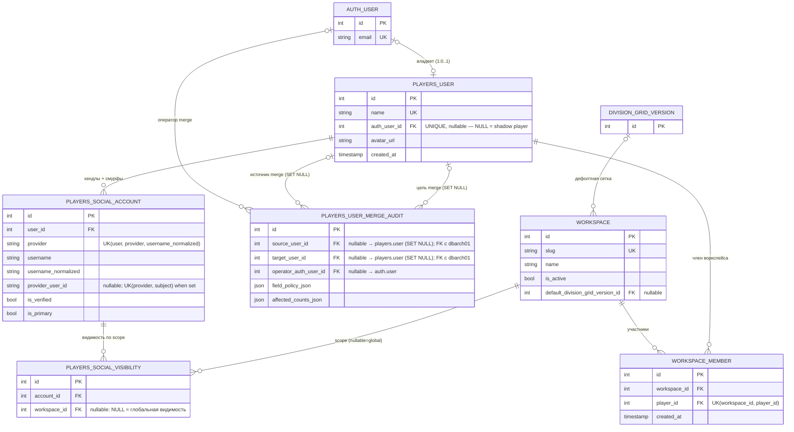

> **`workspace_member`** ключуется на `player_id` (FK → `players.user`) с
> уникальностью `(workspace_id, player_id)`; денормализованной роли нет.
> **`players.social_account`** имеет частичный unique-индекс (dbarch01) для
> строк с `username_normalized IS NULL` (по `lower(btrim(username))`) — он
> закрывает обход основного `uq(user, provider, username_normalized)`, который
> не дедуплицирует NULL-хендлы.

---

## 3. Сетки дивизионов (`public.division_grid*`)

Версионируемые «сетки» рангов: тиры с диапазонами SR + маппинги между версиями
(для нормализации рангов между сезонами/OW-биндингами). Привязываются к
воркспейсу (или глобальные) и выбираются турниром.

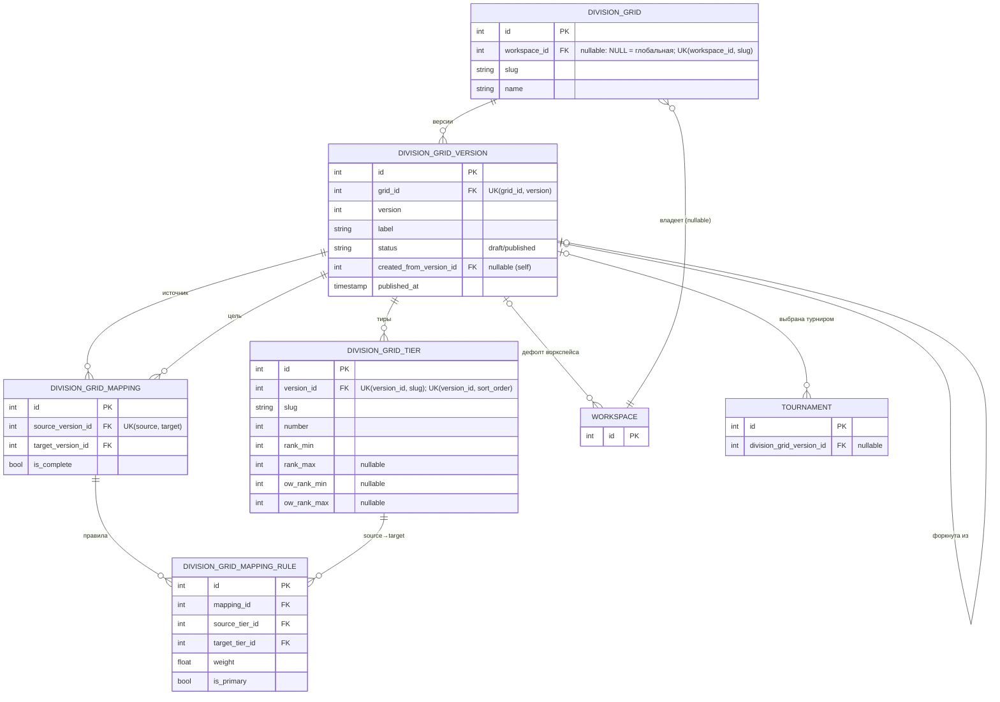

---

## 4. Структура турнира: стадии, команды, ростер (`tournament`)

Турнир → стадии (Stage/StageItem/StageItemInput — новая модель сетки, `group` —
legacy) → команды и их ростер (`player`, привязан к `workspace_member`). Итоги —
в `standing`.

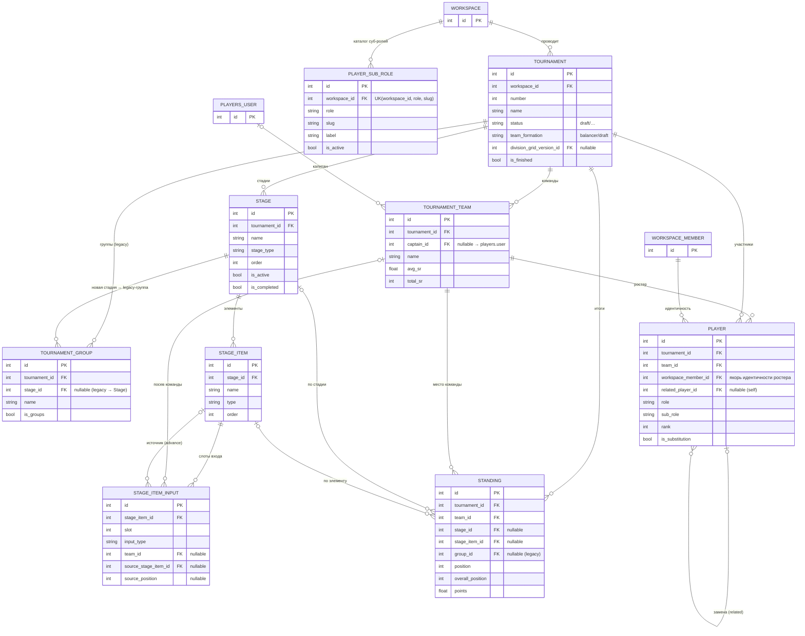

---

## 5. Встречи, сетка и синхронизация с Challonge (`tournament`)

`encounter` — конкретная встреча (best-of), `encounter_link` — явные рёбра
продвижения (winner/loser → слот). Пул карт и вето (пул `map_veto_config`
нормализован из JSON `map_pool_ids` в дочернюю `map_veto_config_map` —
dbarch05). Плюс мост к Challonge (source/participant/match mapping + журнал
синка) и сохранённые фильтры.

> **Нормализация Challonge (dbarch04 + dbarch04b, применено на проде).**
> Легаси-колонки `challonge_id`/`challonge_slug` на `tournament`/`stage` и
> `encounter.challonge_id`, а также таблица `challonge_team` — **удалены**.
> Единственный источник правды: `challonge_source` +
> `challonge_participant_mapping` + `challonge_match_mapping` +
> `challonge_sync_log`. Исключение — `tournament.group.challonge_id` /
> `challonge_slug` **оставлены**: они хранят Challonge-значение маршрутизации
> `match.group_id` по группам (не покрывается source-моделью).

```mermaid
erDiagram
    ENCOUNTER {
        int id PK
        int tournament_id FK
        int tournament_group_id FK "nullable"
        int stage_id FK "nullable"
        int stage_item_id FK "nullable"
        int home_team_id FK "nullable"
        int away_team_id FK "nullable"
        int home_score
        int away_score
        int round
        int best_of
        string status
        string result_status
        int submitted_by_id FK "nullable → players.user"
        int confirmed_by_id FK "nullable → players.user"
    }
    ENCOUNTER_LINK {
        int id PK
        int source_encounter_id FK "UK(source, role)"
        int target_encounter_id FK
        string role "winner/loser"
        string target_slot "home/away"
    }
    ENCOUNTER_MAP_POOL {
        int id PK
        int encounter_id FK
        int map_id FK
        int order
        string picked_by "nullable"
        string status
    }
    MAP_VETO_CONFIG {
        int id PK
        int tournament_id FK
        int stage_id FK "nullable"
        json veto_sequence_json "шаги ban/pick — остаётся JSON"
    }
    MAP_VETO_CONFIG_MAP {
        int id PK
        int map_veto_config_id FK "UK(config, map)"
        int map_id FK "→ overwatch.map"
        int sort_order
    }
    ENCOUNTER_SAVED_VIEW {
        int id PK
        int workspace_id FK
        int auth_user_id FK "UK(workspace, user, name)"
        string name
        json filters_json
    }
    CHALLONGE_SOURCE {
        int id PK
        int tournament_id FK "UK(tournament, challonge_tournament_id)"
        int stage_id FK "nullable (SET NULL)"
        int stage_item_id FK "nullable (SET NULL)"
        int challonge_tournament_id
        string slug "nullable"
        string source_type "tournament/stage/group/playoff"
    }
    CHALLONGE_PARTICIPANT_MAPPING {
        int id PK
        int source_id FK
        int team_id FK
        int challonge_participant_id
    }
    CHALLONGE_MATCH_MAPPING {
        int id PK
        int source_id FK
        int encounter_id FK
        int challonge_match_id
    }
    CHALLONGE_SYNC_LOG {
        int id PK
        int tournament_id FK
        int source_id FK "nullable"
        string direction "import/export"
        string entity_type
        string status
    }
    TOURNAMENT {
        int id PK
    }
    TOURNAMENT_TEAM {
        int id PK
    }
    MAP {
        int id PK
    }

    TOURNAMENT ||--o{ ENCOUNTER : "встречи"
    TOURNAMENT_TEAM |o--o{ ENCOUNTER : "home/away"
    ENCOUNTER ||--o{ ENCOUNTER_LINK : "источник продвижения"
    ENCOUNTER ||--o{ ENCOUNTER_LINK : "цель продвижения"
    ENCOUNTER ||--o{ ENCOUNTER_MAP_POOL : "пул карт"
    MAP ||--o{ ENCOUNTER_MAP_POOL : "карта"
    TOURNAMENT ||--o{ MAP_VETO_CONFIG : "конфиг вето"
    MAP_VETO_CONFIG ||--o{ MAP_VETO_CONFIG_MAP : "пул карт (нормализован)"
    MAP ||--o{ MAP_VETO_CONFIG_MAP : "карта пула"
    TOURNAMENT ||--o{ CHALLONGE_SOURCE : "источники Challonge"
    CHALLONGE_SOURCE ||--o{ CHALLONGE_PARTICIPANT_MAPPING : "участники"
    TOURNAMENT_TEAM ||--o{ CHALLONGE_PARTICIPANT_MAPPING : "команда"
    CHALLONGE_SOURCE ||--o{ CHALLONGE_MATCH_MAPPING : "матчи"
    ENCOUNTER ||--o{ CHALLONGE_MATCH_MAPPING : "встреча"
    TOURNAMENT ||--o{ CHALLONGE_SYNC_LOG : "журнал синка"
    CHALLONGE_SOURCE |o--o{ CHALLONGE_SYNC_LOG : "по источнику"
    WORKSPACE ||--o{ ENCOUNTER_SAVED_VIEW : "сохранённые фильтры"
```

---

## 6. Матч-логи и справочник Overwatch (`matches` + `overwatch`)

Разобранные лог-файлы: `match` (карта во встрече), детальная per-round
`statistics`, `kill_feed`, события `assists`. Справочник игры — `hero`, `map`,
`gamemode`. `mv_hero_global_stats` — materialized view с глобальными рекордами
по героям (не таблица).

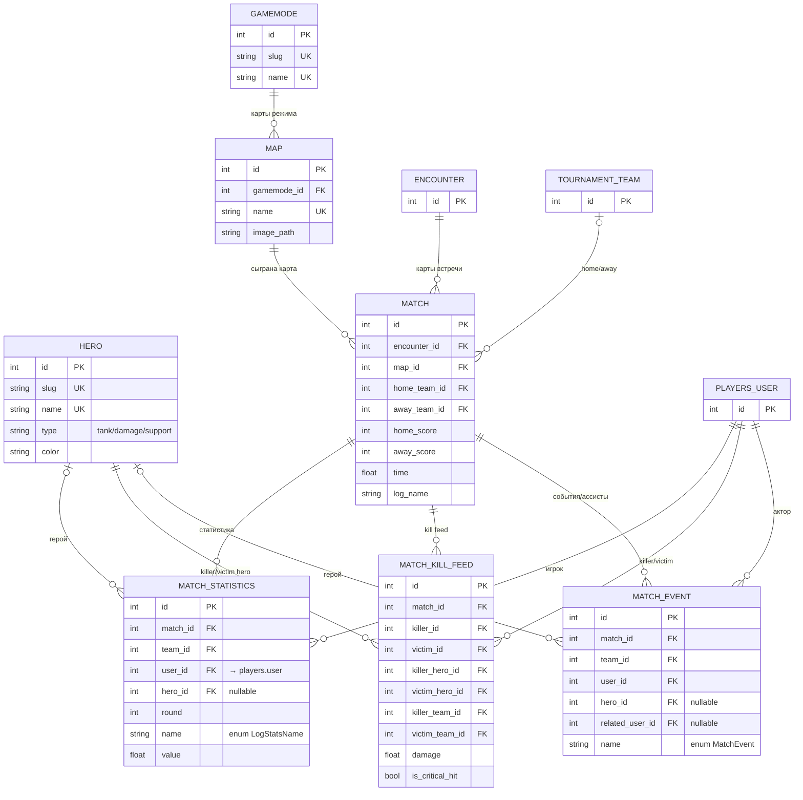

---

## 7. Телеметрия рангов Overwatch (`overwatch_rank`)

Периодический сбор рангов через OverFast, привязан к battlenet-`social_account`
и `players.user`. `rank_snapshot` — временной ряд, `battle_tag_state` — стейт
планировщика (backoff/приоритет), `fetch_log` — история попыток воркера.

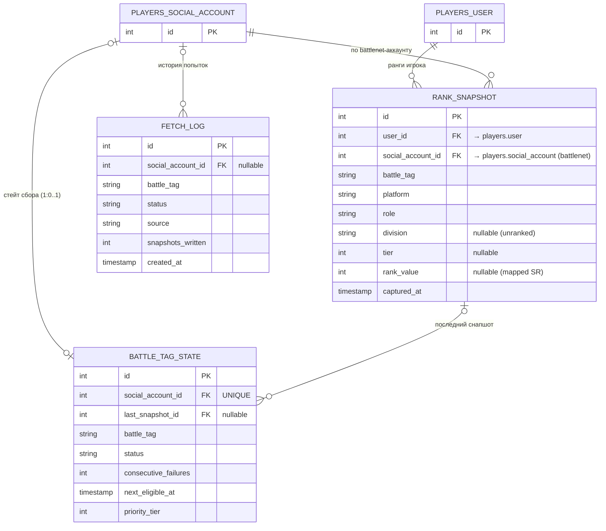

---

## 8. Балансировка и регистрация (`balancer`)

Форма регистрации (`registration_form`), заявки игроков (`registration` + роли +
топ-герои + статусы), опциональный импорт из Google Sheets. Результат баланса —
`balance` → варианты → команды → слоты игроков. Конфиг балансера на уровне
турнира и воркспейса.

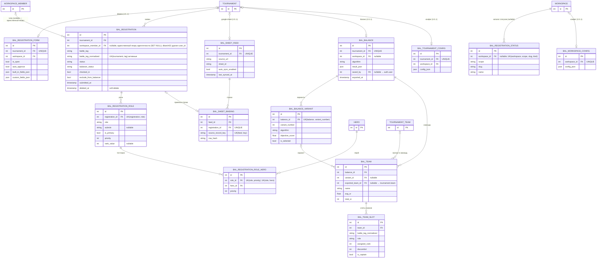

---

## 9. Live-драфт (`balancer.draft_*`)

Snake-драфт: сессия на турнир, команды с капитанами, пул игроков и последовательность
пиков (server-authoritative часы, optimistic-concurrency `version`). Пул берётся
из сохранённого баланса. Идентичность капитана/игрока/актора пика якорится на
`workspace_member` (dbarch03 удалил легаси `*_user_id`-колонки). Per-role
данные игрока (`role_ranks`/`role_top_heroes`/`secondary_roles_json`) вынесены
из JSON в дочерние `draft_player_role` + `draft_player_role_hero` (dbarch03).

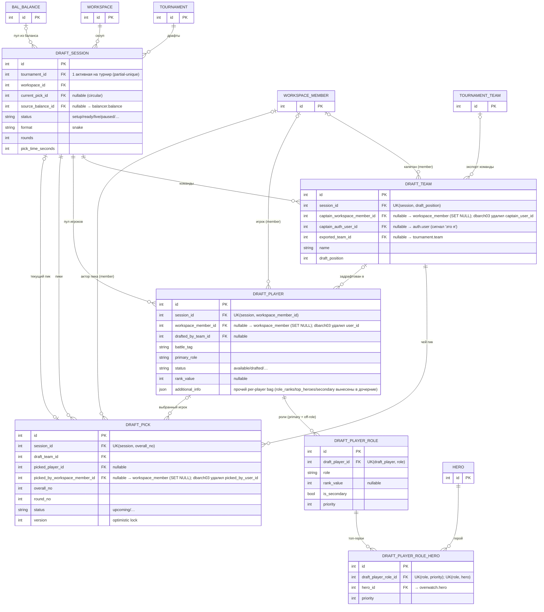

---

## 10. Достижения (`achievements`)

Декларативный движок: `rule` (условие как JSON-дерево) → `evaluation_result`
(кто и почему квалифицировался) + `override` (ручной grant/revoke overlay) +
`evaluation_run` (аудит прогонов). Идентичность — через `workspace_member`.
Легаси-таблицы `achievements.achievement` и `achievements.user`
(`AchievementUser`) **удалены** (данные смигрированы, таблицы дропнуты).

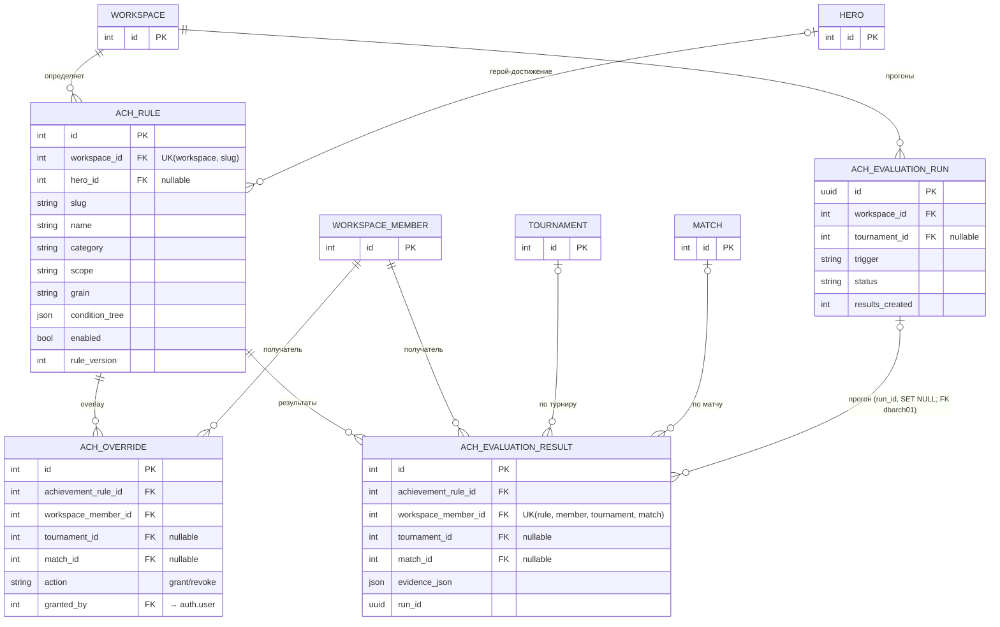

---

## 11. Аналитика и ML (`analytics`)

Сигналы поверх матч-логов: per-tournament статистика игрока (`analytics.tournament`),
shift-алгоритмы, снапшоты качества баланса, feature-store и реестр ML-моделей,
per-player performance (v2), распределения мест (Монте-Карло,
`standings_distribution` — **единственный** источник прогноза мест: скалярный
`predicted_place = round(mean_position)`; v1-таблица `predictions` удалена
dbarch06), качество матчей и аномалии + обратная связь ревьюера. `job` — единый
трекер пересчёта.

```mermaid
erDiagram
    AN_ALGORITHM {
        int id PK
        string name UK
        bool produces_shifts
    }
    AN_PLAYER {
        int id PK
        int tournament_id FK
        int player_id FK "→ tournament.player"
        int wins
        int losses
        int shift "nullable"
    }
    AN_SHIFT {
        int id PK
        int tournament_id FK
        int algorithm_id FK
        int player_id FK
        float shift
        float confidence
    }
    AN_PERFORMANCE {
        int id PK
        int tournament_id FK
        int player_id FK
        int algorithm_id FK "UK(tournament, player, algorithm)"
        float impact_score
        float raw_value
        float local_percentile
    }
    AN_STANDINGS_DISTRIBUTION {
        int id PK
        int tournament_id FK
        int team_id FK
        int algorithm_id FK
        float mean_position
        float prob_top1
        json position_histogram
    }
    AN_MATCH_QUALITY {
        int id PK
        int encounter_id FK
        int algorithm_id FK "UK(encounter, algorithm)"
        float quality_score
        json anomaly_flags
    }
    AN_PLAYER_ANOMALY {
        int id PK
        int tournament_id FK
        int player_id FK
        int source_encounter_id FK "nullable"
        string kind
        float score
    }
    AN_ANOMALY_FEEDBACK {
        int id PK
        int tournament_id FK
        int player_id FK "UK(tournament, player, kind)"
        int reviewer_user_id FK "nullable → auth.user"
        string kind
        string verdict
    }
    AN_BALANCE_SNAPSHOT {
        int id PK
        int tournament_id FK
        int balance_id FK "→ balancer.balance"
        int variant_id FK "nullable"
        int workspace_id FK "nullable"
        float avg_sr_overall
        float sr_std_dev
    }
    AN_BALANCE_PLAYER_SNAPSHOT {
        int id PK
        int balance_snapshot_id FK
        int tournament_id FK
        int user_id FK "nullable → players.user"
        int team_id FK "nullable"
        string assigned_role
        int assigned_rank
    }
    AN_ML_FEATURE {
        int id PK
        int tournament_id FK "UK(tournament, granularity, entity, feature_version)"
        string granularity
        int entity_id
        string feature_version
        json features
    }
    AN_ML_MODEL_ARTIFACT {
        int id PK
        int algorithm_id FK "UK(algorithm, model_kind, role, version)"
        int training_cutoff_tournament_id FK "nullable"
        string model_kind
        string version
        string storage_uri
        bool is_active
    }
    AN_EXPLANATION {
        int id PK
        int algorithm_id FK
        int tournament_id FK
        int entity_id
        string entity_kind
        json contributions
    }
    AN_JOB {
        int id PK
        int workspace_id FK "nullable; 1 running per workspace (partial-unique)"
        int tournament_id FK
        int requested_by_user_id FK "nullable → auth.user"
        string kind "compute/train_ml"
        string status
        json progress
    }
    TOURNAMENT {
        int id PK
    }
    PLAYER {
        int id PK
    }
    TOURNAMENT_TEAM {
        int id PK
    }
    ENCOUNTER {
        int id PK
    }
    BAL_BALANCE {
        int id PK
    }

    TOURNAMENT ||--o{ AN_PLAYER : "статистика игрока"
    PLAYER ||--o{ AN_PLAYER : "игрок"
    AN_ALGORITHM ||--o{ AN_SHIFT : "алгоритм"
    TOURNAMENT ||--o{ AN_SHIFT : "турнир"
    PLAYER ||--o{ AN_SHIFT : "игрок"
    AN_ALGORITHM ||--o{ AN_PERFORMANCE : "алгоритм"
    PLAYER ||--o{ AN_PERFORMANCE : "игрок"
    AN_ALGORITHM ||--o{ AN_STANDINGS_DISTRIBUTION : "алгоритм"
    TOURNAMENT_TEAM ||--o{ AN_STANDINGS_DISTRIBUTION : "команда"
    ENCOUNTER ||--o{ AN_MATCH_QUALITY : "встреча"
    AN_ALGORITHM ||--o{ AN_MATCH_QUALITY : "алгоритм"
    PLAYER ||--o{ AN_PLAYER_ANOMALY : "аномалия"
    ENCOUNTER |o--o{ AN_PLAYER_ANOMALY : "источник"
    PLAYER ||--o{ AN_ANOMALY_FEEDBACK : "вердикт"
    BAL_BALANCE ||--o{ AN_BALANCE_SNAPSHOT : "снапшот баланса"
    AN_BALANCE_SNAPSHOT ||--o{ AN_BALANCE_PLAYER_SNAPSHOT : "по игрокам"
    AN_ALGORITHM ||--o{ AN_ML_MODEL_ARTIFACT : "модель"
    AN_ALGORITHM ||--o{ AN_EXPLANATION : "атрибуция"
    TOURNAMENT ||--o{ AN_JOB : "пересчёты"
```

---

## 12. Платформа / операционные таблицы

Кросс-доменная инфраструктура: transactional outbox (`event_outbox`), журнал
realtime-событий (`workspace_event`), глобальные настройки (`settings`),
пайплайн загрузки логов (`log_processing.record`, `discord_channel`) и durable-
джобы вычисления сетки/итогов (`computation_job`, `recalculation_state`).

> `event_outbox` и `workspace_event` намеренно **без FK** — это append-only
> шины/журналы (`workspace_id`/`tournament_id`/`actor_user_id` хранятся как
> обычные `BigInteger` для развязки от жизненного цикла бизнес-строк).

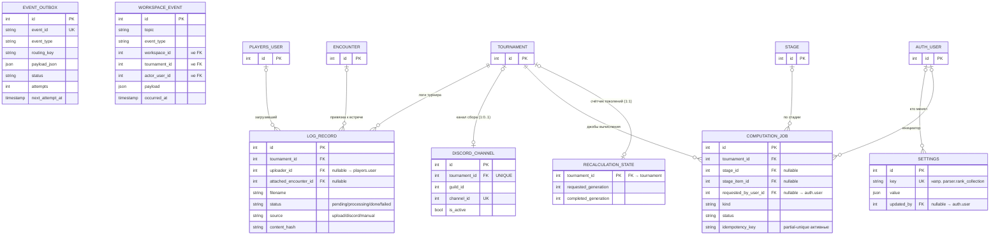

---

## Заметки по чтению диаграмм

- **Мультитенантность.** Почти каждая бизнес-таблица несёт `workspace_id`
  (напрямую или транзитивно через `tournament`/`workspace_member`). Глобальные
  сущности (роль/деней/сетка/статус) допускают `workspace_id = NULL`.
- **Двойная идентичность.** `auth.user` (вход) и `players.user` (игрок) — разные
  таблицы, связь `1:0..1`. Ростер (`tournament.player`), регистрации
  (`balancer.registration`), драфт (`draft_*`) и достижения
  (`evaluation_result`/`override`) якорятся на `workspace_member`
  (= уникальность `workspace_id + player_id`), что и есть суть
  identity/workspace-рефактора. Денормализованной роли на `workspace_member`
  нет — роль выводится из RBAC.
- **Единственный legacy.** Осталась только `tournament.group` (→ `stage`).
  `achievements.achievement`/`achievements.user` и `analytics.predictions`
  (v1) — **удалены** (см. «История изменений схемы»).
- **Циклические FK.** `draft_session.current_pick_id ↔ draft_pick.session_id`
  (создаётся с `use_alter`); `division_grid_version.created_from_version_id` и
  `tournament.player.related_player_id` — само-ссылки.
- **Enum `encounterstatus`.** Тип перенесён из схемы `public` в `tournament`
  (dbarch01); хранит имя члена (`COMPLETED`/`PENDING`/`OPEN`), не `.value`.
- `mv_hero_global_stats` — **materialized view** (не в диаграммах как таблица):
  глобальные рекорды по (hero, stat), обновляется вне транзакций.

---

## История изменений схемы

Документ актуализирован под финальное состояние (Alembic head — **`dbarch06`**).
Ключевые изменения относительно прежнего mid-refactor состояния:

- **Identity/workspace-рефактор.** `players.user.auth_user_id` (unique nullable;
  NULL = shadow-player) — линк `1:0..1` к `auth.user`. `public.workspace_member`
  ключуется на `player_id` (FK → `players.user`) с уникальностью
  `(workspace_id, player_id)`; денормализованная роль убрана. На
  `workspace_member_id` теперь якорятся `balancer.registration` (dbarch02),
  `tournament.player` (iwrefac07, NOT NULL), `draft_team`/`draft_player`/`draft_pick`
  (dbarch03) и `achievements.evaluation_result`/`override`.
- **Challonge-нормализация (dbarch04 + dbarch04b).** Удалены
  `tournament.tournament.challonge_id`/`challonge_slug`,
  `tournament.stage.challonge_id`/`challonge_slug`,
  `tournament.encounter.challonge_id` и таблица `tournament.challonge_team`.
  Источник правды — `challonge_source` + `challonge_participant_mapping` +
  `challonge_match_mapping` + `challonge_sync_log`. **Оставлены**
  `tournament.group.challonge_id`/`challonge_slug` (routing-значение
  `match.group_id` по группам).
- **JSON-нормализация (dbarch05).** `map_veto_config.map_pool_ids` (JSON) →
  дочерняя `map_veto_config_map`; `veto_sequence_json` остался JSON.
- **Draft-нормализация (dbarch03).** `draft_player.role_ranks`/`role_top_heroes`/
  `secondary_roles_json` (JSON) → `draft_player_role` + `draft_player_role_hero`.
- **Predictions (dbarch06).** `analytics.predictions` (v1) удалена;
  `analytics.standings_distribution` (v2) — единственный источник прогноза мест.
- **Гигиена индексов/FK (dbarch01).** Индексы на `auth.user_roles`/
  `auth.role_permissions`; новые FK: `achievements.evaluation_result.run_id →
  evaluation_run`, `players.user_merge_audit.source_user_id`/`target_user_id →
  players.user`, `auth.user_permission_deny.created_by → auth.user`; перенос
  типа `encounterstatus` `public` → `tournament`; частичный unique-индекс на
  `players.social_account` для NULL-хендлов.
