# Database ERD — OWT

A single PostgreSQL database shared by every Python service in the monorepo. The ORM models
(SQLAlchemy) live in `backend/shared/models/<package>/`; the tables themselves are split across
**Postgres schemas**, which double as domain boundaries. A package name does not always match a
schema name — `ranks/` writes to `overwatch_rank`, `ingestion/` to `log_processing`, and
`tournament/` spans `tournament` and `casual`.

> **Every entity diagram in this document is generated** from `Base.metadata` by
> `backend/scripts/export_erd.py`, one diagram per model package. The prose around them is
> written by hand. Regenerate with `cd backend && uv run python scripts/export_erd.py`; CI runs
> `--check` and fails on drift, so the diagrams cannot fall behind the models again.

<!-- ERD:auto _alembic_head -->
Alembic head: **`annstat01`** (50 revisions in `backend/migrations/versions/`).
<!-- /ERD:auto -->

**Reading the diagrams**

- Entity name is `SCHEMA_TABLE`. Qualifying is not decoration: `user` exists in `auth`,
  `players` and `achievements`; `team` and `tournament` each exist in two schemas.
- Every column is shown, with `PK` / `FK` / `UK` markers and `"nullable"` where it applies.
  Multi-column unique constraints cannot be expressed in Mermaid and are listed under the
  diagram that owns them.
- A relationship whose parent lives in another package is still drawn — the parent appears as a
  bare node with no attributes. Cross-domain coupling is the thing an ERD exists to show.
- Cardinality is read off the schema: `||` means the foreign key is `NOT NULL`, `|o` that it is
  nullable, `o|` that the child side is unique (one-to-one), `o{` that it is not.
- **Multitenancy.** Almost every business row carries `workspace_id`, directly or transitively
  through `tournament` or `public.workspace_member`. Rows that are deliberately global —
  system roles, permission denials, division grids, registration statuses — allow
  `workspace_id = NULL`.
- **Dual identity.** `auth.user` is the login account, `players.user` is the player, and the
  link between them is a nullable unique FK on the player side. A player with no account — a
  "shadow" or "virtual" player imported from a match log or a CSV — is therefore an ordinary
  row, not an anomaly. Anything scoped to a tenant anchors on `public.workspace_member`, never
  on a bare player; `players.favorite_player` is the one deliberate exception, because a
  favourite belongs to an account and follows it across workspaces.
- Self-references and cycles are real edges, not drawing artefacts:
  `balancer.draft_session.current_pick_id` ↔ `balancer.draft_pick.session_id` (declared with
  `use_alter`), `public.division_grid_version.created_from_version_id`,
  `public.division_grid.source_grid_id`, `tournament.player.related_player_id`.
- Only tables in `Base.metadata` are drawn. `matches.mv_hero_global_stats` is a materialized
  view refreshed out of band and does not appear. Append-only journals carry their
  `workspace_id` / `tournament_id` / actor ids as plain `BigInteger` with no FK, so they appear
  unconnected — see [platform](#platform--public-realtime).

## Postgres schemas

| Schema | Domain | Owner (service) |
| --- | --- | --- |
| `auth` | Login accounts, sessions, OAuth, API keys, RBAC | identity-service |
| `players` | Player identity and social accounts | app-service |
| `public` | Workspaces, membership, division grids, settings, outbox | app-service |
| `tournament` | Tournament structure, bracket, encounters, pick/ban, reports | tournament-service |
| `casual` | Casual and scrim matches outside the tournament tree | tournament-service |
| `overwatch` | Game catalog — heroes, maps, game modes | app-service / parser-service |
| `overwatch_rank` | Overwatch rank telemetry from OverFast | parser-service |
| `matches` | Parsed match logs and derived statistics | parser-service |
| `balancer` | Registration, balancing, live draft, member ranks | balancer-service |
| `achievements` | Achievement rules, evaluations and overrides | parser-service / app-service |
| `analytics` | Analytics signals and ML model registry | analytics-service |
| `log_processing` | Match-log upload and parse records | parser-service / discord-service |
| `realtime` | Realtime event journal used for WebSocket replay | gateway (Go) |
| `subscriptions` | Subscription providers, requirements and entitlements | tournament-service / parser-service |

The hubs almost every domain converges on:

- **`public.workspace`** — the tenant. Nearly every business row is scoped by `workspace_id`.
- **`public.workspace_member`** — a player's membership in one workspace, unique on
  `workspace_id + player_id`. Rosters, registrations, drafts, ranks and achievements all anchor
  here rather than on a bare player, which is what keeps workspaces isolated by construction.
- **`players.user`** — the domain player. Can exist with no login account (a "virtual" or
  "shadow" player imported from match logs or a CSV).
- **`auth.user`** — the login account. Links to `players.user` `1:0..1`.
- **`tournament.tournament`** — the root for stages, teams, encounters, registrations and
  analytics.
- **`overwatch.hero`** — referenced by statistics, registration preferences and achievements.

Full identity semantics — who owns which table, what a virtual player is, how linking works —
are in [`users-identity.md`](./users-identity.md). System context is in
[`architecture.md`](./architecture.md).

---

## Domain map

Which schema depends on which, read in foreign-key direction (child → parent). Actor columns
(`created_by`, `reviewed_by`, `*_auth_user_id`) point at `auth` from nearly every domain and are
left out here; so are the append-only journals, which have no foreign keys at all.

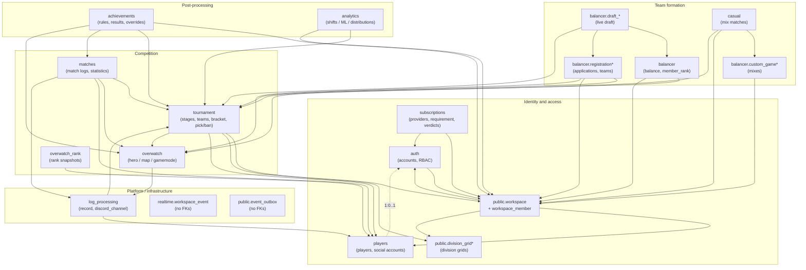
```mermaid
flowchart TB
    subgraph IDENTITY["Identity and access"]
        AUTH["auth<br/>(accounts, RBAC)"]
        PLAYERS["players<br/>(players, social accounts)"]
        WS["public.workspace<br/>+ workspace_member"]
        GRID["public.division_grid*<br/>(division grids)"]
        SUBS["subscriptions<br/>(providers, requirement, verdicts)"]
    end

    subgraph COMPETITION["Competition"]
        TOUR["tournament<br/>(stages, teams, bracket, pick/ban)"]
        MATCHES["matches<br/>(match logs, statistics)"]
        OW["overwatch<br/>(hero / map / gamemode)"]
        RANK["overwatch_rank<br/>(rank snapshots)"]
    end

    subgraph TEAMBUILD["Team formation"]
        REG["balancer.registration*<br/>(applications, teams)"]
        BAL["balancer<br/>(balance, member_rank)"]
        DRAFT["balancer.draft_*<br/>(live draft)"]
        MIX["balancer.custom_game*<br/>(mixes)"]
        CAS["casual<br/>(mix matches)"]
    end

    subgraph INSIGHT["Post-processing"]
        ACH["achievements<br/>(rules, results, overrides)"]
        AN["analytics<br/>(shifts / ML / distributions)"]
    end

    subgraph PLATFORM["Platform / infrastructure"]
        LOG["log_processing<br/>(record, discord_channel)"]
        RT["realtime.workspace_event<br/>(no FKs)"]
        OUTBOX["public.event_outbox<br/>(no FKs)"]
    end

    WS --> AUTH
    WS --> PLAYERS
    PLAYERS -. "1:0..1" .-> AUTH
    AUTH --> WS
    WS --> GRID
    SUBS --> WS
    SUBS --> AUTH

    TOUR --> WS
    TOUR --> GRID
    TOUR --> PLAYERS
    TOUR --> OW
    MATCHES --> TOUR
    MATCHES --> OW
    MATCHES --> PLAYERS
    MATCHES --> LOG
    OW --> LOG
    RANK --> PLAYERS

    REG --> TOUR
    REG --> WS
    REG --> OW
    BAL --> TOUR
    BAL --> WS
    DRAFT --> BAL
    DRAFT --> REG
    DRAFT --> TOUR
    MIX --> WS
    CAS --> MIX
    CAS --> WS
    CAS --> OW

    ACH --> WS
    ACH --> TOUR
    ACH --> MATCHES
    ACH --> OW
    AN --> TOUR
    AN --> WS

    LOG --> TOUR
    LOG --> PLAYERS
```

Two edges the map does not draw, because the schema no longer has them: `balancer` does not
reference `players` (registration identity goes through `workspace_member`), and `analytics`
reads match data only through `tournament.player` and `tournament.encounter`, never through
`matches` directly.

## identity — `auth`, `players`

Login accounts, refresh tokens, OAuth connections, API keys, the grant-only RBAC catalog with
its deny overlay, the domain player, and the audit trail left when two players are merged.

RBAC is grant-only: roles grant permissions, and the single subtracting mechanism is
`auth.user_permission_deny` — a targeted denial that overrides everything a role grants,
including a superuser's implicit grant. Both `roles` and `user_permission_deny` allow a NULL
`workspace_id`, which means "everywhere": a system role, or a platform-wide ban on one
permission. API keys are scoped the other way round — always to one workspace — and store only
`secret_hash`, with their scopes in a child table rather than a JSON array so a scope can be
revoked with a `DELETE`.

`players.user` is the domain player and is independent of the account: `auth_user_id` is unique
and nullable, so a player parsed out of a match log exists long before, or instead of, anyone
logging in. Social handles (battlenet, discord, twitch, …) are consolidated in `social_account`,
deduplicated per `(user_id, provider, username_normalized)`, with a per-workspace visibility
overlay — a row in `social_account_visibility` with `workspace_id = NULL` means visible
everywhere.

Merging two players is destructive at the row level, which is why `user_merge_audit` keeps the
field policy, the identity ids that moved, the ones that were deduplicated, the affected row
counts and a preview snapshot. Its source and target FKs are nullable so the audit outlives the
rows it describes.

<!-- ERD:auto identity -->

```mermaid
erDiagram
    AUTH_API_KEY {
        bigint id PK
        timestamptz created_at
        timestamptz updated_at "nullable"
        bigint auth_user_id FK
        bigint workspace_id FK
        varchar(32) public_id UK
        varchar(128) secret_hash
        varchar(100) name
        json limits_json
        json config_policy_json
        timestamptz expires_at "nullable"
        timestamptz revoked_at "nullable"
        timestamptz last_used_at "nullable"
    }
    AUTH_API_KEY_SCOPE {
        bigint api_key_id PK,FK
        varchar(64) scope PK
    }
    AUTH_OAUTH_CONNECTIONS {
        bigint id PK
        timestamptz created_at
        timestamptz updated_at "nullable"
        bigint auth_user_id FK
        varchar(50) provider
        varchar(255) provider_user_id
        varchar(255) email "nullable"
        varchar(100) username
        varchar(100) display_name "nullable"
        varchar(500) avatar_url "nullable"
        text access_token "nullable"
        text refresh_token "nullable"
        timestamptz token_expires_at "nullable"
        json provider_data "nullable"
    }
    AUTH_PERMISSIONS {
        bigint id PK
        timestamptz created_at
        timestamptz updated_at "nullable"
        varchar(100) name UK
        varchar(100) resource
        varchar(50) action
        text description "nullable"
    }
    AUTH_REFRESH_TOKEN {
        bigint id PK
        timestamptz created_at
        timestamptz updated_at "nullable"
        text token UK
        bigint user_id FK
        uuid session_id
        timestamptz session_started_at
        timestamptz expires_at
        boolean is_revoked
        timestamptz revoked_at "nullable"
        varchar(500) user_agent "nullable"
        varchar(45) ip_address "nullable"
    }
    AUTH_ROLE_PERMISSIONS {
        int id PK
        int role_id FK
        int permission_id FK
        timestamptz created_at
    }
    AUTH_ROLES {
        bigint id PK
        timestamptz created_at
        timestamptz updated_at "nullable"
        varchar(100) name
        text description "nullable"
        boolean is_system
        bigint workspace_id FK "nullable"
    }
    AUTH_USER {
        bigint id PK
        timestamptz created_at
        timestamptz updated_at "nullable"
        varchar(255) email UK
        varchar(100) username UK
        varchar(255) hashed_password "nullable"
        boolean is_active
        boolean is_superuser
        boolean is_verified
        varchar(100) first_name "nullable"
        varchar(100) last_name "nullable"
        varchar(500) avatar_url "nullable"
    }
    AUTH_USER_PERMISSION_DENY {
        bigint id PK
        timestamptz created_at
        timestamptz updated_at "nullable"
        bigint user_id FK
        bigint permission_id FK
        bigint workspace_id FK "nullable"
        bigint created_by FK "nullable"
        text reason "nullable"
    }
    AUTH_USER_ROLES {
        int id PK
        int user_id FK
        int role_id FK
        timestamptz created_at
    }
    PLAYERS_SOCIAL_ACCOUNT {
        bigint id PK
        timestamptz created_at
        timestamptz updated_at "nullable"
        bigint user_id FK
        varchar(64) provider
        varchar(255) username
        varchar(255) username_normalized "nullable"
        varchar(500) url "nullable"
        varchar(255) provider_user_id "nullable"
        boolean is_verified
        boolean is_primary
    }
    PLAYERS_SOCIAL_ACCOUNT_VISIBILITY {
        bigint id PK
        timestamptz created_at
        timestamptz updated_at "nullable"
        bigint account_id FK
        bigint workspace_id FK "nullable"
    }
    PLAYERS_USER {
        bigint id PK
        timestamptz created_at
        timestamptz updated_at "nullable"
        varchar name UK
        varchar(500) avatar_url "nullable"
        boolean stream_visible
        bigint auth_user_id FK,UK "nullable"
    }
    PLAYERS_USER_MERGE_AUDIT {
        bigint id PK
        timestamptz created_at
        timestamptz updated_at "nullable"
        bigint source_user_id FK "nullable"
        bigint target_user_id FK "nullable"
        bigint operator_auth_user_id FK "nullable"
        json field_policy_json
        json moved_identity_ids_json
        json deduped_identity_ids_json
        json affected_counts_json
        json preview_snapshot_json
    }

    AUTH_API_KEY ||--o| AUTH_API_KEY_SCOPE : "api_key_id"
    AUTH_PERMISSIONS ||--o{ AUTH_ROLE_PERMISSIONS : "permission_id"
    AUTH_PERMISSIONS ||--o{ AUTH_USER_PERMISSION_DENY : "permission_id"
    AUTH_ROLES ||--o{ AUTH_ROLE_PERMISSIONS : "role_id"
    AUTH_ROLES ||--o{ AUTH_USER_ROLES : "role_id"
    AUTH_USER |o--o{ AUTH_USER_PERMISSION_DENY : "created_by"
    AUTH_USER |o--o{ PLAYERS_USER_MERGE_AUDIT : "operator_auth_user_id"
    AUTH_USER |o--o| PLAYERS_USER : "auth_user_id"
    AUTH_USER ||--o{ AUTH_API_KEY : "auth_user_id"
    AUTH_USER ||--o{ AUTH_OAUTH_CONNECTIONS : "auth_user_id"
    AUTH_USER ||--o{ AUTH_REFRESH_TOKEN : "user_id"
    AUTH_USER ||--o{ AUTH_USER_PERMISSION_DENY : "user_id"
    AUTH_USER ||--o{ AUTH_USER_ROLES : "user_id"
    PLAYERS_SOCIAL_ACCOUNT ||--o{ PLAYERS_SOCIAL_ACCOUNT_VISIBILITY : "account_id"
    PLAYERS_USER |o--o{ PLAYERS_USER_MERGE_AUDIT : "source_user_id"
    PLAYERS_USER |o--o{ PLAYERS_USER_MERGE_AUDIT : "target_user_id"
    PLAYERS_USER ||--o{ PLAYERS_SOCIAL_ACCOUNT : "user_id"
    PUBLIC_WORKSPACE |o--o{ AUTH_ROLES : "workspace_id"
    PUBLIC_WORKSPACE |o--o{ AUTH_USER_PERMISSION_DENY : "workspace_id"
    PUBLIC_WORKSPACE |o--o{ PLAYERS_SOCIAL_ACCOUNT_VISIBILITY : "workspace_id"
    PUBLIC_WORKSPACE ||--o{ AUTH_API_KEY : "workspace_id"
```

Composite unique keys:

- `AUTH_OAUTH_CONNECTIONS` unique on (`provider`, `provider_user_id`)
- `PLAYERS_SOCIAL_ACCOUNT` unique on (`user_id`, `provider`, `username_normalized`)
<!-- /ERD:auto -->

## tenancy — `public`

The tenant root and its membership anchor, plus workspace-level settings: branding, subdomain
and custom domain, Discord guild binding, default roster shape and division grid.

`workspace` is the tenant and carries the white-label surface: `timezone` (IANA), the
`brand_*` palette behind `branding_enabled`, `subdomain` and `custom_domain` (both UNIQUE, the
domain with a verification token and timestamp), the SEO strings, and `discord_guild_id` —
UNIQUE and verified the same way, which makes it the single source of the guild snowflake for
every service that needs one. `owner_id` records who created the workspace and is deliberately
decoupled from the RBAC `owner` role: the role is mutable and may have several holders, while
ownership is an accountability fact about one account.

`workspace_member` is the identity anchor for everything tenant-scoped — rosters, registrations,
member ranks, draft entries, custom-game lineups, casual players, achievements — and is unique
on `(workspace_id, player_id)`. It carries no denormalized role: the role is derived from RBAC,
so there is exactly one place where a permission answer comes from.

`settings` is the exception in this schema: a global key/value table (`key` UNIQUE, e.g. the
parser's rank-collection switch), not tenant-scoped.

<!-- ERD:auto tenancy -->
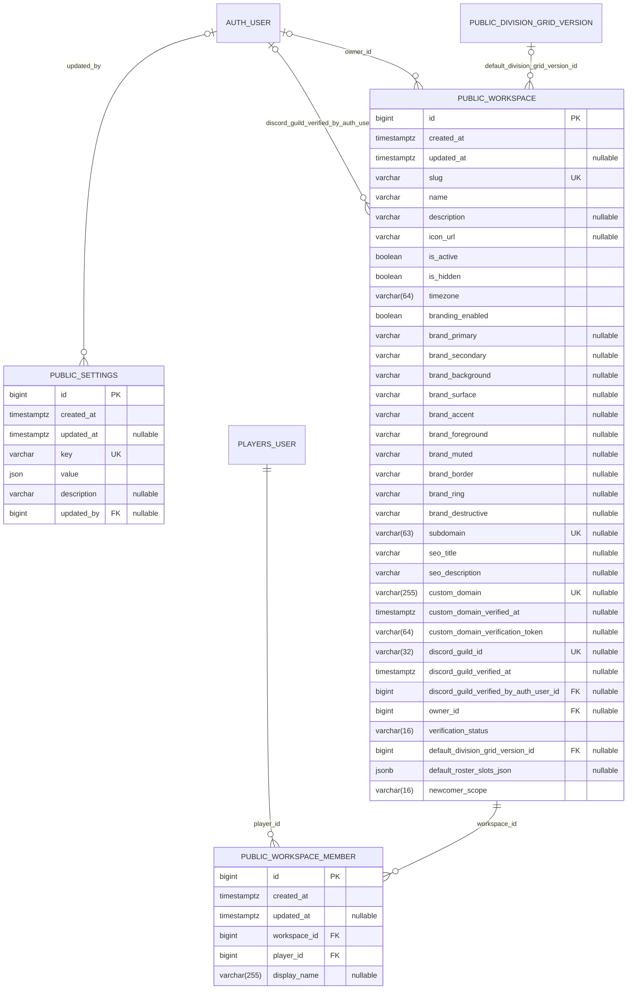
```mermaid
erDiagram
    PUBLIC_SETTINGS {
        bigint id PK
        timestamptz created_at
        timestamptz updated_at "nullable"
        varchar key UK
        json value
        varchar description "nullable"
        bigint updated_by FK "nullable"
    }
    PUBLIC_WORKSPACE {
        bigint id PK
        timestamptz created_at
        timestamptz updated_at "nullable"
        varchar slug UK
        varchar name
        varchar description "nullable"
        varchar icon_url "nullable"
        boolean is_active
        boolean is_hidden
        varchar(64) timezone
        boolean branding_enabled
        varchar brand_primary "nullable"
        varchar brand_secondary "nullable"
        varchar brand_background "nullable"
        varchar brand_surface "nullable"
        varchar brand_accent "nullable"
        varchar brand_foreground "nullable"
        varchar brand_muted "nullable"
        varchar brand_border "nullable"
        varchar brand_ring "nullable"
        varchar brand_destructive "nullable"
        varchar(63) subdomain UK "nullable"
        varchar seo_title "nullable"
        varchar seo_description "nullable"
        varchar(255) custom_domain UK "nullable"
        timestamptz custom_domain_verified_at "nullable"
        varchar(64) custom_domain_verification_token "nullable"
        varchar(32) discord_guild_id UK "nullable"
        timestamptz discord_guild_verified_at "nullable"
        bigint discord_guild_verified_by_auth_user_id FK "nullable"
        bigint owner_id FK "nullable"
        varchar(16) verification_status
        bigint default_division_grid_version_id FK "nullable"
        jsonb default_roster_slots_json "nullable"
        varchar(16) newcomer_scope
    }
    PUBLIC_WORKSPACE_MEMBER {
        bigint id PK
        timestamptz created_at
        timestamptz updated_at "nullable"
        bigint workspace_id FK
        bigint player_id FK
        varchar(255) display_name "nullable"
    }

    AUTH_USER |o--o{ PUBLIC_SETTINGS : "updated_by"
    AUTH_USER |o--o{ PUBLIC_WORKSPACE : "discord_guild_verified_by_auth_user_id"
    AUTH_USER |o--o{ PUBLIC_WORKSPACE : "owner_id"
    PLAYERS_USER ||--o{ PUBLIC_WORKSPACE_MEMBER : "player_id"
    PUBLIC_DIVISION_GRID_VERSION |o--o{ PUBLIC_WORKSPACE : "default_division_grid_version_id"
    PUBLIC_WORKSPACE ||--o{ PUBLIC_WORKSPACE_MEMBER : "workspace_id"
```

Composite unique keys:

- `PUBLIC_WORKSPACE_MEMBER` unique on (`id`, `workspace_id`)
- `PUBLIC_WORKSPACE_MEMBER` unique on (`workspace_id`, `player_id`)
<!-- /ERD:auto -->

## member_rank — `balancer`

A player's rank inside one workspace, kept in two layers that are never merged: the workspace
canon everyone inherits, and each ranking author's own book, which overrides canon for that
author alone.

The nullable `author_user_id` *is* the discriminator, and there is deliberately no `scope`
column that could disagree with it. Two partial unique indexes enforce the split: one canon row
per `(workspace, member, role)` where the author is NULL, one private row per
`(workspace, author, member, role)` where it is not. They are partial indexes rather than plain
unique constraints because Postgres treats NULLs in a composite unique key as distinct and would
happily store two canon rows for the same member and role. One table replaced three earlier
per-context rank stores, so the resolver reads both layers in a single query.

<!-- ERD:auto member_rank -->
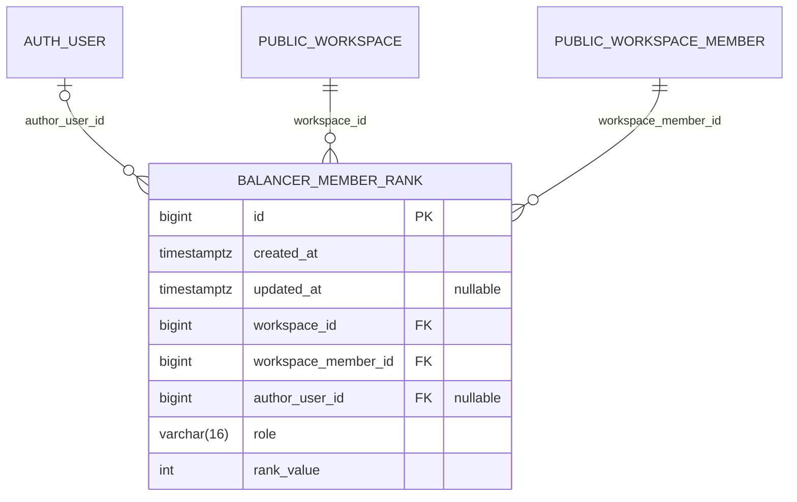
```mermaid
erDiagram
    BALANCER_MEMBER_RANK {
        bigint id PK
        timestamptz created_at
        timestamptz updated_at "nullable"
        bigint workspace_id FK
        bigint workspace_member_id FK
        bigint author_user_id FK "nullable"
        varchar(16) role
        int rank_value
    }

    AUTH_USER |o--o{ BALANCER_MEMBER_RANK : "author_user_id"
    PUBLIC_WORKSPACE ||--o{ BALANCER_MEMBER_RANK : "workspace_id"
    PUBLIC_WORKSPACE_MEMBER ||--o{ BALANCER_MEMBER_RANK : "workspace_member_id"
```
<!-- /ERD:auto -->

## catalog — `overwatch`

The game catalog — heroes, maps, game modes — plus the misses log that records catalog names
arriving from logs that no alias resolves.

Logs arrive with map, gamemode and hero names in the player client's locale, so every catalog
entity carries `aliases` (a JSONB array of strings). Hero aliases are populated by the OverFast
sync across the Blizzard locales; map and gamemode aliases are maintained by hand, because those
endpoints take no locale parameter. This replaced three hardcoded translation dictionaries in
the parser, each of which needed a service redeploy for every new map, hero or client locale.

A name that resolves to neither a canonical value nor an alias lands in `catalog_alias_miss` —
the "add an alias" queue in the admin UI. It is keyed on `(entity_type, raw_name)` with an
`occurrences` counter, and `resolved_at` is cleared again when a supposedly resolved name comes
back. Its link to the log record it last arrived on is nullable, so pruning ingestion records
does not empty the queue.

<!-- ERD:auto catalog -->
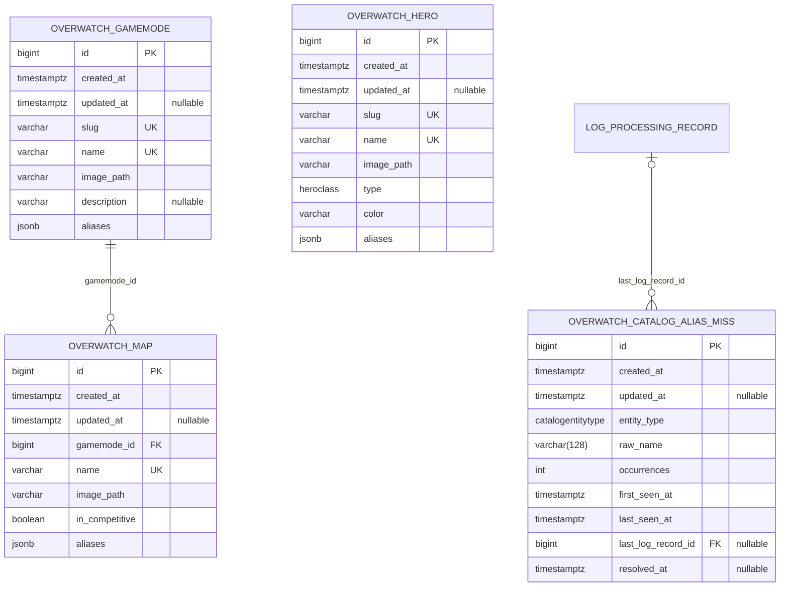
```mermaid
erDiagram
    OVERWATCH_CATALOG_ALIAS_MISS {
        bigint id PK
        timestamptz created_at
        timestamptz updated_at "nullable"
        catalogentitytype entity_type
        varchar(128) raw_name
        int occurrences
        timestamptz first_seen_at
        timestamptz last_seen_at
        bigint last_log_record_id FK "nullable"
        timestamptz resolved_at "nullable"
    }
    OVERWATCH_GAMEMODE {
        bigint id PK
        timestamptz created_at
        timestamptz updated_at "nullable"
        varchar slug UK
        varchar name UK
        varchar image_path
        varchar description "nullable"
        jsonb aliases
    }
    OVERWATCH_HERO {
        bigint id PK
        timestamptz created_at
        timestamptz updated_at "nullable"
        varchar slug UK
        varchar name UK
        varchar image_path
        heroclass type
        varchar color
        jsonb aliases
    }
    OVERWATCH_MAP {
        bigint id PK
        timestamptz created_at
        timestamptz updated_at "nullable"
        bigint gamemode_id FK
        varchar name UK
        varchar image_path
        boolean in_competitive
        jsonb aliases
    }

    LOG_PROCESSING_RECORD |o--o{ OVERWATCH_CATALOG_ALIAS_MISS : "last_log_record_id"
    OVERWATCH_GAMEMODE ||--o{ OVERWATCH_MAP : "gamemode_id"
```

Composite unique keys:

- `OVERWATCH_CATALOG_ALIAS_MISS` unique on (`entity_type`, `raw_name`)
<!-- /ERD:auto -->

## division_grid — `public`

Versioned rank grids: tiers with SR ranges, and mappings between versions so ranks stay
comparable across seasons and Overwatch rebindings. A workspace picks the version it uses.

A tier carries both the internal SR range (`rank_min`/`rank_max`) and the Overwatch-side range
(`ow_rank_min`/`ow_rank_max`); mappings between two versions, with weighted rules per tier pair,
are what keeps ranks comparable after a season change or an Overwatch rebinding. A version is
immutable once published — a new one is forked through `created_from_version_id` — and a grid
with `workspace_id = NULL` is global.

There are two independent selectors: `workspace.default_division_grid_version_id` and
`tournament.division_grid_version_id`. A tournament may pin its own version instead of
inheriting the workspace default, which is what lets a finished tournament keep showing the
ranks it was actually played at. `division_grid_import_job` covers copying a grid from another
workspace; it is idempotent per `(workspace_id, idempotency_key)`.

<!-- ERD:auto division_grid -->
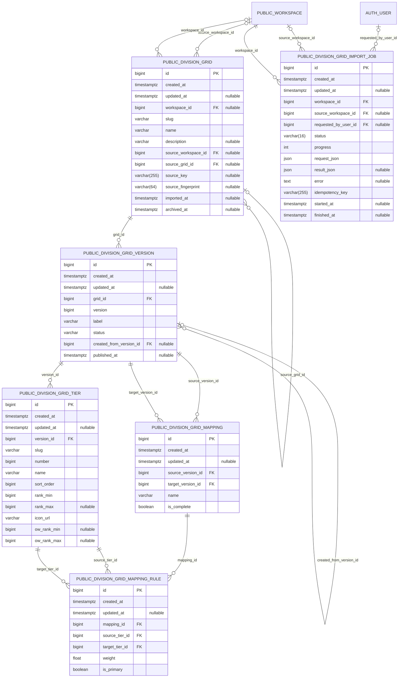
```mermaid
erDiagram
    PUBLIC_DIVISION_GRID {
        bigint id PK
        timestamptz created_at
        timestamptz updated_at "nullable"
        bigint workspace_id FK "nullable"
        varchar slug
        varchar name
        varchar description "nullable"
        bigint source_workspace_id FK "nullable"
        bigint source_grid_id FK "nullable"
        varchar(255) source_key "nullable"
        varchar(64) source_fingerprint "nullable"
        timestamptz imported_at "nullable"
        timestamptz archived_at "nullable"
    }
    PUBLIC_DIVISION_GRID_IMPORT_JOB {
        bigint id PK
        timestamptz created_at
        timestamptz updated_at "nullable"
        bigint workspace_id FK
        bigint source_workspace_id FK "nullable"
        bigint requested_by_user_id FK "nullable"
        varchar(16) status
        int progress
        json request_json
        json result_json "nullable"
        text error "nullable"
        varchar(255) idempotency_key
        timestamptz started_at "nullable"
        timestamptz finished_at "nullable"
    }
    PUBLIC_DIVISION_GRID_MAPPING {
        bigint id PK
        timestamptz created_at
        timestamptz updated_at "nullable"
        bigint source_version_id FK
        bigint target_version_id FK
        varchar name
        boolean is_complete
    }
    PUBLIC_DIVISION_GRID_MAPPING_RULE {
        bigint id PK
        timestamptz created_at
        timestamptz updated_at "nullable"
        bigint mapping_id FK
        bigint source_tier_id FK
        bigint target_tier_id FK
        float weight
        boolean is_primary
    }
    PUBLIC_DIVISION_GRID_TIER {
        bigint id PK
        timestamptz created_at
        timestamptz updated_at "nullable"
        bigint version_id FK
        varchar slug
        bigint number
        varchar name
        bigint sort_order
        bigint rank_min
        bigint rank_max "nullable"
        varchar icon_url
        bigint ow_rank_min "nullable"
        bigint ow_rank_max "nullable"
    }
    PUBLIC_DIVISION_GRID_VERSION {
        bigint id PK
        timestamptz created_at
        timestamptz updated_at "nullable"
        bigint grid_id FK
        bigint version
        varchar label
        varchar status
        bigint created_from_version_id FK "nullable"
        timestamptz published_at "nullable"
    }

    AUTH_USER |o--o{ PUBLIC_DIVISION_GRID_IMPORT_JOB : "requested_by_user_id"
    PUBLIC_DIVISION_GRID |o--o{ PUBLIC_DIVISION_GRID : "source_grid_id"
    PUBLIC_DIVISION_GRID ||--o{ PUBLIC_DIVISION_GRID_VERSION : "grid_id"
    PUBLIC_DIVISION_GRID_MAPPING ||--o{ PUBLIC_DIVISION_GRID_MAPPING_RULE : "mapping_id"
    PUBLIC_DIVISION_GRID_TIER ||--o{ PUBLIC_DIVISION_GRID_MAPPING_RULE : "source_tier_id"
    PUBLIC_DIVISION_GRID_TIER ||--o{ PUBLIC_DIVISION_GRID_MAPPING_RULE : "target_tier_id"
    PUBLIC_DIVISION_GRID_VERSION |o--o{ PUBLIC_DIVISION_GRID_VERSION : "created_from_version_id"
    PUBLIC_DIVISION_GRID_VERSION ||--o{ PUBLIC_DIVISION_GRID_MAPPING : "source_version_id"
    PUBLIC_DIVISION_GRID_VERSION ||--o{ PUBLIC_DIVISION_GRID_MAPPING : "target_version_id"
    PUBLIC_DIVISION_GRID_VERSION ||--o{ PUBLIC_DIVISION_GRID_TIER : "version_id"
    PUBLIC_WORKSPACE |o--o{ PUBLIC_DIVISION_GRID : "source_workspace_id"
    PUBLIC_WORKSPACE |o--o{ PUBLIC_DIVISION_GRID : "workspace_id"
    PUBLIC_WORKSPACE |o--o{ PUBLIC_DIVISION_GRID_IMPORT_JOB : "source_workspace_id"
    PUBLIC_WORKSPACE ||--o{ PUBLIC_DIVISION_GRID_IMPORT_JOB : "workspace_id"
```

Composite unique keys:

- `PUBLIC_DIVISION_GRID` unique on (`workspace_id`, `slug`)
- `PUBLIC_DIVISION_GRID_IMPORT_JOB` unique on (`workspace_id`, `idempotency_key`)
- `PUBLIC_DIVISION_GRID_MAPPING` unique on (`source_version_id`, `target_version_id`)
- `PUBLIC_DIVISION_GRID_TIER` unique on (`version_id`, `slug`)
- `PUBLIC_DIVISION_GRID_TIER` unique on (`version_id`, `sort_order`)
- `PUBLIC_DIVISION_GRID_VERSION` unique on (`grid_id`, `version`)
<!-- /ERD:auto -->

## ranks — `overwatch_rank`

Rank telemetry polled from OverFast against a linked BattleTag: the snapshot time series, the
per-BattleTag fetch state, and the fetch log.

Collection is bound to the battlenet `social_account`, not to a bare BattleTag string, so a
re-linked or renamed account keeps its history. `rank_snapshot` is append-only and stores one
row per role per capture, together with `mapping_version` — which SR mapping produced
`rank_value` — and the raw provider payload, so a mapping change can be replayed instead of
re-fetched.

`battle_tag_state` is the scheduler, one row per social account (UNIQUE): `next_eligible_at`,
`consecutive_failures` and `priority_tier` are the backoff, and `last_snapshot_id` is the
shortcut to the newest reading. `fetch_log` is the attempt history, with a nullable account FK
so it survives unlinking.

<!-- ERD:auto ranks -->
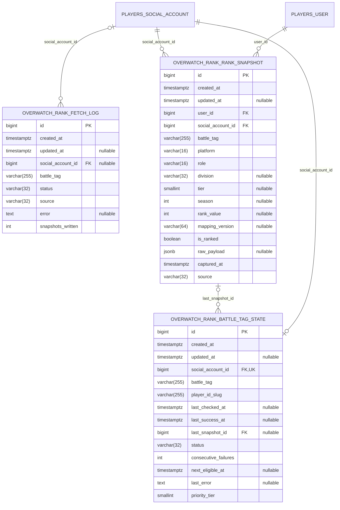
```mermaid
erDiagram
    OVERWATCH_RANK_BATTLE_TAG_STATE {
        bigint id PK
        timestamptz created_at
        timestamptz updated_at "nullable"
        bigint social_account_id FK,UK
        varchar(255) battle_tag
        varchar(255) player_id_slug
        timestamptz last_checked_at "nullable"
        timestamptz last_success_at "nullable"
        bigint last_snapshot_id FK "nullable"
        varchar(32) status
        int consecutive_failures
        timestamptz next_eligible_at "nullable"
        text last_error "nullable"
        smallint priority_tier
    }
    OVERWATCH_RANK_FETCH_LOG {
        bigint id PK
        timestamptz created_at
        timestamptz updated_at "nullable"
        bigint social_account_id FK "nullable"
        varchar(255) battle_tag
        varchar(32) status
        varchar(32) source
        text error "nullable"
        int snapshots_written
    }
    OVERWATCH_RANK_RANK_SNAPSHOT {
        bigint id PK
        timestamptz created_at
        timestamptz updated_at "nullable"
        bigint user_id FK
        bigint social_account_id FK
        varchar(255) battle_tag
        varchar(16) platform
        varchar(16) role
        varchar(32) division "nullable"
        smallint tier "nullable"
        int season "nullable"
        int rank_value "nullable"
        varchar(64) mapping_version "nullable"
        boolean is_ranked
        jsonb raw_payload "nullable"
        timestamptz captured_at
        varchar(32) source
    }

    OVERWATCH_RANK_RANK_SNAPSHOT |o--o{ OVERWATCH_RANK_BATTLE_TAG_STATE : "last_snapshot_id"
    PLAYERS_SOCIAL_ACCOUNT |o--o{ OVERWATCH_RANK_FETCH_LOG : "social_account_id"
    PLAYERS_SOCIAL_ACCOUNT ||--o{ OVERWATCH_RANK_RANK_SNAPSHOT : "social_account_id"
    PLAYERS_SOCIAL_ACCOUNT ||--o| OVERWATCH_RANK_BATTLE_TAG_STATE : "social_account_id"
    PLAYERS_USER ||--o{ OVERWATCH_RANK_RANK_SNAPSHOT : "user_id"
```
<!-- /ERD:auto -->

## tournament — `tournament`, `casual`

The largest domain: the tournament itself and its lifecycle, stages and stage items, teams and
their rosters, encounters and the advancement edges that form the bracket, the pick/ban engine,
standings and their computation jobs, match reports, Challonge synchronisation, scrim rooms, and
preview access.

The structure is `tournament → stage → stage_item → stage_item_input`. A stage item is a group,
a bracket or a round-robin; the legacy `tournament.group` table is gone, and a group is a stage
item of that type. Seeding and advancement live in `stage_item_input`: a slot is filled either
by a team directly or by "position N of stage item M", which makes the bracket declarative
instead of derived from a shape.

A roster entry is `tournament.player`, anchored on `workspace_member` with a NOT NULL FK — a
roster slot cannot exist for someone who is not a member of the tenant. `related_player_id` is a
self-reference linking a substitute to the player they stand in for, and sub-roles come from the
per-workspace `player_sub_role` catalog. `tournament.team` deliberately stores no SR: team
strength is derived from the roster, never cached on the row.

`encounter` is one best-of meeting; `encounter_link` holds the advancement edges explicitly
(`winner`/`loser` → `home`/`away` slot). Results are a small state machine rather than a score
write: `result_status` plus `confirmed_at` on the row, and one `encounter_result_audit` row per
transition — confirm, reopen, auto-confirm, dispute, import, cascade reset — recording the
scores after the change and whose report was adopted. Captains report through
`encounter_captain_report` (one per team per encounter) with per-map lobby codes, and
`encounter_map_report` records per-map scores; `encounter_report_form` is the per-tournament
field definition, `encounter_readiness` the per-side ready signal.

Pick/ban is generic: `pick_ban_config` is the template (mode, first-pick rule, ban rotation,
resolved sequence) with its pool in `pick_ban_config_item` and `pick_ban_config_slot*`;
`pick_ban_session` is one live run per `(encounter, kind)` and `pick_ban_entry` a single step.
`encounter_pick_ban_ledger` keeps what was banned in which round, which is what a no-repeat
scope spanning several encounters reads. This engine replaced the earlier map-veto tables; there
is no `map_veto_config` any more.

The Challonge bridge has exactly one source of truth: `challonge_source` (per tournament, stage
or stage item) plus `challonge_participant_mapping`, `challonge_match_mapping` and
`challonge_sync_log`. No Challonge id is stored on `tournament`, `stage` or `encounter`.

Recomputation is durable: `computation_job` carries an idempotency key so a retry does not
double-run, and `recalculation_state` is one row per tournament holding a requested and a
completed generation counter — a burst of change events collapses into one recompute instead of
queueing several. `slug_redirect` keeps old URLs alive after a rename, `scrim_room` is a
tokenized link for one encounter, and `tournament_preview_access` is the allow-list for a
tournament that is still hidden.

<!-- ERD:auto tournament -->
```mermaid
erDiagram
    TOURNAMENT_CHALLONGE_MATCH_MAPPING {
        bigint id PK
        timestamptz created_at
        timestamptz updated_at "nullable"
        bigint source_id FK
        int challonge_match_id
        bigint encounter_id FK
    }
    TOURNAMENT_CHALLONGE_PARTICIPANT_MAPPING {
        bigint id PK
        timestamptz created_at
        timestamptz updated_at "nullable"
        bigint source_id FK
        int challonge_participant_id
        bigint team_id FK
    }
    TOURNAMENT_CHALLONGE_SOURCE {
        bigint id PK
        timestamptz created_at
        timestamptz updated_at "nullable"
        bigint tournament_id FK
        bigint stage_id FK "nullable"
        bigint stage_item_id FK "nullable"
        int challonge_tournament_id
        varchar slug "nullable"
        varchar(32) source_type
    }
    TOURNAMENT_CHALLONGE_SYNC_LOG {
        bigint id PK
        timestamptz created_at
        timestamptz updated_at "nullable"
        bigint tournament_id FK
        bigint source_id FK "nullable"
        varchar(10) direction
        varchar(32) operation "nullable"
        varchar(32) entity_type
        int entity_id "nullable"
        int challonge_id "nullable"
        varchar(16) status
        varchar(32) conflict_type "nullable"
        json payload_json "nullable"
        json before_json "nullable"
        json after_json "nullable"
        text error_message "nullable"
    }
    TOURNAMENT_COMPUTATION_JOB {
        bigint id PK
        timestamptz created_at
        timestamptz updated_at "nullable"
        varchar(16) kind
        varchar(48) operation
        bigint tournament_id FK
        bigint stage_id FK "nullable"
        bigint stage_item_id FK "nullable"
        varchar(16) status
        json payload_json
        json result_json "nullable"
        text error "nullable"
        bigint requested_by_user_id FK "nullable"
        varchar(255) idempotency_key
        int attempts
        timestamptz started_at "nullable"
        timestamptz finished_at "nullable"
    }
    TOURNAMENT_ENCOUNTER {
        bigint id PK
        timestamptz created_at
        timestamptz updated_at "nullable"
        varchar name
        bigint home_team_id FK "nullable"
        bigint away_team_id FK "nullable"
        int home_score
        int away_score
        int round
        float closeness "nullable"
        int best_of
        timestamptz scheduled_at "nullable"
        timestamptz started_at "nullable"
        timestamptz ended_at "nullable"
        int current_map_index "nullable"
        bigint tournament_id FK
        bigint stage_id FK "nullable"
        bigint stage_item_id FK "nullable"
        encounterstatus status
        encounterresultstatus result_status
        timestamptz confirmed_at "nullable"
    }
    TOURNAMENT_ENCOUNTER_CAPTAIN_REPORT {
        bigint id PK
        timestamptz created_at
        timestamptz updated_at "nullable"
        bigint encounter_id FK
        bigint team_id FK
        bigint reporter_user_id FK "nullable"
        int home_score
        int away_score
        int closeness "nullable"
        text comment "nullable"
        json custom_fields_json
    }
    TOURNAMENT_ENCOUNTER_LINK {
        bigint id PK
        timestamptz created_at
        timestamptz updated_at "nullable"
        int source_encounter_id FK
        int target_encounter_id FK
        encounterlinkrole role
        encounterlinkslot target_slot
    }
    TOURNAMENT_ENCOUNTER_MAP_CODE {
        bigint id PK
        timestamptz created_at
        timestamptz updated_at "nullable"
        bigint report_id FK
        int map_index
        bigint map_id FK "nullable"
        varchar(32) code
    }
    TOURNAMENT_ENCOUNTER_MAP_REPORT {
        bigint id PK
        timestamptz created_at
        timestamptz updated_at "nullable"
        bigint encounter_id FK
        bigint map_id FK
        int map_index
        bigint team_id FK
        bigint reporter_user_id FK "nullable"
        int home_score
        int away_score
    }
    TOURNAMENT_ENCOUNTER_PICK_BAN_LEDGER {
        bigint id PK
        timestamptz created_at
        timestamptz updated_at "nullable"
        bigint encounter_id FK
        pickbankind kind
        int item_id
        pickbanside banned_by_side
        int round
    }
    TOURNAMENT_ENCOUNTER_READINESS {
        bigint id PK
        timestamptz created_at
        timestamptz updated_at "nullable"
        bigint encounter_id FK
        varchar(16) side
        bigint ready_user_id FK "nullable"
    }
    TOURNAMENT_ENCOUNTER_REPORT_FORM {
        bigint id PK
        timestamptz created_at
        timestamptz updated_at "nullable"
        bigint tournament_id FK,UK
        json built_in_fields_json
        json custom_fields_json
    }
    TOURNAMENT_ENCOUNTER_RESULT_AUDIT {
        bigint id PK
        timestamptz created_at
        timestamptz updated_at "nullable"
        bigint encounter_id FK
        bigint actor_user_id FK "nullable"
        encounterresultauditaction action
        encounterresultstatus from_result_status "nullable"
        encounterresultstatus to_result_status
        int home_score_before "nullable"
        int away_score_before "nullable"
        int home_score_after
        int away_score_after
        bigint adopted_team_id FK "nullable"
        varchar(16) source
    }
    TOURNAMENT_PICK_BAN_CONFIG {
        bigint id PK
        timestamptz created_at
        timestamptz updated_at "nullable"
        bigint tournament_id FK
        pickbankind kind
        bigint stage_id FK "nullable"
        int round "nullable"
        pickbanmode mode
        pickbanfirstpickrule first_pick_rule
        pickbanrotation first_ban_rotation
        int turn_timer_seconds "nullable"
        varchar(32) preset "nullable"
        json sequence_json
        pickbannorepeatscope no_repeat_scope
        varchar(32) unique_attribute_per_side_per_round "nullable"
        boolean allow_protect
    }
    TOURNAMENT_PICK_BAN_CONFIG_ITEM {
        bigint id PK
        timestamptz created_at
        timestamptz updated_at "nullable"
        bigint pick_ban_config_id FK
        int item_id
        int sort_order
    }
    TOURNAMENT_PICK_BAN_CONFIG_SLOT {
        bigint id PK
        timestamptz created_at
        timestamptz updated_at "nullable"
        bigint pick_ban_config_id FK
        int position
        int reserve_item_id "nullable"
    }
    TOURNAMENT_PICK_BAN_CONFIG_SLOT_ITEM {
        bigint id PK
        timestamptz created_at
        timestamptz updated_at "nullable"
        bigint pick_ban_config_slot_id FK
        int item_id
        int sort_order
    }
    TOURNAMENT_PICK_BAN_ENTRY {
        bigint id PK
        timestamptz created_at
        timestamptz updated_at "nullable"
        bigint session_id FK
        int item_id
        int order
        int action_index "nullable"
        int round "nullable"
        pickbanside picked_by "nullable"
        pickbanentrystatus status
        bigint team_id FK "nullable"
        pickbanside protected_by "nullable"
    }
    TOURNAMENT_PICK_BAN_SESSION {
        bigint id PK
        timestamptz created_at
        timestamptz updated_at "nullable"
        bigint encounter_id FK
        pickbankind kind
        bigint config_id FK "nullable"
        pickbanside first_side "nullable"
        pickbanseedsource seed_source
        int home_seed "nullable"
        int away_seed "nullable"
        json resolved_sequence_json
        json slot_reserves_json "nullable"
        int turn_timer_seconds "nullable"
        pickbansessionstatus status
        boolean awaiting_choice
        pickbanside pending_loser_side "nullable"
        pickbanside undo_requested_by "nullable"
        int undo_target_index "nullable"
        timestamptz started_at "nullable"
        timestamptz current_step_started_at "nullable"
    }
    TOURNAMENT_PLAYER {
        bigint id PK
        timestamptz created_at
        timestamptz updated_at "nullable"
        varchar name
        varchar(128) sub_role "nullable"
        int rank
        heroclass role "nullable"
        boolean is_substitution
        bigint related_player_id FK "nullable"
        bigint tournament_id FK
        boolean is_newcomer
        boolean is_newcomer_role
        bigint workspace_member_id FK
        bigint team_id FK
    }
    TOURNAMENT_PLAYER_SUB_ROLE {
        bigint id PK
        timestamptz created_at
        timestamptz updated_at "nullable"
        bigint workspace_id FK
        varchar(64) role
        varchar(128) slug
        varchar(128) label
        text description "nullable"
        int sort_order
        boolean is_active
    }
    TOURNAMENT_RECALCULATION_STATE {
        bigint tournament_id PK,FK
        bigint requested_generation
        bigint completed_generation
        timestamptz created_at
        timestamptz updated_at "nullable"
    }
    TOURNAMENT_SCRIM_ROOM {
        bigint id PK
        timestamptz created_at
        timestamptz updated_at "nullable"
        varchar(32) token UK
        varchar(255) label
        bigint workspace_id FK
        bigint tournament_id FK
        bigint stage_id FK
        bigint encounter_id FK,UK
        bigint created_by_auth_user_id FK
        timestamptz closed_at "nullable"
    }
    TOURNAMENT_SLUG_REDIRECT {
        bigint id PK
        timestamptz created_at
        timestamptz updated_at "nullable"
        varchar old_slug UK
        bigint tournament_id FK
    }
    TOURNAMENT_STAGE {
        bigint id PK
        timestamptz created_at
        timestamptz updated_at "nullable"
        bigint tournament_id FK
        varchar name
        varchar description "nullable"
        stagetype stage_type
        int max_rounds
        int advance_count "nullable"
        boolean split_lower_bracket
        int order
        boolean is_active
        boolean is_published
        boolean is_completed
        json settings_json "nullable"
    }
    TOURNAMENT_STAGE_ITEM {
        bigint id PK
        timestamptz created_at
        timestamptz updated_at "nullable"
        bigint stage_id FK
        varchar name
        stageitemtype type
        int order
        int advance_count "nullable"
    }
    TOURNAMENT_STAGE_ITEM_INPUT {
        bigint id PK
        timestamptz created_at
        timestamptz updated_at "nullable"
        bigint stage_item_id FK
        int slot
        stageiteminputtype input_type
        bigint team_id FK "nullable"
        bigint source_stage_item_id FK "nullable"
        int source_position "nullable"
    }
    TOURNAMENT_STANDING {
        bigint id PK
        timestamptz created_at
        timestamptz updated_at "nullable"
        int tournament_id FK
        int team_id FK
        int stage_id FK "nullable"
        int stage_item_id FK "nullable"
        int position
        int overall_position
        int matches
        int win
        int draw
        int lose
        float points
        float buchholz "nullable"
        float full_buchholz "nullable"
        int tie_group "nullable"
        int tb "nullable"
        int score_differential "nullable"
    }
    TOURNAMENT_TEAM {
        bigint id PK
        timestamptz created_at
        timestamptz updated_at "nullable"
        varchar balancer_name
        varchar name
        varchar image_url "nullable"
        bigint captain_id FK "nullable"
        bigint tournament_id FK
    }
    TOURNAMENT_TOURNAMENT {
        bigint id PK
        timestamptz created_at
        timestamptz updated_at "nullable"
        bigint workspace_id FK
        varchar name
        varchar slug UK
        varchar description "nullable"
        boolean is_league
        boolean is_finished
        boolean is_hidden
        varchar team_formation
        tournamentstatus status
        timestamptz start_date "nullable"
        timestamptz end_date "nullable"
        boolean auto_transitions_enabled
        boolean allow_late_registration
        float win_points
        float draw_points
        float loss_points
        bigint division_grid_version_id FK "nullable"
        jsonb roster_slots_json "nullable"
        varchar cover_image_url "nullable"
        varchar logo_url "nullable"
    }
    TOURNAMENT_TOURNAMENT_LINK {
        bigint id PK
        timestamptz created_at
        timestamptz updated_at "nullable"
        bigint tournament_id FK
        varchar(32) kind
        varchar(128) label "nullable"
        varchar(500) url
        int sort_order
        boolean is_active
    }
    TOURNAMENT_TOURNAMENT_PHASE_SCHEDULE {
        bigint id PK
        timestamptz created_at
        timestamptz updated_at "nullable"
        bigint tournament_id FK
        tournamentstatus status
        timestamptz starts_at
        timestamptz ends_at "nullable"
    }
    TOURNAMENT_TOURNAMENT_PREVIEW_ACCESS {
        bigint id PK
        timestamptz created_at
        timestamptz updated_at "nullable"
        bigint tournament_id FK
        bigint auth_user_id FK
    }

    AUTH_USER |o--o{ TOURNAMENT_COMPUTATION_JOB : "requested_by_user_id"
    AUTH_USER ||--o{ TOURNAMENT_SCRIM_ROOM : "created_by_auth_user_id"
    AUTH_USER ||--o{ TOURNAMENT_TOURNAMENT_PREVIEW_ACCESS : "auth_user_id"
    OVERWATCH_MAP |o--o{ TOURNAMENT_ENCOUNTER_MAP_CODE : "map_id"
    OVERWATCH_MAP ||--o{ TOURNAMENT_ENCOUNTER_MAP_REPORT : "map_id"
    PLAYERS_USER |o--o{ TOURNAMENT_ENCOUNTER_CAPTAIN_REPORT : "reporter_user_id"
    PLAYERS_USER |o--o{ TOURNAMENT_ENCOUNTER_MAP_REPORT : "reporter_user_id"
    PLAYERS_USER |o--o{ TOURNAMENT_ENCOUNTER_READINESS : "ready_user_id"
    PLAYERS_USER |o--o{ TOURNAMENT_ENCOUNTER_RESULT_AUDIT : "actor_user_id"
    PLAYERS_USER |o--o{ TOURNAMENT_TEAM : "captain_id"
    PUBLIC_DIVISION_GRID_VERSION |o--o{ TOURNAMENT_TOURNAMENT : "division_grid_version_id"
    PUBLIC_WORKSPACE ||--o{ TOURNAMENT_PLAYER_SUB_ROLE : "workspace_id"
    PUBLIC_WORKSPACE ||--o{ TOURNAMENT_SCRIM_ROOM : "workspace_id"
    PUBLIC_WORKSPACE ||--o{ TOURNAMENT_TOURNAMENT : "workspace_id"
    PUBLIC_WORKSPACE_MEMBER ||--o{ TOURNAMENT_PLAYER : "workspace_member_id"
    TOURNAMENT_CHALLONGE_SOURCE |o--o{ TOURNAMENT_CHALLONGE_SYNC_LOG : "source_id"
    TOURNAMENT_CHALLONGE_SOURCE ||--o{ TOURNAMENT_CHALLONGE_MATCH_MAPPING : "source_id"
    TOURNAMENT_CHALLONGE_SOURCE ||--o{ TOURNAMENT_CHALLONGE_PARTICIPANT_MAPPING : "source_id"
    TOURNAMENT_ENCOUNTER ||--o{ TOURNAMENT_CHALLONGE_MATCH_MAPPING : "encounter_id"
    TOURNAMENT_ENCOUNTER ||--o{ TOURNAMENT_ENCOUNTER_CAPTAIN_REPORT : "encounter_id"
    TOURNAMENT_ENCOUNTER ||--o{ TOURNAMENT_ENCOUNTER_LINK : "source_encounter_id"
    TOURNAMENT_ENCOUNTER ||--o{ TOURNAMENT_ENCOUNTER_LINK : "target_encounter_id"
    TOURNAMENT_ENCOUNTER ||--o{ TOURNAMENT_ENCOUNTER_MAP_REPORT : "encounter_id"
    TOURNAMENT_ENCOUNTER ||--o{ TOURNAMENT_ENCOUNTER_PICK_BAN_LEDGER : "encounter_id"
    TOURNAMENT_ENCOUNTER ||--o{ TOURNAMENT_ENCOUNTER_READINESS : "encounter_id"
    TOURNAMENT_ENCOUNTER ||--o{ TOURNAMENT_ENCOUNTER_RESULT_AUDIT : "encounter_id"
    TOURNAMENT_ENCOUNTER ||--o{ TOURNAMENT_PICK_BAN_SESSION : "encounter_id"
    TOURNAMENT_ENCOUNTER ||--o| TOURNAMENT_SCRIM_ROOM : "encounter_id"
    TOURNAMENT_ENCOUNTER_CAPTAIN_REPORT ||--o{ TOURNAMENT_ENCOUNTER_MAP_CODE : "report_id"
    TOURNAMENT_PICK_BAN_CONFIG |o--o{ TOURNAMENT_PICK_BAN_SESSION : "config_id"
    TOURNAMENT_PICK_BAN_CONFIG ||--o{ TOURNAMENT_PICK_BAN_CONFIG_ITEM : "pick_ban_config_id"
    TOURNAMENT_PICK_BAN_CONFIG ||--o{ TOURNAMENT_PICK_BAN_CONFIG_SLOT : "pick_ban_config_id"
    TOURNAMENT_PICK_BAN_CONFIG_SLOT ||--o{ TOURNAMENT_PICK_BAN_CONFIG_SLOT_ITEM : "pick_ban_config_slot_id"
    TOURNAMENT_PICK_BAN_SESSION ||--o{ TOURNAMENT_PICK_BAN_ENTRY : "session_id"
    TOURNAMENT_PLAYER |o--o{ TOURNAMENT_PLAYER : "related_player_id"
    TOURNAMENT_STAGE |o--o{ TOURNAMENT_CHALLONGE_SOURCE : "stage_id"
    TOURNAMENT_STAGE |o--o{ TOURNAMENT_COMPUTATION_JOB : "stage_id"
    TOURNAMENT_STAGE |o--o{ TOURNAMENT_ENCOUNTER : "stage_id"
    TOURNAMENT_STAGE |o--o{ TOURNAMENT_PICK_BAN_CONFIG : "stage_id"
    TOURNAMENT_STAGE |o--o{ TOURNAMENT_STANDING : "stage_id"
    TOURNAMENT_STAGE ||--o{ TOURNAMENT_SCRIM_ROOM : "stage_id"
    TOURNAMENT_STAGE ||--o{ TOURNAMENT_STAGE_ITEM : "stage_id"
    TOURNAMENT_STAGE_ITEM |o--o{ TOURNAMENT_CHALLONGE_SOURCE : "stage_item_id"
    TOURNAMENT_STAGE_ITEM |o--o{ TOURNAMENT_COMPUTATION_JOB : "stage_item_id"
    TOURNAMENT_STAGE_ITEM |o--o{ TOURNAMENT_ENCOUNTER : "stage_item_id"
    TOURNAMENT_STAGE_ITEM |o--o{ TOURNAMENT_STAGE_ITEM_INPUT : "source_stage_item_id"
    TOURNAMENT_STAGE_ITEM |o--o{ TOURNAMENT_STANDING : "stage_item_id"
    TOURNAMENT_STAGE_ITEM ||--o{ TOURNAMENT_STAGE_ITEM_INPUT : "stage_item_id"
    TOURNAMENT_TEAM |o--o{ TOURNAMENT_ENCOUNTER : "away_team_id"
    TOURNAMENT_TEAM |o--o{ TOURNAMENT_ENCOUNTER : "home_team_id"
    TOURNAMENT_TEAM |o--o{ TOURNAMENT_ENCOUNTER_RESULT_AUDIT : "adopted_team_id"
    TOURNAMENT_TEAM |o--o{ TOURNAMENT_PICK_BAN_ENTRY : "team_id"
    TOURNAMENT_TEAM |o--o{ TOURNAMENT_STAGE_ITEM_INPUT : "team_id"
    TOURNAMENT_TEAM ||--o{ TOURNAMENT_CHALLONGE_PARTICIPANT_MAPPING : "team_id"
    TOURNAMENT_TEAM ||--o{ TOURNAMENT_ENCOUNTER_CAPTAIN_REPORT : "team_id"
    TOURNAMENT_TEAM ||--o{ TOURNAMENT_ENCOUNTER_MAP_REPORT : "team_id"
    TOURNAMENT_TEAM ||--o{ TOURNAMENT_PLAYER : "team_id"
    TOURNAMENT_TEAM ||--o{ TOURNAMENT_STANDING : "team_id"
    TOURNAMENT_TOURNAMENT ||--o{ TOURNAMENT_CHALLONGE_SOURCE : "tournament_id"
    TOURNAMENT_TOURNAMENT ||--o{ TOURNAMENT_CHALLONGE_SYNC_LOG : "tournament_id"
    TOURNAMENT_TOURNAMENT ||--o{ TOURNAMENT_COMPUTATION_JOB : "tournament_id"
    TOURNAMENT_TOURNAMENT ||--o{ TOURNAMENT_ENCOUNTER : "tournament_id"
    TOURNAMENT_TOURNAMENT ||--o{ TOURNAMENT_PICK_BAN_CONFIG : "tournament_id"
    TOURNAMENT_TOURNAMENT ||--o{ TOURNAMENT_PLAYER : "tournament_id"
    TOURNAMENT_TOURNAMENT ||--o{ TOURNAMENT_SCRIM_ROOM : "tournament_id"
    TOURNAMENT_TOURNAMENT ||--o{ TOURNAMENT_SLUG_REDIRECT : "tournament_id"
    TOURNAMENT_TOURNAMENT ||--o{ TOURNAMENT_STAGE : "tournament_id"
    TOURNAMENT_TOURNAMENT ||--o{ TOURNAMENT_STANDING : "tournament_id"
    TOURNAMENT_TOURNAMENT ||--o{ TOURNAMENT_TEAM : "tournament_id"
    TOURNAMENT_TOURNAMENT ||--o{ TOURNAMENT_TOURNAMENT_LINK : "tournament_id"
    TOURNAMENT_TOURNAMENT ||--o{ TOURNAMENT_TOURNAMENT_PHASE_SCHEDULE : "tournament_id"
    TOURNAMENT_TOURNAMENT ||--o{ TOURNAMENT_TOURNAMENT_PREVIEW_ACCESS : "tournament_id"
    TOURNAMENT_TOURNAMENT ||--o| TOURNAMENT_ENCOUNTER_REPORT_FORM : "tournament_id"
    TOURNAMENT_TOURNAMENT ||--o| TOURNAMENT_RECALCULATION_STATE : "tournament_id"
```

Composite unique keys:

- `TOURNAMENT_CHALLONGE_MATCH_MAPPING` unique on (`source_id`, `encounter_id`)
- `TOURNAMENT_CHALLONGE_MATCH_MAPPING` unique on (`source_id`, `challonge_match_id`)
- `TOURNAMENT_CHALLONGE_PARTICIPANT_MAPPING` unique on (`source_id`, `challonge_participant_id`)
- `TOURNAMENT_CHALLONGE_SOURCE` unique on (`tournament_id`, `challonge_tournament_id`)
- `TOURNAMENT_ENCOUNTER_CAPTAIN_REPORT` unique on (`encounter_id`, `team_id`)
- `TOURNAMENT_ENCOUNTER_LINK` unique on (`source_encounter_id`, `role`)
- `TOURNAMENT_ENCOUNTER_MAP_CODE` unique on (`report_id`, `map_index`)
- `TOURNAMENT_ENCOUNTER_MAP_REPORT` unique on (`encounter_id`, `map_id`, `map_index`, `team_id`)
- `TOURNAMENT_ENCOUNTER_PICK_BAN_LEDGER` unique on (`encounter_id`, `kind`, `item_id`, `banned_by_side`)
- `TOURNAMENT_ENCOUNTER_READINESS` unique on (`encounter_id`, `side`)
- `TOURNAMENT_PICK_BAN_CONFIG_ITEM` unique on (`pick_ban_config_id`, `item_id`)
- `TOURNAMENT_PICK_BAN_CONFIG_SLOT` unique on (`pick_ban_config_id`, `position`)
- `TOURNAMENT_PICK_BAN_CONFIG_SLOT_ITEM` unique on (`pick_ban_config_slot_id`, `item_id`)
- `TOURNAMENT_PICK_BAN_SESSION` unique on (`encounter_id`, `kind`)
- `TOURNAMENT_PLAYER_SUB_ROLE` unique on (`workspace_id`, `role`, `slug`)
- `TOURNAMENT_TOURNAMENT_LINK` unique on (`tournament_id`, `kind`, `url`)
- `TOURNAMENT_TOURNAMENT_PHASE_SCHEDULE` unique on (`tournament_id`, `status`)
- `TOURNAMENT_TOURNAMENT_PREVIEW_ACCESS` unique on (`tournament_id`, `auth_user_id`)
<!-- /ERD:auto -->

## registration — `balancer`

Registration forms and their fields, player and team applications, roles and top-hero
preferences, team invites, and the Google Sheets import binding.

`registration` is the application. `workspace_member_id` is its only identity anchor and is
nullable, because a form can be submitted before membership exists; the earlier `user_id` column
was dropped rather than kept alongside. Live entries are deduplicated per tournament on
`battle_tag_normalized`, and deletion is soft (`deleted_at` / `deleted_by`), which both preserves
the audit and frees the tag for reuse. Role preferences and top heroes are normalized into
`registration_role` and `registration_role_hero` — a hero is unique both per priority and per
role, so a top-three cannot contain the same hero twice or two heroes in one slot.

`registration_status` is a per-workspace catalog (`workspace_id = NULL` for built-in rows) whose
entries carry behaviour, not just a label: `excludes_from_balancer` and `excludes_from_ready`
mean an organizer can add a status without a code change.

Team registration adds `registration_team` (with an exported-team link back into `tournament`)
and `registration_team_invite`, which stores only `token_sha256` and keeps the full lifecycle on
the row — invited, revoked, revoked by organizer, accepted, and which registration accepted it.
The Google Sheets import is a feed per tournament and a binding per row, unique on
`(feed_id, source_record_key)` with a `row_hash`, so a re-sync only touches rows that changed.

<!-- ERD:auto registration -->
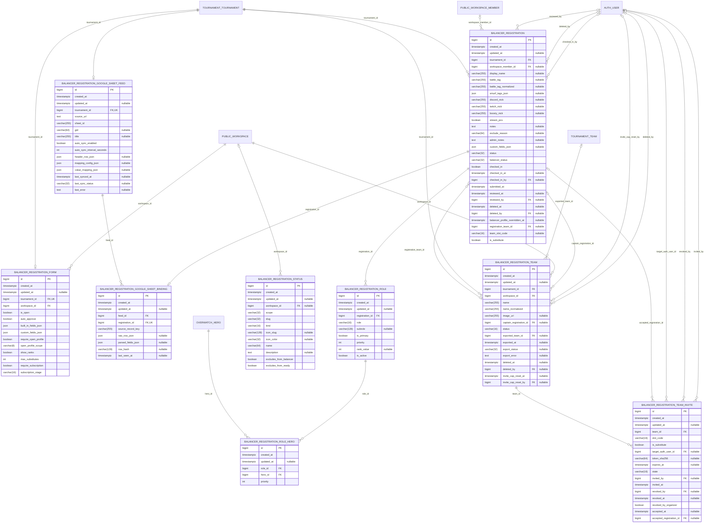
```mermaid
erDiagram
    BALANCER_REGISTRATION {
        bigint id PK
        timestamptz created_at
        timestamptz updated_at "nullable"
        bigint tournament_id FK
        bigint workspace_member_id FK "nullable"
        varchar(255) display_name "nullable"
        varchar(255) battle_tag "nullable"
        varchar(255) battle_tag_normalized "nullable"
        json smurf_tags_json "nullable"
        varchar(255) discord_nick "nullable"
        varchar(255) twitch_nick "nullable"
        varchar(255) boosty_nick "nullable"
        boolean stream_pov
        text notes "nullable"
        varchar(64) exclude_reason "nullable"
        text admin_notes "nullable"
        json custom_fields_json "nullable"
        varchar(32) status
        varchar(32) balancer_status
        boolean checked_in
        timestamptz checked_in_at "nullable"
        bigint checked_in_by FK "nullable"
        timestamptz submitted_at
        timestamptz reviewed_at "nullable"
        bigint reviewed_by FK "nullable"
        timestamptz deleted_at "nullable"
        bigint deleted_by FK "nullable"
        timestamptz balancer_profile_overridden_at "nullable"
        bigint registration_team_id FK "nullable"
        varchar(16) team_slot_code "nullable"
        boolean is_substitute
    }
    BALANCER_REGISTRATION_FORM {
        bigint id PK
        timestamptz created_at
        timestamptz updated_at "nullable"
        bigint tournament_id FK,UK
        bigint workspace_id FK
        boolean is_open
        boolean auto_approve
        json built_in_fields_json
        json custom_fields_json
        boolean require_open_profile
        varchar(8) open_profile_scope
        boolean show_ranks
        int max_substitutes
        boolean require_subscription
        varchar(16) subscription_stage
    }
    BALANCER_REGISTRATION_GOOGLE_SHEET_BINDING {
        bigint id PK
        timestamptz created_at
        timestamptz updated_at "nullable"
        bigint feed_id FK
        bigint registration_id FK,UK
        varchar(255) source_record_key
        json raw_row_json "nullable"
        json parsed_fields_json "nullable"
        varchar(128) row_hash "nullable"
        timestamptz last_seen_at "nullable"
    }
    BALANCER_REGISTRATION_GOOGLE_SHEET_FEED {
        bigint id PK
        timestamptz created_at
        timestamptz updated_at "nullable"
        bigint tournament_id FK,UK
        text source_url
        varchar(255) sheet_id
        varchar(64) gid "nullable"
        varchar(255) title "nullable"
        boolean auto_sync_enabled
        int auto_sync_interval_seconds
        json header_row_json "nullable"
        json mapping_config_json "nullable"
        json value_mapping_json "nullable"
        timestamptz last_synced_at "nullable"
        varchar(32) last_sync_status "nullable"
        text last_error "nullable"
    }
    BALANCER_REGISTRATION_ROLE {
        bigint id PK
        timestamptz created_at
        timestamptz updated_at "nullable"
        bigint registration_id FK
        varchar(16) role
        varchar(128) subrole "nullable"
        boolean is_primary
        int priority
        int rank_value "nullable"
        boolean is_active
    }
    BALANCER_REGISTRATION_ROLE_HERO {
        bigint id PK
        timestamptz created_at
        timestamptz updated_at "nullable"
        bigint role_id FK
        bigint hero_id FK
        int priority
    }
    BALANCER_REGISTRATION_STATUS {
        bigint id PK
        timestamptz created_at
        timestamptz updated_at "nullable"
        bigint workspace_id FK "nullable"
        varchar(32) scope
        varchar(32) slug
        varchar(16) kind
        varchar(128) icon_slug "nullable"
        varchar(32) icon_color "nullable"
        varchar(64) name
        text description "nullable"
        boolean excludes_from_balancer
        boolean excludes_from_ready
    }
    BALANCER_REGISTRATION_TEAM {
        bigint id PK
        timestamptz created_at
        timestamptz updated_at "nullable"
        bigint tournament_id FK
        bigint workspace_id FK
        varchar(255) name
        varchar(255) name_normalized
        varchar(255) image_url "nullable"
        bigint captain_registration_id FK "nullable"
        varchar(16) status
        bigint exported_team_id FK "nullable"
        timestamptz exported_at "nullable"
        varchar(32) export_status "nullable"
        text export_error "nullable"
        timestamptz deleted_at "nullable"
        bigint deleted_by FK "nullable"
        timestamptz invite_cap_reset_at "nullable"
        bigint invite_cap_reset_by FK "nullable"
    }
    BALANCER_REGISTRATION_TEAM_INVITE {
        bigint id PK
        timestamptz created_at
        timestamptz updated_at "nullable"
        bigint team_id FK
        varchar(16) slot_code
        boolean is_substitute
        bigint target_auth_user_id FK "nullable"
        varchar(64) token_sha256 "nullable"
        timestamptz expires_at "nullable"
        varchar(16) state
        bigint invited_by FK "nullable"
        timestamptz invited_at
        bigint revoked_by FK "nullable"
        timestamptz revoked_at "nullable"
        boolean revoked_by_organizer
        timestamptz accepted_at "nullable"
        bigint accepted_registration_id FK "nullable"
    }

    AUTH_USER |o--o{ BALANCER_REGISTRATION : "checked_in_by"
    AUTH_USER |o--o{ BALANCER_REGISTRATION : "deleted_by"
    AUTH_USER |o--o{ BALANCER_REGISTRATION : "reviewed_by"
    AUTH_USER |o--o{ BALANCER_REGISTRATION_TEAM : "deleted_by"
    AUTH_USER |o--o{ BALANCER_REGISTRATION_TEAM : "invite_cap_reset_by"
    AUTH_USER |o--o{ BALANCER_REGISTRATION_TEAM_INVITE : "invited_by"
    AUTH_USER |o--o{ BALANCER_REGISTRATION_TEAM_INVITE : "revoked_by"
    AUTH_USER |o--o{ BALANCER_REGISTRATION_TEAM_INVITE : "target_auth_user_id"
    BALANCER_REGISTRATION |o--o{ BALANCER_REGISTRATION_TEAM : "captain_registration_id"
    BALANCER_REGISTRATION |o--o{ BALANCER_REGISTRATION_TEAM_INVITE : "accepted_registration_id"
    BALANCER_REGISTRATION ||--o{ BALANCER_REGISTRATION_ROLE : "registration_id"
    BALANCER_REGISTRATION ||--o| BALANCER_REGISTRATION_GOOGLE_SHEET_BINDING : "registration_id"
    BALANCER_REGISTRATION_GOOGLE_SHEET_FEED ||--o{ BALANCER_REGISTRATION_GOOGLE_SHEET_BINDING : "feed_id"
    BALANCER_REGISTRATION_ROLE ||--o{ BALANCER_REGISTRATION_ROLE_HERO : "role_id"
    BALANCER_REGISTRATION_TEAM |o--o{ BALANCER_REGISTRATION : "registration_team_id"
    BALANCER_REGISTRATION_TEAM ||--o{ BALANCER_REGISTRATION_TEAM_INVITE : "team_id"
    OVERWATCH_HERO ||--o{ BALANCER_REGISTRATION_ROLE_HERO : "hero_id"
    PUBLIC_WORKSPACE |o--o{ BALANCER_REGISTRATION_STATUS : "workspace_id"
    PUBLIC_WORKSPACE ||--o{ BALANCER_REGISTRATION_FORM : "workspace_id"
    PUBLIC_WORKSPACE ||--o{ BALANCER_REGISTRATION_TEAM : "workspace_id"
    PUBLIC_WORKSPACE_MEMBER |o--o{ BALANCER_REGISTRATION : "workspace_member_id"
    TOURNAMENT_TEAM |o--o{ BALANCER_REGISTRATION_TEAM : "exported_team_id"
    TOURNAMENT_TOURNAMENT ||--o{ BALANCER_REGISTRATION : "tournament_id"
    TOURNAMENT_TOURNAMENT ||--o{ BALANCER_REGISTRATION_TEAM : "tournament_id"
    TOURNAMENT_TOURNAMENT ||--o| BALANCER_REGISTRATION_FORM : "tournament_id"
    TOURNAMENT_TOURNAMENT ||--o| BALANCER_REGISTRATION_GOOGLE_SHEET_FEED : "tournament_id"
```

Composite unique keys:

- `BALANCER_REGISTRATION_GOOGLE_SHEET_BINDING` unique on (`feed_id`, `source_record_key`)
- `BALANCER_REGISTRATION_ROLE` unique on (`registration_id`, `role`)
- `BALANCER_REGISTRATION_ROLE_HERO` unique on (`role_id`, `hero_id`)
- `BALANCER_REGISTRATION_ROLE_HERO` unique on (`role_id`, `priority`)
- `BALANCER_REGISTRATION_STATUS` unique on (`workspace_id`, `scope`, `slug`, `kind`)
<!-- /ERD:auto -->

## balancer — `balancer`

Balancing runs and their resulting teams, and the live snake draft: sessions, captains, the
player pool, the pick sequence, and the audit trail.

There is at most one `balance` per tournament. The chosen result is stored twice on purpose: as
`result_json` for replay, and normalized into `balance_variant` → `team` → `team_slot` for
querying. A slot identifies its player by normalized battle tag rather than by member id,
because the balancer works on the registration snapshot as it was submitted. `exported_team_id`
is the boundary where balancing output becomes tournament truth — until it is set, nothing in
`tournament` has been touched.

The draft is a snake draft with a server-authoritative clock: one session per tournament, its
pool taken either from a saved balance (`source_balance_id`) or built directly, and `version`
columns on the session and on each pick as the optimistic lock. Session and pick reference each
other (`current_pick_id` ↔ `session_id`), which is why the FK is declared with `use_alter`.

`draft_player` is unique on `(session_id, registration_id)`: a pool entry *is* a registration,
so roles, ranks and top heroes are read from the registration tables instead of being copied
into draft-local child tables, which is what the earlier model did. Captain, drafted player and
pick actor all resolve through `workspace_member`; `captain_auth_user_id` exists separately only
as the "this is me" signal for the live UI. `draft_audit_event` is the append-only trail of what
the session did and who caused it.

Configuration exists at two levels — `workspace_config` as the default and `tournament_config`
as the override — each unique on its scope.

<!-- ERD:auto balancer -->
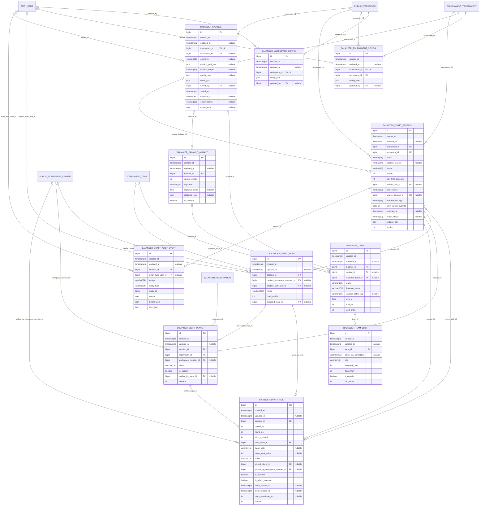
```mermaid
erDiagram
    BALANCER_BALANCE {
        bigint id PK
        timestamptz created_at
        timestamptz updated_at "nullable"
        bigint tournament_id FK,UK
        bigint workspace_id FK "nullable"
        varchar(32) algorithm "nullable"
        json division_grid_json "nullable"
        varchar(32) division_scope "nullable"
        json config_json "nullable"
        json result_json
        bigint saved_by FK "nullable"
        timestamptz saved_at
        timestamptz exported_at "nullable"
        varchar(32) export_status "nullable"
        text export_error "nullable"
    }
    BALANCER_BALANCE_VARIANT {
        bigint id PK
        timestamptz created_at
        timestamptz updated_at "nullable"
        bigint balance_id FK
        int variant_number
        varchar(32) algorithm
        float objective_score "nullable"
        json statistics_json "nullable"
        boolean is_selected
    }
    BALANCER_DRAFT_AUDIT_EVENT {
        bigint id PK
        timestamptz created_at
        timestamptz updated_at "nullable"
        bigint session_id FK
        bigint actor_auth_user_id FK "nullable"
        varchar(64) action
        varchar(64) entity_type
        bigint entity_id
        text reason
        json before_json
        json after_json
    }
    BALANCER_DRAFT_PICK {
        bigint id PK
        timestamptz created_at
        timestamptz updated_at "nullable"
        bigint session_id FK
        int overall_no
        int round_no
        int pick_in_round
        bigint draft_team_id FK
        varchar(16) target_role "nullable"
        int target_rank_value "nullable"
        varchar(16) status
        bigint picked_player_id FK "nullable"
        bigint picked_by_workspace_member_id FK "nullable"
        boolean is_autopick
        boolean is_admin_override
        timestamptz clock_started_at "nullable"
        timestamptz clock_expires_at "nullable"
        int clock_remaining_ms "nullable"
        int version
    }
    BALANCER_DRAFT_PLAYER {
        bigint id PK
        timestamptz created_at
        timestamptz updated_at "nullable"
        bigint session_id FK
        bigint registration_id FK
        bigint workspace_member_id FK "nullable"
        varchar(16) status
        boolean is_captain
        bigint drafted_by_team_id FK "nullable"
        int version
    }
    BALANCER_DRAFT_SESSION {
        bigint id PK
        timestamptz created_at
        timestamptz updated_at "nullable"
        bigint tournament_id FK
        bigint workspace_id FK
        varchar(16) status
        varchar(64) blocked_reason "nullable"
        varchar(16) format
        int rounds
        int pick_time_seconds
        bigint current_pick_id FK "nullable"
        varchar(32) pool_source
        bigint source_balance_id FK "nullable"
        varchar(16) autopick_strategy
        boolean allow_admin_override
        timestamptz exported_at "nullable"
        varchar(32) export_status "nullable"
        json settings_json
        int version
    }
    BALANCER_DRAFT_TEAM {
        bigint id PK
        timestamptz created_at
        timestamptz updated_at "nullable"
        bigint session_id FK
        bigint captain_workspace_member_id FK "nullable"
        bigint captain_auth_user_id FK "nullable"
        varchar(255) name
        int draft_position
        bigint exported_team_id FK "nullable"
    }
    BALANCER_TEAM {
        bigint id PK
        timestamptz created_at
        timestamptz updated_at "nullable"
        bigint balance_id FK
        bigint variant_id FK "nullable"
        bigint exported_team_id FK "nullable"
        varchar(255) name
        varchar(255) balancer_name
        varchar(255) captain_battle_tag "nullable"
        float avg_sr
        int total_sr
        int sort_order
    }
    BALANCER_TEAM_SLOT {
        bigint id PK
        timestamptz created_at
        timestamptz updated_at "nullable"
        bigint team_id FK
        varchar(255) battle_tag_normalized "nullable"
        varchar(16) role
        int assigned_rank
        int discomfort
        boolean is_captain
        int sort_order
    }
    BALANCER_TOURNAMENT_CONFIG {
        bigint id PK
        timestamptz created_at
        timestamptz updated_at "nullable"
        bigint tournament_id FK,UK
        bigint workspace_id FK
        json config_json
        bigint updated_by FK "nullable"
    }
    BALANCER_WORKSPACE_CONFIG {
        bigint id PK
        timestamptz created_at
        timestamptz updated_at "nullable"
        bigint workspace_id FK,UK
        json config_json
        bigint updated_by FK "nullable"
    }

    AUTH_USER |o--o{ BALANCER_BALANCE : "saved_by"
    AUTH_USER |o--o{ BALANCER_DRAFT_AUDIT_EVENT : "actor_auth_user_id"
    AUTH_USER |o--o{ BALANCER_DRAFT_TEAM : "captain_auth_user_id"
    AUTH_USER |o--o{ BALANCER_TOURNAMENT_CONFIG : "updated_by"
    AUTH_USER |o--o{ BALANCER_WORKSPACE_CONFIG : "updated_by"
    BALANCER_BALANCE |o--o{ BALANCER_DRAFT_SESSION : "source_balance_id"
    BALANCER_BALANCE ||--o{ BALANCER_BALANCE_VARIANT : "balance_id"
    BALANCER_BALANCE ||--o{ BALANCER_TEAM : "balance_id"
    BALANCER_BALANCE_VARIANT |o--o{ BALANCER_TEAM : "variant_id"
    BALANCER_DRAFT_PICK |o--o{ BALANCER_DRAFT_SESSION : "current_pick_id"
    BALANCER_DRAFT_PLAYER |o--o{ BALANCER_DRAFT_PICK : "picked_player_id"
    BALANCER_DRAFT_SESSION ||--o{ BALANCER_DRAFT_AUDIT_EVENT : "session_id"
    BALANCER_DRAFT_SESSION ||--o{ BALANCER_DRAFT_PICK : "session_id"
    BALANCER_DRAFT_SESSION ||--o{ BALANCER_DRAFT_PLAYER : "session_id"
    BALANCER_DRAFT_SESSION ||--o{ BALANCER_DRAFT_TEAM : "session_id"
    BALANCER_DRAFT_TEAM |o--o{ BALANCER_DRAFT_PLAYER : "drafted_by_team_id"
    BALANCER_DRAFT_TEAM ||--o{ BALANCER_DRAFT_PICK : "draft_team_id"
    BALANCER_REGISTRATION ||--o{ BALANCER_DRAFT_PLAYER : "registration_id"
    BALANCER_TEAM ||--o{ BALANCER_TEAM_SLOT : "team_id"
    PUBLIC_WORKSPACE |o--o{ BALANCER_BALANCE : "workspace_id"
    PUBLIC_WORKSPACE ||--o{ BALANCER_DRAFT_SESSION : "workspace_id"
    PUBLIC_WORKSPACE ||--o{ BALANCER_TOURNAMENT_CONFIG : "workspace_id"
    PUBLIC_WORKSPACE ||--o| BALANCER_WORKSPACE_CONFIG : "workspace_id"
    PUBLIC_WORKSPACE_MEMBER |o--o{ BALANCER_DRAFT_PICK : "picked_by_workspace_member_id"
    PUBLIC_WORKSPACE_MEMBER |o--o{ BALANCER_DRAFT_PLAYER : "workspace_member_id"
    PUBLIC_WORKSPACE_MEMBER |o--o{ BALANCER_DRAFT_TEAM : "captain_workspace_member_id"
    TOURNAMENT_TEAM |o--o{ BALANCER_DRAFT_TEAM : "exported_team_id"
    TOURNAMENT_TEAM |o--o{ BALANCER_TEAM : "exported_team_id"
    TOURNAMENT_TOURNAMENT ||--o{ BALANCER_DRAFT_SESSION : "tournament_id"
    TOURNAMENT_TOURNAMENT ||--o| BALANCER_BALANCE : "tournament_id"
    TOURNAMENT_TOURNAMENT ||--o| BALANCER_TOURNAMENT_CONFIG : "tournament_id"
```

Composite unique keys:

- `BALANCER_BALANCE_VARIANT` unique on (`balance_id`, `variant_number`)
- `BALANCER_DRAFT_PICK` unique on (`session_id`, `overall_no`)
- `BALANCER_DRAFT_PLAYER` unique on (`session_id`, `registration_id`)
- `BALANCER_DRAFT_TEAM` unique on (`session_id`, `draft_position`)
<!-- /ERD:auto -->

## custom_game — `balancer`

Workspace custom games ("mixes"): the game, its host and co-hosts, the lineup, per-player role
and must-play constraints, and the role slots that shape a team.

Host and co-hosts are accounts (`auth.user`), while the lineup is workspace members: hosting is
an act, playing is a membership. `participation` separates a player who must be in the game from
the pool that fills the remaining slots and from the benched, and `role_slot` fixes the shape of
a team per role. The balancer input and its output are kept as versioned JSON on the game row
(`balancer_config_json` / `balance_result_json` with their `*_version` counters), so a re-balance
is a new version rather than an in-place overwrite. The child tables use composite primary keys
rather than surrogate ids — the pair *is* the fact.

<!-- ERD:auto custom_game -->
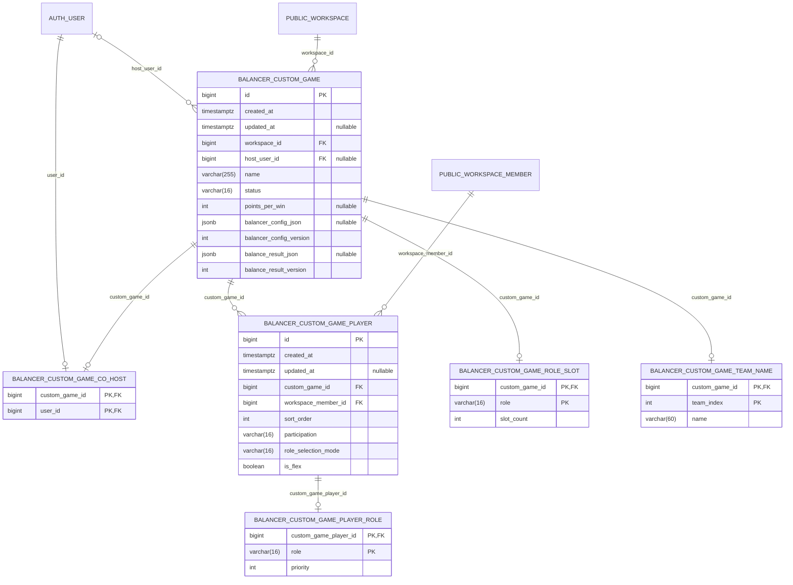
```mermaid
erDiagram
    BALANCER_CUSTOM_GAME {
        bigint id PK
        timestamptz created_at
        timestamptz updated_at "nullable"
        bigint workspace_id FK
        bigint host_user_id FK "nullable"
        varchar(255) name
        varchar(16) status
        int points_per_win "nullable"
        jsonb balancer_config_json "nullable"
        int balancer_config_version
        jsonb balance_result_json "nullable"
        int balance_result_version
    }
    BALANCER_CUSTOM_GAME_CO_HOST {
        bigint custom_game_id PK,FK
        bigint user_id PK,FK
    }
    BALANCER_CUSTOM_GAME_PLAYER {
        bigint id PK
        timestamptz created_at
        timestamptz updated_at "nullable"
        bigint custom_game_id FK
        bigint workspace_member_id FK
        int sort_order
        varchar(16) participation
        varchar(16) role_selection_mode
        boolean is_flex
    }
    BALANCER_CUSTOM_GAME_PLAYER_ROLE {
        bigint custom_game_player_id PK,FK
        varchar(16) role PK
        int priority
    }
    BALANCER_CUSTOM_GAME_ROLE_SLOT {
        bigint custom_game_id PK,FK
        varchar(16) role PK
        int slot_count
    }
    BALANCER_CUSTOM_GAME_TEAM_NAME {
        bigint custom_game_id PK,FK
        int team_index PK
        varchar(60) name
    }

    AUTH_USER |o--o{ BALANCER_CUSTOM_GAME : "host_user_id"
    AUTH_USER ||--o| BALANCER_CUSTOM_GAME_CO_HOST : "user_id"
    BALANCER_CUSTOM_GAME ||--o{ BALANCER_CUSTOM_GAME_PLAYER : "custom_game_id"
    BALANCER_CUSTOM_GAME ||--o| BALANCER_CUSTOM_GAME_CO_HOST : "custom_game_id"
    BALANCER_CUSTOM_GAME ||--o| BALANCER_CUSTOM_GAME_ROLE_SLOT : "custom_game_id"
    BALANCER_CUSTOM_GAME ||--o| BALANCER_CUSTOM_GAME_TEAM_NAME : "custom_game_id"
    BALANCER_CUSTOM_GAME_PLAYER ||--o| BALANCER_CUSTOM_GAME_PLAYER_ROLE : "custom_game_player_id"
    PUBLIC_WORKSPACE ||--o{ BALANCER_CUSTOM_GAME : "workspace_id"
    PUBLIC_WORKSPACE_MEMBER ||--o{ BALANCER_CUSTOM_GAME_PLAYER : "workspace_member_id"
```

Composite unique keys:

- `BALANCER_CUSTOM_GAME_PLAYER` unique on (`custom_game_id`, `workspace_member_id`)
- `BALANCER_CUSTOM_GAME_PLAYER_ROLE` unique on (`custom_game_player_id`, `priority`)
<!-- /ERD:auto -->

## casual — `casual`

Casual matches recorded outside a tournament bracket.

A casual match is not free-floating: `custom_game_id` is NOT NULL, so every row here is a played
round of a mix. Each match has exactly two teams (unique on `match_id, side`). A player row
stores `display_name_snapshot` and allows a NULL `workspace_member_id` for the same reason — the
result must stay readable after a rename or after the member leaves the workspace.

<!-- ERD:auto casual -->
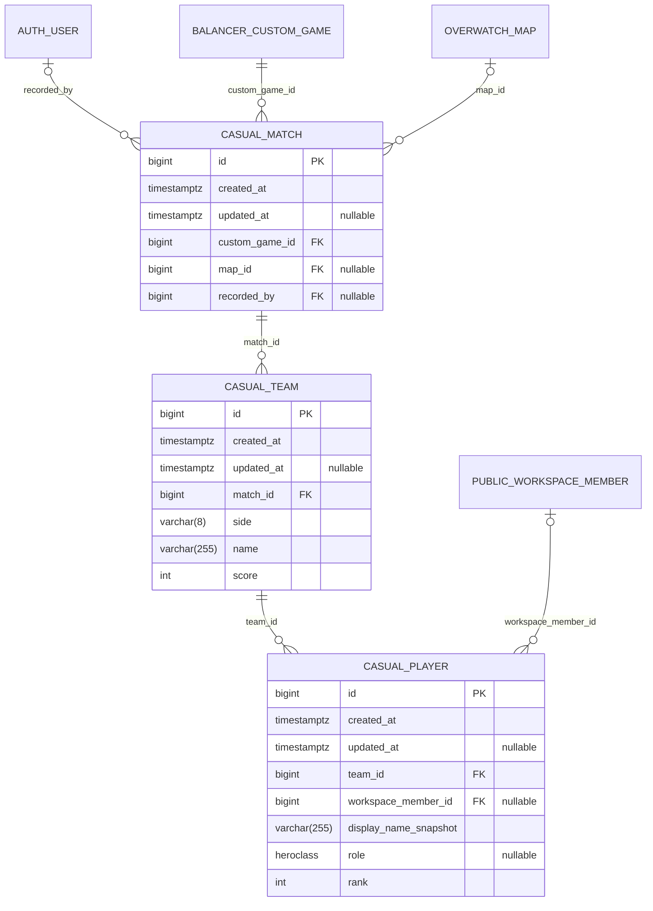
```mermaid
erDiagram
    CASUAL_MATCH {
        bigint id PK
        timestamptz created_at
        timestamptz updated_at "nullable"
        bigint custom_game_id FK
        bigint map_id FK "nullable"
        bigint recorded_by FK "nullable"
    }
    CASUAL_PLAYER {
        bigint id PK
        timestamptz created_at
        timestamptz updated_at "nullable"
        bigint team_id FK
        bigint workspace_member_id FK "nullable"
        varchar(255) display_name_snapshot
        heroclass role "nullable"
        int rank
    }
    CASUAL_TEAM {
        bigint id PK
        timestamptz created_at
        timestamptz updated_at "nullable"
        bigint match_id FK
        varchar(8) side
        varchar(255) name
        int score
    }

    AUTH_USER |o--o{ CASUAL_MATCH : "recorded_by"
    BALANCER_CUSTOM_GAME ||--o{ CASUAL_MATCH : "custom_game_id"
    CASUAL_MATCH ||--o{ CASUAL_TEAM : "match_id"
    CASUAL_TEAM ||--o{ CASUAL_PLAYER : "team_id"
    OVERWATCH_MAP |o--o{ CASUAL_MATCH : "map_id"
    PUBLIC_WORKSPACE_MEMBER |o--o{ CASUAL_PLAYER : "workspace_member_id"
```

Composite unique keys:

- `CASUAL_TEAM` unique on (`match_id`, `side`)
<!-- /ERD:auto -->

## matches — `matches`

Parsed match logs: one row per played map, per-round statistics, the kill feed, assists, and the
statistical baselines derived from them.

A `match` row is one played map inside an encounter, not the encounter itself; `map_index` is
its 1-based position in the series and is nullable for logs parsed before that column existed.
`log_record_id` is the provenance link back to the uploaded file and is nullable, so pruning
ingestion records never deletes parsed matches.

`statistics` is long-format — one row per `(match, round, team, player, hero, stat name)` with a
single float — which is why it is by far the largest table in the database. `kill_feed` and
`event` both record two sides of an interaction (killer/victim, actor/related) with team and
hero on each side, so a query never has to infer who was on the other end.

`stat_baselines` holds the precomputed mean and standard deviation per
`(formula_version, role, rank_bucket, stat)`; it is what turns a raw stat into a comparable
score without re-scanning `statistics`. The global per-hero records are served from
`matches.mv_hero_global_stats`, a materialized view refreshed concurrently out of band — it is
not a model, so it is not on the diagram.

<!-- ERD:auto matches -->
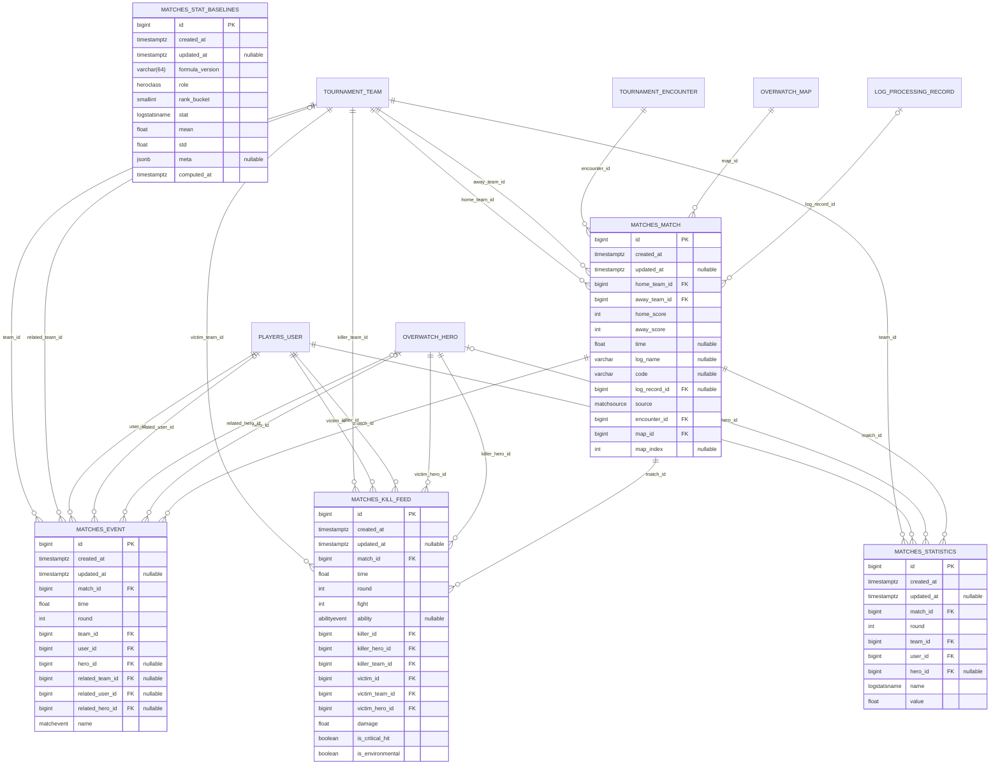
```mermaid
erDiagram
    MATCHES_EVENT {
        bigint id PK
        timestamptz created_at
        timestamptz updated_at "nullable"
        bigint match_id FK
        float time
        int round
        bigint team_id FK
        bigint user_id FK
        bigint hero_id FK "nullable"
        bigint related_team_id FK "nullable"
        bigint related_user_id FK "nullable"
        bigint related_hero_id FK "nullable"
        matchevent name
    }
    MATCHES_KILL_FEED {
        bigint id PK
        timestamptz created_at
        timestamptz updated_at "nullable"
        bigint match_id FK
        float time
        int round
        int fight
        abilityevent ability "nullable"
        bigint killer_id FK
        bigint killer_hero_id FK
        bigint killer_team_id FK
        bigint victim_id FK
        bigint victim_team_id FK
        bigint victim_hero_id FK
        float damage
        boolean is_critical_hit
        boolean is_environmental
    }
    MATCHES_MATCH {
        bigint id PK
        timestamptz created_at
        timestamptz updated_at "nullable"
        bigint home_team_id FK
        bigint away_team_id FK
        int home_score
        int away_score
        float time "nullable"
        varchar log_name "nullable"
        varchar code "nullable"
        bigint log_record_id FK "nullable"
        matchsource source
        bigint encounter_id FK
        bigint map_id FK
        int map_index "nullable"
    }
    MATCHES_STAT_BASELINES {
        bigint id PK
        timestamptz created_at
        timestamptz updated_at "nullable"
        varchar(64) formula_version
        heroclass role
        smallint rank_bucket
        logstatsname stat
        float mean
        float std
        jsonb meta "nullable"
        timestamptz computed_at
    }
    MATCHES_STATISTICS {
        bigint id PK
        timestamptz created_at
        timestamptz updated_at "nullable"
        bigint match_id FK
        int round
        bigint team_id FK
        bigint user_id FK
        bigint hero_id FK "nullable"
        logstatsname name
        float value
    }

    LOG_PROCESSING_RECORD |o--o{ MATCHES_MATCH : "log_record_id"
    MATCHES_MATCH ||--o{ MATCHES_EVENT : "match_id"
    MATCHES_MATCH ||--o{ MATCHES_KILL_FEED : "match_id"
    MATCHES_MATCH ||--o{ MATCHES_STATISTICS : "match_id"
    OVERWATCH_HERO |o--o{ MATCHES_EVENT : "hero_id"
    OVERWATCH_HERO |o--o{ MATCHES_EVENT : "related_hero_id"
    OVERWATCH_HERO |o--o{ MATCHES_STATISTICS : "hero_id"
    OVERWATCH_HERO ||--o{ MATCHES_KILL_FEED : "killer_hero_id"
    OVERWATCH_HERO ||--o{ MATCHES_KILL_FEED : "victim_hero_id"
    OVERWATCH_MAP ||--o{ MATCHES_MATCH : "map_id"
    PLAYERS_USER |o--o{ MATCHES_EVENT : "related_user_id"
    PLAYERS_USER ||--o{ MATCHES_EVENT : "user_id"
    PLAYERS_USER ||--o{ MATCHES_KILL_FEED : "killer_id"
    PLAYERS_USER ||--o{ MATCHES_KILL_FEED : "victim_id"
    PLAYERS_USER ||--o{ MATCHES_STATISTICS : "user_id"
    TOURNAMENT_ENCOUNTER ||--o{ MATCHES_MATCH : "encounter_id"
    TOURNAMENT_TEAM |o--o{ MATCHES_EVENT : "related_team_id"
    TOURNAMENT_TEAM ||--o{ MATCHES_EVENT : "team_id"
    TOURNAMENT_TEAM ||--o{ MATCHES_KILL_FEED : "killer_team_id"
    TOURNAMENT_TEAM ||--o{ MATCHES_KILL_FEED : "victim_team_id"
    TOURNAMENT_TEAM ||--o{ MATCHES_MATCH : "away_team_id"
    TOURNAMENT_TEAM ||--o{ MATCHES_MATCH : "home_team_id"
    TOURNAMENT_TEAM ||--o{ MATCHES_STATISTICS : "team_id"
```

Composite unique keys:

- `MATCHES_STAT_BASELINES` unique on (`formula_version`, `role`, `rank_bucket`, `stat`)
<!-- /ERD:auto -->

## ingestion — `log_processing`

The upload and parse pipeline: the record of each processed log file, and the Discord channels
logs arrive from.

`record` is the unit of work and the retry state at once: `content_hash` rejects a re-upload of
the same file, `status` and `source` say where it is and where it came from, and `attempts` is
the retry budget carried on the row so a reaper can resume work without any external queue
state. `uploader_id` and `attached_encounter_id` are both nullable — a log can arrive from a
Discord channel with no uploader, and before anyone has bound it to an encounter.
`discord_channel` binds one channel to one tournament (UNIQUE on both sides).

<!-- ERD:auto ingestion -->
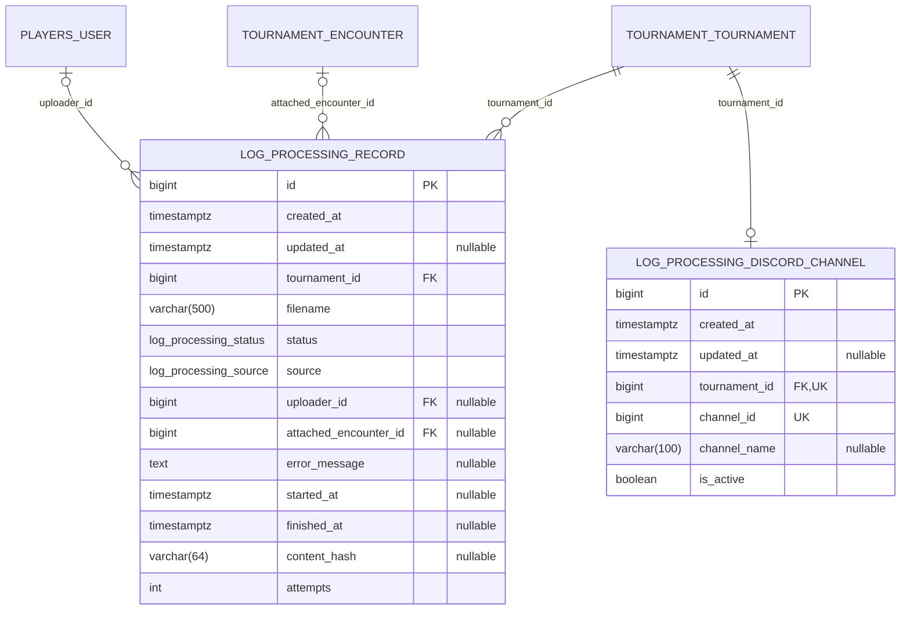
```mermaid
erDiagram
    LOG_PROCESSING_DISCORD_CHANNEL {
        bigint id PK
        timestamptz created_at
        timestamptz updated_at "nullable"
        bigint tournament_id FK,UK
        bigint channel_id UK
        varchar(100) channel_name "nullable"
        boolean is_active
    }
    LOG_PROCESSING_RECORD {
        bigint id PK
        timestamptz created_at
        timestamptz updated_at "nullable"
        bigint tournament_id FK
        varchar(500) filename
        log_processing_status status
        log_processing_source source
        bigint uploader_id FK "nullable"
        bigint attached_encounter_id FK "nullable"
        text error_message "nullable"
        timestamptz started_at "nullable"
        timestamptz finished_at "nullable"
        varchar(64) content_hash "nullable"
        int attempts
    }

    PLAYERS_USER |o--o{ LOG_PROCESSING_RECORD : "uploader_id"
    TOURNAMENT_ENCOUNTER |o--o{ LOG_PROCESSING_RECORD : "attached_encounter_id"
    TOURNAMENT_TOURNAMENT ||--o{ LOG_PROCESSING_RECORD : "tournament_id"
    TOURNAMENT_TOURNAMENT ||--o| LOG_PROCESSING_DISCORD_CHANNEL : "tournament_id"
```
<!-- /ERD:auto -->

## achievements — `achievements`

The declarative achievement engine: a rule as a JSON condition tree, the evaluation results it
produces, the manual grant/revoke overlay, and the evaluation runs.

A rule is data, not code: `condition_tree` is the JSON condition, `scope` and `grain` say what
it is evaluated over, `depends_on` lets one rule build on another, and `rule_version` makes a
result produced by an older version of the same rule distinguishable. Rules are per workspace
(`workspace_id, slug` unique), optionally tied to a hero.

`evaluation_result` is unique on `(rule, member, tournament, match)`, which is what makes
re-evaluation idempotent — a run inserts or does nothing. `override` is a separate manual
grant/revoke overlay precisely so that a re-evaluation can never erase an admin's decision.
`evaluation_run` is the run audit, and results point back at it by `run_id`.

Recipients are `workspace_member`, not players: an achievement is earned inside one tenant. The
earlier `achievements.achievement` and `achievements.user` tables are gone — the rule engine
replaced them.

<!-- ERD:auto achievements -->
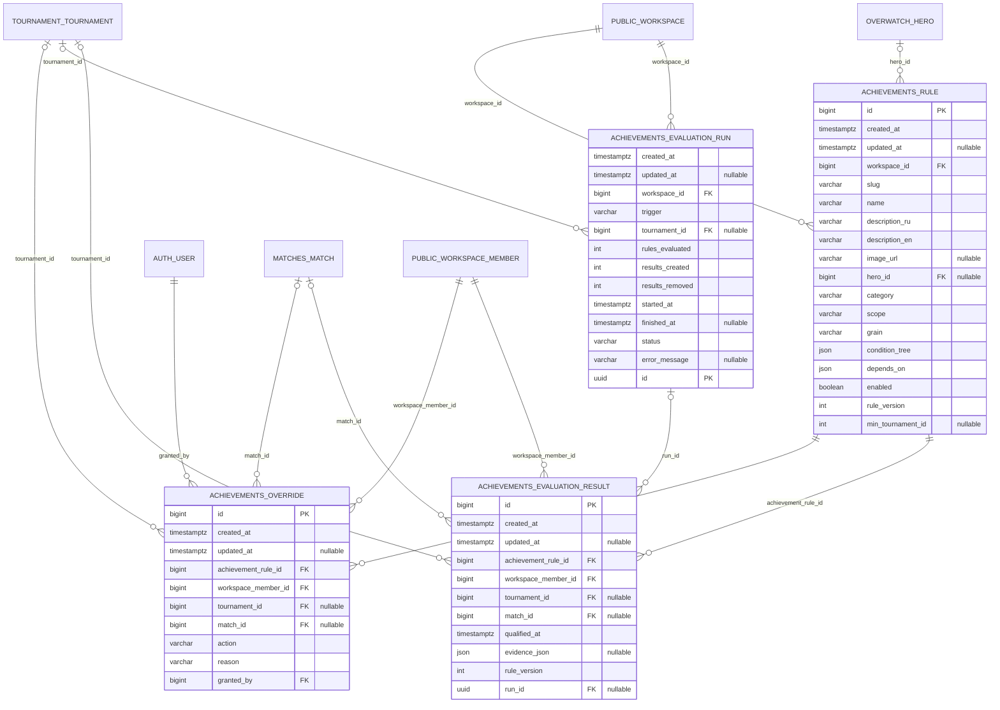
```mermaid
erDiagram
    ACHIEVEMENTS_EVALUATION_RESULT {
        bigint id PK
        timestamptz created_at
        timestamptz updated_at "nullable"
        bigint achievement_rule_id FK
        bigint workspace_member_id FK
        bigint tournament_id FK "nullable"
        bigint match_id FK "nullable"
        timestamptz qualified_at
        json evidence_json "nullable"
        int rule_version
        uuid run_id FK "nullable"
    }
    ACHIEVEMENTS_EVALUATION_RUN {
        timestamptz created_at
        timestamptz updated_at "nullable"
        bigint workspace_id FK
        varchar trigger
        bigint tournament_id FK "nullable"
        int rules_evaluated
        int results_created
        int results_removed
        timestamptz started_at
        timestamptz finished_at "nullable"
        varchar status
        varchar error_message "nullable"
        uuid id PK
    }
    ACHIEVEMENTS_OVERRIDE {
        bigint id PK
        timestamptz created_at
        timestamptz updated_at "nullable"
        bigint achievement_rule_id FK
        bigint workspace_member_id FK
        bigint tournament_id FK "nullable"
        bigint match_id FK "nullable"
        varchar action
        varchar reason
        bigint granted_by FK
    }
    ACHIEVEMENTS_RULE {
        bigint id PK
        timestamptz created_at
        timestamptz updated_at "nullable"
        bigint workspace_id FK
        varchar slug
        varchar name
        varchar description_ru
        varchar description_en
        varchar image_url "nullable"
        bigint hero_id FK "nullable"
        varchar category
        varchar scope
        varchar grain
        json condition_tree
        json depends_on
        boolean enabled
        int rule_version
        int min_tournament_id "nullable"
    }

    ACHIEVEMENTS_EVALUATION_RUN |o--o{ ACHIEVEMENTS_EVALUATION_RESULT : "run_id"
    ACHIEVEMENTS_RULE ||--o{ ACHIEVEMENTS_EVALUATION_RESULT : "achievement_rule_id"
    ACHIEVEMENTS_RULE ||--o{ ACHIEVEMENTS_OVERRIDE : "achievement_rule_id"
    AUTH_USER ||--o{ ACHIEVEMENTS_OVERRIDE : "granted_by"
    MATCHES_MATCH |o--o{ ACHIEVEMENTS_EVALUATION_RESULT : "match_id"
    MATCHES_MATCH |o--o{ ACHIEVEMENTS_OVERRIDE : "match_id"
    OVERWATCH_HERO |o--o{ ACHIEVEMENTS_RULE : "hero_id"
    PUBLIC_WORKSPACE ||--o{ ACHIEVEMENTS_EVALUATION_RUN : "workspace_id"
    PUBLIC_WORKSPACE ||--o{ ACHIEVEMENTS_RULE : "workspace_id"
    PUBLIC_WORKSPACE_MEMBER ||--o{ ACHIEVEMENTS_EVALUATION_RESULT : "workspace_member_id"
    PUBLIC_WORKSPACE_MEMBER ||--o{ ACHIEVEMENTS_OVERRIDE : "workspace_member_id"
    TOURNAMENT_TOURNAMENT |o--o{ ACHIEVEMENTS_EVALUATION_RESULT : "tournament_id"
    TOURNAMENT_TOURNAMENT |o--o{ ACHIEVEMENTS_EVALUATION_RUN : "tournament_id"
    TOURNAMENT_TOURNAMENT |o--o{ ACHIEVEMENTS_OVERRIDE : "tournament_id"
```

Composite unique keys:

- `ACHIEVEMENTS_EVALUATION_RESULT` unique on (`achievement_rule_id`, `workspace_member_id`, `tournament_id`, `match_id`)
- `ACHIEVEMENTS_RULE` unique on (`workspace_id`, `slug`)
<!-- /ERD:auto -->

## analytics — `analytics`

Signals computed on top of tournament results and match logs: rating shifts, per-player
performance, placement distributions, encounter quality and player anomalies with their reviewer
verdicts, the ML model registry, and the job table that tracks long-running compute.

`algorithms` is the registry every derived number points at, which is why practically every
unique key in this schema includes `algorithm_id`: two algorithms may hold different opinions
about the same `(tournament, player)` at the same time, and neither overwrites the other.

Everything here is anchored on `tournament.player` — the roster slot — rather than on a player
or a member, so a number always belongs to one participation in one tournament and never leaks
across tournaments. Nothing in `analytics` references `matches` directly; match data is reached
through the encounter.

`standings_distribution` is the only source of placement predictions: a Monte Carlo distribution
per `(tournament, team, algorithm)` with mean, median, p10/p90, top-1/3/8 probabilities and the
full histogram. A scalar "predicted place" is the rounded mean, derived at read time; the older
scalar predictions table was dropped rather than kept in sync.

`player_anomaly` flags a suspicious performance and `anomaly_feedback` records the reviewer's
verdict, unique per `(tournament, player, kind)` — a reviewed anomaly stays reviewed instead of
being raised again on every recompute. `job` is the single recomputation tracker for both
ordinary compute and ML training.

<!-- ERD:auto analytics -->

```mermaid
erDiagram
    ANALYTICS_ALGORITHMS {
        bigint id PK
        timestamptz created_at
        timestamptz updated_at "nullable"
        varchar name UK
        boolean produces_shifts
    }
    ANALYTICS_ANOMALY_FEEDBACK {
        bigint id PK
        timestamptz created_at
        timestamptz updated_at "nullable"
        bigint tournament_id FK
        bigint player_id FK
        varchar(32) kind
        varchar(16) verdict
        bigint reviewer_user_id FK "nullable"
        text note "nullable"
    }
    ANALYTICS_JOB {
        bigint id PK
        timestamptz created_at
        timestamptz updated_at "nullable"
        bigint workspace_id FK "nullable"
        bigint tournament_id FK
        bigint requested_by_user_id FK "nullable"
        varchar(16) kind
        varchar(16) status
        json algorithms "nullable"
        json training_workspace_ids "nullable"
        json progress
        text error "nullable"
        timestamptz started_at "nullable"
        timestamptz finished_at "nullable"
    }
    ANALYTICS_MATCH_QUALITY {
        bigint id PK
        timestamptz created_at
        timestamptz updated_at "nullable"
        bigint encounter_id FK
        bigint algorithm_id FK
        float competitiveness
        float predictability
        float skill_balance
        float quality_score
    }
    ANALYTICS_ML_MODEL_ARTIFACT {
        bigint id PK
        timestamptz created_at
        timestamptz updated_at "nullable"
        bigint algorithm_id FK
        varchar(32) model_kind
        varchar(16) role "nullable"
        varchar(32) version
        text storage_uri
        varchar(32) feature_version
        bigint training_cutoff_tournament_id FK "nullable"
        json metrics "nullable"
        json feature_importance "nullable"
        boolean is_active
    }
    ANALYTICS_PERFORMANCE {
        bigint id PK
        timestamptz created_at
        timestamptz updated_at "nullable"
        bigint tournament_id FK
        bigint player_id FK
        bigint algorithm_id FK
        float impact_score
        float raw_value
        float confidence
        float log_coverage
        float local_mean
        float local_std
        float local_residual
        float local_zscore
        float local_percentile
        int local_reference_n
        int local_band_min_div "nullable"
        int local_band_max_div "nullable"
        json contributions "nullable"
        float base_value "nullable"
    }
    ANALYTICS_PLAYER_ANOMALY {
        bigint id PK
        timestamptz created_at
        timestamptz updated_at "nullable"
        bigint tournament_id FK
        bigint player_id FK
        varchar(32) kind
        float score
        float confidence
        json reasons
        json evidence "nullable"
        bigint source_encounter_id FK "nullable"
    }
    ANALYTICS_PLAYER_SHIFT {
        bigint id PK
        timestamptz created_at
        timestamptz updated_at "nullable"
        bigint tournament_id FK
        bigint player_id FK
        int wins
        int losses
        int shift_one "nullable"
        int shift_two "nullable"
        int shift "nullable"
    }
    ANALYTICS_SHIFTS {
        bigint id PK
        timestamptz created_at
        timestamptz updated_at "nullable"
        bigint tournament_id FK
        bigint algorithm_id FK
        bigint player_id FK
        float shift
        float confidence
        float effective_evidence
        int sample_tournaments
        int sample_matches
        float log_coverage
    }
    ANALYTICS_STANDINGS_DISTRIBUTION {
        bigint id PK
        timestamptz created_at
        timestamptz updated_at "nullable"
        bigint tournament_id FK
        bigint team_id FK
        bigint algorithm_id FK
        float mean_position
        float median_position
        float p10_position
        float p90_position
        float prob_top1
        float prob_top3
        float prob_top8
        json position_histogram
    }

    ANALYTICS_ALGORITHMS ||--o{ ANALYTICS_MATCH_QUALITY : "algorithm_id"
    ANALYTICS_ALGORITHMS ||--o{ ANALYTICS_ML_MODEL_ARTIFACT : "algorithm_id"
    ANALYTICS_ALGORITHMS ||--o{ ANALYTICS_PERFORMANCE : "algorithm_id"
    ANALYTICS_ALGORITHMS ||--o{ ANALYTICS_SHIFTS : "algorithm_id"
    ANALYTICS_ALGORITHMS ||--o{ ANALYTICS_STANDINGS_DISTRIBUTION : "algorithm_id"
    AUTH_USER |o--o{ ANALYTICS_ANOMALY_FEEDBACK : "reviewer_user_id"
    AUTH_USER |o--o{ ANALYTICS_JOB : "requested_by_user_id"
    PUBLIC_WORKSPACE |o--o{ ANALYTICS_JOB : "workspace_id"
    TOURNAMENT_ENCOUNTER |o--o{ ANALYTICS_PLAYER_ANOMALY : "source_encounter_id"
    TOURNAMENT_ENCOUNTER ||--o{ ANALYTICS_MATCH_QUALITY : "encounter_id"
    TOURNAMENT_PLAYER ||--o{ ANALYTICS_ANOMALY_FEEDBACK : "player_id"
    TOURNAMENT_PLAYER ||--o{ ANALYTICS_PERFORMANCE : "player_id"
    TOURNAMENT_PLAYER ||--o{ ANALYTICS_PLAYER_ANOMALY : "player_id"
    TOURNAMENT_PLAYER ||--o{ ANALYTICS_PLAYER_SHIFT : "player_id"
    TOURNAMENT_PLAYER ||--o{ ANALYTICS_SHIFTS : "player_id"
    TOURNAMENT_TEAM ||--o{ ANALYTICS_STANDINGS_DISTRIBUTION : "team_id"
    TOURNAMENT_TOURNAMENT |o--o{ ANALYTICS_ML_MODEL_ARTIFACT : "training_cutoff_tournament_id"
    TOURNAMENT_TOURNAMENT ||--o{ ANALYTICS_ANOMALY_FEEDBACK : "tournament_id"
    TOURNAMENT_TOURNAMENT ||--o{ ANALYTICS_JOB : "tournament_id"
    TOURNAMENT_TOURNAMENT ||--o{ ANALYTICS_PERFORMANCE : "tournament_id"
    TOURNAMENT_TOURNAMENT ||--o{ ANALYTICS_PLAYER_ANOMALY : "tournament_id"
    TOURNAMENT_TOURNAMENT ||--o{ ANALYTICS_PLAYER_SHIFT : "tournament_id"
    TOURNAMENT_TOURNAMENT ||--o{ ANALYTICS_SHIFTS : "tournament_id"
    TOURNAMENT_TOURNAMENT ||--o{ ANALYTICS_STANDINGS_DISTRIBUTION : "tournament_id"
```

Composite unique keys:

- `ANALYTICS_ANOMALY_FEEDBACK` unique on (`tournament_id`, `player_id`, `kind`)
- `ANALYTICS_MATCH_QUALITY` unique on (`encounter_id`, `algorithm_id`)
- `ANALYTICS_ML_MODEL_ARTIFACT` unique on (`algorithm_id`, `model_kind`, `role`, `version`)
- `ANALYTICS_PERFORMANCE` unique on (`tournament_id`, `player_id`, `algorithm_id`)
- `ANALYTICS_PLAYER_ANOMALY` unique on (`tournament_id`, `player_id`, `kind`, `source_encounter_id`)
- `ANALYTICS_PLAYER_SHIFT` unique on (`tournament_id`, `player_id`)
- `ANALYTICS_SHIFTS` unique on (`tournament_id`, `player_id`, `algorithm_id`)
- `ANALYTICS_STANDINGS_DISTRIBUTION` unique on (`tournament_id`, `team_id`, `algorithm_id`)
<!-- /ERD:auto -->

## subscriptions — `subscriptions`

Subscription checks used as an admission condition for registration and check-in: how a
workspace verifies a subscription with a provider, what a tournament requires, the resulting
entitlement, and the check log.

`provider_config` describes how a workspace verifies a subscription with one provider, unique
per `(workspace, provider)`. `enabled` is false by default: creating a config does not turn the
check on. The Discord guild snowflake is not stored in `config_json` — it is injected from
`workspace.discord_guild_id`, which is the single source for it.

The eligibility rule lives on the workspace, not on the registration form: one `requirement` row
is shared by every tournament in the workspace, and the per-tournament decision is the
`require_subscription` toggle on `balancer.registration_form`. It is a table rather than a column
because presets were intended from the start — more rows plus a nullable FK on the form is a
purely additive change, while a column on `workspace` would have needed a data migration.
`(workspace_id, name)` is unique, with a partial unique index pinning a single default row.

`entitlement` is the last known verdict per `(workspace, auth_user, provider)`. `state` has three
values — `active`, `inactive`, `unknown` — and `unknown` is fail-open: a provider outage must
never lock people out. Verdicts compose under three-valued logic, so a block only happens when
the answer is certain. `check_log` is the append-only history of live provider calls, mirroring
`overwatch_rank.fetch_log`; both its workspace and its user FK are nullable so the history
outlives account deletion.

<!-- ERD:auto subscriptions -->
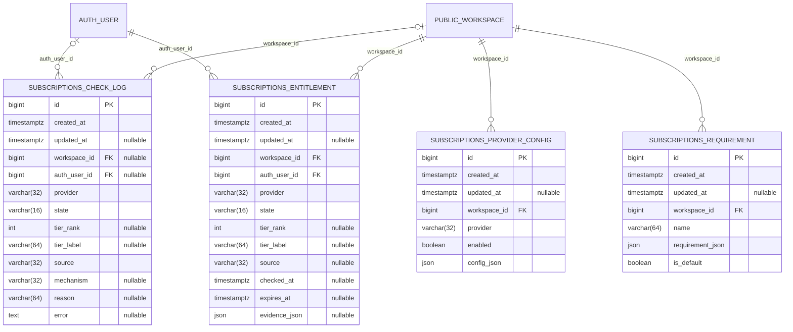
```mermaid
erDiagram
    SUBSCRIPTIONS_CHECK_LOG {
        bigint id PK
        timestamptz created_at
        timestamptz updated_at "nullable"
        bigint workspace_id FK "nullable"
        bigint auth_user_id FK "nullable"
        varchar(32) provider
        varchar(16) state
        int tier_rank "nullable"
        varchar(64) tier_label "nullable"
        varchar(32) source
        varchar(32) mechanism "nullable"
        varchar(64) reason "nullable"
        text error "nullable"
    }
    SUBSCRIPTIONS_ENTITLEMENT {
        bigint id PK
        timestamptz created_at
        timestamptz updated_at "nullable"
        bigint workspace_id FK
        bigint auth_user_id FK
        varchar(32) provider
        varchar(16) state
        int tier_rank "nullable"
        varchar(64) tier_label "nullable"
        varchar(32) source "nullable"
        timestamptz checked_at "nullable"
        timestamptz expires_at "nullable"
        json evidence_json "nullable"
    }
    SUBSCRIPTIONS_PROVIDER_CONFIG {
        bigint id PK
        timestamptz created_at
        timestamptz updated_at "nullable"
        bigint workspace_id FK
        varchar(32) provider
        boolean enabled
        json config_json
    }
    SUBSCRIPTIONS_REQUIREMENT {
        bigint id PK
        timestamptz created_at
        timestamptz updated_at "nullable"
        bigint workspace_id FK
        varchar(64) name
        json requirement_json
        boolean is_default
    }

    AUTH_USER |o--o{ SUBSCRIPTIONS_CHECK_LOG : "auth_user_id"
    AUTH_USER ||--o{ SUBSCRIPTIONS_ENTITLEMENT : "auth_user_id"
    PUBLIC_WORKSPACE |o--o{ SUBSCRIPTIONS_CHECK_LOG : "workspace_id"
    PUBLIC_WORKSPACE ||--o{ SUBSCRIPTIONS_ENTITLEMENT : "workspace_id"
    PUBLIC_WORKSPACE ||--o{ SUBSCRIPTIONS_PROVIDER_CONFIG : "workspace_id"
    PUBLIC_WORKSPACE ||--o{ SUBSCRIPTIONS_REQUIREMENT : "workspace_id"
```

Composite unique keys:

- `SUBSCRIPTIONS_ENTITLEMENT` unique on (`workspace_id`, `auth_user_id`, `provider`)
- `SUBSCRIPTIONS_PROVIDER_CONFIG` unique on (`workspace_id`, `provider`)
- `SUBSCRIPTIONS_REQUIREMENT` unique on (`workspace_id`, `name`)
<!-- /ERD:auto -->

## preferences — `players`, `tournament`

Per-account preferences: favourite players, and saved encounter views.

Both tables key on `auth_user_id`, not on `workspace_member`: a preference belongs to the logged-in
account and follows it everywhere. `favorite_player` therefore points straight at `players.user` —
the one place where the tenant-scoped anchor is deliberately not used — while a saved encounter
view is workspace-scoped and unique per `(workspace, user, name)`.

<!-- ERD:auto preferences -->
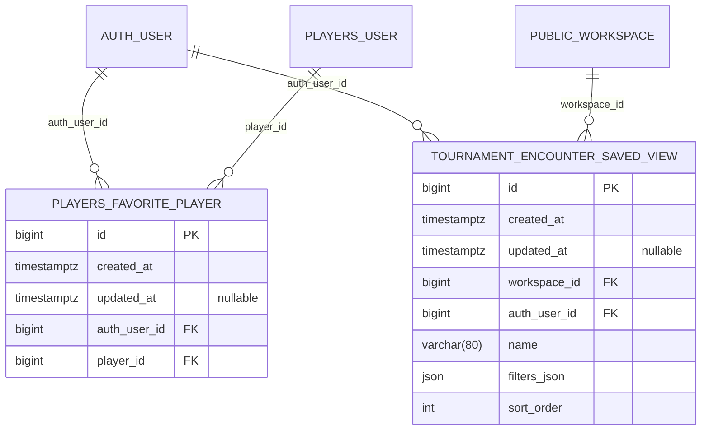
```mermaid
erDiagram
    PLAYERS_FAVORITE_PLAYER {
        bigint id PK
        timestamptz created_at
        timestamptz updated_at "nullable"
        bigint auth_user_id FK
        bigint player_id FK
    }
    TOURNAMENT_ENCOUNTER_SAVED_VIEW {
        bigint id PK
        timestamptz created_at
        timestamptz updated_at "nullable"
        bigint workspace_id FK
        bigint auth_user_id FK
        varchar(80) name
        json filters_json
        int sort_order
    }

    AUTH_USER ||--o{ PLAYERS_FAVORITE_PLAYER : "auth_user_id"
    AUTH_USER ||--o{ TOURNAMENT_ENCOUNTER_SAVED_VIEW : "auth_user_id"
    PLAYERS_USER ||--o{ PLAYERS_FAVORITE_PLAYER : "player_id"
    PUBLIC_WORKSPACE ||--o{ TOURNAMENT_ENCOUNTER_SAVED_VIEW : "workspace_id"
```

Composite unique keys:

- `PLAYERS_FAVORITE_PLAYER` unique on (`auth_user_id`, `player_id`)
- `TOURNAMENT_ENCOUNTER_SAVED_VIEW` unique on (`workspace_id`, `auth_user_id`, `name`)
<!-- /ERD:auto -->

## platform — `public`, `realtime`

Cross-domain infrastructure: the transactional outbox, the realtime event journal the gateway
replays from, the platform audit log, and the notification inbox.

These tables carry `workspace_id`, `tournament_id` and actor ids as plain `BigInteger`
with **no foreign keys**, which is why they appear unconnected on the diagram. That is the
point: an append-only bus or journal must outlive the business rows it describes, and must not
be draggable into a cascade delete.

`event_outbox` is the transactional outbox — written in the same transaction as the business
change, then published by a relay; `event_id` is unique so a consumer can deduplicate, and
`status` / `attempts` / `next_attempt_at` are the retry state. `realtime.workspace_event` is the
replay journal the Go gateway reads by topic and id when a WebSocket client reconnects;
`schema_version` lets the payload shape change without invalidating older entries. `audit_log`
stores `before_json` / `after_json` together with `actor_label` and `entity_label` snapshots, so
an entry stays readable after the row it describes is gone.

`notification` is the inbox journal — appended by `shared.services.notifications.notify()`
inside the transaction that causes the event, never committed on its own. It stores `kind` plus
a `payload_json` snapshot rather than rendered text, so the wording lives in the frontend
dictionary and a deleted team still reads by name; `audience` decides who may see the row
(`user`, `workspace` or `global`) and the check constraints keep `recipient_auth_user_id` /
`workspace_id` filled exactly for the audience that needs one. `source_workspace_id` answers a
different question — *which tenant produced* the row — and is therefore set for every audience,
`user` included: a registration decision is addressed to one competitor and owned by the
organizer that decided it. It is what the workspace operator screen scopes on
(`rpc.app.notification_admin_*`), where a "delete" is an `expires_at = now()` retire, so the row
and its read marks survive. `notification_read` is the per-viewer state, primary key
`(auth_user_id, notification_id)`: "read" is a fact about one viewer, which is what lets a global
announcement be dismissed by each reader independently, and the mark survives the announcement
being unpublished, so who saw it stays answerable. `deleted_at` on the same row is the inbox's
own delete button — that viewer stops seeing the notification while every other recipient's copy,
and the journal row itself, are untouched.

<!-- ERD:auto platform -->
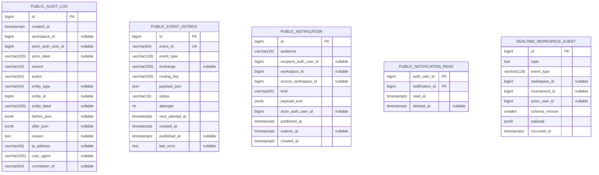
```mermaid
erDiagram
    PUBLIC_AUDIT_LOG {
        bigint id PK
        timestamptz created_at
        bigint workspace_id "nullable"
        bigint actor_auth_user_id "nullable"
        varchar(255) actor_label "nullable"
        varchar(16) source
        varchar(64) action
        varchar(64) entity_type "nullable"
        bigint entity_id "nullable"
        varchar(255) entity_label "nullable"
        jsonb before_json "nullable"
        jsonb after_json "nullable"
        text reason "nullable"
        varchar(45) ip_address "nullable"
        varchar(255) user_agent "nullable"
        varchar(64) correlation_id "nullable"
    }
    PUBLIC_EVENT_OUTBOX {
        bigint id PK
        varchar(64) event_id UK
        varchar(128) event_type
        varchar(255) exchange "nullable"
        varchar(255) routing_key
        json payload_json
        varchar(16) status
        int attempts
        timestamptz next_attempt_at
        timestamptz created_at
        timestamptz published_at "nullable"
        text last_error "nullable"
    }
    PUBLIC_NOTIFICATION {
        bigint id PK
        varchar(16) audience
        bigint recipient_auth_user_id "nullable"
        bigint workspace_id "nullable"
        bigint source_workspace_id "nullable"
        varchar(64) kind
        jsonb payload_json
        bigint actor_auth_user_id "nullable"
        timestamptz published_at
        timestamptz expires_at "nullable"
        timestamptz created_at
    }
    PUBLIC_NOTIFICATION_READ {
        bigint auth_user_id PK
        bigint notification_id PK
        timestamptz read_at
        timestamptz deleted_at "nullable"
    }
    REALTIME_WORKSPACE_EVENT {
        bigint id PK
        text topic
        varchar(128) event_type
        bigint workspace_id "nullable"
        bigint tournament_id "nullable"
        bigint actor_user_id "nullable"
        smallint schema_version
        jsonb payload
        timestamptz occurred_at
    }
```
<!-- /ERD:auto -->

## Schema change history

What the current shape replaced, and why. Revision ids are deliberately absent: the migration
chain was squashed into a single baseline, so anything older than that baseline exists in the
schema but not as a separate file in `backend/migrations/versions/`. The generated head line at
the top of this document is the only revision claim here.

- **Identity/workspace refactor.** `players.user.auth_user_id` (unique, nullable) became the
  `1:0..1` link to `auth.user`, and `public.workspace_member` — unique on
  `(workspace_id, player_id)`, with no denormalized role — became the identity anchor for
  `tournament.player` (NOT NULL), `balancer.registration`, the draft tables and the achievement
  results and overrides. The parallel `*_user_id` columns those tables used to carry were
  dropped, not kept alongside.
- **Challonge normalization.** `challonge_id` / `challonge_slug` were removed from `tournament`,
  `stage` and `encounter`, and the `challonge_team` table with them. The source of truth is
  `challonge_source` plus the participant, match and sync-log tables.
- **Groups removed.** `tournament.group` was dropped; a group is a `stage_item` of type GROUP.
- **Map veto replaced by pick/ban.** The `map_veto_config` pair was dropped in favour of the
  generic `pick_ban_config*` / `pick_ban_session` / `pick_ban_entry` model, which covers map and
  hero bans under one sequence engine and keeps a per-encounter ledger for no-repeat scopes.
- **Draft pool re-pointed at registrations.** The draft first lifted per-role data out of JSON
  into its own child tables; those were then dropped again when `draft_player` became unique on
  `(session_id, registration_id)` and started reading roles and top heroes from the registration
  tables. Two copies of the same preferences were one copy too many.
- **Predictions.** The scalar predictions table was dropped;
  `analytics.standings_distribution` is the only source of placement predictions.
- **Analytics cleanup.** The balance-snapshot tables and the feature/explanation stores were
  dropped after the shift and performance models stopped reading them; what remains is anchored
  on `tournament.player` and keyed by algorithm.
- **Member ranks unified.** `balancer.member_rank` replaced three separate per-context rank
  stores. The nullable `author_user_id` is the only discriminator between workspace canon and an
  author's private book, enforced by two partial unique indexes.
- **Catalog aliases.** `aliases` (JSONB, `NOT NULL DEFAULT '[]'`) on `overwatch.hero` / `map` /
  `gamemode` plus `overwatch.catalog_alias_miss` replaced three hardcoded translation
  dictionaries in the parser (103 entries across 7 gamemodes, 32 maps and 50 heroes), each of
  which had required a service redeploy for a new map, hero or client locale. The data migration
  carried every entry over and warned about each canonical name missing from the catalog instead
  of dropping it silently. No expand/contract was needed: a column with a default is invisible to
  the old code.
- **Workspace Discord guild.** `public.workspace.discord_guild_id` became the single source of
  the guild snowflake — UNIQUE, with a verification timestamp and verifier, mirroring the custom
  domain pattern. Rolling it out needed a mandatory order: add and backfill the column *before*
  the code rollout, then remove the key from `subscriptions.provider_config.config_json` and drop
  `log_processing.discord_channel.guild_id` *after* it. It is not deployable as one step — the
  old ORM still maps `guild_id`, so an early DROP halts log collection, while the new config
  loader joins the workspace column, so early code breaks subscription reads.
- **Workspace-level subscription rule.** `subscriptions.requirement` became the single source of
  the eligibility rule shared by every tournament in a workspace, while `require_subscription`
  stayed on the registration form as the per-tournament decision. Same mandatory order: create
  and backfill from the forms before the code rollout, drop the rule column from the form after
  it, because SQLAlchemy emits every mapped column in every `SELECT`. The backfill refuses to
  choose on the organizer's behalf: if a workspace held more than one distinct rule, it fails and
  rolls back rather than picking one.
- **Workspace ownership.** `public.workspace.owner_id` (FK → `auth.user`) records who created
  the workspace, deliberately decoupled from the mutable RBAC `owner` role. The backfill set it
  from the current holder of that role only when there was exactly one; with none or several it
  stayed NULL.
- **Later additions.** Team registration with invites, custom games ("mixes") and the casual
  matches played inside them, tournament slugs with redirects, phase schedules, hidden and
  preview tournaments, captain and per-map reports with the result-status state machine, scrim
  rooms, division-grid import jobs, and the removal of stored team SR.
