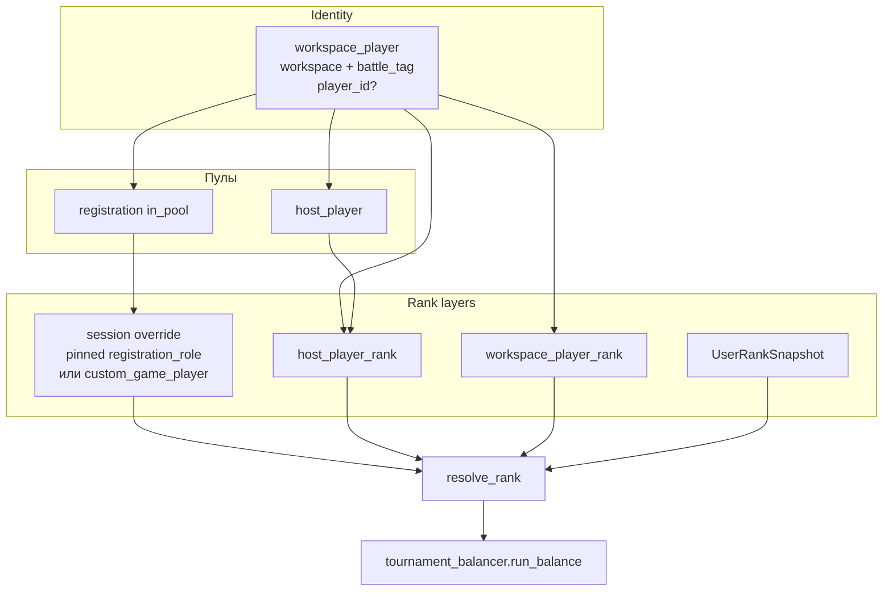
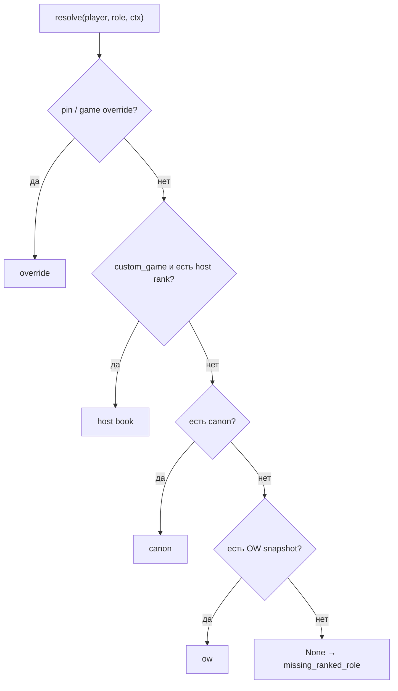
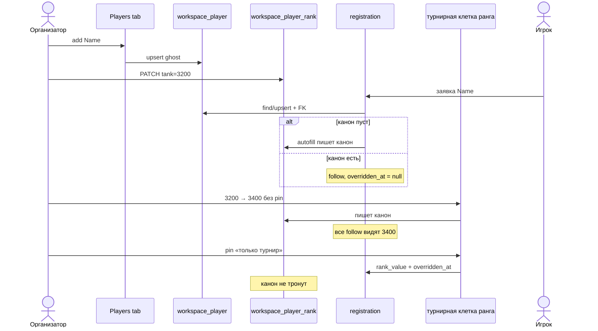
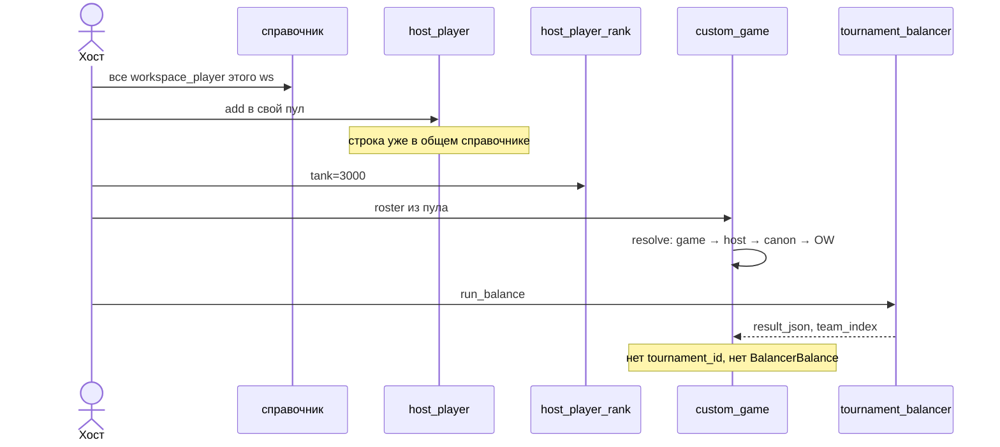
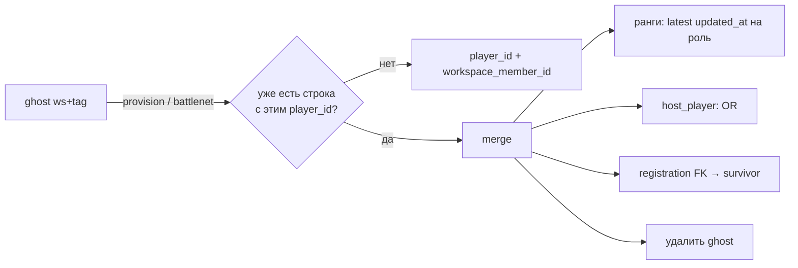
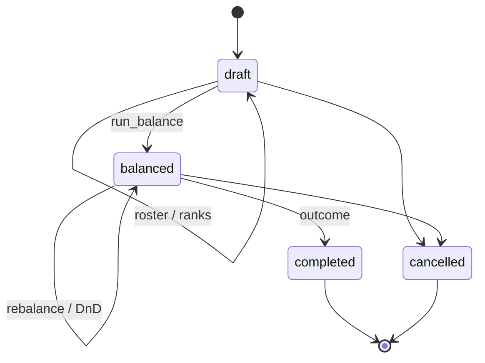

# Workspace Players + Custom Games

> **For Claude:** REQUIRED SUB-SKILL: Use superpowers:executing-plans to implement this plan task-by-task.

**Goal:** Балансер видит и ранжирует игроков workspace без заявки; кастомки балансятся из пула/книги хоста поверх того же канона.

**Architecture:** `workspace_player` — identity балансера. Канон рангов — `workspace_player_rank`. Заявка = допуск на турнир + опциональный pin-оверрайд. Хост кастомки держит свой поднабор (`host_player`) и книгу (`host_player_rank`), канон не трогает. `tournament_balancer.run_balance` без изменений. Кастомка — отдельная сущность, без `tournament_id` / `BalancerBalance`.

**Tech Stack:** SQLAlchemy/Alembic (`balancer` schema), balancer-service RPC, tournament-service registration write path, Next.js Players/custom-games tab.

**Supersedes (partially):** `docs/superpowers/specs/2026-06-29-custom-games-design.md` — Approach B (`CustomGame` без турнирного мусора) остаётся; per-member rank book всех мемберов и «player pool = UNION регистраций» — нет.

---

## Understanding

- Справочник игроков workspace не зависит от заявки. Ghost = battle tag без `players.user`, потом линк/мерж.
- Канон микса (`workspace_player_rank`) не связан с турнирными рангами. Заявка хранит свой `registration_role.rank_value`.
- Кастомка: game override → host book → mix canon → OW на глобальной DivisionGrid.
- Чужие кастомки/книги видны внутри workspace, между workspace — нет.
- UI — новая вкладка вне турниров (не balancer tab).
- Пул турнира по-прежнему заявки `in_pool`. Справочник не заменяет чек-ин / ready / team-registration.

## Decision log

| Решение | Отклонено | Почему |
|---|---|---|
| Approach 1: `WorkspacePlayer` + слои рангов | Универсальный scope; только rank book поверх регистраций | Identity одна, регистрацию не переписываем в presence |
| Ghost по battle tag | Только `WorkspaceMember` | `WorkspaceMember.player_id` NOT NULL; «не регнулся» включает нет аккаунта |
| Ранги миксов и турниров не связаны | Канон SoT, заявка follow/pin | Правка турнира не должна менять микс и наоборот |
| Миксы читают глобальную DivisionGrid | Workspace default grid | У миксов нет tournament/workspace scale |
| Autofill/заявка пишут только `registration_role` | Autofill пишет канон | Иначе справочник миксов и турнир делят одни числа |
| Хост: свой пул + своя книга | Общая книга всех мемберов; пул = весь workspace | Несколько хостов в одном workspace |
| Виртуальный игрок → общий справочник | Приватный список хоста | Одна identity |
| `CustomGame` без `tournament_id` | Турнир-обёртка | Июньский Approach B, без загрязнения турнирного пайплайна |
| Новая вкладка вне турниров | Вкладка balancer / страница tournament | Это не турниры |
| Бэкфилл из `registration_role.rank_value` | Стартовать с пустого канона | Не теряем уже проставленные ранги |
| Видимость кастомок/книг внутри workspace | Только свои | Организаторы видят всех хостов своего workspace |

## Assumptions

- Бэкфилл: канон роли = latest `registration_role.updated_at` на `(workspace, battle_tag, role)`. Строки с другим значением получают pin (`overridden_at`), чтобы живые турниры не поехали.
- Форма игрока при регистрации не перезаписывает существующий канон (канон принадлежит организатору). Пустой канон — ingest.
- Смена battle tag: если новый тег уже в справочнике — мерж; если нет и строку никто кроме этой заявки не держит — UPDATE тега; иначе новая строка.
- Удаление из справочника: soft-hide, пока есть заявка или `host_player`.
- OpenSkill / сезоны / очередь / match-log→статы — вне скоупа (как в июньской спеке).

---

## End-to-end flows

### Слои



### Резолвер



### Турнир: ingest, follow, pin



### Кастомка



### Ghost merge



### Custom game lifecycle



---

## Data model

Schema: `balancer`. Models: `backend/shared/models/workspace_player.py` (или `custom_game.py`, если хочется один модуль с кастомками — лучше раздельно: identity не принадлежит кастомке).

### `workspace_player`

| Column | Notes |
|---|---|
| `id` | PK, `TimeStampIntegerMixin` |
| `workspace_id` | FK `workspace.id` CASCADE |
| `battle_tag` / `battle_tag_normalized` | nullable только если нет тега; unique `(workspace_id, battle_tag_normalized)` WHERE tag NOT NULL |
| `display_name` | |
| `player_id` | FK `players.user.id` SET NULL; unique `(workspace_id, player_id)` WHERE NOT NULL |
| `workspace_member_id` | FK `workspace_member.id` SET NULL |
| `hidden_at` | soft-hide |

Не использовать `WorkspaceMember` как identity: у мембера обязателен `player_id`.

### `workspace_player_rank`

`(workspace_player_id, role) → rank_value`. Unique. Role = существующий код (`tank`/`dps`/`support`), тот же мост dps↔damage, что у балансера.

### `host_player` / `host_player_rank`

- `host_player`: unique `(workspace_id, host_user_id, workspace_player_id)`. `host_user_id` → `auth.user`.
- `host_player_rank`: unique `(host_user_id, workspace_player_id, role)`. Книга живёт после выкидывания из пула.

### `registration` (alter)

- `workspace_player_id` nullable FK → `balancer.workspace_player.id` SET NULL.
- `registration_role.rank_value` пишется **только при pin**. Follow читает резолвер.
- `balancer_profile_overridden_at` = pin. Уже есть.

### `custom_game` / `custom_game_player`

Как июньский Approach B, но FK на `workspace_player`, не на `players.user`.

- `custom_game`: `workspace_id`, `host_user_id`, `name`, `status`, `config_json`, `result_json`, `outcome_json`.
- `custom_game_player`: `custom_game_id`, `workspace_player_id`, optional `rank_value` (клетка игры), `team_index`, `sort_order`. Unique `(custom_game_id, workspace_player_id)`.

## Rank write matrix

| Событие | Канон микса | Заявка |
|---|---|---|
| Players tab PATCH | пишет | не трогает |
| Регистрация / autofill | не трогает | `registration_role.rank_value` |
| Турнирная клетка | не трогает | `rank_value` |
| Книга хоста | не трогает | — |
| Клетка кастомки | не трогает | game override |

Чтение турнира: `registration_role.rank_value` (+ отдельно OW display).  
Чтение кастомки: game override → host → canon → OW на **глобальной** DivisionGrid.

`createSyntheticPlayerFromRegistration` (`frontend/src/app/balancer/components/workspace-helpers.ts`) уезжает: wire несёт уже резолвнутые `rank_value` + `rank_source: override | host | canon | ow | none`.

---

## Services / RPC

Владелец: **balancer-service**. Регистрационный write path в tournament-service зовёт общий upsert (shared service или RPC), не копирует SQL.

```
shared/domain/workspace_player.py     resolve_rank, RankSource, merge rules
shared/repository/workspace_player.py
balancer-service/services/workspace_player.py   upsert, link, hide
balancer-service/services/host_book.py
balancer-service/services/custom_game.py        lifecycle + run_balance
```

RPC (`rpc.balancer.*`), gateway workspace-scoped:

- `players.{list, get, upsert, set_ranks, hide, merge}`
- `hosts.{list_pool, add, remove, set_ranks, get_book}` — read любой книги в workspace; write только своей
- `custom.{create, list, get, update_roster, set_rank, balance, move_player, record_outcome, delete}`

Регистрация (tournament-service):

- create → `upsert workspace_player` + attach FK
- autofill → если канон пуст, `set_ranks` канона
- admin rank PATCH → default `set_ranks` канона; `pin=true` → local override

Realtime: `workspace:{id}:players` (ACL как `logs`). Турнирный `tournament:{id}:balancer` канон-события не несёт — клиент турнира рефетчит заявки.

RBAC: resource `workspace_player` (`read/update`) и `custom_game` (`create/read/update/delete`). Superuser bypass как у балансера.

---

## Frontend

Новая вкладка (не `/admin/tournaments/...`, не balancer tab):

1. Справочник: грид игроков × роли, ghost-add, hide, бейдж `ghost` / `linked`.
2. Кастомки: список + редактор (пул хоста, книга, balance, DnD, outcome).
3. Турнирная клетка: значение + `rank_source` + pin / «сбросить к канону».

Query keys — workspace-scoped, не `tournamentQueryKeys`.

---

## Implementation steps

Каждый шаг — один PR. После шага 1 существующие тесты балансера зелёные. `tournament_balancer` не трогать.

### Step 1 — Models + migration

**Files:** `backend/shared/models/workspace_player.py`, export в `shared/models/__init__.py`, `backend/migrations/versions/…_workspace_player.py`, model tests.

Создать `workspace_player`, `workspace_player_rank`. Ещё без host/custom. `id` тип как у `TimeStampIntegerMixin`. Unique partial indexes как у `registration`.

**Verify:** model tests; `alembic upgrade/downgrade` на anak_dev.

**Rollback:** downgrade migration.

### Step 2 — Upsert / link / merge

**Files:** `shared/repository/workspace_player.py`, `shared/domain/workspace_player.py` (merge), `balancer-service` service + tests.

`upsert(workspace_id, battle_tag) → row`. `link(player_id)` → set или merge. Гонка unique → retry read. Одна транзакция.

**Verify:** unit tests на upsert, link без коллизии, merge рангов/host/FK (host таблиц ещё нет — merge рангов + player_id).

### Step 3 — `resolve_rank` / `resolve_ranks`

**Files:** `shared/domain/workspace_player.py` или `balancer-service/src/domain/workspace_player/ranks.py`.

Батч, без N+1. Пока ctx = tournament (canon → OW) и pin. Host слой — заглушка до step 6.

OW: существующий резолвер из `rank_autofill` / rank snapshots, не новый запрос.

**Verify:** override / canon / OW / None.

### Step 4 — Backfill

**Files:** data migration (отдельный revision после step 1) + dry-run test на фикстурах.

Для каждого `(workspace_id, battle_tag_normalized)` из живых регистраций: upsert player; на роль канон = latest `registration_role`; если у заявки другое значение — `overridden_at = now()` (pin). Проставить `registration.workspace_player_id`.

**Verify:** два турнира, разные ранги → один канон, второй pinned. Заявки без тега пропускаются.

### Step 5 — Registration write path

**Files:** tournament-service registration create/update, `rank_autofill.py`, admin rank PATCH.

Create всегда upsert + FK. Autofill пишет канон только если пуст. PATCH без pin → канон; `pin=true` → local + `overridden_at`. Un-pin чистит override.

Листинг заявок для балансера отдаёт **резолвнутый** `rank_value` + `rank_source`. Follow не дублирует цифру в `registration_role`.

**Verify:** create с пустым каноном заполняет его; create с каноном не затирает; unpinned PATCH двигает другую follow-заявку; pinned — нет.

### Step 6 — Tournament balancer UI

**Files:** `frontend/src/types/balancer-admin.types.ts`, `workspace-helpers.ts` (`createSyntheticPlayerFromRegistration` — читать уже резолвнутое), клетка ранга + pin.

**Verify:** component test: бейдж source; pin не зовёт canon PATCH.

### Step 7 — Host pool + book

**Files:** models `host_player`, `host_player_rank` + migration; service/RPC; merge из step 2 дополнить OR членств.

Write только `host_user_id == actor`. Read любой в workspace.

**Verify:** чужая книга читается, писать 403; выкинул из пула — ранги на месте.

### Step 8 — Custom game + balance

**Files:** `custom_game`, `custom_game_player`; `services/custom_game.py`; RPC; тот же `run_balance`, что турнир (вынести вход, если ещё обёрнут в job/tournament — маленький extract, без нового солвера).

`completed` / `cancelled` → 409 на balance/roster.

**Verify:** balance без строк `BalancerBalance` / `tournament_id`. Детерминированный фикстурный ростер стабилен.

### Step 9 — Players + custom-games tab

**Files:** новый app route (не под `admin/tournaments`), services, query keys. Realtime `workspace:{id}:players`.

**Verify:** `tsc`; ghost-add появляется в списке; кастомка не создаёт турнир.

### Step 10 — Cleanup

Убрать мёртвые синтетики, если никто не читает сырой `registration_role.rank_value` как канон. Документ: пометить июньскую спеку superseded в части rank book / player pool.

---

## Testing (contract)

- Резолвер: 5 источников, батч без N+1.
- Бэкфилл: latest wins + pin на расхождении.
- Merge ghost+linked.
- Follow vs pin на PATCH канона и на турнирной клетке.
- Autofill не затирает канон.
- Custom balance без tournament rows.
- Model: `workspace_player.player_id` nullable.
- Cross-workspace 404.
- Frontend: грид, source badge, pin.

Интеграция — только anak_dev, skip если БД недоступна.

## Risks

- Follow-на-чтении: старые клиенты, ждущие `registration_role.rank_value` всегда заполненным. Шаг 5 отдаёт резолвнутое в том же поле + `rank_source`.
- Backfill pin'ит много исторических заявок — ожидаемо, живые цифры не едут.
- Extract `run_balance` от tournament job: не тащить job scaffolding в кастомку (июньский риск, всё ещё актуален).

## Out of scope

OpenSkill, сезоны, self-serve queue, realtime DnD кастомок, match-log stats, aggregate-median всех мемберов, универсальная presence-таблица.
