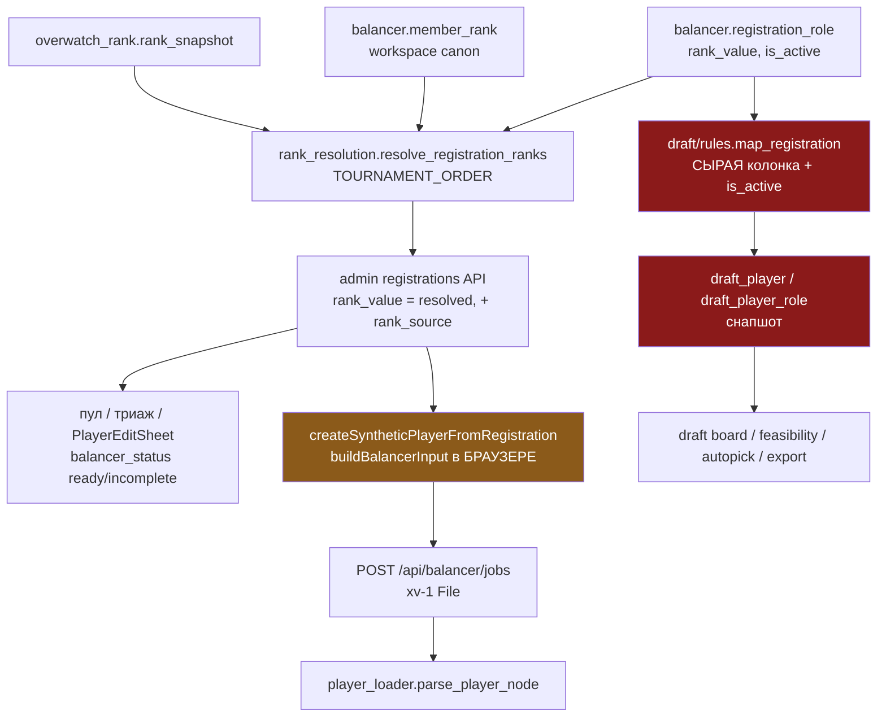
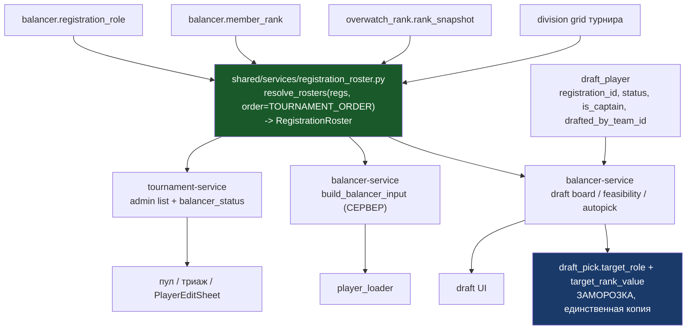

# Роли и ранги драфта — строго из балансера

Дата: 2026-09-04
Статус: анализ + целевая архитектура, к согласованию

---

## 1. Проблема

Игрок попадает в драфт без рангов (и без вторичных ролей), хотя в балансере у него всё
заполнено.

Причина не в потере данных. Балансер и драфт читают **разные источники** для одного и
того же понятия «ранг игрока на роли»:

| | Источник ранга | Кто это |
|---|---|---|
| Балансер (пул, триаж, Run Balance, `balancer_status`) | **резолвнутое** значение по слоям `registration → workspace canon → OW snapshot` | `tournament-service/src/services/registration/rank_resolution.py:57-121` + `shared/services/member_rank.py:34` |
| Драфт (сид пула, борда, autopick, экспорт) | **сырая колонка** `balancer.registration_role.rank_value` | `balancer-service/src/domain/draft/rules.py:336-426` (`map_registration`) |

`TOURNAMENT_ORDER = ("registration", "workspace", "ow")` — пустой `rank_value` **наследует**
ранг, а не читается как «без ранга» (`shared/services/member_rank.py:30-34`). Драфт про это
наследование не знает.

### Подтверждение на проде

`owt.craazzzyyfoxx.me`, турнир 78, драфт-сессия 20 (шейп `tank:1, dps:2, support:2`),
`Mirai#21878`, `balancer_status = ready`:

| Роль | Балансер (`/admin/balancer/tournaments/78/registrations`) | Драфт (`/balancer/draft/sessions/20/board`) |
|---|---|---|
| tank | 3400, `rank_source=registration` | 3400 |
| dps | 2900, `rank_source=ow` | — |
| support | 3700, `rank_source=workspace` | — |

`role_ranks = {"tank": 3400}`, `secondary_roles_json = null` — в драфте это чистый тэнк.
То же у `TeYzee#2561` (балансер dps 4300 + tank 3500 + support 3800 → драфт только dps),
`Termi120#2404`, `Стрелок#260123`, `NoBrain#21491`, `litnik#21214`, `error2222#2932`,
`Honoka#21889`, `Kiara#21121`, `Nova#28747`, `SanekTheRio#2344`, `HOTUKEV#2374`.

Полная потеря рангов (репортнутый симптом) наступает, когда **все** роли наследованные:
`Sunless#21813` — tank 1800 / support 2500 / dps 2000, все `rank_source=workspace`, все
`is_active=true`; `CeMaster#21243` — 4500/4400/4700, все `ow`. Балансер видит полноценного
трёхролевого игрока, драфт — `rank_value=NULL`, `role_ranks={}`, `effective_rank=null`,
`primary_role` подставляется дефолтом `damage` (`rules.py:365`).

### Вторая, независимая причина

Пул драфта — одноразовый снапшот. Единственные писатели `DraftPlayer` —
`services/draft/lifecycle.py:258,277` (INSERT при сиде). Ресинка нет: ни консьюмера, ни
воркера, ни крона на изменение ранга регистрации. Прод: сессия 12 турнира 72 (сид 10:35)
держала `CABY#21621`, `Termi120#2404`, `Стрелок#260123` с NULL; ранги вбили после, и ре-сид
в 12:31 (сессия 13) их подхватил. Ре-сид разрешён только в `SETUP`/`READY` и сносит все
команды, игроков и пики (`lifecycle.py:201-205`).

---

## 2. Текущая архитектура

### 2.1. Где физически живёт роль и ранг

| Таблица | Колонки роль/ранг | Scope | Писатели |
|---|---|---|---|
| `balancer.registration_role` | `role`, `subrole`, `is_primary`, `priority`, `rank_value`, `is_active` | турнир × регистрация | `registration/_common.py::replace_registration_roles`, `sheet_sync.py`, `rank_autofill.py:461-462` |
| `balancer.registration_role_hero` | `hero_id`, `priority` | турнир × роль | те же |
| `balancer.member_rank` | `role`, `rank_value`; `author_user_id IS NULL` = канон воркспейса, иначе приватная книга хоста | workspace / author | `shared/services/member_rank.py::set_ranks` — единственный |
| `overwatch_rank.rank_snapshot` | `role`, `division`, `tier`, `rank_value`, `season` | глобально, привязан к `players.user` | OW-фетчер, read-only для организатора |
| `balancer.draft_player` | `primary_role`, `sub_role`, `is_flex`, `division_number`, `rank_value` | сессия драфта | `lifecycle.py:258,277` (только INSERT) |
| `balancer.draft_player_role` | `role`, `rank_value`, `is_secondary`, `priority` | сессия драфта | `lifecycle.py` при сиде; `role_edit.py:88` (append новой роли) |
| `balancer.draft_pick` | `target_role`, `target_rank_value` | пик | `selection.py:302-303,375,425` — **намеренная заморозка** |
| `balancer.team_slot` | `role`, `assigned_rank` | вариант балансировки | алгоритм |
| `tournament.player` | `role`, `sub_role`, `rank` | итоговый ростер турнира | публикация ростера |

Ранги живут в трёх слоях (`registration_role`, `member_rank`, OW-снапшоты) и копируются в
четыре снапшота (`draft_player*`, `draft_pick`, `team_slot`, `tournament.player`).

### 2.2. Две трубы, которые не сходятся



Ключевые факты цепочек:

- **Вход алгоритма собирается в браузере.** `BalancerMainPageClient.tsx:235-240` тянет
  админ-список (уже резолвнутый на сервере, `registration_admin.py:436`), фронт делает
  синтетический `BalancerPlayerRecord` (`workspace-helpers.ts:608-633`), сериализует xv-1
  (`workspace-helpers.ts:455-491`) и загружает файлом (`balancer.service.ts:131-158`).
- **`export.py::serialize_registration_for_export` (сырые ранги) в балансировке не
  участвует** — это отдельная кнопка «скачать JSON» (`rpc.tournament.sheet_players_export`,
  `integrations.py:436-442`). Мёртвая для алгоритма ветка, но живая копия правил.
- **Драфт — третья, полностью независимая реализация** тех же правил
  (`map_registration`), плюс четвёртая на фронте (`setup-types.ts:36-50`
  `summarizeRegistration`), плюс пятая копия flex-режимов
  (`rules.all_roles_required` vs `_common.all_roles_required`, синхронизируются только
  тестами по признанию докстринга `rules.py:294-297`).

### 2.3. Семантика `is_active` — четыре состояния

`is_active` есть только у `registration_role` (`registration.py:269`). Комбинации:

| `is_active` | `rank_value` | Смысл | Балансер | Драфт |
|---|---|---|---|---|
| true | число | явный ранг от организатора/игрока | берёт | берёт |
| true | NULL | роль играбельна, ранг **наследуется** (`workspace`/`ow`) | берёт резолвнутое | **теряет** ← баг |
| false | NULL | роль выключена / не распарсилась | пропускает | пропускает |
| false | число | `rank_autofill` проставил число в выключенную строку (`rank_autofill.py:461-462` не трогает `is_active`) | пропускает (`toClassConfig` гейтит `is_active && rank_value`) | пропускает |

Строки `is_active=true, rank_value=NULL` создаются легально: `sheet_parsing.py:565-568`
(`declared_in_source` без числа) и `_common.apply_all_roles` (бэкфилл ролей под
`all_roles`/`forced` — новые строки берут ORM-дефолты `is_active=true, rank_value=NULL`).
То есть режим `all_roles` **массово** производит именно то состояние, которое драфт теряет.

### 2.4. Две ортогональные оси «флекса»

1. `registration_form.built_in_fields_json.flex_role.mode` ∈ `optional | all_roles | forced`
   — сколько ролей играет **один игрок** и как считается его ранг. Под `all_roles`/`forced`
   `map_registration` меняет семантику: `rank_value` = максимум по ролям, а нерейтингованным
   ролям **тиражируется** этот максимум (`rules.py:406-414`), и фильтр `is_active`
   намеренно обходится (`rules.py:356`).
2. `RosterShape.has_role_slots` (`shared/domain/roster_shape.py:141-149`) — есть ли у
   **команды** ролевые слоты. Безролевой ростер (все слоты `flex`) заставляет
   `slot_rank` возвращать максимум по ролям (`domain/draft/ranks.py:45-52`).

Обе оси корректны как продуктовые решения, но каждая реализована по два раза.

### 2.5. Идентичность драфт-игрока

`DraftPlayer` **не ссылается на регистрацию**: FK/колонки `registration_id` нет нигде в
`shared/models/balancer/draft.py`. Единственный якорь — `workspace_member_id` (nullable) +
`battle_tag` (строка), а `workspace_member_id` резолвится один раз в момент сида
(`lifecycle.py:212-232`). Обратного пути «драфт-игрок → его регистрация» в коде нет.

Это и есть корень невозможности «читать из балансера»: связи нет.

### 2.6. Потребители ранга в драфте — все терпят `None`

| Потребитель | Что читает | `None`? |
|---|---|---|
| `domain/draft/ranks.py:24-52` | `rank_value`, `role_ranks` | да, возвращает `None` |
| `rules.py:561-564 playable_roles` | `primary_role`, `secondary_roles_json` | да, `or []` |
| `feasibility.py:83-96` | `roles[].role`, `is_flex`, `primary_role` | ранг не читает вообще |
| `selection.py:125` порядок мест | `captain.rank_value` | да, `else -1` |
| `selection.py:227-232` средний ранг команды | `pick.target_rank_value`, иначе `slot_rank` | да, `or 0` |
| `selection.py:327` autopick | `p.rank_value or 0` | да → **игрок без ранга = ранг 0, берут последним** |
| `board.py:206` | `slot_rank(p, None, shape)` → `effective_rank` | да |
| `export.py:67-84` | `target_rank_value`, иначе `slot_rank ... or 0` | да |
| `role_edit.py:62-93` | `DraftPlayerRole.rank_value` | да, но требует `rank_absence_confirmed` |

Вывод: отсутствие ранга **нигде не падает** — молча деградирует в 0. Поэтому баг доезжает
до живого драфта незамеченным: `feasibility` проверяет только покрытие ролей, визард ранги
не валидирует, предупреждения «N игроков в пуле без ранга» не существует.

### 2.7. Заморозка на пике — единственная правильная копия

`DraftPick.target_role` + `target_rank_value` пишутся при `select`/`autopick`/`override`
(`selection.py:302-303,375,425`) и читаются `DraftOrder.tsx:55-59`, `TeamRosters.tsx`,
`export.py:67-72`, `selection.py:228-229`. Смысл: пик — это исторический факт
`(игрок, роль, ранг)`, он не должен переезжать при последующей правке рангов. Это
единственный снапшот, который нужно **сохранить**.

Обратите внимание: под безролевым шейпом экспорт и средний ранг **уже игнорируют**
замороженное значение и пересчитывают живьём (`selection.py:211-213`, `export.py`) — то
есть модель «читать живьём» в кодовой базе частично уже принята.

### 2.8. Мёртвый путь

Ручной сид (`rpc/draft.py:545-569`, `DraftManualCaptainInput`/`DraftManualPlayerInput`) в
проде не используется: визард всегда отправляет `pool_captains`
(`DraftSetupWizard.tsx:241-245`), в `loadtests/` драфта нет вообще. Только тесты. При этом
именно он содержит два собственных дефекта: `CaptainSeed` там создаётся **без рангов и без
роли** (`rpc/draft.py:547-553`), а `role_ranks` ключуется `p.primary_role.value`
(`"Tank"/"Damage"`) вместо `slot_code` (`"tank"/"dps"`) — `rpc/draft.py:565` против
`ranks.role_rank` (`ranks.py:28`).

### 2.9. Сводка расхождений

| # | Расхождение | Цитата |
|---|---|---|
| 1 | драфт читает сырую колонку, балансер — резолвнутую | `rules.py:369` vs `rank_resolution.py:95-108` |
| 2 | правила «роли игрока» реализованы 4 раза | `rules.py:336`, `_common.py`+`serializers.py`, `setup-types.ts:36`, `export.py:40` |
| 3 | flex-режимы реализованы 2 раза, синхронизация только тестами | `rules.py:292-312` vs `_common.py:1-20` |
| 4 | пул драфта — снапшот без ресинка | `lifecycle.py:258,277` |
| 5 | нет связи `draft_player → registration` | `shared/models/balancer/draft.py` |
| 6 | `division_number` в пуле всегда `NULL` | `rules.py:421` |
| 7 | вход алгоритма собирается в браузере | `workspace-helpers.ts:455-491` |
| 8 | ручной сид жив в контракте, мёртв в проде, содержит 2 бага | `rpc/draft.py:545-569` |
| 9 | отсутствие ранга не диагностируется нигде | `selection.py:327`, `feasibility.py` |
| 10 | правка ранга регистрации публикует событие в топик `bracket`, а кэш борды драфта ключуется по топику `draft` | `realtime_commit.py:148` vs `board.py:152-156` |

---

## 3. Целевая архитектура

### 3.1. Принцип

> Роли и ранги игрока существуют **в одном месте** — в регистрации балансера, через один
> серверный резолвер. Драфт их не хранит и не выводит сам. Единственная копия — то, что
> заморожено на состоявшемся пике.

Из принципа следуют три правила:

1. **Один резолвер в `shared/`.** Его вызывают и tournament-service (админ-список,
   `balancer_status`), и balancer-service (борда, feasibility, autopick, экспорт). Ни одна
   служба не читает `registration_role.rank_value` напрямую.
2. **Драфт-игрок — это ссылка на регистрацию + состояние драфта.** Никаких `rank_value`,
   `role_ranks`, `primary_role`, `is_flex`, `division_number` в `draft_player*`.
3. **Единственная точка записи ранга/роли — балансер.** Аварийная правка роли во время
   драфта пишет в `registration_role`, а не в `draft_player_role`.

### 3.2. Целевые потоки



### 3.3. Единый контракт: `RegistrationRoster`

Новый модуль `backend/shared/services/registration_roster.py` (+ доменные типы в
`backend/shared/domain/registration_roster.py`). Один дата-класс на регистрацию:

```python
@dataclass(frozen=True)
class RosterRole:
    role: HeroClass            # tank | damage | support
    rank: int | None           # РЕЗОЛВНУТЫЙ ранг
    source: RankScope | None   # registration | workspace | ow | None
    is_primary: bool
    priority: int
    subrole: str | None
    top_heroes: tuple[HeroRef, ...]

@dataclass(frozen=True)
class RegistrationRoster:
    registration_id: int
    battle_tag: str | None
    player_id: int | None          # players.user.id через workspace_member
    workspace_member_id: int | None
    roles: tuple[RosterRole, ...]  # только играбельные, в порядке priority
    primary: RosterRole | None
    is_full_flex: bool
    division_number: int | None    # из ранга по сетке турнира, один раз

    def rank_on(self, role: HeroClass | None) -> int | None: ...
    def playable(self) -> frozenset[HeroClass]: ...
```

Инвариант играбельности — **тот же предикат, что уже гейтит вход алгоритма**
(`workspace-helpers.ts` `toClassConfig`: `is_active && rank_value`, и
`player_loader.py:29-32`: `isActive && rank > 0`):

> роль играбельна ⟺ `registration_role.is_active` И резолвнутый ранг не `None`

Это убирает исключение `active = entries if all_roles else [...]` (`rules.py:356`): под
`all_roles`/`forced` бэкфилл ролей делает `_common.apply_all_roles` **на записи**, и
наследование ранга через резолвер закрывает ровно тот кейс, ради которого фильтр
обходили («строка из Google Sheets, чей ранг не распарсился»).

Flex-режимы (`optional | all_roles | forced`) читаются в этом же модуле **один раз** —
обе текущие копии (`rules.all_roles_required`, `_common.all_roles_required`) удаляются в
пользу него.

### 3.4. Целевая схема БД

`balancer.draft_player` — только идентичность и состояние драфта:

| Колонка | Судьба |
|---|---|
| `session_id` | остаётся |
| **`registration_id`** | **новая**, FK → `balancer.registration`, `NOT NULL`, `UNIQUE (session_id, registration_id)` |
| `workspace_member_id` | остаётся (нужна для ACL капитана и `picked_by_member`), но перестаёт быть якорем |
| `battle_tag` | **удаляется** (читается из регистрации) |
| `primary_role`, `sub_role`, `is_flex`, `division_number`, `rank_value` | **удаляются** |
| `additional_info` | **удаляется** — кастомные поля читаются из `registration.custom_fields_json` (`rules.registration_additional_info` больше не нужен) |
| `status`, `is_captain`, `drafted_by_team_id`, `version` | остаются |

`balancer.draft_player_role` и `balancer.draft_player_role_hero` — **удаляются целиком**.

`balancer.draft_pick` — без изменений: `target_role` + `target_rank_value` остаются
заморозкой. Плюс убирается ветка «пересчитать живьём, если заморожено `NULL`»
(`export.py:67-72`, `selection.py:230-232`): у состоявшегося пика заморозка всегда есть.

`UNIQUE (session_id, registration_id)` строго лучше текущего
`uq_draft_player_session_member`: регистрация уникальна на (турнир, участник)
(`uq_balancer_registration_user`), а `workspace_member_id` у пуловых игроков часто `NULL`.

### 3.5. Целевой путь чтения

`board.build_board` (`board.py:147-220`):

1. один запрос: `draft_player` JOIN `registration` + `selectinload(roles.hero_entries.hero)`;
2. один вызов `resolve_rosters(session, regs, workspace_id, order=TOURNAMENT_ORDER, grid=...)`;
3. `DraftPlayerRead` собирается из `(draft_player, roster)`.

Стоимость — тот же порядок, что сейчас: `loaders.player_options()` уже грузит
`roles.hero_entries.hero` для драфт-игрока, а резолвер батчевый и OW-слой догружает лениво
только для пар без более дешёвого слоя (`member_rank.py:224-232`).

`feasibility` / `selection` / `export` получают `dict[draft_player_id, RegistrationRoster]`
из того же резолва. `domain/draft/ranks.py` сохраняется, но принимает `RegistrationRoster`
вместо ORM-строки:

```python
def slot_rank(roster: RegistrationRoster, role: HeroClass | None, shape: RosterShape) -> int | None:
    return roster.rank_on(role) if shape.has_role_slots else roster.best_rank()
```

**Инвалидация кэша борды.** Сейчас ключ — `max(WorkspaceEvent.id) WHERE topic = draft(t)`
(`board.py:152-156`), а правка регистрации пишет событие в топик `bracket`
(`realtime_commit.py:148`). В целевой схеме ключ обязан покрывать оба топика:
`topic IN (draft(t), bracket(t))`. Без этого живое чтение будет отдавать закэшированный
старый ранг.

### 3.6. Целевой путь записи

| Действие | Сейчас | Целевое |
|---|---|---|
| организатор правит ранг/роль игрока | `PlayerEditSheet` → `registration_role`; в засеянном драфте не видно | то же место, в драфте видно сразу |
| канон воркспейса | `WorkspacePlayerSheet` → `member_rank`; в драфте не видно | то же место, в драфте видно сразу |
| аварийная правка роли во время драфта | `role_edit.py` → append `DraftPlayerRole` (только новая роль, только `AVAILABLE`) | **пишет `registration_role`** через tournament-service; борда обновляется общей инвалидацией. Ограничение «только не выбранный игрок» снимается само: у выбранного ранг уже заморожен в пике |
| сид | копирует роли/ранги в `draft_player*` | вставляет только `registration_id` + место в очереди |

`DraftRoleEditRequest` сохраняет `reason` (аудит) и `expected_version`, но теряет
`rank_absence_confirmed`: «роль без ранга» перестаёт быть выразимой — по инварианту §3.3
роль без резолвнутого ранга не играбельна.

### 3.7. Целевой wire-контракт

`DraftPlayerRead` (`schemas/draft.py:243-272`) / `DraftPlayer` (`draft.types.ts:61-86`):

| Поле | Судьба |
|---|---|
| `registration_id` | **новое** |
| `battle_tag`, `user_id` | остаются (из регистрации) |
| `primary_role`, `sub_role`, `is_flex`, `secondary_roles_json` | остаются, но проецируются из `RegistrationRoster` |
| `role_ranks: Record<string, number>` | остаётся — «нет ключа» = роль не играбельна |
| `role_sources: Record<string, "registration"\|"workspace"\|"ow">` | **новое**, опционально: организатор видит, откуда ранг (как в `PlayerEditSheet`) |
| `effective_rank` | остаётся, считается тем же `slot_rank` |
| `rank_value` | **удаляется** — «ранг primary-роли» это `role_ranks[primary_role]` |
| `division_number` | **удаляется** — фронт уже умеет `resolveDivisionFromRank(grid, rank)` и делает это как fallback в 5 компонентах |

`DraftSeedRequest`: остаётся только `pool_captains` (`registration_id` + `name`). Поля
`captains`/`players` удаляются вместе с `DraftManualCaptainInput`/`DraftManualPlayerInput`.

### 3.8. Что удаляется

Backend:
- `domain/draft/rules.py::map_registration`, `all_roles_required`, `_to_draft_role`,
  `registration_additional_info`, `seed_role_rows`, `seed_hero_rows`
- `domain/draft/rules.py::playable_roles` / `role_is_legal` — переезжают в
  `RegistrationRoster.playable()`
- `shared/models/balancer/draft.py`: `DraftPlayerRole`, `DraftPlayerRoleHero`,
  свойства-совместимости `DraftPlayer.role_ranks` / `role_top_heroes` /
  `secondary_roles_json`
- `entities.PlayerSeed` / `CaptainSeed` (сид больше не переносит данные) и ручная ветка
  `rpc/draft.py:545-574`
- `tournament-service/src/services/registration/export.py::serialize_registration_for_export`
  + RPC `rpc.tournament.sheet_players_export` + роут `/players/export` — пятая копия правил
  на сырой колонке (если кнопка «скачать JSON» нужна, она пересобирается из
  `RegistrationRoster`)
- `registration/_common.py::all_roles_required` / `forced_flex_enabled` — в пользу общего модуля

Frontend:
- `setup-types.ts::summarizeRegistration` — в пользу поля из API
- `division_number` из всех драфт-компонентов (`PlayerPool.tsx:242`,
  `PlayerInspector.tsx:89`, `CaptainShortlist.tsx:46`, `TeamRosters.tsx:251,380`)
- `workspace-helpers.ts::buildBalancerInput` + `createSyntheticPlayerFromRegistration` —
  если делаем фазу 5 (см. §4)

### 3.9. Что осознанно остаётся

- **Заморозка на пике** — исторический факт, единственная законная копия.
- **`is_active`** — «роль объявлена/выключена». Хранится в регистрации, читается резолвером.
- **Две оси флекса** (§2.4) — продуктовые, но каждая в одной реализации.
- **`member_rank` как отдельный слой** — это и есть «канон балансера», в него организатор
  осознанно пишет; убирать нельзя.
- **`team_slot` / `tournament.player`** — результаты, не источники.

---

## 4. Что построено

Сделано целиком, одним заходом, включая фазу 5. Ниже — фактический результат, а не план.

### 4.1. Движок

| Файл | Содержимое |
|---|---|
| `backend/shared/domain/roster.py` | `PlayerRoster`, `RosterRole`, `HeroRef`, `flex_role_mode(form)` |
| `backend/shared/services/roster.py` | `roster_engine`: `for_tournament()`, `resolve()`, `balancer_input()`, `registration_load_options()` |

Инвариант, заменивший пять предикатов:

> роль играбельна ⟺ `registration_role.is_active` И резолвнутый ранг не `None`

Резолв — `TOURNAMENT_ORDER = (registration, workspace, ow)`. `flex_role.enabled: false`
перевешивает `mode`: форма не может сделать роли играбельными через поле, которого не
показывает.

`PlayerRoster.rank_on(role)` **не** имеет фолбэка на чужой ранг: роль без своего числа не
играбельна, а подсказывать соседний ранг значит выдумывать рейтинг, на который капитан
потом пикает.

### 4.2. Схема

Миграция `draftreg1`. `balancer.draft_player` теперь: `session_id`, `registration_id`
(FK, `NOT NULL`, `RESTRICT`), `workspace_member_id`, `status`, `is_captain`,
`drafted_by_team_id`, `version`. Уникальность — `(session_id, registration_id)`.

Удалено: колонки `primary_role`, `sub_role`, `is_flex`, `division_number`, `rank_value`,
`battle_tag`, `additional_info`; таблицы `draft_player_role`, `draft_player_role_hero`.

Бэкфилл — по `workspace_member_id`, затем по `battle_tag_normalized`. Проверено на проде:
1768 драфт-игроков в 20 сессиях, 0 нерезолвленных. Миграция **падает громко** на
нерезолвленной строке в живой сессии (`setup`/`ready`/`live`/`paused`) — такой драфт
надо пересидить; в завершённых сессиях такие строки удаляются, пики сохраняют
замороженные `(role, rank)`.

`RESTRICT`, а не `CASCADE`: регистрация удаляется мягко, поэтому жёсткое удаление — это
кто-то стирает строку, от которой зависит драфт. Отказать лучше, чем молча снести историю.

### 4.3. Удалённые параллельные реализации

| Было | Где |
|---|---|
| `map_registration`, `all_roles_required`, `registration_additional_info`, `seed_role_rows`, `seed_hero_rows`, `playable_roles`, `role_is_legal`, `role_rank`, `max_role_rank` | balancer-service `domain/draft/{rules,ranks}.py` |
| весь модуль `rank_resolution.py`, `_common.{flex_role_mode,all_roles_required,forced_flex_enabled,_active_roles,active_roles_all_ranked}` | tournament-service |
| `serialize_registration_for_export`, `export_active_registrations` | tournament-service `registration/export.py` |
| `registration_slot_rank`, `_role_view`, `_sub_role_for` | `shared/services/team_export/registered.py` |
| `buildBalancerInput`, `flattenRolesToMaxRank`, `ratesByMaxRank`, `summarizeRegistration` | frontend |
| ручной сид (`DraftManualCaptainInput`/`DraftManualPlayerInput`, `CaptainSeed`, `PlayerSeed`) | контракт сида: остался только `pool_captains` |

Осталась ровно одна функция, выводящая что-либо про ранг:
`domain/draft/ranks.py::slot_rank(roster, role, shape)` — и она отвечает не на «какой
ранг», а на «какой ранг стоит СЛОТ» (ролевой слот — ранг своей роли, безролевой —
максимум). Это концепт драфта, он не может жить в движке.

### 4.4. Вход алгоритма больше не собирается в браузере

`POST /api/balancer/tournaments/{id}/balance` → `rpc.balancer.jobs.create_for_tournament`
→ `create_tournament_job` → `roster_engine.balancer_input(...)`. Тело — только
`config_overrides`. Multipart-загрузка файла осталась для случая «свой payload».

### 4.5. Запись

| Действие | Куда пишет |
|---|---|
| правка ранга/роли игрока | `registration_role` (как и раньше) |
| канон воркспейса | `member_rank` (как и раньше) |
| аварийная роль во время драфта | `registration_role`, upsert с ре-активацией строки; `rank_value` обязателен (`gt=0`) — роль без ранга не играбельна, добавлять её нечего |
| сид | только `registration_id` + место в очереди |

### 4.6. Громкие отказы вместо тихой деградации

| Ситуация | Было | Стало |
|---|---|---|
| регистрация в пуле без единого играбельного ранга | садится в пул как `damage` с NULL, autopick берёт последним | сид отказывает: `draft_pool_unranked`, с перечислением кто именно |
| пик игрока без играбельной роли | проходит, ранг 0 | `player_unranked` (422) |
| такой игрок в feasibility | считался eligible | не eligible → драфт репортит дефицит роли |
| визард | ничего не показывал | блокер `pool_unranked`, `poolReady` не пускает дальше |

### 4.7. Инвалидация кэша борды

Ключ борды теперь `max(WorkspaceEvent.id)` по **двум** топикам — `draft` и `bracket` —
потому что правка регистрации публикуется в `bracket`
(`realtime_commit.py::_build_realtime_event`). Без этого живое чтение отдавало бы
пред-правочные ранги до истечения TTL.

### 4.8. Изменения контракта

**Админ-API регистраций (ломающее).** `BalancerRegistrationRoleRead.is_active` больше не
зеркалит колонку — это `RosterRole.is_playable`, тот самый единственный предикат. Сырая
колонка вынесена в новое поле `is_declared_active`. `rank_value`/`rank_source` всегда
резолвнутые; нерейтингованная роль отдаёт `null` / `"none"` / `is_active: false`.

**`rpc.tournament.sheet_players_export`.** Тот же конверт `xv-1`, но из движка: ключи —
id регистрации вместо случайного uuid4, `stats.classes` содержит только играбельные роли
(без заглушек `isActive: false, rank: 0`), `priority` — индекс из ростера
(сентинел `99` и особый случай full-flex убраны), нерейтингованные регистрации не
попадают вовсе.

**Публичное API.** `RegistrationRoleRead.rank_value` — форма та же, но фолбэка на сырую
колонку нет: роль, которую движок не оценил, отдаёт `null`.

**Драфт.** `DraftPlayerRead`: добавлены `registration_id`, `role_sources`, `notes`;
`primary_role` стал nullable; `secondary_roles_json` → `secondary_roles` (всегда массив);
удалены `rank_value`, `division_number`, `additional_info`.
`DraftRoleEditRequest.rank_value: int (gt=0)`, `rank_absence_confirmed` удалён.

### 4.9. Изменения поведения, принятые сознательно

1. **Пул завершённого драфта стал живым.** Пики и экспортированные ростеры заморожены;
   карточки невыбранных игроков пересчитываются. Принято: пул завершённого драфта не
   имеет продуктового смысла.
2. **Роль с наследованным рангом теперь имеет ранг.** Контракт `PlayerInspector` «роль без
   ранга → прочерк, а не ранг primary» остался в силе и покрыт тестом; изменился смысл
   «без ранга» — теперь это «ни один слой не дал числа».
3. **Экспорт registered-команд больше не подставляет primary-ранг.** Игрок на слоте `tank`
   без ранга на `tank` экспортируется с `rank=0`, а не со своим dps-рангом.
4. **`rank_autofill` покрывает роли с `is_active=false`** и при записи ранга сам ставит
   `is_active=True` — раньше он оставлял выключенную строку с числом, которого никто не видел.
5. **`rank_source` виден организатору** в инспекторе драфта (короткий маркер + tooltip) для
   любой роли, чей ранг пришёл не из регистрации.

### 4.10. Что осознанно осталось читать сырую колонку

- `shared/domain/workspace_player_backfill.py` — он ЗАПОЛНЯЕТ канон из сырых строк, читать
  резолвнутое значение здесь было бы циклом.
- `registration/audit.py` — аудит фиксирует то, что было записано.
- `apply_all_roles` / `replace_registration_roles` / `rank_autofill` — это писатели
  колонки; движок только читает.

---

## 5. Верификация

Всё прогнано против реального Postgres 16 (одноразовый контейнер), схема — после
`alembic upgrade head`.

| Область | Результат |
|---|---|
| balancer-service | `627 passed, 1 skipped, 0 failed` (пропуск — опциональное нативное `tournament_balancer`) |
| tournament-service | `1325 passed, 46 skipped, 0 failed` |
| shared | `944 passed, 12 skipped, 0 failed` |
| gateway | `go build ./...` + `go test ./internal/...` — зелёное |
| frontend | `tsc --noEmit` exit 0; затронутые тесты 74 (bun) + 60 (vitest), 0 fail |
| openapi-манифест | перегенерён; `secondary_roles_json`, `rank_absence_confirmed`, `division_number`, ручные seed-типы — исчезли; `registration_id`, `role_sources`, `secondary_roles`, `best_rank`, `is_declared_active` — на месте |

До этого захода `test_draft_integration.py` и `test_draft_custom_rules.py` (31 тест)
никогда не запускались против миграций — их фикстуры отстали на `tslug0001`
(`Tournament.slug NOT NULL`). Исправлено, теперь они реально гоняют
`seed(seats=[PoolSeat(...)])` по живым строкам `BalancerRegistration`.

### 5.1. Миграция проверена на данных

| Сценарий | Результат |
|---|---|
| бэкфилл по `workspace_member_id` | сопоставлено |
| бэкфилл по `battle_tag_normalized` (с пробелами вокруг `#`) | сопоставлено |
| сирота в `completed`-сессии | удалена, замороженные пики целы |
| сирота в `ready`-сессии | `RuntimeError: draftreg1: cannot anchor these draft players ... session 901 (ready): 1 players. Re-seed those drafts from the balancer pool, then re-run.` |
| `downgrade tcover01` → `upgrade head` | обратимо, повторно применяется |

Два SQL-бага в миграции нашлись именно этим прогоном: Postgres не даёт `FROM`-элементу
(в том числе `LATERAL`) ссылаться на цель `UPDATE`. Оба бэкфилла переписаны на
коррелированные подзапросы с детерминированным `ORDER BY reg.deleted_at NULLS FIRST, reg.id`
— уникальность регистрации частичная (`deleted_at IS NULL`), так что у участника могут быть
и мягко удалённая, и живая.

### 5.2. Баги, найденные тестами в новом коде (оба исправлены)

1. `domain/draft/feasibility.py` — `_as_role` вызывался, но не был определён: мой рерайт
   `build_feasibility_state` заменил диапазон строк, в котором жил хелпер. `NameError` на
   каждом вызове feasibility. Восстановлен.
2. `schemas/draft.py` — `effective_rank` считался как `slot_rank(roster, None, shape)`, что
   сводится к `best_rank` при ЛЮБОМ шейпе, то есть ролевая ветка задокументированного
   правила была мёртвым кодом. Саппорт-мейн 2800/dps 4000 показывался как 4000 —
   ровно тот баг, который закрывал существовавший до этого тест. Исправлено на
   `slot_rank(roster, lead.role, shape)`, обе ветки покрыты.
