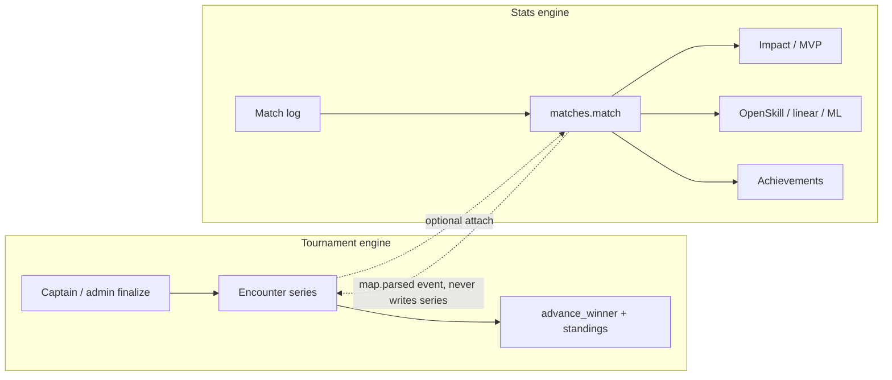

# Decouple the statistical engine from the tournament engine

Point-in-time intention. Present-tense facts: [`../business-logic-inventory.md`](../business-logic-inventory.md). Do not treat this file as a description of the running system.

## Problem

Two different questions share one object graph:

| Engine | Question | Must be true for |
| --- | --- | --- |
| **Tournament** | Who plays whom, in which series, who advances? | Bracket, standings table, pick-ban, registration |
| **Stats** | What happened on a played map, and how good was the player? | Logs, impact/MVP, ratings, achievements, mix history |

Today the stats engine cannot exist without a tournament encounter and a `tournament.team`. That is why scrims skip writing `matches.match`, mix stats still hang off tournament-shaped rows, and a parsed log can move bracket standings.

## Coupling that actually exists (code)

Not a vibe. These are the load-bearing joins.

1. **`matches.match.encounter_id` is NOT NULL, ON DELETE CASCADE** (`backend/shared/models/matches/match.py`). A played map cannot be stored unless an encounter exists. Deleting the series deletes the log-derived stats.

2. **`matches.match.home_team_id` / `away_team_id` FK `tournament.team`**. Mixes and scrims mint tournament teams so a map has somewhere to point. Stats identity is a *tournament roster row*, not a `workspace_member`.

3. **Parser writes tournament state.** After a log, `parser-service` invalidates `TOURNAMENT_ENCOUNTERS` + `TOURNAMENT_STANDINGS`, enqueues `tournament.standings.invalidated`, and if the encounter looks completed emits `tournament.encounter.completed` (`_enqueue_match_log_tournament_events`). A log is not evidence beside the series — it **is** a series write.

4. **Analytics joins stats through `tournament.player`.** `extract_match_features` attaches `MatchStatistics` to `Player` on `(team_id, tournament_id)` and drops substitutes. OpenSkill replay walks **encounters** (`get_matches_for_tournaments` is a historical misnomer). Ratings are a function of series scores, not map stats.

5. **Log ingest is keyed by `tournament_id`.** Dedup, S3 key `logs/{tournament_id}/{log_name}`, Discord channel → tournament. There is no first-class “this log belongs to a mix / a player / a workspace”.

6. **Achievements query both engines in one tree.** Leaves hit `matches.statistics` *and* `Encounter` + `Stage` + `Standing` + bracket path. Competitive context is not a projection; it is a live join into the tournament schema.

7. **Two kinds of `Match` in one table.** `source=log_parser` has duration, kill-feed, stats. `source=captain_report` has scores only (scrims skip even that). Callers branch on `source` / nullability instead of on a type.

8. **Scrim is already a special case** of this coupling: map reports run the pick-ban loop, no `matches.match` row, standings recalc suppressed at the enqueue site. That is a symptom, not a third engine.

## What not to do

- New database, new ORM, new “stats-svc” process. One DB and one metadata stay.
- Event-sourcing rewrite of encounters.
- Making analytics the authority for who won a series.
- Teaching the client a second identity for “player in a match”.

The lazy split is a **write-authority seam** plus a **nullable attachment**, not a new service.

## Target seam

```
Tournament engine                         Stats engine
─────────────────                         ────────────
Encounter  = series between two teams     Match = one played map
Series score → advancement / standings    Kill-feed, stats, impact
Captain/admin finalize is authority       Log parse is evidence
tournament.player = event roster          Subject = workspace_member
                                          Optional: attached_encounter_id
```

A map **may** attach to an encounter. It must not **require** one. Series score must not be a side effect of parse.



## Phases

Stop at the first phase that removes the pain you actually have. Do not pre-build 2–4.

### Phase 1 — Parser stops writing the series (do this)

**Invariant:** the only writers of `Encounter.home_score` / `away_score` / `status` / `result_status` are tournament-svc finalize paths (captain dual-report, admin, Challonge import). Parser writes `matches.match` + statistics + kill-feed.

Concretely:

- Delete / stop `_enqueue_match_log_tournament_events` from mutating series completion. Keep cache invalidation for **match** reads if those exist; do not enqueue `tournament.standings.invalidated` or `tournament.encounter.completed` from parser.
- If a log is attached to an encounter, emit a thin `match.parsed {encounter_id, match_id, map_id, home_score, away_score}` on the outbox. Tournament-svc **may** later consume it under an explicit form flag (`logs_are_official`). Default off — captains already report maps.
- Impact / achievements still run on parse. They read match rows, not encounter status.
- Dashboard `encounters_missing_logs` stays a coverage metric, not a completeness gate for the bracket.

This is the root-cause fix: one function in parser currently treats a log as a standings source. Removing that write is smaller than a schema split and unblocks scrim/mix logs without minting fake series.

**Check:** parse a log for a LIVE encounter whose captains have not reported → series score unchanged, standings job not enqueued, `matches.match` + stats present, achievements that key off stats still fire.

### Phase 2 — Stats subject is `workspace_member` (when analytics/mix hurt)

Analytics and achievements that say “this person” today join `tournament.player`. That row exists only inside one event.

Change feature extraction and impact persistence to key `(workspace_member_id | player_id, match_id)`. Keep `tournament.player` as the event roster (who was fielded). Substitutes stay a roster fact, not a stats join filter that drops rows before the engine sees them.

OpenSkill can keep replaying **encounters** — that algorithm *is* series-shaped. Do not pretend map stats are series results. Rename `get_matches_for_tournaments` to `get_encounters_for_tournaments` so the next person does not join the wrong table.

**Check:** a player who appears in two tournaments has one ratings timeline by `workspace_member`, not two `player_id`s that happen to share a BattleTag.

### Phase 3 — `Match.encounter_id` nullable (when mix/scrim need real logs)

Only if mix/scrim must store kill-feed without a container tournament.

- `encounter_id` nullable. `ON DELETE SET NULL` (stats outlive the series).
- `home_team_id` / `away_team_id`: either keep FKs and accept that mix still materializes two teams (today’s cheap path) **or** add a parallel `(home_member_ids, away_member_ids)` payload later. Do not do both in one PR.
- Log record grows `workspace_id` + optional `encounter_id` / `custom_game_id`. S3 key becomes `logs/{workspace_id}/…` with a backfill, or keep tournament_id as a prefix for old objects.

Scrim special-case in map_report (“don’t write Match”) inverts: **do** write Match, still don’t finalize a series that isn’t competitive.

### Phase 4 — Achievement competitive context as a projection (only if eval is slow/fragile)

Bracket-path / standing-position / “lost in GF” leaves should read a small `competitive_fact` table (`workspace_member_id`, `tournament_id`, `placement`, `played_lower_bracket`, …) written by tournament-svc on standings jobs — not live joins to `EncounterLink`. Stats leaves stay on `matches.statistics`.

Do not build this until a condition is measurably expensive or a tournament schema change keeps breaking rules.

## Authority matrix (after phase 1)

| Fact | Writer | Readers |
| --- | --- | --- |
| Series score, advancement | tournament-svc finalize | Bracket, standings, Swiss pairing, Challonge push |
| Map score without a log | tournament-svc map_report → `Match(source=captain_report)` | Pick-ban rotation, series length |
| Map score + stats from a log | parser-svc → `Match(source=log_parser)` | Impact, achievements (stat leaves), analytics features, public match page |
| “Logs are official series” | optional tournament-svc consumer of `match.parsed` | Same as series score — still tournament-svc |

Two scores on one map (captain vs log) are allowed. They are different facts. Do not merge them in the parser.

## Already-split pieces (reuse, don’t reimplement)

- `Match.source` already distinguishes log vs captain report.
- Scrim already refuses to let standings invent placements for rosterless teams.
- Admission / registration / pick-ban / draft do not read `matches.statistics`. They are already on the tournament side of the seam.
- Impact math is already pure (`domain/match_logs/impact.py`). Keep it that way — no `Encounter` import.

## Out of scope

Gateway routes, RBAC catalog, realtime topic names, frontend query keys. Those follow the write seam; they are not the seam.
