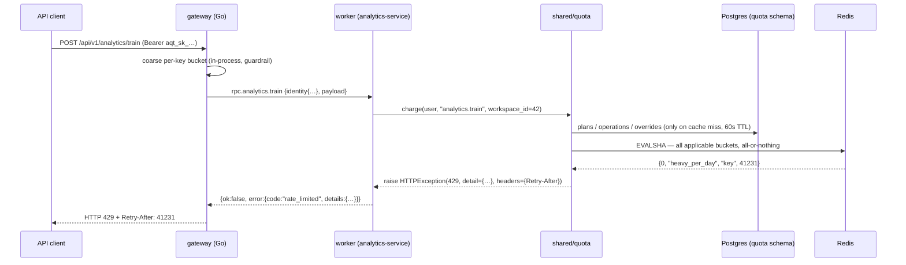

# Project-wide quotas as shared library code

**Status:** implemented (2026-09-17)

One quota implementation in `backend/shared/quota/`, called explicitly from the operations that
cost money or CPU, reading relational policy tables in a new `quota` schema. Two enforcement
scopes: the **workspace** (a tenant-wide budget every principal in it shares) and the
**key/session** (per-client fairness inside that budget). No new service, no extra network hop.
Section 6 records why the separate-service variant was rejected and what would revive it.

## 1. What exists today

| Layer | Enforces | Keyed on | Storage | Evidence |
|---|---|---|---|---|
| nginx | `req_edge` 40r/s, `req_auth` 10r/s, `req_ws` 1r/s, `req_upload` 10r/m, `conn_edge` 100 | `$binary_remote_addr`, RFC1918 exempt | nginx shm zones | `nginx/nginx.conf:111-126` |
| gateway auth limiter | 10 req / 60s on `/api/auth/*` (`WrapFailures` on refresh meters only 401/403) | client IP + path | in-process map | `gateway/cmd/gateway/main.go:145`, `gateway/internal/config/config.go:213-214` |
| gateway anon limiter | disabled by default (`GATEWAY_ANON_RATE_LIMIT=0`) | client IP | in-process map | `gateway/internal/config/config.go:217-218`, `gateway/cmd/gateway/main.go:495` |
| gateway API-key limiter | `api_key.limits.requests_per_minute`, else 60/min | API-key id | in-process map | `gateway/internal/ratelimit/ratelimit.go:237-267`, `gateway/cmd/gateway/main.go:504-505` |
| balancer worker | `requests_per_minute`, `jobs_per_day`, `concurrent_jobs`, `max_upload_bytes`, `max_players` | `("api_key"\|"user", id)` | Redis + Lua, atomic | `backend/balancer-service/src/core/security/api_key_limiter.py:12-65,128-149` |

The error contract is already unified end to end: a worker emits `rate_limited` + `retry_after`
(`backend/shared/schemas/rpc.py:39-83`), the gateway maps it to 429 and re-emits `Retry-After`
(`gateway/internal/rpc/envelope.go:34-56`), and the gateway's own 429 uses the same body
(`gateway/internal/ratelimit/ratelimit.go:269-280`). This part needs no redesign.

## 2. Problems

1. **The configuration is fictional.** `ApiKey.limits_json` is written exactly once, as `{}`
   (`backend/identity-service/src/services/api_keys.py:332`); no RPC, admin UI, backfill or seed
   ever sets it. Both readers therefore always fall back to their own hardcoded defaults
   (gateway 60/min, balancer `DEFAULT_LIMITS`). Same trajectory `config_policy_json` was on before
   `apikeycfg1` dropped it.
2. **Only one service enforces anything.** No service outside balancer inspects
   `credential_type`/`_api_key_*` (`backend/shared/rpc/identity.py:131-136` does not even stamp
   `limits`). Uncapped and expensive today: `rpc.parser.logs.upload` (S3 + a parse job per file),
   `logs.process_tournament`, `rpc.parser.ach.import/export`, `rpc.tournament.challonge_import/
   export` and `sheet_sync` (third-party API quota), `rpc.analytics.train/infer/recalculate`
   (ML CPU), `rpc.app.assets.upload`, `rpc.stream.repoll` (shared 800-pt/min Helix bucket).
3. **Even inside balancer the quota is partial.** `api_key_limiter` is called only from the job
   creation path in `services/balancer/jobs.py`; `rpc/admin.py` exports and `rpc/binary.py`
   imports bypass it.
4. **Everything is per-credential, nothing per-tenant.** Ten keys in one workspace get ten
   budgets, and an interactive member's jobs are counted in a namespace of their own. The unit
   that actually consumes the platform — the workspace — has no budget at all.
5. **The edge budget is per-replica.** `gateway/internal/ratelimit/ratelimit.go:7-14` says so: with
   N gateway processes a key's effective budget is N × the limit.
6. **One number cannot describe cost.** 60 requests/minute is generous for reads and absurd for 60
   ML trainings. There is no notion of operation weight anywhere.
7. **No observability, no contract.** Nothing counts 429s or consumption; `record_audit` is never
   called for a quota event; no doc or OpenAPI entry publishes a rate-limit contract.
8. **The write authority is wrong.** `ApiKeyService.ensure_can_manage` requires `team.create` in
   the workspace — whoever can mint a key could set its quota if the field were writable.

Note what is **not** in that list: nobody has been hurt by read volume. Problems 2, 3 and 6 are
about a finite set of expensive operations, and that shapes the design below.

## 3. Decision

**`backend/shared/quota/` — one module, called explicitly at the operations that cost something.**

```python
# parser-service/src/rpc/logs.py, inside the existing handler
await quota.charge(user, "parser.logs.upload", workspace_id=ws, item_count=len(files), size_bytes=total)
# balancer-service, around a long solve
lease = await quota.lease(user, "balancer.job", workspace_id=ws, ttl_seconds=ttl)
try:    ...
finally: await quota.release(lease)
```

The module owns everything: plans, tier resolution, overrides, per-operation cost, Redis keys, the
Lua, the 429 with its `Retry-After`, the fail-open/fail-closed policy, the metrics. A call site
passes only facts it already holds — the actor, the operation, the workspace, the payload size —
and either proceeds or gets an exception. It never sees a number.

The metered set is the list in §2.2 plus balancer's job path: ~30 call sites, all writes or
compute. Reads stay unmetered; nginx and the gateway's buckets already bound floods.

### 3.1 Two scopes, both enforced

| Scope | Bucket keyed on | Answers |
|---|---|---|
| `workspace` | `workspace_id` — **shared by every API key, and by every member's session, in that workspace** | "how much may this tenant consume" |
| `key` / `session` | api-key id, or auth-user id for an interactive principal | "how much may one client consume of it" |

Both are checked on every metered call and the tighter one refuses; the error names which scope hit
(`details.limit_name`, `details.scope`). Either scope may be left unset, meaning unlimited there —
a workspace-only configuration is legitimate and is the simplest way to run a tenant.

Why both rather than only the workspace: without a per-key bucket, one runaway integration eats the
whole tenant's budget and every other key starts failing. Without the workspace bucket, minting a
key multiplies the budget — today's problem (§2.4).

### 3.2 Vocabulary

| Field | Kind | Scopes | Replaces |
|---|---|---|---|
| `requests_per_minute` | counter, 60s window | `workspace`, `key`, `session` | same name |
| `heavy_per_day` | counter, UTC day, incremented by the operation's cost | `workspace`, `key`, `session` | `jobs_per_day` |
| `concurrent_heavy` | lease set | `workspace`, `key`, `session` | `concurrent_jobs` |
| `max_upload_bytes` | per-request cap | narrowest set value wins | same name |
| `max_items_per_request` | per-request cap | narrowest set value wins | `max_players` |

`key` and `session` are the same principal scope for the two credential kinds, so a machine client
and an interactive member can carry different ceilings while sharing one workspace budget.

## 4. The `quota` schema

Relational, not a JSON bag. The dimension vocabulary is closed and typed, admin editing is per-row
CRUD through the existing engine, and a misspelled limit has to fail at write time rather than
silently read as "unlimited". Same taste these tables already state: `Workspace`'s branding is
"typed hex (#RRGGBB) columns — no JSON bag" (`backend/shared/models/tenancy/workspace.py:112-116`).

Counters are the exception and stay in Redis: they are per-minute and per-day increments and in
Postgres would be pure write amplification.

### 4.1 Shape

```mermaid
erDiagram
    workspace ||--o| quota_plan : "quota_plan_id (nullable)"
    workspace ||--o{ quota_workspace_limit : "0..3 rows, one per scope"
    quota_plan ||--|{ quota_plan_limit : "3 rows: workspace|key|session"
    api_key ||--o| quota_api_key_limit : "0..1 row"
    workspace ||--o{ api_key : "keys"

    quota_plan {
        bigint id PK
        varchar32 slug UK "unverified|verified|trusted|partner-…"
        varchar64 title
        text description "nullable"
    }
    quota_plan_limit {
        bigint plan_id PK_FK
        varchar16 scope PK "workspace|key|session"
        int requests_per_minute "nullable = unlimited"
        int heavy_per_day "nullable"
        int concurrent_heavy "nullable"
        bigint max_upload_bytes "nullable"
        int max_items_per_request "nullable"
    }
    quota_operation {
        bigint id PK
        varchar64 slug UK "analytics.train"
        int cost "heavy units, default 1"
        boolean enabled "default true"
        text description "nullable"
    }
    quota_workspace_limit {
        bigint workspace_id PK_FK
        varchar16 scope PK
        int requests_per_minute "nullable = inherit"
        int heavy_per_day "nullable"
        int concurrent_heavy "nullable"
        bigint max_upload_bytes "nullable"
        int max_items_per_request "nullable"
        bigint updated_by FK "nullable"
    }
    quota_api_key_limit {
        bigint api_key_id PK_FK
        int requests_per_minute "nullable = inherit"
        int heavy_per_day "nullable"
        int concurrent_heavy "nullable"
        bigint max_upload_bytes "nullable"
        int max_items_per_request "nullable"
        bigint updated_by FK "nullable"
    }
```

`quota.operation` has no FK: it is the metered-operation catalogue, keyed by the slug the call site
passes.

### 4.2 DDL

```sql
CREATE SCHEMA IF NOT EXISTS quota;

CREATE TABLE quota.plan (
    id          BIGSERIAL   PRIMARY KEY,
    created_at  TIMESTAMPTZ NOT NULL DEFAULT now(),
    updated_at  TIMESTAMPTZ,
    slug        VARCHAR(32) NOT NULL UNIQUE,
    title       VARCHAR(64) NOT NULL,
    description TEXT
);

CREATE TABLE quota.plan_limit (
    plan_id               BIGINT      NOT NULL REFERENCES quota.plan(id) ON DELETE CASCADE,
    scope                 VARCHAR(16) NOT NULL,
    requests_per_minute   INTEGER,
    heavy_per_day         INTEGER,
    concurrent_heavy      INTEGER,
    max_upload_bytes      BIGINT,
    max_items_per_request INTEGER,
    PRIMARY KEY (plan_id, scope),
    CONSTRAINT ck_quota_plan_limit_nonneg CHECK (
        COALESCE(requests_per_minute, 0)   >= 0 AND COALESCE(heavy_per_day, 0)         >= 0 AND
        COALESCE(concurrent_heavy, 0)      >= 0 AND COALESCE(max_upload_bytes, 0)      >= 0 AND
        COALESCE(max_items_per_request, 0) >= 0)
);

CREATE TABLE quota.operation (
    id          BIGSERIAL   PRIMARY KEY,
    created_at  TIMESTAMPTZ NOT NULL DEFAULT now(),
    updated_at  TIMESTAMPTZ,
    slug        VARCHAR(64) NOT NULL UNIQUE,
    cost        INTEGER     NOT NULL DEFAULT 1,
    enabled     BOOLEAN     NOT NULL DEFAULT true,
    description TEXT,
    CONSTRAINT ck_quota_operation_cost CHECK (cost >= 0)
);

CREATE TABLE quota.workspace_limit (
    workspace_id          BIGINT      NOT NULL REFERENCES workspace(id)    ON DELETE CASCADE,
    scope                 VARCHAR(16) NOT NULL,
    requests_per_minute   INTEGER,
    heavy_per_day         INTEGER,
    concurrent_heavy      INTEGER,
    max_upload_bytes      BIGINT,
    max_items_per_request INTEGER,
    updated_by            BIGINT      REFERENCES auth."user"(id)           ON DELETE SET NULL,
    created_at            TIMESTAMPTZ NOT NULL DEFAULT now(),
    updated_at            TIMESTAMPTZ,
    PRIMARY KEY (workspace_id, scope)
);

CREATE TABLE quota.api_key_limit (
    api_key_id            BIGINT      PRIMARY KEY REFERENCES auth.api_key(id) ON DELETE CASCADE,
    requests_per_minute   INTEGER,
    heavy_per_day         INTEGER,
    concurrent_heavy      INTEGER,
    max_upload_bytes      BIGINT,
    max_items_per_request INTEGER,
    updated_by            BIGINT      REFERENCES auth."user"(id)              ON DELETE SET NULL,
    created_at            TIMESTAMPTZ NOT NULL DEFAULT now(),
    updated_at            TIMESTAMPTZ
);

ALTER TABLE workspace
    ADD COLUMN quota_plan_id BIGINT REFERENCES quota.plan(id) ON DELETE SET NULL;
CREATE INDEX ix_workspace_quota_plan_id ON workspace (quota_plan_id);

ALTER TABLE auth.api_key DROP COLUMN limits_json;
```

Deliberate omissions:

- **No `CHECK` on `scope`.** A fourth scope must be a data change, not a migration — the same
  reason `verification_status` and `newcomer_scope` are plain strings with no constraint
  (`workspace.py:98-106,117-124`). The write layer validates against the pydantic literal.
- **No extra indexes.** Every read is a primary-key lookup or a full scan of a table with tens of
  rows.
- **No `NOT NULL` on any dimension.** `NULL` is the load-bearing value: "inherit" in an override
  row, "unlimited" in a plan row (§4.5).
- **`id` + timestamps only where a row is an entity.** `plan_limit` is a child of `plan` and needs
  no identity of its own, mirroring `ApiKeyScope` (`shared/models/identity/api_key.py:47-57`);
  models use `db.TimeStampIntegerMixin` where an `id` exists and `db.Base` where the PK is
  composite (`shared/core/db.py:76-83`).

Models live in `backend/shared/models/quota/`: every service's library call reads them, which is
the rule that directory states.

### 4.3 Data as stored

`quota.plan` — four rows after the seed, plus any partner plan a superuser adds later:

| id | slug | title |
|---|---|---|
| 1 | `unverified` | Unverified workspace |
| 2 | `verified` | Verified workspace |
| 3 | `trusted` | Trusted workspace |
| 4 | `default` | No workspace in the request |

`quota.plan_limit` — two rows per plan as seeded, and the four plans are
**deliberately identical**: the values are today's hardcoded `DEFAULT_LIMITS`/`SESSION_LIMITS`, so
landing the schema changed nothing observable. Differentiating the tiers is an ops decision taken
against live numbers, not part of this change. `—` is SQL `NULL`:

| plan | scope | requests_per_minute | heavy_per_day | concurrent_heavy | max_upload_bytes | max_items_per_request |
|---|---|---|---|---|---|---|
| every plan | `key` | 60 | 100 | 2 | 10485760 | 500 |
| every plan | `session` | 120 | 500 | 3 | 26214400 | 1000 |

No `workspace`-scope row is seeded: the tenant-wide budget starts unlimited, because tightening a
shared pool below what its keys already spend is exactly the change that should be made
deliberately and per tenant. The per-request caps stay `NULL` on a `workspace` row for the same
reason a byte ceiling is a property of one request and not of a pool; a workspace row may still
set them to tighten its own keys (§4.5).

`quota.operation` — the metered set, as seeded by `quota0001` (`balancer.job`) and `quota0002`
(everything else, once its call site landed). A slug with no row costs nothing beyond its request
token:

| slug | cost | slug | cost |
|---|---|---|---|
| `balancer.job` | 1 | `tournament.challonge_import` | 5 |
| `balancer.balance_export` | 3 | `tournament.challonge_export` | 5 |
| `balancer.balance_ranks_export` | 3 | `tournament.sheet_sync` | 3 |
| `balancer.teams_import` | 2 | `tournament.sheet_players_export` | 2 |
| `balancer.teams_export` | 2 | `analytics.train` | 10 |
| `parser.logs.upload` | 1 | `analytics.infer` | 5 |
| `parser.logs.process_tournament` | 5 | `analytics.recalculate` | 5 |
| `parser.ach.import` | 5 | `app.assets.upload` | 1 |
| `parser.ach.export` | 2 | `app.workspace_icon_upload` | 1 |
| `parser.ach.lib_import` | 5 | `stream.repoll` | 3 |
| `parser.ach.calculate` | 3 | `parser.ach.calculate_tournament` | 2 |

`quota.workspace_limit` — workspace 42 bought more daily budget and decided one key may hold only
one concurrent job:

| workspace_id | scope | requests_per_minute | heavy_per_day | concurrent_heavy | max_upload_bytes | max_items_per_request | updated_by |
|---|---|---|---|---|---|---|---|
| 42 | `workspace` | — | 2000 | — | — | — | 1 |
| 42 | `key` | — | — | 1 | — | — | 9 |

`quota.api_key_limit` — key 7 is the tenant's bulk importer and a superuser raised its rate above
the plan:

| api_key_id | requests_per_minute | heavy_per_day | concurrent_heavy | max_upload_bytes | max_items_per_request | updated_by |
|---|---|---|---|---|---|---|
| 7 | 600 | 100 | — | — | — | 1 |

`workspace` row 42: `verification_status = 'verified'`, `quota_plan_id = NULL` → plan 2 by slug.
Workspace 77 has `quota_plan_id = 4` and runs on the partner plan regardless of its tier.

Seeding happens **in the same migration** as the DDL: an empty `plan_limit` means unlimited, so a
gap between the two would be a window with no quotas at all. Data-carrying migrations are
established here (`backend/migrations/versions/mix3nf02_backfill_mix_schema.py`).

### 4.4 What is not in Postgres

```
q:ws:42:rpm                  STRING  counter, TTL 60s
q:ws:42:heavy:20260917       STRING  counter, TTL 25h
q:ws:42:heavy:active         ZSET    member = lease id, score = expiry epoch
q:key:7:rpm | :heavy:… | :heavy:active     same three, per key
q:user:9:rpm | …                            same three, for session principals
```

Lease sets are ZSETs, not SETs: `ZREMRANGEBYSCORE key 0 <now>` at the head of every reservation
prunes leases whose holder died, so each lease expires on its own schedule. Today's balancer uses a
plain SET with a whole-key `EXPIRE` (`api_key_limiter.py:62-63`), which means one stuck member keeps
its slot for as long as the set stays active.

### 4.5 Resolution

```
plan(ws)          = ws.quota_plan_id  ??  plan WHERE slug = ws.verification_status
scope_of(actor)   = "key" for an API key, "session" for an interactive principal

effective(scope, dim) = first value that is NOT NULL of
    1. quota.api_key_limit[api_key_id].dim          (only when scope_of(actor) = "key")
    2. quota.workspace_limit[ws.id, scope].dim
    3. quota.plan_limit[plan(ws).id, scope].dim
    4. NULL  →  unlimited for that dimension

per-request caps (max_upload_bytes, max_items_per_request)
                      = MIN over the same three levels, ignoring NULLs
```

Counters take the first non-null so a raise is possible; per-request caps take the minimum so a
workspace can tighten what its keys upload without a superuser. That asymmetry is the only
irregular rule in the model, and it is why the two kinds are labelled separately in §3.2.

`Workspace.verification_status` (`workspace.py:106`) stays the default tier axis — it already gates
compute for unverified workspaces and only a superuser moves it — while `quota_plan_id` (the same
nullable-FK-assignment shape as `default_division_grid_version_id` on that table,
`workspace.py:107-111`) lets one tenant get a partner plan without inventing a fourth tier.

### 4.6 Reads and caching

| Lookup | Query | Cached |
|---|---|---|
| plans + their limits | two full scans (~4 and ~12 rows), loaded whole | 60s, process-wide |
| operations | one full scan (~30 rows) | 60s, process-wide |
| workspace tier + plan assignment + override rows | one join keyed by `workspace_id` | 60s, per workspace |
| key override | PK lookup | 60s, per key |

A metered call on a warm cache costs **one `EVALSHA`** and no SQL. The module opens its own
short-lived session for a policy miss rather than borrowing the caller's: a policy `SELECT` inside
a handler's failed transaction would raise, and the one metered caller with no session at all
(`balance_inline`, which deliberately touches no Postgres) would otherwise have no way to be
metered. `quota.configure(session_factory=…, redis_url=…)` runs once per service at startup. The
Redis client it builds itself from `REDIS_URL`, as the balancer limiter did (`api_key_limiter.py`
before its deletion); there is no shared Redis factory to reuse
(`shared/observability/health.py:46-74` is the only shared Redis code).

An API key's workspace comes off the credential when a call site does not name one: the tenant is
a property of the key, not of the request, so a forgotten `workspace_id` cannot escape the tenant
budget. A principal with no workspace at all (a session user polling a job by id) resolves the
plan slugged `default` — without it, "no workspace" resolved no plan, which reads as unlimited.
That hole existed in the first implementation and a smoke test found it before the tests did.

Writes invalidate immediately instead of waiting out the TTL, over the existing
`CACHE_INVALIDATION_EXCHANGE` topic exchange with its per-consumer bound queues
(`backend/shared/messaging/config.py:265-296`) — the same mechanism the rest of the platform
already uses to drop caches across replicas.

### 4.7 Admin surface

Rows, not a blob, means ordinary CRUD on the generic engine (`backend/shared/rpc/crud.py`):
`rpc.quota.plan.*` and `rpc.quota.operation.*` for superusers, `rpc.app.workspaces.quota_set` and
`rpc.identity.api_key.quota_set` for the two override tables — the former next to the
superuser-only `verification_set` it mirrors (`app-service/src/rpc/workspaces.py:568-579`). Per-row
validation, list/filter and audit come from the engine instead of being re-implemented for a JSON
payload.

Kill switches: `quota.operation.enabled = false` disables one operation instantly (and invalidates
the cache), `QUOTA_ENABLED=false` (env, restart-scoped) turns the whole gate into a no-op.

### 4.8 Authority

| Writer | May | Enforced |
|---|---|---|
| superuser | set any value at any scope, above or below the plan | the escape hatch for a partner integration without moving a tier |
| workspace admin (`team.create` in the workspace) | only **lower** a value below what it would inherit | rejected at write time with 422 if it exceeds the inherited value |

Checked once, on write, so the stored row is always the truth — no surprising `min()` at read time.
Both writes are audited (`workspace.quota_update`, `api_key.quota_update`); `action` is a plain
`String(64)`, so no migration and no enum to extend.

### 4.9 Rejected shapes

| Shape | Why not |
|---|---|
| JSON columns (`workspace.quota_json`, `api_key.limits_json`) | no `NOT NULL`/type guarantees, typos read as "unlimited", no per-row audit or CRUD, no FK/cascade |
| Settings row `quota.policy` for plans | fine for one global config blob, wrong once a workspace must point at a plan (needs a FK) |
| EAV `quota_limit(plan_id, scope, dimension, value)` | every read becomes a pivot and the vocabulary loses its types; five dimensions in two years is not enough churn to pay for that |
| One polymorphic `quota.override(workspace_id NULL, api_key_id NULL, scope, …)` | saves one small table but needs `CHECK ((workspace_id IS NULL) <> (api_key_id IS NULL))` plus a second check that a key row never carries a workspace scope |
| Shared `quota.limit_set` row referenced by plan/workspace/key | one more join per read and orphan rows to garbage-collect, for five columns |
| Counters in Postgres | per-minute `UPDATE`s on a hot row: lock contention and bloat for data that is worthless in 60 seconds |

## 5. Runtime

### 5.1 One metered call, end to end



### 5.2 The same call, with the numbers

Actor: API key 7, workspace 42, `verification_status='verified'`, `quota_plan_id=NULL` → plan 2.
Operation `analytics.train`, `cost = 10`.

Effective limits, resolved from the rows in §4.3:

| dimension | workspace scope | source | key scope | source |
|---|---|---|---|---|
| `requests_per_minute` | 600 | plan 2 / `workspace` | **600** | `api_key_limit[7]` (superuser raise over the plan's 120) |
| `heavy_per_day` | **2000** | `workspace_limit[42,'workspace']` | **100** | `api_key_limit[7]` |
| `concurrent_heavy` | 4 | plan 2 / `workspace` | **1** | `workspace_limit[42,'key']` |
| `max_upload_bytes` | — | — | 26214400 | MIN(∅, ∅, plan 2 / `key`) |

Buckets touched, in one script:

```
INCR    q:ws:42:rpm                 → 41    ≤ 600    ok
INCRBY  q:ws:42:heavy:20260917  10  → 180   ≤ 2000   ok
INCR    q:key:7:rpm                 → 12    ≤ 600    ok
INCRBY  q:key:7:heavy:20260917  10  → 100   ≤ 100    ok      (exactly at the limit)
```

The next `analytics.train` on key 7 would reach 110 > 100, so the script increments nothing and
returns `{0, "heavy_per_day", "key", ttl}`. The tenant is *not* out of budget — 1820 units remain
at workspace scope — and another key in workspace 42 keeps working. That is the point of two
scopes, and it is why the error names the scope. What the client sees:

```json
{ "ok": false,
  "error": {
    "code": "rate_limited",
    "message": "quota exceeded: heavy_per_day",
    "details": {
      "retry_after": 41231,
      "fields": [{ "field": null, "code": "quota_exceeded",
                   "msg": "quota exceeded: heavy_per_day",
                   "limit_name": "heavy_per_day", "scope": "key",
                   "limit": 100, "remaining": 0 }]
    }}}
```

Extra keys on a dict detail survive into the fields entry and the header becomes
`details.retry_after` — that is the existing mapper behaviour
(`backend/shared/rpc/common.py:192-230`), which is why no new error plumbing is needed.

**All-or-nothing matters.** Charging the workspace and then failing on the key would burn tenant
budget on every rejection: a client in a retry loop would drain a shared pool it never actually
used. The script therefore evaluates every bucket first and writes only if all of them pass — the
existing `RESERVE_JOB_SCRIPT` shape (`api_key_limiter.py:46-65`), widened from two keys to six.

### 5.3 A long job

```
lease()   ZREMRANGEBYSCORE q:{ws,key}:heavy:active 0 <now>      prune dead holders
          ZCARD            → compare with concurrent_heavy       both scopes
          INCRBY           heavy:{day} by cost                   both scopes
          ZADD             lease_id score=<now + ttl>            both scopes
release() ZREM             lease_id                              both scopes
```

Reserve and release are separate because a request-scoped check cannot know when a ten-minute
solve finished. A worker killed mid-job never calls `release()`; its member is pruned by the next
reservation, so a crash costs one slot until the next attempt rather than forever. `heavy_per_day`
is charged at `lease()` and **not** refunded on failure — a failed expensive job consumed the same
CPU as a successful one.

### 5.4 When policy changes

| Event | Effect |
|---|---|
| plan or operation edited | row write + cache-invalidation event → every worker re-reads within one message hop, 60s worst case if the event is lost |
| `verification_set` moves a workspace's tier | next resolution picks the new plan by slug; in-flight counters keep their values, so a demotion can leave a tenant already over its new limit — it is refused until the window rolls |
| override written | same invalidation path; the stored row is already clamped by §4.8, so no read-time surprise |
| `quota_plan_id` set to a partner plan | tier is ignored from then on |
| key revoked and purged | `ON DELETE CASCADE` drops `api_key_limit`; its Redis counters die with their TTL, and ids are never reused |
| workspace deleted | cascade drops both override rows |
| UTC midnight | `heavy:{YYYYMMDD}` key changes; the old one expires on its 25h TTL, which covers the rollover with slack |

### 5.5 Failure behaviour

| Call | On Redis error |
|---|---|
| `charge()` counters and per-request caps | **fail open** + `quota_unavailable_total` + warn log |
| `lease()` | **fail closed**, 503 `unavailable` |
| `release()` | best effort; the ZSET score reclaims the slot |

Both directions already exist in the repo with this reasoning: `assert_accept_attempt_allowed`
fails open, `assert_invite_attempt_allowed` fails closed
(`backend/tournament-service/src/services/registration/team_rate_limits.py:95-135`). A Postgres
error is different: policy is cached, so a brief outage is invisible; a cold cache plus a dead
Postgres means the handler was going to fail anyway.

### 5.6 Usage reads

`rpc.identity.api_key.quota_usage` and its workspace-level sibling return, per scope, the effective
limit next to the current counter — a handful of Redis `GET`s plus a resolution the module has
cached. That is what the admin UI renders as two bars, and the reason a tenant can tell "my key is
throttled" from "my workspace is out of budget" before opening a ticket.

## 6. Why not a separate quota service

The service version was written up first and rejected. The argument for it was "one implementation
instead of N" — but the library already gives that: one module, one-line call sites, nothing to
duplicate.

| | shared library | quota-service |
|---|---|---|
| Implementations of the logic | 1 module | 1 service |
| Cost per metered call | 1 Redis `EVALSHA` (~0.2 ms) | + 1 RabbitMQ request-reply (~1-3 ms) |
| New failure domain | none | yes — per-call fail policy, timeouts, self-exemption |
| Deployment surface | none | image, compose block, env file, metrics port, CI loop entry, deploy matrix (~10 files) |
| New DB objects | `quota` schema, 5 tables, 1 column, 1 column dropped | the same, plus its own |
| Reaches the Go gateway | no | yes (if wanted) |

The one thing a service buys is **enforcement outside Python** — the Go gateway refusing before
dispatch. Today the gateway keeps a coarse in-process bucket, and if exact per-key rate at the edge
becomes a requirement the cheaper fix is still not a service: ~40 lines of Go moving that one
bucket into Redis against the same `q:key:{id}:rpm` key (it already holds a Redis client for the
realtime bus).

**Revive the service when** one of these is true, not before:

1. Quota becomes billing (invoices, metered pricing, a ledger with its own lifecycle).
2. A non-Python consumer must enforce, not merely guardrail.
3. The metered set grows from ~30 named operations to "every subject".

`charge()`/`lease()`/`release()` is already the RPC surface such a service would expose, so the
extraction stays mechanical: swap the module body for a `request_rpc` call
(`backend/shared/messaging/rpc.py:26-52`) and no call site changes.

### 6.1 If "meter every subject" is wanted anyway

- `shared/rpc/common.py:envelope()` (`:250-278`) is the one function every handler runs through,
  but it does not receive the request `data`, so the principal is invisible there — gating it means
  touching ~400 call sites.
- `c.actor(data)` (`common.py:89-95`, 93 call sites) and `shared/rpc/crud.py` are where the
  principal appears, and both are **synchronous**; a Redis check is not.
- A broker-wide FastStream middleware (precedent: `shared/rpc/deadline.py:49-73`, installed for
  every service via `shared/observability/broker.py:16-53`) is async and gets the routing key and
  `len(msg.body)` for free — but identity rides in the message **body**
  (`gateway/internal/edge/dispatch.go:99`), so it would either re-parse the body (bad for upload
  payloads) or need the gateway to stamp `x-principal-{kind,id}` / `x-workspace-id` headers
  (`buildPublishing` already merges caller headers, `gateway/internal/rpc/deadline.go:27-47`).

That is the escalation order. Stage it when a named problem demands it.

## 7. Staging

1. **The schema + the module + its first consumer.** Migration: `CREATE SCHEMA quota`, the five
   tables, `workspace.quota_plan_id`, the §4.3 seed, the `api_key.limits_json` drop;
   `backend/shared/models/quota/`; `backend/shared/quota/` (resolution cache, Lua,
   `charge`/`lease`/`release`, metrics); balancer switched onto it, including the admin subjects
   that bypass its limiter today. *Acceptance:* balancer's observable behaviour is unchanged (same
   429, same `Retry-After`) on the seeded `verified` plan; `QUOTA_ENABLED=false` is a full no-op;
   `api_key_limiter.py` is deleted.
2. **Make the numbers editable, at both scopes.** `rpc.quota.plan.*` / `rpc.quota.operation.*` on
   the CRUD engine (superuser), `rpc.app.workspaces.quota_set`, `rpc.identity.api_key.quota_set`,
   all audited, lower-only for workspace admins, all invalidating the cache.
   *Acceptance:* a workspace-scoped limit refuses the tenant's second key once the first has spent
   the budget; a workspace admin cannot raise above the inherited value; a superuser can point one
   workspace at a partner plan without touching its tier.
3. **Cover the expensive operations.** One `charge()`/`lease()` line each in the §2.2 list.
   *Acceptance:* each refuses past budget with `code=rate_limited`, `details.limit_name` and
   `details.scope`; killing a worker mid-job frees its slot on the next reservation.
4. **Publish and watch.** `quota_usage` reads, usage/limits UI in
   `frontend/src/app/admin/access/api-keys/page.tsx` and on the workspace settings page,
   `docs/api-rate-limits.md`, OpenAPI `DOCS` entries, alert on `quota_rejections_total`.
5. **Optional, only if measured:** Redis-back the gateway's per-key bucket to close the N×replicas
   gap (§2.5) and emit `RateLimit-*` headers.

## 8. Open decisions

| Decision | Options | Recommendation |
|---|---|---|
| Session principals | metered vs exempt | Metered, on the plan's `session` row, and **inside the workspace bucket** — a member's recomputes cost the tenant exactly what a key's do |
| Plan assignment | tier-named plan only vs `workspace.quota_plan_id` | Both: the FK when set, the plan named after `verification_status` otherwise |
| Day boundary | UTC vs tenant-local | UTC, one key shape for everyone. `Workspace.timezone` exists (`workspace.py:112-116` region) and could suffix the key, but a per-tenant day makes support arithmetic harder for a benefit nobody has asked for |
| Shared-vs-split workspace budget | one pool vs per-key reservations | One pool plus a per-key cap (§3.1). Reservations ("key A is guaranteed 30%") are a real feature, but nobody has asked and it doubles the resolution rules |
| Metered set | ~30 named ops vs every subject | Named ops — the rows in `quota.operation`. "Every subject" is §6.1 and needs a reason first |
| Who may raise a quota | workspace admin vs superuser | Superuser raises, workspace admin only lowers (§4.8) |

## 9. Risks and non-goals

- **A call site can forget to charge.** The real cost of the library variant: enforcement is
  opt-in per operation. Mitigation: `quota.operation` *is* the metered set, and a test asserts
  every enabled slug in it is charged somewhere in the repo — a row with no call site is a bug the
  suite names.
- **Workspace scope makes one tenant's keys interfere.** That is the point, and it will surface as
  "my second integration started getting 429s". Hence the scope in the error and two bars in the
  admin UI; without them it reads as a random failure.
- **Plan tightening is a behaviour change.** Every key runs on hardcoded defaults today; the seed
  matches them and `quota_rejections_total` must be watched before lowering anything.
- **A tier demotion is retroactive within the window** (§5.4) — expected, worth saying out loud in
  the support runbook.
- **The edge stays approximate** until stage 5. Documented as a guardrail, not accounting.
- **Not in scope:** billing, quotas for anonymous public reads (nginx and the gateway's anon bucket
  keep those), outbound third-party budgets (Helix, Challonge, OverFast self-throttles).
