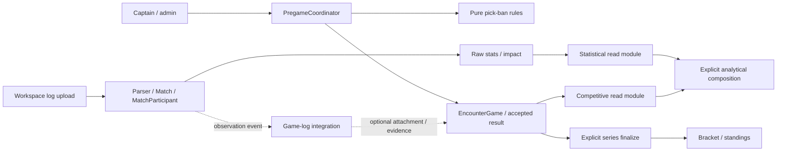
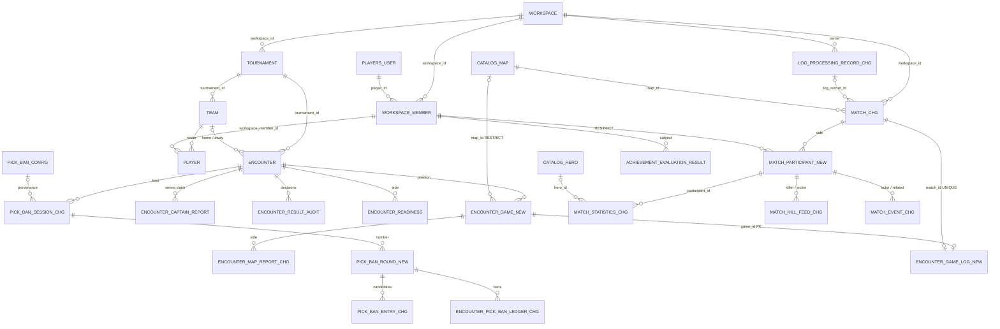

# Pick/ban, результаты серии и независимая статистика игр
**Status:** draft — revised 2026-09-22 after review against HEAD `8c8af02a` (v1.15.5)

## 1. Назначение и статус решений

Единая архитектурная спецификация по итогам review pick/ban и дополнительного запроса на отделение статистических моделей от турнирной логики. Документ описывает целевое состояние, не уже реализованную систему. Изменения поведения ниже предлагаются на утверждение вместе со спекой; код и БД этой работой не изменены.

**Цель:** турнир и scrim проходят одинаковый цикл выбора и подтверждения карт без обязательных статистических записей; лог можно сохранить и обработать без турнира, серии и турнирных команд; статистический факт не становится официальным результатом вследствие самого парсинга.

Документ объединяет и уточняет [generic pick/ban](2026-08-09-generic-pickban-engine.md) и [предварительное отделение статистики](2026-09-13-decouple-stats-from-tournament.md). После утверждения для этой задачи приоритет имеют решения ниже. Старые документы сохраняются как история, а не как параллельные требования.

Из предварительного плана НЕ переносится подход «остановиться после запрета parser-событий»: он не убирает обязательные FK на Encounter/Team. Также не переносится создание Match для scrim-отчёта без лога: такой результат принадлежит EncounterGame. Терминология действующей системы описана в [glossary](../glossary.md); новые термины ниже становятся evergreen-документацией только после реализации.

Параллельный документ [multi-discipline stats engine](2026-09-20-multi-discipline-stats-engine.md) того же дня описывает ту же границу с другой стороны: словарь дисциплин/ролей, реестр парсеров, транспортный namespace `rpc.stats.*`; в своём §11 он откладывает «`Match.encounter_id` nullable, субъект статистики = `workspace_member`» до фаз 2–3 старого плана. Разграничение владения после утверждения обоих: форма данных `matches.*`, `encounter_game`, `encounter_game_log`, authority результата карты и ACL статистики определяются здесь; словарь дисциплин, `catalog.*`, `player.role` и имена очередей — там. Его B1 («parser перестаёт писать состояние серии») и §8.3 здесь — одно изменение; кто приземляется первым, на того ссылается второй. Совместимость: `Match`/`participant` не получают `discipline_id` — дисциплина unattached-записи разрешается его же резолвером через `workspace.default_discipline_id`; HTTP-пути и схемы этого документа не зависят от того, называется очередь `rpc.parser.*` или `rpc.stats.*`. «Нет stats-микросервиса» ниже означает отсутствие новой БД и нового артефакта с собственным хранилищем, а не запрет второго процесса того же пакета.

С первой редакции чистые правила veto уже переехали в `shared/domain/pick_ban_engine.py` (ed74a93e), а pregame-комната получила общий [RoomChat](2026-09-21-shared-room-chat.md); §2, §11 и §12 учитывают оба факта.

## 2. Основания: что обнаружено в текущей системе

| Факт | Источник | Следствие |
| --- | --- | --- |
| Match одновременно хранит log_parser и captain_report | [match.py](../../backend/shared/models/matches/match.py), Match | Учёт результата и существование статистики смешаны |
| Найденный Match выставляет already_played независимо от учёта победы в Encounter | [map_report.py](../../backend/tournament-service/src/services/encounter/map_report.py), submit_map_report | Лог до отчётов может оставить счёт серии 0:0 после сыгранной карты |
| Победитель для следующего hero-раунда читается из Match | [pick_ban_session.py](../../backend/tournament-service/src/services/encounter/pick_ban_session.py), map_round_winner / sync_hero_rounds | Scrim без Match теряет result-dependent rotation |
| Parser выбирает Match через encounter_id + map_id без позиции | [encounter/service.py](../../backend/parser-service/src/services/encounter/service.py), get_match_by_encounter_and_map; [flows.py](../../backend/parser-service/src/services/match_logs/flows.py), MatchLogFlow.start | Повторное прохождение карты может переписать первое |
| Следующий раунд читает изменяемый PickBanConfig | pick_ban_session.py, advance_to_next_round | Настройки запущенной серии не изолированы |
| GET создаёт сессии, разрешает timeout/decider и синхронизирует hero-раунды | [pick_ban_action.py](../../backend/tournament-service/src/services/encounter/pick_ban_action.py), get_pick_ban_state / get_pick_ban_pool | Polling является частью автомата, а не только доставкой состояния |
| Ручной act не проверяет истечение дедлайна до применения действия | pick_ban_action.py, perform_pick_ban_action | Просроченное действие принимается, если timeout ещё не обработал читатель |
| Match, statistics, kill_feed и event имеют прямые FK на tournament.* | [match.py](../../backend/shared/models/matches/match.py) | Один nullable encounter_id не отделит статистику от удаления Team |
| Ingestion требует tournament_id; ключ объекта вычисляется из tournament_id и filename | [log_processing.py](../../backend/shared/models/ingestion/log_processing.py), [binary.py](../../backend/parser-service/src/services/match_logs/binary.py) | Без турнирного контекста нельзя даже устойчиво адресовать лог |
| Parser публикует standings-invalidated и повторный encounter-completed | flows.py, _enqueue_match_log_tournament_events | События статистики выдаются за события турнирного результата; это не доказательство прямой записи parser в поля счёта |
| Raw ML features проходят через Encounter, Tournament и Player | [extractors.py](../../backend/analytics-service/src/services/ml/features/extractors.py), extract_match_features | Отсутствие турнирного ростера отбрасывает реально сыгравшего участника |
| Frontend самостоятельно соединяет Match, pool и claims | [PregameRoom.tsx](../../frontend/src/app/%28site%29/tournaments/%5Bslug%5D/pregame/%5BencounterId%5D/_components/PregameRoom.tsx), [pick-ban-model.ts](../../frontend/src/components/pick-ban/pick-ban-model.ts) | Фазы и источник результата определяются повторно на клиенте |
| `Encounter.has_logs` — `column_property` EXISTS над matches.match по `encounter_id` и `source=log_parser` | match.py, `Encounter.has_logs`; читатели: tournament `encounter/service.py` (`_apply_encounter_filters`, сортировка `get_all_encounters`, `get_overview_data`), app-service `dashboard/service.py`, `dashboard/readiness.py`, `user/queries/encounters.py`; схема `EncounterRead` в tournament/parser/app | Удаление `encounter_id` и `source` из Match ломает выражение; признак «есть лог» нуждается в новом источнике |
| Истечение хода разрешается только внутри `get_pick_ban_pool`; других вызовов `auto_resolve_timeout` нет | pick_ban_action.py, get_pick_ban_pool | Без читателя ход не истекает; APScheduler-воркер в tournament-service уже есть ([serve.py](../../backend/tournament-service/serve.py), `start_worker`) — нужен только новый job |
| `WorkspaceMember.player_id → players.user` ON DELETE CASCADE; есть `UNIQUE(id, workspace_id)` | [workspace.py](../../backend/shared/models/tenancy/workspace.py), WorkspaceMember | Составной FK участника реализуем без новой родительской уникальности; удаление игрового профиля потянуло бы участия — правило удаления `participant` обязано быть явным |
| user_merge перевешивает `user_id` в statistics/kill_feed/event списком колонок | [user_merge.py](../../backend/app-service/src/services/admin/user_merge.py), module-level список | После cutover перевешивается `participant.workspace_member_id`, с обработкой коллизии UNIQUE |
| Achievements имеют grain `user_encounter` рядом с `user_match` | [achievement_validation.py](../../backend/parser-service/src/domain/achievement_validation.py), GRAIN_ARITY | Серийный grain — competitive, ключ по Encounter; статистическое отделение его не меняет |
| Чистые правила уже в `shared/domain/pick_ban_engine.py` (5 импортёров) | commit ed74a93e | Повторный перенос не нужен |
| Pregame-комната рендерит `RoomChat`; доступ — `encounter/chat_access.py` | PregameRoom.tsx | Чат — отдельный контракт, не часть pregame read-model |

### Проверенные сценарии review

В предыдущем review выполнены четыре существующих набора: test_pregame_loop.py, test_pick_ban_action.py, test_pick_ban_session.py, test_pick_ban_undo.py — **125 passed**. Дополнительные вызовы реальных сервисных функций с существующим in-memory AsyncSession-стендом показали:

- Лог 1:2 до согласования капитанов: resolved=true, series_score=0:0, следующий map-раунд уже открыт.
- RESULT_LOSER_CHOICE после поражения home: обычный турнир ожидает выбор home; scrim открывает hero-раунд без выбора.
- Изменение конфига после старта заменяет пул второго раунда [21,22,23] на [901,902,903].
- Ручной бан принимается через минуту после старта при turn_timer_seconds=1, если перед ним не вызывали state-read.

Для расширения спеки отдельно исполнена интроспекция текущего SQLAlchemy MetaData: в четырёх таблицах matches найдено **8 прямых FK на tournament.*, все ON DELETE CASCADE**: 3 в match, 1 в statistics, 2 в kill_feed, 2 в event. У log_processing.record также есть CASCADE на tournament. Это сведения модели, не инспекция production-БД; миграционные preflight-проверки обязаны проверить реальную схему.

PostgreSQL race-тесты, полный parser upload и browser UI в review не выполнялись. Их нельзя считать уже пройденными критериями ниже.

## 3. Решения и границы задачи

| Решение | Выбрано | Почему не альтернатива |
| --- | --- | --- |
| Владелец результата отдельной карты | EncounterGame в tournament | Match остаётся измерением из лога, а не универсальным контейнером |
| Общий pick/ban | Чистое ядро + PregameCoordinator в tournament-service | Перенос методов в helper без смены владельцев оставляет проблему |
| Статистический субъект | MatchParticipant → WorkspaceMember | Tournament.Player — участие в турнире, а не факт присутствия в конкретном логе |
| Стороны статистической игры | home/away внутри записи лога | FK на tournament.team снова делает независимый parser зависимым от турнира |
| Связь статистики с серией | Явная необязательная EncounterGameLog | Не nullable encounter_id плюс сохранённые обязательные Team FK |
| Источник официального счёта | Согласованные капитаны либо явное решение admin | Parser не получает полномочия менять результат загрузкой файла |
| Хранение/процессы | Текущие Postgres, MetaData, сервисы, outbox | Нет новой БД, брокера или stats/veto-микросервиса |
| Уровень аналитики | Raw map facts отдельно; competitive projections отдельно | Не превращаем series-shaped OpenSkill в map-shaped алгоритм |
| Способ внедрения | Additive подготовка + единый cutover всех писателей и читателей | Нельзя держать два владельца официального результата или постоянные legacy fallbacks |

### Включено

Полный путь map/hero veto, готовность, opener choice, timeout, undo/reset, map reports, scrim parity; отделение Match и всех его raw fact-таблиц от Encounter/Team; workspace-scoped ingestion и участники; явная привязка лога; статистические/турнирные read-модули; ACL и публичные агрегаты; миграция исторических данных и всех затронутых потребителей.

### Не включено

Новый standalone lobby-продукт или переписывание provisioning scrim-контейнеров; объединение с draft игроков; новый язык workflow/DAG; event sourcing; новые формулы рейтингов, retraining как скрытая часть рефакторинга; автоматическое признание всех логов официальными; самостоятельная публичная публикация unattached-логов; новые scrim ladders; изменение политики удаления аккаунта/игрового профиля.

Безтурнирный путь записи и обработки статистики входит в задачу. Новый интерфейс создания mix/scrim-комнат ради него не требуется: используются существующая административная загрузка и соответствующий workspace-scoped контракт.

## 4. Доменная модель и направление зависимостей

| Термин | Единственное значение в новой модели |
| --- | --- |
| Encounter | Соревновательная серия/встреча двух сторон, её официальный результат и место в сетке |
| EncounterGame | Конкретная игра на позиции серии; может существовать до выбора карты и до появления лога |
| Map | Элемент каталога; один map_id может встречаться у нескольких EncounterGame |
| PickBanSession | Экземпляр правил выбора одного kind для серии, включая snapshot |
| PickBanRound | Один исполняемый блок выбора; flat map veto имеет один блок на весь порядок карт, slot map и hero — блок на позицию |
| Match | Одна запись реально сыгранной карты, полученная из лога; её счёт — наблюдение, не турнирное решение |
| MatchParticipant | Факт участия WorkspaceMember на стороне конкретного Match |
| EncounterGameLog | Привязка записи Match к EncounterGame с ориентацией сторон |
| Tournament.Player | Турнирный ростер и его role/rank/substitution-контекст; не статистическая личность |
| Competitive projection | Расчёт над турнирными результатами/ростерами: standings, OpenSkill replay, турнирная performance/shift-оценка |

Rules:

1. tournament domain/pregame result logic не импортирует MatchStatistics/MatchKillFeed/MatchEvent и не выводит результат из Match.
2. Statistical parsing, raw storage и pure impact не импортируют Encounter/Team/Player/Stage/Standing и не создают их.
3. Связывание, публичная видимость и competitive enrichment — именованные integration/read-модули. Там JOIN допустим: отделение не означает запрет полезных SQL JOIN в одной БД.
4. Analytics может потреблять оба read-контракта, но raw extraction не требует successful JOIN с турнирным ростером.
5. Shared ORM остаётся в shared/models; следуем [пяти слоям backend](../../backend/ARCHITECTURE.md). Не создаём таблицы в сервисных src/models.

### 4.1. Карта таблиц

Три контура и один мост. Ребро — FK child → parent; суффикс `_NEW`/`_CHG` — новая/изменённая таблица, остальное без изменений схемы.

### 4.2. Три контура и мост

**Соревновательный контур** (`tournament.*`): Tournament → Stage → Encounter → EncounterGame. Team и Player — ростер; Encounter ссылается на две Team (home/away, nullable до жеребьёвки). Официальный результат карты — `encounter_game.accepted_*`; счёт серии до финализации — материализованное число побед по `confirmed` играм в `encounter.home_score/away_score`; официальный итог серии — `encounter.result_status/confirmed_at` плюс `encounter_result_audit`. Ни одна таблица контура не ссылается на `matches.*`.

**Veto-контур** (`tournament.pick_ban_*`, `encounter_readiness`): одна PickBanSession на (Encounter, kind) среди не-cancelled; внутри — PickBanRound по номеру; внутри раунда — PickBanEntry-кандидаты; ledger банов — на session/round. Связь с играми — по номеру, не по FK: slot map round N и hero round N обслуживают `encounter_game.position = N`; flat map veto — один round, порождающий несколько игр по порядку picks/decider. Игра создаётся координатором как результат раунда, а не раунд — как свойство игры.

**Статистический контур** (`log_processing.*`, `matches.*`): Workspace владеет записью лога и Match; Match → MatchParticipant (сторона + WorkspaceMember) → facts. Ни одна таблица контура не ссылается на `tournament.*`; сторона факта — `participant.side` в ориентации ЛОГА.

**Мост**: единственная таблица `encounter_game_log` (game_id PK, match_id UNIQUE, orientation). Nullable контекст в `achievement_evaluation_result` (tournament_id/encounter_id/match_id) и competitive FK в `analytics.*` — проекции над обоими контурами, не raw facts, и мостом не считаются.

### 4.3. Связи, кардинальности и правила удаления

| Связь (child → parent) | Кардинальность / уникальность | ON DELETE | Почему |
| --- | --- | --- | --- |
| encounter_game.encounter_id → encounter | N:1; partial UNIQUE(encounter_id, position) WHERE state != cancelled | CASCADE | игра — часть серии; вместе с ней уходит attachment, но не Match |
| encounter_game.map_id → catalog map | N:1, nullable до выбора | RESTRICT | карту каталога нельзя удалить, оставив игру без идентичности |
| encounter_map_report.game_id → encounter_game | N:1; UNIQUE(game_id, side) — не более двух claims | CASCADE | claim без игры бессмыслен |
| encounter_map_report.reporter_user_id → players.user | N:1 nullable | SET NULL | provenance, не ключ результата (как сейчас) |
| pick_ban_session.encounter_id → encounter | N:1; partial UNIQUE(encounter_id, kind) WHERE status != cancelled | CASCADE | сессия живёт с серией |
| pick_ban_session.config_id → pick_ban_config | N:1 nullable | SET NULL | исполняется snapshot, config — происхождение |
| pick_ban_round.session_id → pick_ban_session | N:1; partial UNIQUE(session_id, number) WHERE state != cancelled; ≤1 waiting_opener/active | CASCADE | раунд — блок сессии |
| pick_ban_entry.round_id → pick_ban_round | N:1; UNIQUE(round_id, item_id); partial UNIQUE(round_id, action_index) | CASCADE | кандидат принадлежит раунду |
| encounter_pick_ban_ledger.session_id / round_id | N:1; UNIQUE(session_id, item_id, banned_by_side) | CASCADE | память банов — свойство сессии; отменённая сессия не влияет на новую |
| encounter_readiness.encounter_id → encounter | N:1; UNIQUE(encounter_id, side) | CASCADE | без изменений |
| encounter_game_log.game_id → encounter_game | 1:0..1 (PK) | CASCADE | удаление игры/серии/турнира снимает только привязку |
| encounter_game_log.match_id → match | 1:0..1 (UNIQUE) | CASCADE | удаление Match снимает привязку; accepted score игры не пересчитывается |
| match.workspace_id → workspace | N:1; UNIQUE(id, workspace_id) как parent key | CASCADE | workspace — граница владения, как сегодня у tournament |
| match.map_id → catalog map | N:1 | RESTRICT (сейчас CASCADE) | удаление карты каталога не должно стирать статистику |
| match.log_record_id → log_processing.record | N:1 nullable | SET NULL | очистка истории обработки не удаляет Match (как сейчас) |
| match.created_by_auth_user_id → auth user | N:1 nullable | SET NULL | доступ к unattached записи; NULL = admin-only |
| match_participant.match_id → match | N:1; UNIQUE(match_id, workspace_member_id, side); UNIQUE(match_id, id) | CASCADE | участие — часть записи |
| match_participant.workspace_member_id → workspace_member | N:1 | RESTRICT | §5.5: удаление/merge профиля перевешивает участия явно |
| match_participant (match_id, workspace_id) → match (id, workspace_id) | составной | — | один workspace у записи и участника |
| match_participant (workspace_member_id, workspace_id) → workspace_member (id, workspace_id) | составной; parent key уже есть | — | участник из своего workspace |
| statistics (match_id, participant_id) → participant (match_id, id) | N:1 составной | CASCADE | участник чужого Match не подмешивается |
| kill_feed (match_id, killer_participant_id) и (match_id, victim_participant_id) → participant | N:1 составной ×2 | CASCADE | то же |
| event (match_id, participant_id) и (match_id, related_participant_id nullable) → participant | N:1 составной ×2 | CASCADE | то же |
| statistics/kill_feed/event.*hero_id → catalog hero | N:1 | как сейчас | каталог |
| log_processing.record.workspace_id → workspace | N:1 NOT NULL | CASCADE | владелец файла |
| log_processing.record.tournament_id → tournament | N:1 nullable | SET NULL (сейчас NOT NULL CASCADE) | import hint, не owner и не ACL |
| log_processing.record.requested_game_id → encounter_game | N:1 nullable | SET NULL | запрос привязки, не действующая связь |
| log_processing.record.uploader_id → players.user | N:1 nullable | SET NULL | без изменений |
| achievement_evaluation_result.{tournament_id, encounter_id, match_id} | nullable контекст | без изменений | проекция, не raw fact |
| analytics.* → tournament.* | competitive FK | без изменений | жизненный цикл проекции = турнир |

### 4.4. Путь данных через модели

Результат карты без лога:

1. Ready обеих сторон → snapshot → `pick_ban_session(map)` и `pick_ban_round(1)`.
2. Раунд завершён → координатор пишет `encounter_game(position, map_id, state=selected)`, открывает hero round этой позиции (если настроен), затем `awaiting_result`.
3. Claim капитана → `encounter_map_report(game_id, side)`; второй claim → reconcile → `encounter_game.accepted_*`, `result_source=captain_agreement`, `state=confirmed`, `result_version+1`; `encounter.pregame_version+1`; `encounter.home_score/away_score` пересчитываются как число побед по confirmed играм.
4. Confirmed outcome (home/away/draw) уходит в следующий Round как вход rotation; при `floor(best_of/2)+1` побед или исчерпании позиций — `series_complete`; официальный finalize — отдельная команда существующего пути.

Лог → статистика → (опционально) evidence:

1. Upload в workspace → `log_processing.record(workspace_id, object_key, content_hash, tournament_id hint, requested_game_id?)`.
2. Parser → `match(workspace_id, map_id, observed score, stats_revision)` + `participant` по фактически присутствовавшим + facts, одной транзакцией; outbox `match.parsed`.
3. Integration-шаг: при указанном `requested_game_id` или однозначной подсказке и наличии прав — `encounter_game_log(game_id, match_id, orientation)`; иначе Match остаётся unattached. Ошибка привязки не откатывает п. 2.
4. Наличие строки `encounter_game_log` — единственное, что делает Match видимым через турнир: `has_logs`, публичные страницы серии, competitive context, achievements scope=competitive, public aggregates.

Что джойнят read-модули, и только они: Game ⟷ Match через `encounter_game_log`; participant → workspace_member → players.user (публичный player_id); participant → tournament.player (roster context) по `workspace_member_id` и стороне после orientation; отсутствующий Player — отсутствующий контекст, не ошибка и не отбрасывание факта.

### 4.5. Текущие модели → целевые

| Сегодня | Целевое | Статус |
| --- | --- | --- |
| `matches.match.encounter_id`, `home_team_id`, `away_team_id` (FK tournament.*) | удалены; серия — через `encounter_game_log` | CHG |
| `matches.match.map_index` | удалён; позиция — `encounter_game.position` | CHG |
| `matches.match.source` (log_parser/captain_report) | удалён; captain-only строки мигрируют в `encounter_game` (§13B) | CHG |
| `matches.match.{map_id, home_score, away_score, time, log_name, code, log_record_id}` | сохраняются; score/стороны — ориентация лога | — |
| — | `matches.match.{workspace_id NOT NULL, stats_revision bigint, created_by_auth_user_id}`; `UNIQUE(id, workspace_id)` | NEW cols |
| `matches.statistics.{team_id, user_id}` | `participant_id` (составной FK); индексы `ix_match_statistics_user_*` перестраиваются по `participant_id`; player-history — через `participant(workspace_member_id, match_id)` | CHG |
| `matches.kill_feed.{killer_id, killer_team_id, victim_id, victim_team_id}` | `killer_participant_id`, `victim_participant_id` | CHG |
| `matches.event.{team_id, user_id, related_team_id, related_user_id}` | `participant_id`, `related_participant_id` | CHG |
| — | `matches.participant` | NEW |
| `matches.stat_baselines` | без изменений | — |
| `mv_hero_global_stats` | пересоздаётся с public-inclusion predicate (attached, non-scrim, разрешённый турнир) | CHG |
| `Encounter.has_logs` = EXISTS(match by encounter_id, source=log_parser) | EXISTS(`encounter_game_log` ⋈ `encounter_game` by encounter_id) | CHG |
| `Encounter.matches` relationship | удаляется; join — в integration read-модуле | DEL |
| `Encounter.home_score/away_score` | до finalize — число побед по confirmed games; после — официальный итог (как сейчас) | семантика |
| `Encounter.current_map_index` | без изменений: ручной admin-маркер live, не проекция Game | — |
| — | `Encounter.pregame_version bigint` | NEW col |
| `tournament.encounter_map_report(encounter_id, map_id, map_index, team_id)` | `(game_id, side)`, UNIQUE(game_id, side); `reporter_user_id` и scores сохраняются | CHG |
| `tournament.encounter_captain_report` (серия целиком) | без изменений | — |
| `tournament.encounter_result_audit` | без изменений таблицы; payload коррекций несёт game_id/result_version | — |
| `pick_ban_session.{first_side, awaiting_choice, pending_loser_side, undo_requested_by, undo_target_index, current_step_started_at, resolved_sequence_json}` | переезжают в `pick_ban_round` как `opener_side, state=waiting_opener, pending_chooser_side, undo_*, deadline_at, resolved_sequence_json` | CHG |
| — | `pick_ban_session.{rules_snapshot_json, snapshot_schema_version, initial_first_side}`; UNIQUE(encounter_id, kind) → partial по status | NEW cols |
| `pick_ban_entry.round` (int), `team_id`, status `PLAYED` | `round_id` FK; `team_id` удалён; `PLAYED` удалён — сыграна Game | CHG |
| `encounter_pick_ban_ledger(encounter_id, kind, …)` | `(session_id, round_id, …)` | CHG |
| `encounter_readiness` | без изменений | — |
| — | `tournament.encounter_game`, `tournament.encounter_game_log`, `tournament.pick_ban_round` | NEW |
| `log_processing.record.tournament_id NOT NULL`, `attached_encounter_id`, ключ = tournament_id+filename | `workspace_id NOT NULL`, `tournament_id` nullable hint, `requested_game_id`, `object_key`, partial UNIQUE(workspace_id, content_hash) | CHG |
| `WorkspaceMember` | без изменений; статистический субъект | — |
| `tournament.player` (role/rank/substitution, `workspace_member_id`) | без изменений; roster context для competitive read-модуля | — |
| `achievements.achievement_evaluation_result` | без изменений | — |
| таблица `analytics.match_quality` / код `AnalyticsMatchQuality` | таблица без изменений; код/контракт → EncounterQuality | код |

## 5. Целевые данные и инварианты

Ниже — логическая схема для миграций. Идентификаторы используют принятый в проекте тип соответствующего родителя, а новые счётчики версий — bigint. Не менять все PK проекта ради этой задачи. Времена — timestamptz; score/count/index — целые с CHECK неотрицательности/положительности; state/kind — существующие enum либо ограниченный enum нового домена, не произвольные строки.

### 5.1. tournament.encounter_game — новая таблица

Поля: id, encounter_id, position, map_id nullable до выбора, state, accepted_home_score nullable, accepted_away_score nullable, result_source nullable, result_version, confirmed_at nullable. state: planned / selected / awaiting_result / disputed / confirmed / cancelled.

- FK encounter_id → Encounter; map_id → каталог. Нельзя удалить используемую карту каталога, оставив выбранную игру без идентичности: новый FK RESTRICT, а не автоматическая потеря результата.
- position >= 1; partial UNIQUE(encounter_id, position) WHERE state != cancelled.
- cancelled сохраняет историческую игру после reset. Новая попытка получает новый game_id, даже на той же позиции; старое событие/отчёт не может примениться к новой попытке.
- confirmed требует оба accepted score, result_source и confirmed_at; ничья — confirmed со сравнимыми равными score, НЕ отсутствие результата.
- result_source: captain_agreement / admin / admin_log. Match score никогда не является неявным значением этого поля.
- Изменения принятого результата пишут before/after, actor, reason, game_id и result_version в существующий аудит. Это журнал решений, не источник replay всего приложения.
- Game не хранит статистическую duration, log filename, kill-feed, measured impact или поля roster rank.

### 5.2. EncounterMapReport и серия

EncounterMapReport переводится на game_id + side(home/away), UNIQUE(game_id, side); reporter — auth-идентичность, отдельно от статистического участника. score >= 0. map_id/позиция берутся из Game, а не используются для выбора строки. Старые ссылки encounter_id/map_id/map_index/team_id как ключ результата удаляются после миграции; подтверждение стороны делает coordinator по текущей авторизованной паре команд.

Encounter получает pregame_version. Любая видимая мутация комнаты, claims, принятого результата, привязки evidence и готовности увеличивает её один раз на транзакцию.

Счёт до официальной финализации — число побед по confirmed и не cancelled Game; это вычисление маленькой серии, не инкремент «если Match отсутствует». Число завершённых карт считается отдельно от суммы побед, поскольку ничья тоже завершает позицию. Поля Encounter.home_score/away_score до финализации остаются материализацией этого текущего счёта.

Официальная финализация остаётся отдельным действием существующего result/finalize-пути. При полном наборе Game итог капитанов сверяется с ними. Технический/admin/Challonge результат может отличаться, но требует явного источника и аудита; не создавать вымышленные Game ради совпадения суммы. После официального override read-model отдельно возвращает live_game_score и official_series_score; parser и новый map-report не перезаписывают confirmed официальный итог. Для изменения используется reopen/correction.

### 5.3. PickBanSession, PickBanRound, PickBanEntry

Сохраняются существующие Config и Entry; вводится явный Round, потому что его завершение не равно завершению всей сессии, а cursor нельзя получать из количества не-AVAILABLE кандидатов.

PickBanSession: id, encounter_id, kind, config_id nullable только provenance, rules_snapshot_json, snapshot_schema_version, исходные seeds/initial_first_side, status(active/completed/cancelled). Partial UNIQUE(encounter_id, kind) для status != cancelled. FK на Encounter остаётся интеграционной привязкой текущего продукта; pure rules его не видят. config_id SET NULL не меняет исполнение.

PickBanRound: id, session_id, number >= 1, resolved_sequence_json, step_index, opener_side nullable до выбора, state(waiting_opener/active/completed/cancelled), pending_chooser_side nullable, deadline_at nullable, undo_requested_by/undo_action_index/undo_requested_version nullable (открытая заявка на undo: все три либо NULL, либо заполнены; заменяют текущие Session.undo_requested_by/undo_target_index). Partial UNIQUE(session_id, number) для state != cancelled; не более одного waiting_opener/active round на session. step_index в пределах sequence, pending chooser обязателен только для waiting_opener.

PickBanEntry получает round_id; содержит item_id, стабильный display_order, status(available/banned/picked/protected), picked_by/protected_by и action_index внутри Round. UNIQUE(round_id,item_id), partial UNIQUE(round_id,action_index) для action_index IS NOT NULL. PLAYED у Entry больше нет: сыграна Game, не кандидат veto. Существующий team_id (FK Team SET NULL) удаляется: сторона выражается picked_by/protected_by, команда стороны читается из Encounter. Не удалять AVAILABLE-кандидатов закрытого раунда ради вычисления следующего — курсор и номер теперь явные.

Существующий ledger переводится с encounter_id/kind на session_id и ссылается на раунд. Его уникальность сохраняет запрет повторного бана стороной. No-repeat — правило набора раундов одной сессии; отменённая сессия не влияет на новую. При undo удаляется только соответствующая активная запись ledger. Защита не попадает в ban ledger.

Каждое действие и его происхождение (captain/admin/timeout/decider), отмена, reset и выбор opener записываются существующим аудитом с session_id, round_id и версией комнаты. Новую event-sourcing или отдельную универсальную action-платформу не вводить.

### 5.4. matches.match — только статистическая запись

Сохранить таблицу matches.match и ID существующих parsed-строк: массовое обновление дочерних ссылок ради имени не нужно. После cutover ни один captain_report не создаёт Match.

Сохраняются: id, map_id, home_score/away_score как наблюдаемые score в ориентации ЛОГА, time как измеренная duration, log provenance. Добавляются обязательный workspace_id, stats_revision, created_by_auth_user_id nullable для доступа к отвязанной записи. Удаляются обязательные encounter_id, map_index и home_team_id/away_team_id. source=log_parser/captain_report удаляется после переноса captain-only строк: тип Match сам означает статистическую запись.

- Match может быть сохранён без Encounter, Team, Stage и Tournament.
- Успешная запись новой версии Match, его facts и события match.parsed атомарна; readers не видят наполовину заменённую статистику.
- stats_revision увеличивается при успешном reparse. Ошибка новой обработки оставляет последнюю успешную версию доступной и помечает ошибку в ingestion, а не уничтожает рабочий набор.
- Личность записи при reparse — log_record_id/существующий match_id, не пара encounter+map и не filename.
- Очистка processing history не удаляет Match. Существующую семантику log_record_id SET NULL можно сохранить: metadata provenance/hash/object_key должны оставаться достаточными для объяснения источника. Новые успешные записи обязательно имеют заполненное происхождение до commit.

### 5.5. matches.participant — новая таблица; удаление raw-FK на Team

Поля: id, match_id (FK match ON DELETE CASCADE), workspace_id, workspace_member_id (FK workspace_member ON DELETE RESTRICT), side(home/away). UNIQUE(match_id, workspace_member_id, side); UNIQUE(match_id, id) как parent key для составных FK фактов. Один человек на обеих сторонах, если это действительно зафиксировано логом, — две записи участия, а не потеря части фактов. RESTRICT намеренно: `players.user` каскадирует в `workspace_member`, поэтому удаление или merge игрового профиля обязан сначала явно перевесить участия — как сегодня user_merge перевешивает `user_id` в трёх таблицах фактов, только теперь в одной таблице; коллизия UNIQUE при слиянии двух участников одного Match и стороны — конфликт для оператора, не тихий DELETE.

WorkspaceMember уже является workspace-scoped игровым субъектом; не вводить вторую сущность игрока. Публичный player/user ID получается через WorkspaceMember.player_id, а не из auth.user и не из tournament.player. Создание записи участия не выдаёт человеку RBAC-права участника workspace.

DB обеспечивает совпадение workspace участника, Match и WorkspaceMember составными FK: `(match_id, workspace_id) → match(id, workspace_id)` (новый UNIQUE на match) и `(workspace_member_id, workspace_id) → workspace_member(id, workspace_id)` (существующий `uq_workspace_member_id_workspace`). Повтор workspace_id на небольшой таблице участников оправдан этим инвариантом; на миллионы stat-строк его не копировать.

Что такое `participant_id` в факте — на примере. Сегодня `statistics(match_id=100, user_id=42, team_id=7, …)`; станет `statistics(match_id=100, participant_id=5001, …)`, где `participant(id=5001, match_id=100, workspace_id=3, workspace_member_id=88, side=home)` и `workspace_member(id=88, workspace_id=3, player_id=42)`. Строка participant — факт участия одного человека в одном Match на одной стороне: не человек и не игрок workspace. `user_id` факта выводится через `participant → workspace_member.player_id`; `team_id` заменяется `participant.side` плюс, только при наличии `encounter_game_log`, `orientation` и `encounter.home_team_id/away_team_id`. Промежуточная строка нужна, потому что сторона хранится один раз, а не на каждом факте; составной FK доказывает, что человек действительно был в этом Match; правка идентичности (неоднозначный BattleTag, merge профилей) — одна строка, а не N фактов. Запрос «вся статистика игрока 42» идёт через `participant(workspace_member_id, match_id)` по всем его workspace_member, затем факты по `(match_id, participant_id)`.

| Таблица | Целевые ссылки вместо турнирной команды и глобального user в факте |
| --- | --- |
| MatchStatistics | match_id + participant_id; hero_id, round/name/value сохраняются |
| MatchKillFeed | match_id + killer_participant_id + victim_participant_id; heroes/time/fight/damage сохраняются |
| MatchEvent | match_id + participant_id + related_participant_id nullable; event/hero/time сохраняются |

Составной FK (match_id, participant_id) → participant(match_id,id), аналогично killer/victim/related, запрещает подмешать участника другого Match. Сторона и игровая личность берутся из participant. Дочерние facts каскадно удаляются при явном удалении Match; удаление tournament.team больше не затрагивает их.

Индексы сохраняют реально используемые match/stat/hero селекции; player-history получает индекс participant(workspace_member_id,match_id), факты — соответствующие составные индексы по match_id/participant_id/name/round. Не добавлять отдельные индексы на каждый low-cardinality столбец и не восстанавливать удалённый physical PK statistics автоматически: нынешнее отличие ORM PK от БД зафиксировано в statdrop01.

### 5.6. tournament.encounter_game_log — единственная привязка

Поля: game_id PK/FK, match_id UNIQUE/FK, orientation(home_to_home/home_to_away), attached_by_auth_user_id, attached_at. Один основной лог на активную Game, одна Game на запись Match. Reparse обновляет тот же Match; другой файл заменяет привязку только явной административной командой, старый Match сохраняется.

- Workspace и map_id обеих сторон должны совпадать; проверяются под блокировкой родителя Game. Нельзя привязать запись к cancelled Game.
- orientation преобразует score и стороны статистики в стороны серии, не переписывает raw факты.
- Проверка принадлежности roster — основание подсказки, не право автоматически выбрать Encounter/Game. Повторы одной карты и одинаковые команды в нескольких встречах требуют game_id.
- Удаление Game/Encounter/турнира удаляет только attachment. Match, participants, raw facts и объект лога остаются.
- Удаление Match убирает attachment, но сохраняет принятое турнирное решение и его аудит. Принятый score не пересчитывается из исчезнувшего evidence.
- Core Game не получает ORM-relationship, автоматически загружающий Match. Join принадлежит integration/read-модулю.

## 6. Правила управления серией и veto

### 6.1. Snapshot и старт

Готовность общая для обеих сторон и видов veto. Команда ready второй стороны в одной транзакции проверяет live bracket, участников, config cascade, строит snapshot и запускает допустимую первую фазу. При отсутствии map veto можно открыть hero-фазу без selected map; это существующий freeplay-сценарий, карту затем выбирают явно до report.

Snapshot включает best_of, допустимость ничьей серии, map/hero mode, полный пул каждого будущего раунда, attributes для ограничений, sequences, no-repeat, protect, rotation, таймер, исходные seeds и reserves. Его JSON валидируется типизированной схемой при записи и загрузке. Изменение catalog role или удаление config не меняет текущие ограничения.

Config cascade и negative bracket rounds сохраняются. Edit конфига применяется к новым сессиям; изменение best_of/участников запущенной серии требует reset с указанными последствиями. Во время snapshot-подготовки нельзя частично стартовать map и затем обнаружить невалидный hero config.

### 6.2. Фазы

| Состояние | Разрешённый переход |
| --- | --- |
| waiting_ready | Оба готовы → первая доступная фаза |
| map_veto | Завершён map round → Game.selected → hero round этой позиции либо awaiting_result |
| hero_veto | Завершены bans/protects → Game.awaiting_result |
| awaiting_opener | Только названная проигравшая сторона или admin выбирает opener; после выбора стартует таймер |
| awaiting_result | Первый claim ожидает второго; disagreement → disputed; agreement → confirmed |
| disputed | Исправленные согласованные claims либо явное решение admin |
| series_complete | Дальнейшие rounds не открываются; официальный series report/finalize остаётся отдельным |
| blocked | Явно назван неустранимый ходом конфигурационный конфликт; admin исправляет через допустимый reset |

phase — проекция backend, а не отдельная независимо обновляемая колонка. Session.completed означает конец всей её работы в серии; Round.completed означает завершение одного блока. Ожидание результата не превращается в ложное завершение сессии.

Flat map veto выбирает весь порядок один раз; Game создаются по порядку picks/decider. Hero N+1 ждёт одновременно выбора карты N+1 и confirmed результата N, даже если flat veto заранее выбрал все карты. Slot map N+1 также ждёт confirmed результата N. В freeplay существует отдельный Game на каждую позицию; map выбирается для game_id, не угадывается по последнему совпавшему map_id.

### 6.3. Результаты, ничьи и источники

- Один claim не меняет счёт; два несовпавших claim не меняют счёт; два совпавших принимают score ровно один раз.
- Лог — evidence. Он может предзаполнить форму, но без действия капитанов/admin не подтверждает Game и не открывает следующий раунд.
- Совпавшие claims имеют полномочия принять результат даже при отличающемся логе: ответ содержит evidence_conflict=true, UI показывает оба score, admin получает уведомление. Конфликт с evidence никогда не замалчивается и не переписывает уже принятый score.
- Поздний лог или reparse не отменяет решения и не переставляет следующий opener. Admin может явно принять нормализованный score из конкретной stats_revision; источник admin_log и исходное наблюдение сохраняются в аудите.
- Одинаковые непротиворечивые сведения дают одинаковый результат независимо от порядка загрузки лога и claims. Выбор между конфликтующими источниками всегда явный, не last-write-wins.
- Победитель следующего раунда передаётся как confirmed outcome(home/away/draw). pending/unknown не представляется тем же None, что draw. Для confirmed draw result-dependent rotation использует исходную фиксированную сторону snapshot; у ничьей нет проигравшего, выбора loser_choice не требуется.
- Серия заканчивается при достижении floor(best_of/2)+1 побед либо при подтверждении best_of позиций. Сумма побед не заменяет число сыгранных позиций. Bo2 1:1 завершается; ничьи карт не создают лишние позиции автоматически.
- Reserve сохраняется и отображается как информация из существующих правил. Эта задача не вводит новую автоматическую схему переигровок на reserve. Если после исчерпания позиций elimination-серия ничейная, официальный finalize остаётся запрещён до явного административного решения по регламенту; выбор reserve не маскируется случайной картой.

### 6.4. Валидация и доступные действия

Используется один predicate допустимости кандидата для команды, timeout и read-model. Он учитывает kind, Round, step, side, protection, no-repeat и attribute uniqueness. Backend возвращает eligible_entry_ids и причины запрета. Frontend не воспроизводит authority-проверки.

До старта валидируются IDs каталога, дубли, совместимость mode/preset, количество выбираемых карт с best_of, числа шагов/кандидатов, доступность атрибутов и исходные последовательности. Перед каждым будущим раундом повторно проверяется исполнимость после no-repeat. Нельзя молча выдавать случайного decider, если регламент ожидал ровно одного выжившего. Валидный timeout выбирает CSPRNG только среди разрешённых кандидатов. Если разрешённых нет — blocked с причиной, а не бесконечный пустой poll.

### 6.5. Undo, corrections и reset

Undo требует согласия двух капитанов на конкретный round_id/action_index/version. Новый ход аннулирует прежнее согласие. Автоматический decider отменяется вместе с породившим его ручным действием. Если уже началась зависимая hero-фаза или карта подтверждена, обычный map undo запрещён.

До подтверждения Game капитаны могут изменять свои claims. После подтверждения обычная отправка claim возвращает 409 result_locked; изменение принятого результата идёт отдельной admin correction-командой с причиной. Это намеренная смена прежнего неоднозначного поведения «повторный report исправляет последнюю подходящую карту».

Correction:

1. Если изменился только счёт внутри карты, но не winner/draw, следующий opener не меняется; пересчитать проекции и аудит.
2. Если outcome изменился, а в зависимом хвосте нет ручных решений/подтверждённых игр, отменить автоматически открытый хвост и построить его заново по исправленному результату.
3. Если зависимый хвост уже использован, обычная correction возвращает 409 downstream_started. Admin должен явно выбрать correction with cascade; команда перечисляет затрагиваемые позиции и требует ожидаемую pregame_version.
4. Cascade отменяет зависимые Game и раунды с сохранением истории, снимает их attachments, создаёт новые game_id/round_id. Raw Match не удаляется. Если серия уже продвинула сетку, применяется существующий турнирный reopen/cascade audit, не статистический delete.

Reset current round разрешён лишь без сыгранной Game и неотменённых зависимых решений; полный series reset требует admin, причины и явного согласия с отменой хвоста. Map reset не оставляет действующие hero-bans для отменённой карты. Смена команд снимает readiness и отменяет artifacts прежней пары даже при счёте 0:0 после ничьей; проверка не опирается на ненулевой score.

## 7. Транзакции, время и версии

- Одна точка мутации — PregameCoordinator; service/repository ниже него только flush. Никакого commit внутри get state, apply action, ensure round или decider.
- Lock order для всех captain/admin/worker/attachment/correction путей: Encounter FOR UPDATE → Game по id → PickBanSession в фиксированном порядке kind → PickBanRound/entries. После lock перечитать изменяемое состояние с populate_existing.
- Любая команда комнаты содержит expected_version; veto-команда дополнительно session_id и round_id. Несовпадение версии/старый ID → 409 с code stale_state, без повторного применения на «текущий похожий ход». Это защита и от старого клиента после reset.
- Под блокировкой сначала проверяется deadline. При now >= deadline текущий ход принадлежит timeout-пути; ручная команда не получает дополнительное время. Если timeout изменил комнату, его commit сохраняется, а ответ ручной команде — 409 turn_expired с новой версией. Не бросать исключение так, чтобы общий envelope откатил уже выполненный timeout.
- Новый дедлайн считается от фактического начала нового хода; waiting_ready/result/opener не расходует turn timer. Undo начинает новый таймер восстановленного хода.
- Worker tournament-service — новый interval-job в существующем APScheduler (`serve.py`, `start_worker`) — периодически выбирает просроченные активные раунды; несколько worker безопасны за счёт того же root-lock и повторной проверки. Выборка due IDs не берёт Round lock раньше Encounter. Не выполнять RPC/S3/ML под этими блокировками.
- Последний ban, автоматический decider, запись выбранной Game и открытие разрешённой следующей фазы фиксируются одной транзакцией и одной версией комнаты. GET только читает.
- Retry после потерянного ответа refetch-ит состояние. expected_version не обещает повторить исходный успешный HTTP-ответ; он обещает отсутствие второго применения. Отдельную универсальную таблицу request-id не вводить.

## 8. Независимый ingestion и статистические события

### 8.1. Владение файлом и дедуп

LogProcessingRecord получает обязательный workspace_id и сохранённый object_key. tournament_id перестаёт быть ключом хранения/дедупа; при необходимости это nullable import hint с SET NULL, не источник ACL и не owner. attached_encounter_id заменяется явной target_game_id-привязкой команды, принятой tournament integration после успешного parse; на record может храниться nullable requested_game_id только как неполучивший подтверждения запрос, не как действующая связь.

Новые объекты адресуются `logs/workspaces/{workspace_id}/{sha256}`; filename остаётся отображаемым исходным именем. Существующие ключи `logs/{tournament_id}/{filename}` сохраняются в object_key без массового S3 move. Все downloads/reparse читают сохранённый ключ; никакого fallback восстановления пути из удалённого турнира.

Для новых записей дедуп — workspace_id + hash байтов, не filename. Одинаковые байты в разных workspace — разные записи и отдельные права. UNIQUE(workspace_id,content_hash) вводится после разрешения исторических дублей; для старых записей без доступных байтов hash остаётся NULL, новые uploads обязаны вычислить его. Изменившиеся байты с тем же filename — новая запись, не overwrite чужого доказательства. Повторная загрузка не меняет исходного владельца и не даёт uploader-доступ к существовавшей записи человеку без её read-права.

### 8.2. Parsing без турнирной команды

Parser разрешает личности из лога существующим механизмом игрового профиля и WorkspaceMember; виртуальный профиль не становится login account. Не связывать человека с auth-аккаунтом по одному BattleTag. Если личность неоднозначна, сохранить исходный лог и явную проблему resolution для admin; не отбрасывать факты и не угадывать игрока.

Стороны формируются из лога, participants создаются из фактически присутствовавших игроков, включая substitutions. Отсутствие tournament roster не является ошибкой обработки. Старый эвристический подбор Team допускается только как подсказка для attachment; он не должен удалять S3-объект или останавливать сохранение unattached Match.

На успешном parse/reparse parser пишет Match + participants + facts + существующий outbox. Привязка к Game — последующий idempotent integration-шаг; её ошибка не откатывает успешно извлечённую статистику и не превращает запись в failed parse.

### 8.3. События и владельцы

| Событие | Владелец/содержание | Что запрещено |
| --- | --- | --- |
| match.parsed | parser; event_id, workspace_id, match_id, stats_revision; при reparse тот же match_id и новая revision | Публиковать encounter.completed или запуск standings как факт парсинга |
| match.deleted | Владелец статистической mutation; идентификаторы удалённой версии и workspace | Обнулять официальный результат серии |
| game.log_attached / detached | tournament integration; game_id, match_id, ориентация и версия | Автоматически подтверждать результат |
| game.result_confirmed / corrected | tournament; game_id, result_version, принятый outcome | Заставлять parser переписывать raw score |
| encounter.completed | Только существующий tournament finalize | Повторно выдавать completion вследствие reparse |

Межпроцессная доставка — существующий transactional outbox, at-least-once. Статистические consumers учитывают stats_revision, stale события игнорируются; для чтения mutable Match сверяют текущую revision и обрабатывают её один раз, а не присваивают содержимое новой версии старому номеру. Atomic replacement и revision ограждают задержанный reparse. Binding/cancelled game проверяется заново при обработке target_game_id.

Pick/ban внутри одного процесса не ждёт брокера для обычного перехода между фазами. Realtime остаётся сигналом refetch, не вторым источником состояния; событие комнаты несёт pregame_version. Parser-инвалидации статистики и аналитических features сохраняются, а standings/completion side effects убираются из _enqueue_match_log_tournament_events.

## 9. Отделение статистических вычислений от competitive projections

### 9.1. Два read-контракта, а не универсальная таблица аналитики

**Statistical facts:** `MatchFacts(workspace_id, match_id, stats_revision, map_id, observed_score, duration, participants, measurements)`; participant содержит workspace_member_id, public player_id и side. В нём нет обязательных tournament_id, team_id, tournament_player_id, rank или standings position. Raw features считают фактически присутствовавших участников и не фильтруют их по Player.is_substitution.

**Competitive context:** `CompetitiveContext(game_id, encounter_id, tournament_id, team_by_side, roster_context, official_result, stage_context)` — отсутствует для unattached Match. Его строит read-модуль интеграции, а не каждый stat leaf собственным JOIN. Roster context разрешается по workspace_member и стороне; отсутствующий/неоднозначный Player остаётся отсутствующим, не отбрасывает raw measurement и не подменяется игроком с той же командой.

Composition-модуль для турнирного ML явно соединяет эти данные. Нехватка rank/role/pre-encounter strength маркируется; замены игроков входят в raw dataset, но участие в конкретной турнирной оценке следует существующему явно названному правилу когорты. Изменение этого правила — отдельное статистическое решение, не побочный эффект SQL rewrite.

### 9.2. Что переносится, что остаётся

| Модель/вычисление | Решение |
| --- | --- |
| MatchStatistics, kill-feed, match events, per-map impact/MVP | Независимые raw/derived facts MatchParticipant; нет обязательных FK на tournament |
| extract_match_features | Разделить raw extraction и competitive enrichment; standalone extraction работает без турнира |
| AnalyticsPerformance | Оставить per-player-per-tournament prediction: её percentile/кохорта определены турниром и role, это НЕ raw per-map impact |
| AnalyticsPlayer / AnalyticsShift | Оставить турнирную оценку участия; WorkspaceMember доступен через явно потребляемый roster context |
| AnalyticsPlayerAnomaly / AnalyticsAnomalyFeedback | Оставить турнирный продукт и существующий grain; не превращать feedback в свойства игрока вне контекста |
| AnalyticsStandingsDistribution | Оставить tournament/team, распределение мест не существует без соревнования |
| AnalyticsMatchQuality | Семантически качество Encounter; переименовать код/контракт в EncounterQuality при cutover, без второй сущности «качество Match» |
| OpenSkill replay | Сохранить вход Encounter+rosters+official score и формулу; get_matches_for_tournaments переименовать в get_encounters_for_tournaments у всех callers |
| MLModelArtifact / analytics jobs | Остаются версиями моделей и турнирными заданиями; не переносятся в raw storage |
| Achievement grain `user_encounter` | Оставить competitive: ключ (user, tournament, encounter), не зависит от Match/Game; statistical read-контракт его не обслуживает |

Наличие слова analytics в схеме не делает таблицу кандидатом на отвязку. FK competitive projection → Tournament/Player допустим и продолжает отражать её жизненный цикл. Не добавлять в эти таблицы параллельные nullable match_id только для видимости универсальности.

Pure impact уже отделён в [domain/match_logs/impact.py](../../backend/parser-service/src/domain/match_logs/impact.py); сохранить алгоритм. Изменяется его participant input/persistence, а не формула. Raw measurement не должен требовать AnalyticsPerformance.

### 9.3. Achievements и публичные агрегаты

Statistical leaves (stat_threshold, kill_feed, match_event, MVP и аналогичные) читают statistical read-контракт. Bracket/standing/registration/draft leaves остаются competitive. Смешанные правила получают competitive context явно; у unattached Match такой контекст отсутствует, а не выдумывается из последнего турнира игрока.

AchievementEvaluationResult уже хранит workspace_member_id и nullable tournament_id/encounter_id/match_id; вторую таблицу результатов не создавать. Внутренний user_match key сохраняет три позиции `(player_id, tournament_id_or_0, match_id)`, где 0 означает отсутствие контекста и при записи нормализуется в SQL NULL существующим differ. GRAIN_ARITY сохраняется; нельзя смешивать 0/NULL в dedup и создавать две награды одной записи. Statistical read-модуль не обязан читать Tournament ради этого ключа: context передаёт orchestration; отсутствие выражается 0. При attach/detach reconciler заменяет старые context-key результаты, а не дописывает дубликат. Grant/revoke precedence и workspace-member identity сохраняются.

Правила и публичные статистические выборки получают явный match scope вместо неявного «нет Player — нет статистики». Для существующих achievement rules scope=competitive сохраняет прежний продукт: только привязанные non-scrim игры разрешённых турниров. Workspace-scoped statistical rule может быть явно включён admin с учётом непубличности evidence; он не публикует приватные результаты на публичном профиле. UI редактора правила и read effective achievements должны поддержать этот контракт, если scope отличается от competitive; включение не является скрытым default.

Unattached/scrim facts не попадают автоматически в global hero records, public player comparisons, ratings training или турнирную когорту. Все aggregates, включая mv_hero_global_stats и Redis caches, используют один public-inclusion predicate. Attach/detach, изменение видимости и удаление инициируют их обновление; устаревшие публичные aggregates после privacy-reducing изменения нельзя продолжать отдавать до перестроения. Это обязательный publication gate, а не только cache TTL.

Feature/cache schema version увеличивается при смене identity/grain. Старые обученные artifacts не кормить несовместимыми столбцами молча. Для неизменённой competitive cohort требуется parity; если доступность substitutes реально меняет вход, dataset/version фиксируются и проверяются отдельно. Эта задача не обязует менять веса или заново обучать модель ради переименования полей.

## 10. Доступ, удаление и владение

1. Все Match/ingestion/participant reads ограничены собственным workspace_id. FK на WorkspaceMember не является RBAC-членством. Существующие hidden tournament/scrim gates сохраняются при attached read.
2. Unattached Match по умолчанию доступен uploader и workspace admin; trusted bot без персонального владельца — workspace admin. Не публиковать его анонимно и не выдавать всему workspace только из-за исчезновения attachment. created_by_auth_user_id сохраняется на Match независимо от processing-history cleanup; legacy неизвестный actor означает admin-only.
3. Attached Match доступен через существующую видимость owning tournament/scrim. Допуск к записи не разрешает прикреплять её к чужой серии: attachment требует права управления результатом целевой Game и read-права на source Match. Cross-workspace attachment всегда запрещён.
4. Для raw download проверка прав выполняется до S3 GET/sign; object_key никогда не задаётся клиентом и не служит авторизацией.
5. Удаление Encounter/Team/Tournament не удаляет статистику. Исчезновение attachment закрывает public tournament route и переводит read к безопасному unattached правилу; ранее скрытые данные не становятся публичными. Generic admin delete путей и cascade hooks недостаточно проверить только один.
6. Явное удаление статистического Match — отдельная административная операция с аудитом: удаляет его facts/derived results, снимает attachment, инвалидирует aggregates; не меняет accepted Game score, advancement или standings. Сохранение/удаление raw объекта и processing record указывается отдельно, чтобы «удалить статистику» не означало недокументированный S3 purge.
7. Удаление/отвязка login account по существующей identity-политике не удаляет игровой профиль и историю. Эта спека не меняет DSAR/удаление самой игровой личности; соответствующие current cascades проверяются отдельно от турнирной развязки.
8. Declared source tournament в upload — подсказка, не способ обойти host/workspace permission. Discord channel mapping остаётся входным routing context; удаление турнира не должно уничтожать уже сохранённые записи.

## 11. API и frontend

Остаётся gateway → typed RPC → service. Все новые/изменённые операции отражаются в service schemas/OpenAPI manifest и regenerated gateway contracts, не только в frontend service.

### Комната

`GET /api/v1/encounters/{encounter_id}/pregame` — одна согласованная read-модель, без блокировки FOR UPDATE и без записи. Читать её в одном read-only consistent snapshot, чтобы версия, Game и обе kind-сессии относились к одному состоянию. Существующие generic per-kind state GET заменяются этим endpoint у всех потребителей, затем удаляются, без двух интерпретаций фаз.

Обязательные группы ответа: encounter_id, version, readiness, viewer capabilities, phase, blockers; games с game_id/position/map/state/accepted_score/result_version/log evidence summary; map/hero sessions и rounds; current action/eligible_entry_ids/deadline_at; live_game_score, official_series_score, series_decided, result_status. Каталожные имена/изображения можно по-прежнему получать кешируемым каталогом; authority не зависит от frontend catalog.

Существующие `/pick-ban/{kind}/act`, `/elect-opener`, `/undo` сохраняют смысл маршрутов, но требуют expected_version, session_id и round_id. Готовность и admin reset/correction также получают expected_version; idempotent ready уже готовой стороны не создаёт новой версии. Ответ успешной мутации — новая согласованная room state, а не только изменённый Entry.

`POST /api/v1/encounters/{encounter_id}/games/{game_id}/report` заменяет `/map-pool/{map_id}/report`. Тело: expected_version, home_score, away_score. Freeplay map selection — отдельная команда на game_id с map_id; correction и attachment имеют отдельные admin-команды с reason. side берётся из авторизованного actor, не из captain payload. Admin override использует те же rules, но явную acting_side и аудит.

Ошибки: 404 для отсутствующего/невидимого ресурса; 403 для запрещённой команды видимого ресурса; 409 stale_state/turn_expired/result_locked/downstream_started; 422 для невалидного config/score/catalog mapping. Ожидание второго капитана, opener или результата — нормальное состояние 200, не transport error.

Frontend удаляет собственные phase/seriesDecided/winner calculations и сопоставление Match по map_id/index. Timeline/history отображает Game и Round. Для статистики ссылка Match отдельно и только при её наличии. `source=captain_report` больше не нужен для выбора типа карточки: Game result card и parsed Match card — разные контракты. Публичный `/matches/{id}` остаётся страницей лог-статистики с сохранёнными parsed IDs.

Room подписывается на один encounter-scoped pregame changed сигнал с version вместо взаимного refetch двух kind-state и Encounter. ACL тот же encounter scope; старые map-veto/hero topic producers и subscribers мигрируют совместно. Клиент после reconnect refetch-ит state; polling может быть fallback доставки, но не условием исполнения таймера.

RoomChat комнаты ([shared room chat](2026-09-21-shared-room-chat.md), `encounter/chat_access.py`) — отдельный контракт: pregame read-model и pregame changed сигнал его не включают, сообщения чата не увеличивают pregame_version. Общее у них — encounter scope ACL; смена пары команд, снимающая readiness и artifacts, историю чата не трогает.

### Статистика и загрузка

Административный workspace upload принимает файл и optional game_id; workspace задаёт авторизованный контекст. Legacy tournament-scoped upload clients, Discord и gateway binary adapters переводятся на эту команду, передавая context hint отдельно. Response различает ingestion status и attachment status, возвращает log_record_id и после успеха match_id. Успешно распарсенный unattached лог не объявляется failed из-за невозможности подобрать игру.

Match read возвращает workspace_id, parsed score, duration, participants и optional competitive context. Обязательные home_team/away_team/encounter объекты заменяются raw sides и nullable attachment context; ложные Team-сущности не синтезируются. Match list/profile/compare/kill-feed/admin detail/download consumers переводятся одновременно с типами.

## 12. Карта реализации

Пути ниже — существующие точки изменения; новые модули названы отдельно. До правки exported symbols использовать LSP references; текстовый список не заменяет окончательный blast-radius проход.

| Вертикаль | Основные файлы/модули |
| --- | --- |
| Game/result/round storage | Новые shared/models/tournament/encounter_game.py и pick_ban_round в существующем pick_ban.py; существующие encounter.py, encounter_report.py, repository/pick_ban.py; новые repositories Game/attachment |
| Pure rules | Уже в shared/domain/pick_ban_engine.py (перенос выполнен, повторно не переименовывать); чистые sequence builders отделить от seed DB lookup в veto_session.py; предикаты допустимости и переходов Round добавляются туда же |
| Pregame coordinator | Новый tournament-service/src/services/encounter/pregame.py; переработка pick_ban_session.py, pick_ban_action.py, pick_ban_undo.py, map_report.py, captain.py |
| Official result hooks | shared/services/encounter/finalize.py, bracket/advancement.py, tournament admin encounter/stage, Challonge sync; все team/best_of/reset пути |
| Raw stats | shared/models/matches/match.py, новый shared/models/matches/participant.py; статистические repositories и bulk insert shapes |
| Ingestion/attachment | shared/models/ingestion/log_processing.py, parser services/match_logs/{uploads,binary,log_records,flows,admin_reads}.py; parser encounter matching; отдельный tournament game-log integration |
| Transport/events | tournament public_rpc.py / pick_ban_admin.py, parser upload/admin RPC, shared/schemas/events.py, service OpenAPI schemas/docs; gateway `internal/tournament/public_routes.go` (pick-ban `{kind}/state`, `/act`, `/elect-opener`, `/undo`, `map-pool/{map_id}/report`, map-pool WS) и `internal/tournament/admin_misc_routes.go` (`pick-ban-elect-opener`), binary/RPC/WS contracts; frontend `services/pickBan.service.ts`; Discord ingestion producers |
| Analytical reads | analytics services/ml/features/{extractors,aggregations,opponent_strength,shift_features,standings_features}.py; services/analytics/service.py; inference cache/dataset metadata |
| Achievements | parser achievement engine context/conditions/differ/runner, shared achievement_effective/repository conflict targets, rule schemas/editor, public achievement reads |
| Public/admin UI | pickBan.service.ts, PregameRoom, pick-ban-model, EncounterPregamePanel, modal/map-pool consumers, encounter.types, Match cards/pages, parsed match browser/sheet, log upload/download clients |
| Derived reads и consumers удалённых колонок | `Encounter.has_logs` column_property (match.py) → EXISTS над encounter_game_log ⋈ encounter_game; читатели: tournament encounter/service.py (`_apply_encounter_filters`, сортировка `get_all_encounters`, `get_overview_data`), app-service dashboard/service.py, dashboard/readiness.py, user/queries/encounters.py, `EncounterRead` в tournament/parser/app; app-service `user/_mappers.py sort_user_matches` (map_index → encounter_game.position через attachment), `map/service.py get_top_maps` и `user/queries/compare` (team-FK joins → participant.side + orientation); admin `user_merge.py` (перевешивание participant) |
| Protection/operations | shared visibility/invalidation, app stats/profile/hero queries + MV refresh, backend migrations, tests, import-linter contracts, glossary/ERD/architecture |

Кодовые переименования MatchQuality и get_matches_for_tournaments выполняются как clean cutover, не aliases/re-exports. SQL-таблицу competitive analytics.match_quality можно сохранить: имя physical table само по себе не смешивает write-authority; API/код должны явно называть grain Encounter.

## 13. Миграция и переключение

### Этап A — preflight, источники и страхование данных

- На restore production проверить реальные FK, enum storage labels, индексы, nullable-поля и отличие physical statistics PK от ORM. Metadata inventory не заменяет эту проверку.
- Получить отчёт по parsed/captain-only Match, missing map_index, повторным картам, противоречивым claims/Match/Encounter scores, orphan participants, workspace conflicts, duplicate hashes, missing blobs и незавершённым сессиям.
- Сохранить backup, проверенный restore и immutable manifest соответствий legacy Match/report/session/entry/record → новые IDs. Manifest включает counts/checksums и исключения; его можно использовать для объяснения истории, но не как runtime fallback.
- Исторический официальный Encounter score сохраняется как официальный, не переопределяется суммой восстановленных наблюдений. Если log score и принятый результат различаются, миграция сохраняет оба.

### Этап B — additive schema и backfill при старом единственном writer

Создать Game, Round, Participant, attachment и новые nullable-поля/индексы. Пока они не обслуживают команды, старый код остаётся единственным writer; не вводить двунаправленную синхронизацию.

Game восстанавливаются по явным map_index и последовательности подтверждённых selections/reports. Flat pick order и progressive round number нормализуются отдельно. Нельзя сопоставлять повторные карты по first() или присваивать всем legacy index=0 одну позицию. Неоднозначные строки блокируют перенос соответствующей серии до явного admin mapping, но не удаляются.

Captain-only Match превращается в принятый/исторический Game result и audit provenance; его ID фиксируется в migration manifest. Parsed Match сохраняет ID, факты и measured score, получает workspace/participants/attachment при однозначной связи. Если captain-only строка неожиданно имеет raw facts — это conflict, не кандидат на удаление.

Participants backfill строится по фактам match+user+team-side, затем связывается с WorkspaceMember. Включить участников, встречающихся только в kill_feed/event, а не только statistics. Не предполагать наличие Tournament.Player. Несопоставимая сторона/личность сохраняется в preflight conflicts; NOT NULL/новый reader не включается до разрешения.

Ingestion получает фактический object_key. Недостающий hash вычисляется из существующего объекта только если он доступен; не придумывать hash по filename. Дубликаты одного workspace проверяются на identity/attachment-конфликты; при consolidation обновляются все FK и manifest, а истории обработки архивируются без потери. Не соединять автоматически две статистические игры лишь из-за совпавшего имени файла.

Большие facts обновляются батчами с checkpoint по устойчивому ключу набора (match_id и внутри набора факт); не использовать отсутствующий physical PK statistics как гарантированный row cursor. Индексы на больших таблицах создавать CONCURRENTLY вне migration transaction; FK добавлять NOT VALID и отдельно VALIDATE до cutover. Измерить размер backfill/WAL на restore; существующие 27M в комментарии модели — историческая оценка, не текущий объём.

### Этап C — обязательное окно cutover всех writers

Выбран безопасный переход с остановкой изменяющих запросов, а не разработка dual-write платформы. Длительность определяется репетицией на restore, здесь не обещается нулевой downtime.

1. Закрыть новые pregame/ingestion/admin mutation-запросы; остановить timeout, parser/reparse и affected analytical workers, дождаться in-flight транзакций.
2. Довести backfill и проверить delta manifest, FK, counts, raw-fact checksums и принятую историю.
3. Активные legacy-сессии не мигрировать выдуманным snapshot из уже изменённого config. Для cutover они должны завершиться либо быть явно остановлены/reset пользователем с сохранённой историей. Без этого gate переключение запрещено. Completed история может иметь отметку legacy_rules_unknown и никогда не возобновляется как новая сессия.
4. Развернуть новые parser/tournament/app/analytics/Discord/gateway/frontend contracts совместно; несовместимые старые queue payloads предварительно drain-ить или явно отклонить с requeue исходного файла по новым IDs. Их нельзя интерпретировать эвристически.
5. Включить новые constraints и единственный новый read/write путь. Удалить старые captain Match writes, Match→Encounter/Team raw FK, per-kind state producers и obsolete endpoint/field fallbacks.
6. Включить event consumers и workers, затем mutation endpoints. Все smoke-сценарии этапа D выполняются до объявления миграции принятой.

### Этап D — проверка и восстановление производных данных

Перестроить participant-based indexes/aggregates, mv_hero_global_stats с public predicate, invalidate/version analytical caches и room/public types. Пересчитать только affected derived outputs и achievement slices; не пересчитывать официальные results из статистики и не запускать новый ML training по умолчанию.

Для parity сравнить raw stat counts/sums по match/user/hero/name/round, kill-feed/events counts и payload hashes, присоединённые игры и ориентацию, официальный score/standings/advancement. Сравнивать и null/отсутствие данных, не только happy-path totals.

Rollback до включения нового writer — возврат приложения на старую схему. После появления новых unattached Match/новых Game/исправлений старый код не способен представить данные: автоматический lossy downgrade запрещён. Использовать forward fix либо согласованный restore с replay сохранённых файлов/аудита; новые записи не выбрасывать ради rollback. Удаление legacy-колонок допускается только после проверенного manifest и backup, без периода, в котором они остаются вторым authority.

## 14. Проверки и критерии приёмки

| ID | Сценарий | Обязательный результат |
| --- | --- | --- |
| V01 | Одинаковые конфиги/результаты tournament и scrim | Одинаковые фазы, bans, opener; наличие Match не влияет |
| V02 | RESULT_LOSER_CHOICE после проигрыша и после ничьей | Выбирает проигравший; у ничьей snapshot fallback, не unknown |
| V03 | Flat veto заранее выбрал все карты | Hero N+1 не открывается до подтверждения N |
| V04 | Edit/delete config и изменение catalog role после старта | Работающий snapshot не меняется |
| V05 | Параллельные act/act, act/timeout, undo/act, reset/act | Единственный допустимый переход и версия; проигравший получает conflict |
| V06 | Серия без открытого браузера, наступил deadline | Worker разрешает ход; GET для этого не нужен |
| V07 | GET readiness/state после истёкшего дедлайна | Нет INSERT/UPDATE/DELETE/commit-переходов; read-only DB transaction проходит |
| V08 | Bo2 1:1, Bo3 2:0, карта-ничья, исчерпание позиций | Backend/UI одинаково завершают цикл; official finalize проверяет elimination draw |
| V09 | Undo последнего ban+decider и reset при hero-зависимости | Нет orphan hero bans/claims/evidence на отменённой Game |
| V10 | Смена пары после сыгранной ничьей 0:0 | Старые readiness и artifacts не переносятся новой паре |
| R01 | Лог до/после согласованных одинаковых claims | Одинаковый accepted/live score; победа учтена один раз |
| R02 | Лог противоречит claims либо reparse меняет score | Явный evidence conflict; без admin не меняется официальный результат/opener |
| R03 | Дважды одна карта в серии, два разных лога | Разные Game/Match IDs, статистика первого не переписана |
| R04 | Переставленные стороны лога | attachment orientation корректно нормализует score и participants |
| R05 | Correction outcome при нетронутом/сыгранном хвосте | Автоматический rebuild первого; conflict либо явный admin cascade второго |
| R06 | Technical/admin/Challonge итог без полного набора Game | Нет вымышленных карт; official/live score различаются явно |
| S01 | Upload только с workspace, без Tournament/Team/Encounter | Успешный Match, participants, raw facts и per-map impact |
| S02 | Substitution без Tournament.Player | Факты сохраняются; raw extraction не отбрасывает человека |
| S03 | Тот же файл повторно и те же filename с другими байтами | Первый идемпотентен, второй отдельный record; нет cross-workspace dedup/access |
| S04 | Ошибка reparse после ранее успешного parse | Старая статистика доступна целиком, новая не видна частично |
| S05 | Удаление Encounter/Team/Tournament | Raw Match/facts/blob сохраняются; detached не становится public |
| S06 | Удаление raw Match | Game result и advancement не меняются; статистические результаты инвалидированы |
| S07 | Stale match.parsed/attachment после reset/reparse | Не применяется к новой Game/не выдаёт старую revision за новую |
| A01 | OpenSkill на фиксированной старой competitive cohort | Выход не меняется; вход по-прежнему series/rosters |
| A02 | Statistical leaf без tournament context | Корректный user_match grain и dedup; разрешённый explicit workspace scope |
| A03 | Scrim/private Match появляется после устранения roster JOIN | Не попадает в существующие competitive awards/public aggregates/training |
| A04 | Attach/detach/visibility change с caches/MV | Ни raw evidence, ни устаревший aggregate не раскрывают закрытые данные |
| A05 | Hidden tournament и cross-workspace IDs на read/upload/attach/download | Существующий privacy gate; S3 fetch только после разрешения |
| M01 | Backfill ambiguous repeated maps, missing blobs и hashes | Нет угадывания/потери; конфликт отражён и блокирует соответствующий cutover |
| M02 | Production-size restore, batched migration, stale client/queue | Проверены constraints/checksums и согласованный deploy; старый контракт не мутирует новое состояние |

Тесты pure rules защищают поведение переходов, а не имена helper/точный текст ошибок. Интеграционные race/rollback/FK tests выполняются на PostgreSQL; существующий in-memory store не доказательство блокировок. Browser smoke проверяет actual room, admin corrections, upload и Match без tournament context. Не добавлять отдельные тесты простого копирования полей.

Существующие regression точки: [pregame loop](../../backend/tournament-service/tests/test_pregame_loop.py), [actions](../../backend/tournament-service/tests/test_pick_ban_action.py), [sessions](../../backend/tournament-service/tests/test_pick_ban_session.py), [undo](../../backend/tournament-service/tests/test_pick_ban_undo.py), [delete cascade](../../backend/shared/tests/test_encounter_match_delete_cascade.py), [scrim achievements](../../backend/parser-service/tests/test_scrim_achievement_isolation.py). Их assertion о старом CASCADE/неявном roster-фильтре меняется на новый наблюдаемый контракт; не удалять саму проверку сохранности/приватности.

Import-linter используется по существующей convention analytics/app; добавить точечные constraints для pure pick-ban и raw stats/impact/extraction против ORM/турнирных модулей, не запретить legitimate competitive composition. Проверку реальных raw-FK на tournament выполнять по migrated PostgreSQL schema, а не regex исходника.

## 15. Последовательность реализации и завершение

1. **Game/result authority:** новая identity игры и reports/corrections, общий live/official read-contract; прекращение captain-only Match writes. Результат этапа — V01/V02/R01/R05/R06 на Game без статистики. — ✅ implemented (branch `feat/pregame-game-authority`, alembic revision `encgame01`).
2. **Veto lifecycle:** Round/snapshot/coordinator, команды с версией, worker, read-only room и перевод всех UI/RPC consumers. Результат — V03–V10 end-to-end.
3. **Independent statistics:** MatchParticipant, raw schema, ingestion identity/provenance, optional binding/ACL, parser events. Результат — R03/R04/S01–S07 без фальшивых турниров/команд.
4. **Read/analytics integration:** raw vs competitive extraction, achievements scope, public/MV gates, API/type cutover; parity A01–A05.
5. **Миграция и совместный rollout:** этапы A–D, checks M01/M02, удаление obsolete writers/fields/imports, актуализация glossary, architecture, ERD и service docs.

Это порядок зависимостей разработки, а не разрешение деплоить промежуточные несовместимые writers. Каждая вертикаль должна иметь воспроизводимый smoke; общий production cutover выполняется только при готовности всех обязательных контрактов.

**Готово**, когда карта серии, статистическая запись и участие игрока имеют независимые однозначные identity; tournament/scrim veto не зависит от наличия Match; standalone статистика не требует Tournament/Team; все источники и readers используют выбранные authority/ACL; существующие competitive алгоритмы сохраняют смысл; исторические факты не теряются и больше не удаляются турнирным CASCADE. Компилирующийся scaffold либо nullable encounter_id при сохранённых Team FK этим определением не являются.
