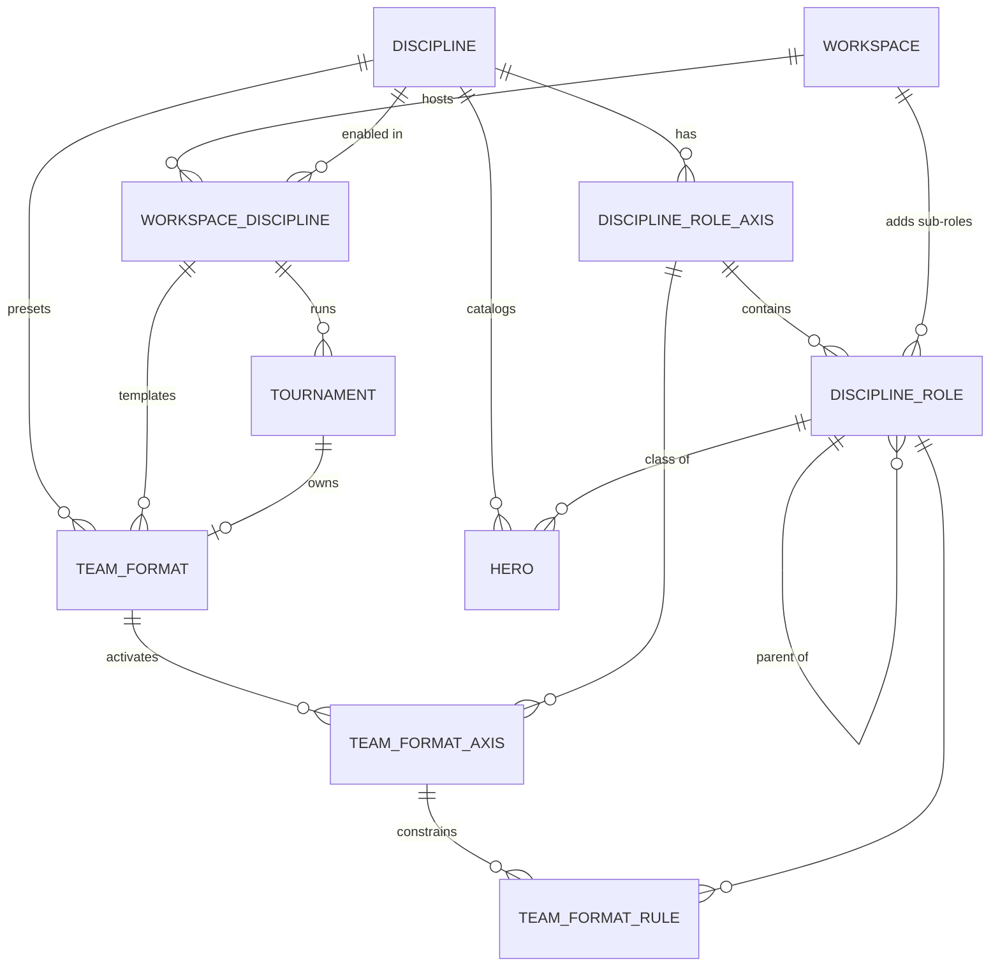

# Дисциплины: метаданные, дерево ролей, формат команды

**Status:** draft

Point-in-time intention. Факты о текущей системе — [`../business-logic-inventory.md`](../business-logic-inventory.md),
[`../database_erd.md`](../database_erd.md). Не читать как описание работающей системы.

Развивает [`2026-09-20-multi-discipline-stats-engine.md`](./2026-09-20-multi-discipline-stats-engine.md) и **заменяет в нём**:

- §4.3, таблицу `catalog.discipline_role`: плоский список заменяется осями и деревом (§4.3 здесь);
- §5 A1, ревизии `disc0001`/`disc0002`: `workspace.default_discipline_id` заменяется таблицей `public.workspace_discipline` (§4.4);
- A3, `RoleSet`: заменяется на `RoleTree` (§5.2);
- A4, место декларации и точку синка: декларация переезжает в `backend/shared/disciplines/`, синк запускается на старте app-service (§5.1, §5.5);
- A6, суперпользовательский CRUD ролей: платформенные роли становятся read-only, а воркспейс ведёт CRUD своих подролей (§6.5);
- из §11 в эту работу переходят два пункта: `discipline_id` на каталоге сущностей и ладдер по дисциплине (R6, R7).

Всё остальное в нём остаётся в силе:

- решение 1: сущность называется `discipline`, а не `game`;
- решение 2: источник правды — код, БД — синкаемая проекция;
- решения 3–4: `player.role` становится `varchar`, `HeroClass` сужается до класса героя OW;
- решение 7: схема `overwatch` переименовывается в `catalog`;
- фаза B целиком.

Основание — исследование ролевых систем соревновательных игр
(«Исследование ролевых систем игр», https://chatgpt.com/share/6aa7c9c3-5b74-83ed-bc0f-d1086c201e84) и его разбор
против кода (§1).

---

## 0. Область

**В этой работе:**

1. Метаданные дисциплины: аккаунт игрока, персонажи, карты, баны, логи, источник рангов, границы размера команды.
2. Дерево ролей: ось → роль → подроль. Подроли воркспейса — узлы того же дерева, а не отдельная таблица.
3. Формат команды турнира в виде таблиц: активные оси и правила `hard`/`recommended` по поддереву. Заменяет `roster_slots_json`.
4. Связь workspace ↔ дисциплина: какие игры ведёт workspace и его дефолты по каждой.
5. Балансер: веса по коду роли вместо полей `tank_*`/`damage_*`/`support_*`, правила подролей вместо штрафа за коллизии.
6. Каталог сущностей, ранги и идентичность игрока — по дисциплине.
7. Несколько осей одновременно (CS: оружие + функция + лидерство).

**Явно не сейчас** — §10.

---

## 1. Что берём из исследования

| Исследование | Здесь | Почему |
| --- | --- | --- |
| Игра → ось → иерархия ролей | берём; `game` называется `discipline` | Слово `game` занято `balancer.custom_game` (решение 1 плана 09-20) |
| Онтология игры отдельно от политики события | берём: `catalog.*` против `tournament.team_format*` | |
| Иерархия только внутри оси, оси независимы | берём, глубина ≤ 2 | Факты хранят пару `(role, sub_role)`: `tournament.player` (`team.py:82,84`), `balancer.registration_role` (`registration.py:392-393`). Потребителей глубже третьего уровня нет |
| `hard_min/max` + `recommended_min/max`, `NULL` = «нет правила» | берём дословно | |
| Правило считается по поддереву, `COUNT(DISTINCT member)` | берём; флаг `include_descendants` выкидываем | Случая «не считать детей» нет ни в одном примере |
| Closure table для подсчёта | выкидываем | В составе ≤ 12 человек (`roster_shape.py:61`), дерево дисциплины — десятки узлов; считается в Python на загруженном составе |
| 4 режима оси: OFF / INFORMATIONAL / PREFERENCE / ENFORCED | сжимаем до «нет строки» / `collect` / `use` | PREFERENCE и ENFORCED дублируют `hard`/`rec` в самих правилах |
| `selection_mode SINGLE/MULTI` + `player_min/max_assignments` | выкидываем; инвариант «один узел на ось на игрока» | Во всех примерах, включая CS, на одной оси у игрока одно значение; несколько ролей — это несколько осей |
| `player_role_preference` глобально на игрока | не берём; предпочтения остаются на регистрации | Сейчас это снимок на событие (`balancer.registration_role`), и это правильно: предпочтения меняются от события к событию |
| — (в исследовании нет) | **рейтинговая ось** | Балансер, драфт и ранги держатся на рейтинге по роли: `member_rank.role`, `registration_role.rank_value` |
| — (в исследовании нет) | **ось-классификатор персонажей** | `catalog.hero.type` — это класс героя; у OW он совпадает с ролью игрока (`enums.py:7-27`), у LoL/Valorant — нет |
| — (в исследовании нет) | **подроли воркспейса** | Организаторы уже заводят свои подроли: `tournament.player_sub_role` (`team.py:124-149`) |

---

## 2. Словарь

| Термин | Значение |
| --- | --- |
| **Дисциплина** | Игра-тайтл, `catalog.discipline`. В UI подписывается «Игра» |
| **Ось** (`role_axis`) | Независимое измерение роли внутри дисциплины. У OW одна ось: `role`. У CS: `rating`, `weapon`, `t_side`, `ct_side`, `leadership` |
| **Роль** | Узел верхнего уровня оси: `tank`, `awper`, `igl` |
| **Подроль** | Дочерний узел роли: `hitscan` под `damage`. Бывает платформенной (из кода) и воркспейса (из админки) |
| **Рейтинговая ось** | Та единственная ось дисциплины, по ролям которой хранятся ранги и работают слоты. Дисциплина без ролей (CS, Valorant) объявляет ось `rating` из одной роли `player` |
| **Ось-классификатор** | Ось, роли которой — классы персонажей (`catalog.hero.class_role_id`). У OW она совпадает с рейтинговой |
| **Формат команды** (`team_format`) | Политика события: сколько игроков в основе, какие оси учитываются и какие правила на них действуют. Пресет платформы, шаблон воркспейса или собственность турнира |
| **Режим оси** | `collect` — спрашивать и показывать; `use` — ещё и учитывать при сборке. Если строки оси в формате нет, ось выключена |
| **Правило** | `hard_min/hard_max/rec_min/rec_max` на узел дерева, считается по поддереву |
| **Форма состава** (`RosterShape`) | Слоты, в которые компилируется формат (`roster_shape.py:84-162`). Единственный вход решателя и драфта |
| **Флекс-слот** | Платформенный код `flex`: слот без роли. Не строка каталога (как в плане 09-20) |

Остальная терминология — из [`../glossary.md`](../glossary.md) дословно.

---

## 3. Принятые решения

| # | Решение | Обоснование |
| --- | --- | --- |
| 1 | Ровно одна рейтинговая ось на дисциплину. Дисциплина без ролей объявляет ось `rating` с одной ролью `player` | Решатель строит роли из ключей маски (`context.rs:6-40`), `member_rank.role` — `NOT NULL` (`member_rank.py:61`). Одна скрытая роль вместо ветки «без ролей» в регистрации, балансере, драфте и рангах. Ось с единственной ролью UI не показывает и назначает автоматически |
| 2 | Глубина дерева ≤ 2. Воркспейс добавляет только подроли; оси и роли верхнего уровня — только из кода | Сейчас так и есть (`player_sub_role` — подроли на workspace). Коды верхнего уровня — это ключи слотов, рангов и весов балансера |
| 3 | Внутри каталога и конфигурации ссылки идут FK по `id` (родитель, правило, класс героя). В фактах ссылки идут по **коду** | Факты — снимки на событие; код неизменяем. Данные уже лежат кодами, и 19 JSON-колонок с кодами (`roledps01:73-93`) не переписываются. FK стоят там, где строки новые и редактируются админом |
| 4 | Код роли верхнего уровня уникален в дисциплине по всем осям. Код подроли уникален среди братьев в своём scope | Код в факте однозначно даёт ось. `flex` под `damage` и `flex` под `support` законны — это пример постановки, и так же устроена уникальность `player_sub_role` сейчас (`team.py:127-132`) |
| 5 | Формат хранится в таблицах, не в JSON | FK из правила на роль (подроль, на которую ссылается правило, удалить нельзя) + требование постановки |
| 6 | Верхний уровень рейтинговой оси компилируется в `RosterShape`. Разрешены только `hard n..n` и `hard n..∞`, остаток состава — `flex` | Rust-решатель и feasibility драфта работают со слотами: мощности строятся из маски. Диапазон на слотах — это другая задача, и ни одному примеру она не нужна |
| 7 | Подроли и нерейтинговые оси в балансере — штрафы. `rec` и `hard` получают разные веса. При сборке составов вручную или через регистрацию `hard` блокирует сохранение | Потолок: балансер может выдать состав с нарушенным `hard` по подроли, и нарушение попадёт в статистику результата. Переход на жёсткое ограничение — когда такой состав реально понадобится запретить |
| 8 | Метаданные: в БД — только то, что читают SQL, FK или payload. Статичное без ссылок (ладдер, нормализатор хэндла) — код и сгенерированный артефакт | Ладдер уже живёт так: `ow_ladder.py` → `export_ow_ladder.py` → `ow-ladder.generated.json` с гейтом в CI |
| 9 | Декларация — `backend/shared/disciplines/<slug>.py`, синк — на старте app-service | Роли и форматы читают balancer-, tournament- и app-service. Стат-движок плана 09-20 держит только `StatSpec` и парсер. Каталог (`rpc.app.*`) принадлежит app-service |
| 10 | `public.workspace_discipline` вместо `workspace.default_discipline_id` | Какие игры ведёт workspace, плюс дефолты по каждой (формат, сетка дивизионов). Турнир ссылается на пару (workspace, discipline) составным FK, поэтому турнир в невключённой игре создать нельзя |
| 11 | Идентичность: `registration.battle_tag*` переименовывается в `account_handle*`, провайдер берётся из дисциплины | `players.social_account` уже провайдер-агностична (`provider` — строка). Переименование дешевле переноса в `registration_identity` и сохраняет уникальный индекс как есть |
| 12 | Миксы задают форму (`RosterShape`), а не формат | У микса нет регистрации, осей и правил подролей. Форма остаётся общей валютой: формат турнира компилируется в неё, микс задаёт её напрямую |

Решения 1, 3 и 4 — двери в одну сторону. Остальное обратимо.

---

## 4. Модель данных

Все таблицы с `id` — на `db.TimeStampIntegerMixin` (`id bigint PK`, `created_at`, `updated_at`). Таблицы с составным PK —
на `db.Base`, по образцу `balancer.custom_game_player_role` (`custom_game.py:109-125`). Имена констрейнтов пишутся руками
(`naming_convention` нет): `uq_<table>_<cols>`, `ix_`, `fk_`, `ck_`. Postgres 16 (`docker-compose.yml:6`), поэтому
`UNIQUE NULLS NOT DISTINCT` (прецедент — `pick_ban.py:120`) и `ON DELETE SET NULL (col)` доступны.

Каскад удаления workspace доходит до двух составных FK двумя путями:

- `team_format_rule → discipline_role` — через подроли workspace и через его форматы;
- `tournament → workspace_discipline` — через турниры и через связь workspace с игрой.

Оба FK объявлены `DEFERRABLE INITIALLY DEFERRED`: проверка идёт на `COMMIT`, когда каскад уже удалил обе стороны.
Недеферрируемого `NO ACTION` мало: на PG16 удаление workspace с таким FK падает на
`fk_team_format_rule_role` — проверено прогоном этого DDL (§8). Прецедент отложенных констрейнтов —
`registration_role_hero` (`registration.py:411-419`). Удаление подроли, на которую ссылается правило, по-прежнему
запрещено, но ошибка приходит на `COMMIT`. Поэтому сервис проверяет ссылки сам и возвращает понятный код до записи.

В DDL ниже `created_at`/`updated_at` не выписаны: их даёт `db.TimeStampIntegerMixin` (для таблиц с `id`) или они
добавляются явно (для таблиц с составным PK).

### 4.1 `catalog.discipline` — дисциплина и её метаданные

```sql
CREATE TABLE catalog.discipline (
  id                  bigserial PRIMARY KEY,
  created_at          timestamptz NOT NULL DEFAULT now(),
  updated_at          timestamptz NOT NULL DEFAULT now(),
  slug                varchar(32)  NOT NULL,
  name                varchar(64)  NOT NULL,
  short_name          varchar(16)  NOT NULL,
  icon_path           varchar(255) NOT NULL,
  tint                varchar(32),
  sort_order          smallint     NOT NULL DEFAULT 0,
  is_active           boolean      NOT NULL DEFAULT true,
  account_provider    varchar(32)  NOT NULL,
  character_noun      varchar(16),
  has_maps            boolean      NOT NULL DEFAULT false,
  has_character_bans  boolean      NOT NULL DEFAULT false,
  has_match_logs      boolean      NOT NULL DEFAULT false,
  rank_source         varchar(32),
  min_team_size       smallint     NOT NULL,
  max_team_size       smallint     NOT NULL,
  CONSTRAINT uq_discipline_slug UNIQUE (slug),
  CONSTRAINT ck_discipline_character_noun CHECK (character_noun IN ('hero', 'agent', 'champion', 'legend')),
  CONSTRAINT ck_discipline_bans_need_characters CHECK (NOT has_character_bans OR character_noun IS NOT NULL),
  CONSTRAINT ck_discipline_rank_source CHECK (rank_source IN ('overfast')),
  CONSTRAINT ck_discipline_team_size CHECK (1 <= min_team_size AND min_team_size <= max_team_size AND max_team_size <= 12)
);
```

| Колонка | Что значит | Кто читает сегодня (где зашит OW) |
| --- | --- | --- |
| `account_provider` | Какой `players.social_account.provider` идентифицирует игрока: `battlenet` / `steam` / `riot` | `ensure_player_identity` (`tournament-service/src/services/registration/service.py:368-510`, хардкод `battlenet`); `BattleTagField.tsx:14-56` (фильтр `provider === "battlenet"`) |
| `character_noun` | Как называются персонажи. `NULL` — у дисциплины нет каталога персонажей | Вкладки героев, поле «топ героев» в регистрации, pick-ban `kind=hero` |
| `has_maps` | Позиция серии несёт карту, есть пул карт и вето | `encounter_game.map_id` (`encounter_game.py:77`, уже nullable), конфиг вето, `useTournamentMapPool.ts:132-166` |
| `has_character_bans` | Разрешён pick-ban героев | Гейт в `pick_ban_session.py:402-465` |
| `has_match_logs` | Для дисциплины зарегистрирован парсер | Загрузка логов; реестр парсеров фазы B плана 09-20 (`parser_for` → 422) |
| `rank_source` | Внешний источник рангов. `NULL` — только ручные ранги | Поллер `RANK_FETCH_QUEUE`, схема `overwatch_rank` |
| `min_team_size` / `max_team_size` | Границы `team_format.starters` | Сейчас глобальные `MIN_TEAM_SIZE=1` / `MAX_TEAM_SIZE=12` (`roster_shape.py:58-61`) |

**Метаданные только в коде** (`DisciplineSpec`, §5.1): ладдер рангов (переезжает из `shared/domain/ow_ladder.py:79-92`),
дефолтные веса балансера по ролям и «якорная» роль (§6.2), нормализатор хэндла. Нормализатор привязан не к дисциплине, а к
провайдеру: `normalize_battle_tag` (`tournament-service/src/domain/registration/utils.py:82-103`) становится веткой
`battlenet` в `shared/identity/handles.py::normalize_handle(provider, raw)`.

**Рассмотрены и не заведены** — нет ни одного потребителя: платформы (`RankPlatform` — внутренность OverFast, остаётся в
`overwatch_rank`), регионы, ссылки на сайт игры, единица счёта серии (у всех дуэльных дисциплин это «выигранные карты»,
FFA считается по плану [`2026-09-24-ffa-encounters.md`](./2026-09-24-ffa-encounters.md)), флаг «баны героев после
выбора карты» (есть только у OW и живёт в коде `map_round_settled`).

### 4.2 Оси и дерево ролей

```sql
CREATE TABLE catalog.discipline_role_axis (
  id                     bigserial PRIMARY KEY,
  -- created_at, updated_at
  discipline_id          bigint      NOT NULL REFERENCES catalog.discipline (id) ON DELETE CASCADE,
  code                   varchar(32) NOT NULL,
  label                  varchar(64) NOT NULL,
  sort_order             smallint    NOT NULL DEFAULT 0,
  is_rated               boolean     NOT NULL DEFAULT false,
  classifies_characters  boolean     NOT NULL DEFAULT false,
  CONSTRAINT uq_discipline_role_axis_discipline_code UNIQUE (discipline_id, code),
  CONSTRAINT uq_discipline_role_axis_id_discipline   UNIQUE (id, discipline_id)
);
CREATE UNIQUE INDEX uq_discipline_role_axis_rated      ON catalog.discipline_role_axis (discipline_id) WHERE is_rated;
CREATE UNIQUE INDEX uq_discipline_role_axis_characters ON catalog.discipline_role_axis (discipline_id) WHERE classifies_characters;

CREATE TABLE catalog.discipline_role (
  id                     bigserial PRIMARY KEY,
  -- created_at, updated_at
  discipline_id          bigint       NOT NULL,
  axis_id                bigint       NOT NULL,
  parent_id              bigint,
  workspace_id           bigint       REFERENCES public.workspace (id) ON DELETE CASCADE,  -- NULL = платформа
  code                   varchar(128) NOT NULL,
  label                  varchar(128) NOT NULL,
  description            text,
  icon_path              varchar(255),
  tint                   varchar(32),
  sort_order             smallint     NOT NULL DEFAULT 0,
  is_active              boolean      NOT NULL DEFAULT true,
  CONSTRAINT fk_discipline_role_axis   FOREIGN KEY (axis_id, discipline_id)
      REFERENCES catalog.discipline_role_axis (id, discipline_id) ON DELETE CASCADE,
  CONSTRAINT fk_discipline_role_parent FOREIGN KEY (parent_id, axis_id)
      REFERENCES catalog.discipline_role (id, axis_id),                 -- родитель из той же оси
  CONSTRAINT uq_discipline_role_id_axis       UNIQUE (id, axis_id),
  CONSTRAINT uq_discipline_role_id_discipline UNIQUE (id, discipline_id),
  CONSTRAINT uq_discipline_role_sibling_code  UNIQUE NULLS NOT DISTINCT (axis_id, workspace_id, parent_id, code),
  CONSTRAINT ck_discipline_role_workspace_adds_children CHECK (workspace_id IS NULL OR parent_id IS NOT NULL),
  CONSTRAINT ck_discipline_role_top_not_flex CHECK (parent_id IS NOT NULL OR code <> 'flex')
);
CREATE UNIQUE INDEX uq_discipline_role_top_code ON catalog.discipline_role (discipline_id, code) WHERE parent_id IS NULL;
CREATE INDEX ix_discipline_role_parent_id      ON catalog.discipline_role (parent_id);
CREATE INDEX ix_discipline_role_workspace_id   ON catalog.discipline_role (workspace_id) WHERE workspace_id IS NOT NULL;
```

- **Обеспечивает БД:** родитель из той же оси; ось из той же дисциплины; воркспейс не создаёт роли верхнего уровня;
  коды верхнего уровня уникальны по всем осям дисциплины; `flex` не бывает кодом верхнего уровня.
- **Обеспечивает сервис** (`RoleTree.validate`, §5.2):
  - глубина ≤ 2;
  - код подроли воркспейса не совпадает с платформенным кодом-братом;
  - у дисциплины ровно одна рейтинговая ось (индекс гарантирует «не больше одной», декларация — «хотя бы одну»).
- `code varchar(128)`, потому что сейчас `player_sub_role.slug` — `String(128)` (`team.py:145`), и перенос не должен
  ничего обрезать. Коды верхнего уровня короче 32 символов, это проверяет декларация.
- Удаления из каталога нет: синк переводит пропавшие из кода роли в `is_active = false`. Правила ссылаются на роли без
  каскада.

### 4.3 `public.workspace_discipline` — какие игры ведёт workspace

```sql
CREATE TABLE public.workspace_discipline (
  workspace_id                      bigint   NOT NULL REFERENCES public.workspace (id) ON DELETE CASCADE,
  discipline_id                     bigint   NOT NULL REFERENCES catalog.discipline (id),
  is_default                        boolean  NOT NULL DEFAULT false,
  sort_order                        smallint NOT NULL DEFAULT 0,
  default_team_format_id            bigint,
  default_division_grid_version_id  bigint REFERENCES public.division_grid_version (id) ON DELETE SET NULL,
  -- created_at, updated_at
  PRIMARY KEY (workspace_id, discipline_id)
);
CREATE UNIQUE INDEX uq_workspace_discipline_default ON public.workspace_discipline (workspace_id) WHERE is_default;
-- добавляется после tournament.team_format (циклическая ссылка):
ALTER TABLE public.workspace_discipline ADD CONSTRAINT fk_workspace_discipline_default_team_format
  FOREIGN KEY (default_team_format_id, discipline_id) REFERENCES tournament.team_format (id, discipline_id)
  ON DELETE SET NULL (default_team_format_id);
```

- Заменяет три колонки `workspace`: `default_roster_slots_json` (`workspace.py:123-127`),
  `default_division_grid_version_id` (`workspace.py:107-111`) и так и не созданную `default_discipline_id` из плана 09-20.
- Что формат по умолчанию принадлежит этому же workspace, проверяет сервис.

### 4.4 Формат команды

```sql
CREATE TABLE tournament.team_format (
  id                     bigserial PRIMARY KEY,
  -- created_at, updated_at
  discipline_id          bigint       NOT NULL REFERENCES catalog.discipline (id),
  workspace_id           bigint,                 -- NULL = пресет платформы
  tournament_id          bigint,                 -- NOT NULL = собственность турнира
  preset_code            varchar(64),            -- только у пресетов
  label                  varchar(128) NOT NULL,
  starters               smallint     NOT NULL,
  is_default             boolean      NOT NULL DEFAULT false,  -- только у пресетов: дефолт дисциплины
  CONSTRAINT fk_team_format_workspace_discipline FOREIGN KEY (workspace_id, discipline_id)
      REFERENCES public.workspace_discipline (workspace_id, discipline_id) ON DELETE CASCADE,
  CONSTRAINT fk_team_format_tournament FOREIGN KEY (tournament_id, workspace_id, discipline_id)
      REFERENCES tournament.tournament (id, workspace_id, discipline_id) ON DELETE CASCADE,
  CONSTRAINT uq_team_format_tournament     UNIQUE (tournament_id),
  CONSTRAINT uq_team_format_id_discipline  UNIQUE (id, discipline_id),
  CONSTRAINT uq_team_format_preset         UNIQUE (discipline_id, preset_code),
  CONSTRAINT ck_team_format_owner CHECK (
      (workspace_id IS NULL AND tournament_id IS NULL AND preset_code IS NOT NULL)
   OR (workspace_id IS NOT NULL AND preset_code IS NULL AND NOT is_default)),
  CONSTRAINT ck_team_format_starters CHECK (starters BETWEEN 1 AND 12)
);
CREATE UNIQUE INDEX uq_team_format_default_preset ON tournament.team_format (discipline_id) WHERE is_default;

CREATE TABLE tournament.team_format_axis (
  team_format_id            bigint      NOT NULL,
  axis_id                   bigint      NOT NULL,
  discipline_id             bigint      NOT NULL,
  mode                      varchar(16) NOT NULL,
  sub_role_rec_max_default  smallint,   -- «рекомендовано не больше N» для подролей без явного правила
  PRIMARY KEY (team_format_id, axis_id),
  CONSTRAINT fk_team_format_axis_format FOREIGN KEY (team_format_id, discipline_id)
      REFERENCES tournament.team_format (id, discipline_id) ON DELETE CASCADE,
  CONSTRAINT fk_team_format_axis_axis   FOREIGN KEY (axis_id, discipline_id)
      REFERENCES catalog.discipline_role_axis (id, discipline_id),
  CONSTRAINT ck_team_format_axis_mode CHECK (mode IN ('collect', 'use')),
  CONSTRAINT ck_team_format_axis_sub_role_default CHECK (sub_role_rec_max_default >= 0)
);
CREATE INDEX ix_team_format_axis_axis_id ON tournament.team_format_axis (axis_id);

CREATE TABLE tournament.team_format_rule (
  team_format_id  bigint NOT NULL,
  axis_id         bigint NOT NULL,
  role_id         bigint NOT NULL,
  hard_min        smallint,
  hard_max        smallint,
  rec_min         smallint,
  rec_max         smallint,
  PRIMARY KEY (team_format_id, role_id),
  CONSTRAINT fk_team_format_rule_axis FOREIGN KEY (team_format_id, axis_id)
      REFERENCES tournament.team_format_axis (team_format_id, axis_id) ON DELETE CASCADE,  -- правило только на активной оси
  CONSTRAINT fk_team_format_rule_role FOREIGN KEY (role_id, axis_id)
      REFERENCES catalog.discipline_role (id, axis_id) DEFERRABLE INITIALLY DEFERRED,        -- роль из этой оси
  CONSTRAINT ck_team_format_rule_not_empty   CHECK (num_nonnulls(hard_min, hard_max, rec_min, rec_max) > 0),
  CONSTRAINT ck_team_format_rule_non_negative CHECK (LEAST(hard_min, hard_max, rec_min, rec_max) >= 0),
  CONSTRAINT ck_team_format_rule_hard_order  CHECK (hard_min <= hard_max),
  CONSTRAINT ck_team_format_rule_rec_order   CHECK (rec_min <= rec_max),
  CONSTRAINT ck_team_format_rule_rec_in_hard CHECK (hard_min <= rec_min AND rec_max <= hard_max)
);
CREATE INDEX ix_team_format_rule_role_id ON tournament.team_format_rule (role_id);
```

- CHECK с `NULL`-операндом даёт `NULL`, то есть проходит. Поэтому `hard_min <= hard_max` сравнивает только заданные
  границы, отдельные `IS NULL OR` не нужны.
- `tournament.tournament` получает `UNIQUE (id, workspace_id, discipline_id)` под составной FK.
- Число запасных в формат **не входит**: оно уже живёт на форме регистрации (`max_substitutes`, `registration.py:82`,
  миграция `regteam0002`). Второй дом тому же факту не заводим.
- Разрешение формата: турнир (`team_format.tournament_id = T`) → `workspace_discipline.default_team_format_id` → пресет
  дисциплины с `is_default`. Это та же цепочка, что сейчас у `resolve_roster_shape` (турнир → workspace → встроенный
  дефолт).
- Шаблоны воркспейса — строки с `workspace_id`, без `tournament_id`, с `is_default = false` — получаются даром. Турнир
  при создании **копирует** выбранный формат и дальше редактирует свою копию. Сегодня `roster_slots_json` тоже копия, а не
  ссылка.
- Проверяет сервис: `starters` в пределах `[min_team_size, max_team_size]` дисциплины; подроль воркспейса в правиле
  принадлежит `workspace_id` формата.

### 4.5 Изменения существующих таблиц

| Таблица.колонка | Было | Стало | Релиз |
| --- | --- | --- | --- |
| `tournament.tournament.discipline_id` | — | `bigint NOT NULL`, бэкфилл OW, FK `(workspace_id, discipline_id)` → `workspace_discipline` `DEFERRABLE INITIALLY DEFERRED` (§4, вступление) | R2 |
| `tournament.tournament.roster_slots_json` | JSONB (`tournament.py:113-116`) | удаляется после бэкфилла в `team_format` | R4 |
| `public.workspace.default_roster_slots_json`, `.default_division_grid_version_id` | колонки workspace | переезжают в `workspace_discipline` | R4, R7 |
| `balancer.custom_game.discipline_id` | — | `bigint NOT NULL`, бэкфилл OW | R2 |
| `tournament.player_sub_role` | таблица (`team.py:124-149`) | строки в `catalog.discipline_role` с `workspace_id`; копия, переключение CRUD и удаление таблицы — в одном релизе, иначе копия устареет | R3 |
| `tournament.player.role` | `Enum(heroclass)` (`team.py:84`) | `varchar(32)` — `plrole001` плана 09-20 дословно | R3 |
| `balancer.registration_role.role`, `team_slot.role`, `member_rank.role`, `custom_game_player_role.role`, `draft_pick.target_role` | `varchar(16)` | `varchar(32)`. Увеличение длины `varchar` в PG меняет только метаданные, без rewrite | R3 |
| `casual_player.role` | `Enum(heroclass)` (`casual.py:70`) | `varchar(32)` | R3 |
| `balancer.member_rank.discipline_id` | — | `NOT NULL`, бэкфилл OW, входит в оба уникальных индекса (`member_rank.py:36-52`) | R7 |
| `division_grid.discipline_id` | — | `NOT NULL`, бэкфилл OW | R7 |
| `division_grid_tier.ow_rank_min/max` | `division_grid.py:119-120` | `RENAME` в `ladder_rank_min/max` — ссылка на ладдер дисциплины сетки | R7 |
| `catalog.hero/map/gamemode.discipline_id` | — | `NOT NULL`, бэкфилл OW; уникальность `slug`/`name` становится per-discipline | R6 |
| `catalog.hero.type` | `Enum(heroclass)` + `ck_hero_type_not_flex` (`initial_v6.py:114`) | `class_role_id bigint NOT NULL`, FK `(class_role_id, discipline_id)` → `discipline_role (id, discipline_id)`; CHECK удаляется: `flex` не может быть строкой каталога | R6 |
| `matches.stat_baselines.role` | `Enum(heroclass)` | без изменений — инфраструктура импакта OW (решение 4 плана 09-20) | — |
| `balancer.registration.battle_tag`, `.battle_tag_normalized`, `.smurf_tags_json`; `balancer.team_slot.battle_tag_normalized` | OW-имена (`registration.py:271-273`, `balance.py:184`) | `RENAME` в `account_handle`, `account_handle_normalized`, `alt_handles_json`; индекс `uq_balancer_registration_tournament_tag_active` переименовывается | R8 |
| `tournament.player_axis_role` | — | новая: `(player_id FK CASCADE, axis_code varchar(32), role_code varchar(32), sub_role varchar(128) NULL, PK (player_id, axis_code))` — назначение на нерейтинговых осях | R9 |

После R6 тип `heroclass` остаётся только на `matches.stat_baselines.role`.

### 4.6 Схема



### 4.7 Примеры данных

**Overwatch, формат из постановки.** Дерево: платформа даёт `role` → `tank`/`damage`/`support`. Workspace 7 добавляет
`damage` → `hitscan`, `flex` и `support` → `main`, `flex`.

| `team_format_rule` (путь) | hard_min | hard_max | rec_min | rec_max |
| --- | ---: | ---: | ---: | ---: |
| `tank` | 1 | 1 | | |
| `damage` | 2 | 2 | | |
| `damage/hitscan` | 0 | 2 | 1 | 1 |
| `damage/flex` | 0 | 2 | 1 | 2 |
| `support` | 2 | 2 | | |
| `support/main` | 0 | 2 | 1 | 1 |
| `support/flex` | 0 | 2 | 1 | 1 |

`team_format_axis`: `(role, use, sub_role_rec_max_default = NULL)`. Компилируется в `RosterShape {tank: 1, damage: 2,
support: 2}` плюс 4 правила подролей для балансера. Правила `hard 0..2` у детей при родителе `2..2` ничего не ограничивают;
валидация их пропускает.

**OW, open queue:** `team_format_axis (role, collect)`, правил нет → `{flex: 5}`. Роли и ранги по ролям собираются, а
балансер берёт лучший ранг — это текущий forced-flex.

**CS2, лига с драфтом:**

| Ось | Роли | Режим в формате | Правила |
| --- | --- | --- | --- |
| `rating` (рейтинговая) | `player` | `use` | `player`: hard 5..5 → `RosterShape {player: 5}` |
| `weapon` | `awper`, `rifler` | `use` | `awper`: hard ..2, rec 1..1 |
| `t_side` | `entry`, `pack`, `lurker` | `collect` | — |
| `ct_side` | `anchor`, `rotator` | нет строки (выключена) | — |
| `leadership` | `igl` | `use` | `igl`: hard 1..1 |

**CS2, обычный турнир:** пресет `standard_5v5` — только `rating: use`, `player 5..5`. Игроков ни о чём не спрашивают:
ось с единственной ролью скрыта.

---

## 5. Домен и декларация

### 5.1 Декларация дисциплины

`backend/shared/disciplines/__init__.py` — dataclass'ы и реестр `DISCIPLINES: dict[str, DisciplineSpec]`, по образцу
RBAC-каталога (`backend/shared/rbac/catalog.py`). Одна дисциплина — один модуль:

```python
# backend/shared/disciplines/overwatch.py
OVERWATCH = DisciplineSpec(
    slug="overwatch", name="Overwatch", short_name="OW", icon_path="/disciplines/overwatch.svg", tint="overwatch",
    account_provider="battlenet", character_noun="hero",
    has_maps=True, has_character_bans=True, has_match_logs=True, rank_source="overfast",
    min_team_size=1, max_team_size=12,
    axes=(
        AxisSpec("role", rated=True, classifies_characters=True,
                 roles=(RoleSpec("tank"), RoleSpec("damage"), RoleSpec("support"))),
    ),
    presets=(
        FormatSpec("role_queue_5v5", starters=5, default=True, axes={"role": "use"},
                   rules={"tank": Rule(hard=(1, 1)), "damage": Rule(hard=(2, 2)), "support": Rule(hard=(2, 2))},
                   sub_role_rec_max_default={"role": 1}),
        FormatSpec("role_queue_6v6", starters=6, axes={"role": "use"},
                   rules={"tank": Rule(hard=(2, 2)), "damage": Rule(hard=(2, 2)), "support": Rule(hard=(2, 2))},
                   sub_role_rec_max_default={"role": 1}),
        FormatSpec("open_queue_5v5", starters=5, axes={"role": "collect"}),
    ),
    ladder=OW_LADDER,  # переезжает из shared/domain/ow_ladder.py:79-92 без изменений данных
    balancer=BalancerDefaults(role_impact_weights={"tank": 1.4, "damage": 1.0, "support": 1.1},
                              anchor_role="tank", anchor_gap_weight=0.8, anchor_std_weight=1.5),
)
```

- Числа в `BalancerDefaults` — текущие дефолты `AlgorithmConfig` (`defaults.py:265,272,279,288,295`).
- `sub_role_rec_max_default=1` воспроизводит текущий штраф за коллизию подролей (§6.2).
- Дисциплина без ролей объявляет `AxisSpec("rating", rated=True, roles=(RoleSpec("player"),))`.
- Статы и парсер в декларацию не входят: они остаются в доменном слое стат-движка (план 09-20, §4.2).

### 5.2 `RoleTree` — `backend/shared/domain/roles.py`

Чистый модуль, без сессии. Собирается из строк каталога: платформенные узлы плюс узлы одного workspace.

```python
@dataclass(frozen=True)
class RoleAxis:  code: str; label: str; is_rated: bool; classifies_characters: bool; sort_order: int
@dataclass(frozen=True)
class RoleNode:  id: int; axis: str; code: str; parent: str | None; label: str; is_platform: bool; is_active: bool

@dataclass(frozen=True)
class RoleTree:
    discipline_slug: str
    axes: tuple[RoleAxis, ...]
    nodes: tuple[RoleNode, ...]

    @property
    def rated_axis(self) -> RoleAxis: ...
    def top_level(self, axis: str) -> tuple[RoleNode, ...]: ...
    def children(self, role_code: str) -> tuple[RoleNode, ...]: ...
    def axis_of(self, role_code: str) -> str: ...                             # код верхнего уровня однозначно даёт ось
    def resolve(self, role: str, sub_role: str | None) -> RoleNode: ...        # факт (role, sub_role) -> узел
    def normalize(self, value: object) -> str | None: ...                     # как HeroClass.parse: регистр, без алиасов
    def validate(self) -> None: ...                                            # глубина ≤ 2, коды воркспейса ≠ платформы
```

Удаляется всё, что план 09-20 перечисляет в A3 (`HeroClass.slot_code/.from_slot_code/.parse`, `ROSTER_SLOT_CODES`,
`RosterSlotCode`, `RegistrationRoleCode`, `REGISTRATION_ROLE_CODES`, `resolve_slot_role`). `parse_roster_slots` получает
`slot_codes: frozenset[str]` (A3 там же): это коды верхнего уровня рейтинговой оси и `flex`.

### 5.3 `TeamFormat` — `backend/shared/domain/team_format.py`

```python
@dataclass(frozen=True)
class FormatRule:  role: str; sub_role: str | None; hard_min: int | None; hard_max: int | None
                   rec_min: int | None; rec_max: int | None

@dataclass(frozen=True)
class TeamFormat:
    discipline_slug: str
    starters: int
    axes: Mapping[str, Literal["collect", "use"]]
    sub_role_rec_max_default: Mapping[str, int]
    rules: tuple[FormatRule, ...]

    def validate(self, tree: RoleTree, *, min_team_size: int, max_team_size: int) -> None: ...  # TeamFormatError(code)
    def to_roster_shape(self, tree: RoleTree) -> RosterShape: ...
    def count_rules(self, tree: RoleTree) -> tuple[CountRule, ...]: ...    # подроли + нерейтинговые оси -> балансер
    def violations(self, tree: RoleTree, members: Sequence[MemberRoles]) -> tuple[Violation, ...]: ...
```

**`to_roster_shape`:**

- рейтинговая ось в режиме `collect` → `{flex: starters}`;
- в режиме `use` каждое правило верхнего уровня `hard n..n` или `hard n..∞` даёт `n` слотов этой роли;
- `flex = starters − Σn`.

**`validate`**, коды ошибок машиночитаемы, как у `RosterShapeError` (`roster_shape.py:64-73`):

| Код | Условие |
| --- | --- |
| `format_starters_out_of_range` | `starters` вне `[min_team_size, max_team_size]` дисциплины |
| `format_rated_axis_missing` | у рейтинговой оси нет строки в формате |
| `format_rule_not_slottable` | правило верхнего уровня рейтинговой оси: `hard_min ≠ hard_max` при заданном `hard_max`, или задан только `rec_*` |
| `format_slots_exceed_starters` | `Σ hard_min` верхнего уровня рейтинговой оси `> starters` |
| `format_child_exceeds_parent` | у ребёнка `hard_min` больше `hard_max` родителя |
| `format_rule_foreign_role` | подроль чужого workspace |

**`violations`:** правило на узле N считает **различных** участников, у которых на оси N назначен N или его потомок.
Приоритет: явное правило подроли выигрывает у `sub_role_rec_max_default` оси.

### 5.4 Доступ, кэш, синк

- `backend/shared/services/discipline_access.py` + `discipline_cache.py` — дословно по форме пары
  `division_grid/{access,cache}.py` (план 09-20, A5). Ключ дерева включает workspace, потому что туда входят его подроли:
  `backend:discipline:{slug}:ws:{workspace_id}:role_tree`. Инвалидация — на CRUD подролей этого workspace.
- `backend/shared/services/team_format_access.py` заменяет в `roster_shape_access.py` уровни «турнир» и «workspace».
  Шесть потребителей `resolve_roster_shape` (`balancer rpc/draft.py:513`, `rpc/prefs.py:46`, `services/custom_game.py:637`,
  `registered_teams.py:76`, `balancer/jobs.py:168,264`, `draft/feasibility.py:82`) получают
  `get_effective_team_format(...).to_roster_shape(tree)`. Уровни «хост»/«пользователь» для миксов
  (`balancer.user_config.role_slots_json`) остаются в `roster_shape_access.py` (решение 12). Последний фоллбэк там —
  дефолтный пресет дисциплины.
- `backend/shared/services/discipline_catalog.py::ensure_discipline_catalog(session)` — идемпотентный upsert дисциплин,
  осей, платформенных ролей (`workspace_id IS NULL`) и пресетов форматов. Форма — `ensure_permission_catalog`
  (`backend/shared/rbac/bootstrap.py:13-34`). Строки воркспейсов синк не трогает. Запуск:
  - первичный снимок — литеральными `INSERT` в миграции `disc0001`: миграции не импортируют код приложения;
  - дальнейшие изменения — на старте app-service, рядом с `configure_cache()`.

---

## 6. Потребители

### 6.1 Регистрация (R4)

- Литеральный набор `{'tank','damage','support'}` (`tournament-service/src/services/registration/_common.py:157`)
  заменяется на `tree.top_level(axis)` для осей, у которых в формате турнира есть строка.
- Подроли: `tree.children(role)`, то есть платформенные плюс подроли workspace турнира.
- `rank_value` принимается только для ролей рейтинговой оси.
- Forced flex (`built_in_fields.flex_role.mode`, `domain/roster.py:65-72`) формулируется как «максимальный ранг на все роли
  верхнего уровня рейтинговой оси» вместо «на все три роли».
- Проверка топ-героев (`roles_rules.py:199`) сравнивает класс героя с заявленной ролью, только если ось роли — классификатор.
- Команды, собранные регистрацией (`team_formation = 'registration'`), проверяются `TeamFormat.violations` при подаче
  состава. Нарушенный `hard` — ошибка, нарушенный `rec` — предупреждение.

### 6.2 Балансер (R5)

`AlgorithmConfig` (`balancer-service/src/services/balancer/config/defaults.py`):

| Было | Стало |
| --- | --- |
| `tank_impact_weight` 1.4 (`:265`), `damage_impact_weight` 1.0 (`:272`), `support_impact_weight` 1.1 (`:279`) | `role_impact_weights: dict[str, float]`, дефолт из `DisciplineSpec.balancer`, отсутствующий код = 1.0 — так же уже устроен `mix_role_weights` |
| `tank_gap_weight` 0.8 (`:288`), `tank_std_weight` 1.5 (`:295`) | `anchor_role: str \| None`, `anchor_gap_weight`, `anchor_std_weight` |
| `sub_role_collision_weight` 24.0 (`:208`) | `rule_rec_weight` 24.0 + `rule_hard_weight`. Стартовое значение — 10 × rec, подбирается прогоном `quality_harness` до мержа |

- Миграция `balrole01` переписывает ключи в `config_json` таблиц `balancer.tournament_config`, `workspace_config`,
  `user_config`, `balance`. Статистику `sub_role_collision_count` в `balance.result_json` и
  `balance_variant.statistics_json` она переименовывает в `rule_violation_count`. Форма ключей в хранении сверяется на
  копии дампа, как в `roledps01`.
- Rust (`native/tournament_balancer/src/`):
  - `lib.rs:208-211`: три `Option<usize>` заменяются на `role_impact: Vec<f64>` и `anchor_role_idx: Option<usize>`;
  - `context.rs:29-35`: сравнения с `"Tank"/"Damage"/"Support"` удаляются. Поиск `flex` остаётся — это платформенный код;
  - `objectives.rs:278-290` читает вектор;
  - `quality_harness.rs` переходит на новые поля.
- Новое слагаемое цели — `count_rule_penalty`. Запрос несёт `count_rules: [{role, sub_role?, tag?, min?, max?, hard}]`, а
  штраф — это Σ по командам и правилам расстояния от счётчика до `[min, max]`, умноженного на вес `hard` или `rec`.
  Предикат «роль слота = R и подроль игрока = S» использует уже передаваемый `subclasses`
  (`domain/balancer/entities.py:160-229`). Предикат `tag` — для R9.
- **Изменение поведения.** Сейчас коллизия считается по slug подроли **через все роли**
  (`subrole_counts[subtype]`, `entities.py:181-205`): `flex` в damage и `flex` в support на одной команде штрафуются. После
  R5 это разные узлы. `sub_role_rec_max_default = 1` воспроизводит штраф для 2 одинаковых подролей в одной роли
  (пары = 1, превышение = 1). Для 3 одинаковых штраф меньше (пары = 3, превышение = 2).

### 6.3 Драфт

Feasibility (Hall) и слоты не меняются: вход — та же `RosterShape`. `DraftRoleEditService`
(`services/draft/role_edit.py`) пишет код роли из `RoleTree` вместо `HeroClass.slot_code`. Подсказки по `rec` подролей в
драфте — вне области (§10).

### 6.4 Миксы

`custom_game.discipline_id` (R2). Роли микса валидируются деревом дисциплины. Форма хоста (`user_config.role_slots_json`)
одна на пользователя: если она невалидна для дисциплины микса, используется дефолтный пресет дисциплины. Потолок записан
в §10.

### 6.5 API

Поверх A6 плана 09-20. Субъекты `rpc.app.*` — у app-service, формат турнира — у tournament-service, там же, где сейчас
`TournamentUpdate.roster_slots_json`.

| Метод | Auth | Маршрут |
| --- | --- | --- |
| список дисциплин с метаданными | нет | `GET /api/v1/disciplines` |
| дисциплина: оси + платформенные роли + пресеты | нет | `GET /api/v1/disciplines/{slug}` |
| игры workspace и дефолты | чтение workspace / админ | `GET`, `PUT /api/v1/workspaces/{id}/disciplines` |
| подроли workspace | существующее право на подроли | маршруты `player_sub_role` переводятся на `catalog.discipline_role` |
| шаблоны форматов workspace | админ | `/api/v1/workspaces/{id}/team-formats` |
| формат турнира | админ турнира | `GET`, `PUT /api/v1/tournaments/{id}/team-format` — `PUT` заменяет оси и правила целиком в одной транзакции |

Payload турнира несёт `discipline` вместе с метаданными и `role_tree` (A7 плана 09-20, с деревом вместо плоского списка).
Гейты CI — §9 плана 09-20 дословно (`check_rpc_docs.py`, `export_openapi_schemas.sh`, `test_rpc_route_parity.py`).

### 6.6 Фронтенд

- **Словарь ролей.** Чеклист A8 плана 09-20 в силе. Пути сверены с текущим деревом: `frontend/src/lib/roster/player-role.ts`,
  `frontend/src/lib/roster/roles.ts`, `frontend/src/lib/roster/shape.ts`. `useRoleSet` становится `useRoleTree()` с
  методами `topLevel(axis)`, `children(code)`, `label(code)`.
- **Редактор формата.** `components/roster-shape/RosterShapeEditor.tsx` заменяется на `components/team-format/TeamFormatEditor.tsx`:
  - дерево оси с полями `hard`/`rec` на узле;
  - переключатель режима оси;
  - счётчик слотов, посчитанный сервером.
  
  Используется в настройках турнира и в настройках workspace — по дисциплине.
- **Прочие экраны:**
  - `app/admin/settings/sub-roles/page.tsx`: группировка идёт по `tree.top_level(rated)` вместо константы `ROLES`, плюс
    выбор дисциплины;
  - настройки workspace, новый раздел «Игры»: включить, сделать основной, дефолтный формат и сетка;
  - создание турнира: выбор дисциплины из `workspace_discipline`;
  - `BattleTagField.tsx` становится `AccountHandleField.tsx` с фильтром `provider === discipline.account_provider`.
- **Флаги метаданных** гейтят UI: `has_maps` — пул и вето; `character_noun` — вкладки героев и топ героев;
  `has_character_bans` — баны; `has_match_logs` — загрузка логов.
- **i18n:** `disciplines.<slug>.axes.<code>`, `disciplines.<slug>.roles.<code>`, `common.characters.<noun>`. Подписи
  подролей воркспейса берутся из БД (`label`), ключей для них нет. Parity-тест кодов ролей — A9 плана 09-20; перечисляются
  коды верхнего уровня и платформенные подроли.
- **Ладдер.** `export_ow_ladder.py` становится `export_ladders.py`: он пишет
  `frontend/src/lib/divisions/ladders.generated.json` с ключом по slug. `ow-ladder.ts` становится `ladder.ts` с
  `ladderFor(slug)`. Гейт `--check` сохраняется.

---

## 7. Фазы и релизы

Каждый релиз — самостоятельно работающая система. Всё, что не названо, катится одним тегом (план 09-20, §8).

| Релиз | Содержимое | Миграции | Зависит от | Откат |
| --- | --- | --- | --- | --- |
| R1 | `overwatch` → `catalog` — план 09-20 R1 дословно | `catsch001` | — | обратный `ALTER SCHEMA` |
| R2 | Каталог и связь с workspace. Таблицы §4.1–4.3; сид OW (ось `role`, 3 роли); `workspace_discipline` для каждого workspace (OW, `is_default`); `tournament.discipline_id`, `custom_game.discipline_id`; `shared/disciplines/overwatch.py`, `RoleTree`, `ensure_discipline_catalog`, `discipline_access`. API пока отдаёт роли по-старому | `disc0001`, `disc0002` | R1 | drop новых таблиц и колонок; данные никто не читает |
| R3 | Контракт роли. `plrole001`, расширение `varchar(16)` → `varchar(32)`, `casual_player.role` → varchar. `RoleTree` вместо `HeroClass.slot_code`. Контракт `"Tank"` → `"tank"` (A7 плана 09-20). Фронт на `useRoleTree`. Подроли: копия `player_sub_role` → `discipline_role`, CRUD и страница подролей на дереве, удаление `tournament.player_sub_role` | `plrole001`, `rolewide01`, `subrole01` | R2 | частичного отката нет by design (план 09-20, §8) |
| R4 | Формат команды. Таблицы §4.4. Бэкфилл: каждый ненулевой `tournament.roster_slots_json` и `workspace.default_roster_slots_json` → формат с осью `role: use` и правилом на каждую роль `hard_min = n`, `hard_max = n`, если flex-слотов нет, иначе `NULL`: флекс-слот сегодня принимает любую роль, и `n..n` запретил бы то, что сейчас разрешено. `{flex: N}` → `role: collect` без правил. Всем бэкфилленным форматам `sub_role_rec_max_default = 1`. `NULL` в workspace → `default_team_format_id = NULL` → пресет `role_queue_5v5`, он равен встроенному дефолту (`roster_shape.py:54`). `TeamFormat`, `team_format_access`, регистрация (§6.1), `TeamFormatEditor`. Удаление JSON-колонок. Балансер до R5 продолжает штрафовать коллизии — правила подролей видны в UI и проверяют команды регистрации | `tfmt0001`, `tfmt0002` (бэкфилл), `tfmt0003` (drop JSON) | R3 | до `tfmt0003` — реверт кода; JSON-колонки ещё на месте |
| R5 | Балансер (§6.2): веса по кодам, `count_rule_penalty`, переписывание конфигов | `balrole01` | R4 | обратный rewrite ключей + реверт |
| R6 | Каталог сущностей по дисциплине: `discipline_id` на hero/map/gamemode, `hero.type` → `class_role_id`, `HeroCatalogEntry.hero_class` → код, гейты pick-ban/вето по флагам | `catdisc01` | R2 | обратная миграция; OW-коды совпадают с именами `heroclass`, `USING code::heroclass` без потерь |
| R7 | Ранги по дисциплине: `member_rank.discipline_id`, `division_grid.discipline_id`, `default_division_grid_version_id` в `workspace_discipline`, `ow_rank_*` → `ladder_rank_*`, ладдер из декларации и `export_ladders.py` | `rankdisc01` | R2 | обратная миграция |
| R8 | Идентичность: переименование `battle_tag*` → `account_handle*`, `normalize_handle(provider, …)`, `ensure_player_identity(provider=discipline.account_provider)`, `AccountHandleField` | `acchandle01` | R2 | обратный `RENAME` |
| R9 | Несколько осей: нерейтинговые роли в `registration_role` (`rank_value NULL`), `tournament.player_axis_role`, тег игрока = роль с высшим приоритетом на оси, предикат `tag` в `count_rule_penalty`, `violations` по всем осям при подаче состава | `axisrole01` | R4, R5 | drop таблицы, реверт |
| R10 | Вторая дисциплина — данные, а не код: `shared/disciplines/cs2.py`, i18n, иконки, `ensure_discipline_catalog` | снимок в миграции `disc0003_cs2` | R2–R9 | `is_active = false` |

R6, R7 и R8 независимы между собой и от R4/R5, их можно катить параллельно после R2. Минимум для турнира по CS2 без
ролей: R1–R4, R6 (карты), R8 (Steam), R10. R5 нужен OW для паритета, R9 — для лиг CS с IGL/AWP.

Нетривиальных бэкфиллов ровно четыре, все внутри миграций:

1. `discipline_id = overwatch` во всех новых колонках;
2. копия `player_sub_role`;
3. `roster_slots_json` → формат;
4. переписывание ключей конфигов балансера.

Ни одной операции над 27-миллионной `matches.statistics`.

---

## 8. Проверки

| Уровень | Что доказываем | Где |
| --- | --- | --- |
| domain | `RoleTree.validate` отклоняет глубину 3, подроль воркспейса с платформенным кодом-братом, дисциплину без рейтинговой оси; `axis_of` и `resolve` однозначны при `flex` под двумя родителями | `backend/shared/tests/test_roles.py` |
| domain | `to_roster_shape`: пример OW → `{tank: 1, damage: 2, support: 2}`; `tank hard 1..∞`, `starters 5` → `{tank: 1, flex: 4}`; `collect` → `{flex: 5}`; `tank hard 1..2` → `format_rule_not_slottable`; `Σ hard_min > starters` → `format_slots_exceed_starters` | `backend/shared/tests/test_team_format.py` |
| domain | `violations` считает участника один раз по поддереву; явное правило подроли выигрывает у `sub_role_rec_max_default`; `NULL` не ограничивает, `0` ограничивает | там же |
| БД | CHECK-и и составные FK отклоняют: родителя из другой оси, роль верхнего уровня от workspace, `flex` верхнего уровня, код верхнего уровня на двух осях, вторую рейтинговую ось, баны без персонажей, турнир в невключённой игре, формат турнира с чужой дисциплиной, правило на неактивной оси, роль правила из другой оси, `rec` вне `hard`, удаление подроли под правилом, отключение игры с турнирами. Пропускают: правило только с `rec`, `SET NULL (default_team_format_id)` без обнуления `discipline_id`, каскадное удаление workspace. DDL §4 уже прогнан на `postgres:16-alpine` (23 негативных и 3 позитивных кейса, все зелёные), кейсы переносятся в тест | `backend/shared/tests/test_team_format_constraints.py` (на тестовой БД `docker-compose.test.yml`) |
| миграция R4 | на копии дампа: для **каждого** турнира и workspace `resolve_roster_shape` до миграции == `get_effective_team_format().to_roster_shape()` после | ручной прогон, результат — в PR |
| миграция R5 | `quality_harness` на OW-фикстурах: значения целей до и после совпадают при отсутствии подролей; с подролями расходятся только в случае ≥ 3 одинаковых (§6.2) | `cargo test` + прогон harness, запись в PR |
| синк | `ensure_discipline_catalog` идемпотентен; роль, пропавшая из декларации, становится `is_active = false` и не удаляется; строки воркспейсов не тронуты | `backend/shared/tests/test_discipline_catalog.py` |
| контракт | существующие гейты плана 09-20 §9 | CI |

Удаляются, а не переписываются, тесты, которые пинят набор из трёх ролей как контракт: `shared/tests/test_heroclass_flex.py`,
кейсы `test_roster_shape.py` на фиксированный `ROSTER_SLOT_CODES`, `RosterShapeEditor.behavior.test.tsx` вместе с
редактором.

---

## 9. Риски

| Риск | Вероятность | Митигация |
| --- | --- | --- |
| Бэкфилл формата меняет форму какого-то турнира | средняя | проверка эквивалентности R4 по всем строкам дампа — до мержа, обязательно |
| Штраф подролей после R5 меняет составы действующих лиг | средняя | эквивалентность для ≤ 2 одинаковых подролей; различие для 3 описано и попадает в changelog |
| Правило подроли воркспейса ссылается на деактивированную подроль | низкая | FK без каскада не даёт удалить; деактивация оставляет правило; валидация формата предупреждает |
| Составные FK усложняют ORM-модели | средняя | `ForeignKeyConstraint` в `__table_args__`; прецеденты составных уникальностей в `pick_ban.py` |
| `hard` по подроли нарушен в результате балансера | средняя | решение 7: нарушение видно в `rule_violation_count` и в UI результата; жёсткий запрет — по триггеру из §10 |
| Пропущенный литерал роли на фронте | высокая | план 09-20, риск 2 и правило «неизвестный код рендерится как код» |

---

## 10. Вне области

| Не делаем | Начать, когда |
| --- | --- |
| Оси и роли верхнего уровня от воркспейса (например, «Капитан») | первый запрос организатора, который не закрывается подролью |
| Диапазоны на слотах рейтинговой оси (`tank 1..2`) | формат, который нельзя выразить через `n..n` + flex |
| `hard` по подролям как жёсткое ограничение решателя | организатор требует запретить, а не штрафовать |
| Подсказки `rec` подролей в драфте | капитаны просят; данные уже есть в `count_rules` |
| Формат (оси и правила) у миксов | микс начинает собирать подроли или нерейтинговые оси |
| Форма хоста по дисциплине (`user_config.role_slots_json` на пару пользователь × дисциплина) | хост ведёт миксы в двух дисциплинах |
| Источник рангов для CS/Valorant (FACEIT, Riot API) | дисциплина с публичным API рангов; `rank_source` расширяется |
| Официальные подроли OW 2026 как платформенные узлы | организаторы хотят общий словарь поверх своих подролей |
| Переименование `overwatch_rank`, `RankDivision`, `RankPlatform` | второй источник рангов; до этого это внутренность OverFast |

---

## 11. Открытые вопросы

1. **Шаблон против копии.** Турнир копирует формат при создании. Нужна ли кнопка «обновить из шаблона»? Предполагается
   «нет», пока не попросят: копия — текущее поведение `roster_slots_json`.
2. **Смена дисциплины турнира.** Вопрос 2 плана 09-20. С форматом ответ жёстче: смена дисциплины удаляет формат турнира
   (каскад по составному FK) и инвалидирует роли регистраций. Предлагается запрет после открытия регистрации.
3. **Тег на нерейтинговой оси (R9)** — только роль с высшим приоритетом или все заявленные? Выбран высший приоритет:
   «могу AWP» не значит «буду AWP». Пересмотреть по первой лиге CS.
