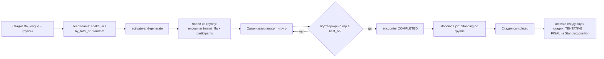

# FFA-встречи: лобби на N участников в турнирном движке

**Status:** draft

**Goal:** турнирный движок проводит стадии, где в одной встрече играют больше двух участников — FFA-лобби
Overwatch, королевская битва, гонки. Участники группы играют N игр, очки за место и за счёт суммируются, топ‑N
группы уходит в следующую стадию через уже существующий механизм посева.

**Architecture:** одна таблица `tournament.encounter` для всех форматов с колонкой `format = duel | ffa` — тот же
приём, что `type: duel | ffa` у матча Toornament ([Matches API](https://developer.toornament.com/v2/doc/organizer_matches)).
Участники лобби — `tournament.encounter_participant`, результат участника в игре — `tournament.encounter_game_result`
поверх существующей `encounter_game`. Лобби отдаёт места в `tournament.standing` той же формы, что группа round robin,
поэтому переход в плей-офф (`activate_stage` → `StageItemInput`) не меняется ни строкой. Всё, что построено на двух
сторонах — счёт серии, вето карт, pick-ban героев, отчёты капитанов, Challonge, логи, рейтинги, — принимает только
`duel`; `EncounterRead` и списки встреч остаются дуэльными.

**Tech Stack:** Python 3.14 / FastStream / SQLAlchemy 2 / Alembic (backend), Go (gateway: маршруты, ACL, кэш ответов),
Next.js 16 / react-query / next-intl / vitest (frontend).

**Связанные документы.** Point-in-time план; факты о системе — [`../architecture.md`](../architecture.md),
[`../../backend/ARCHITECTURE.md`](../../backend/ARCHITECTURE.md), [`../glossary.md`](../glossary.md).

- [`2026-09-20-pregame-results-statistics-separation.md`](./2026-09-20-pregame-results-statistics-separation.md):
  его Vertical 1 внедрён (`encgame01`), `encounter_game` — единственный владелец результата позиции. Этот план
  сохраняет правило: результат игры лобби — тоже `encounter_game`, плюс строки участников. Его Vertical 2–5
  (вето, независимая статистика) FFA не трогает и от них не зависит.
- [`2026-09-20-multi-discipline-stats-engine.md`](./2026-09-20-multi-discipline-stats-engine.md): дисциплина для
  FFA не нужна — формула очков и подпись счёта задаются на стадии. Логи FFA-игр ждут его реестр парсеров (§11).

---

## 0. Область

**Фазы F1–F3 (выпуски R1–R3), детализированы до шагов:**

1. `encounter.format`, `encounter_participant`, `encounter_game_result`; сдерживание — ни один дуэльный читатель
   не видит лобби, ни одна дуэльная функция не принимает лобби.
2. Тип стадии `ffa_league`: группы — лобби, формула очков как данные стадии, FFA-тай-брейки, места в `Standing`,
   завершение, выход топ‑N в следующую стадию.
3. Ввод результатов организатором, публичная таблица лобби, страница лобби с чатом для кода, редактор стадии.
4. Регистрация команд на составе только из флекс-слотов (`{flex: 3}`) — без неё отряды королевской битвы не соберутся.

**Фазы F4–F5 — дизайн и список задач (§7.4, §7.5):** самоотчёт участников со скриншотами; `ffa_single_elimination` —
сетка из лобби.

**Явно не сейчас** — §11: логи и статистика FFA-игр, FFA в профилях/рейтингах/ачивках, ротация лобби между
группами, Challonge, дублирование дуэлей в `encounter_participant`.

**Сценарий приёмки всей работы** — турнир «Widow's Deadly Kiss» целиком на платформе: 1-й этап `ffa_league`
(группы по 8–10 соло-игроков, 3 игры, очки = убийства, топ‑N группы), 2-й этап Single Elimination 1x1 Bo3 с финалом
Bo5, посеянный из мест 1-го этапа автоматически.

---

## 1. Что есть сейчас

| Факт | Где | Следствие |
| --- | --- | --- |
| Встреча строго двусторонняя: `home_team_id`/`away_team_id`, `home_score`/`away_score` NOT NULL | `backend/shared/models/tournament/encounter.py:65-68` | Лобби N участников не выражается колонками |
| `encounter_game` — владелец результата позиции; CHECK требует оба счёта у `confirmed` | `backend/shared/models/tournament/encounter_game.py:53-57` | Игра лобби с тем же CHECK невозможна |
| Игры создаются лениво: freeplay открывает позицию при первом отчёте | `backend/tournament-service/src/services/encounter/games.py:134-152` | FFA повторяет тот же приём |
| Генерация ветвится на «группы» и «сетку»; генераторы выдают `Pairing(home, away)`; неизвестный тип — `ValueError` | `backend/tournament-service/src/services/admin/stage.py:1986`, `backend/shared/services/bracket/types.py:30-31`, `backend/shared/services/bracket/engine.py:51` | Нужна третья ветка без `Pairing` |
| Места считаются по стадии, две ветки | `backend/tournament-service/src/services/standings/service.py:1059-1072` | Третья ветка — `ffa_league` |
| Переход в плей-офф читает только `Standing.position` по `stage_item_id` | `backend/tournament-service/src/services/admin/stage.py:1000-1018` | Не меняется, если лобби пишет `Standing` |
| Стадия завершена, когда все её встречи `COMPLETED` | `standings/service.py:1039-1043` | Работает для лобби без изменений |
| Проводка «группы → сетка» принимает только ROUND_ROBIN/SWISS | `admin/stage.py:1488-1492`, `:1769` | Добавить `ffa_league` в допустимые источники |
| `buchholz IS NULL` означает «строка плей-офф» для app-service и parser-service | `backend/shared/models/tournament/standings.py:45-49` | Строки лобби пишут `buchholz = 0.0` |
| Списки, поиск, обзор, live/upcoming идут через один WHERE-builder | `backend/tournament-service/src/services/encounter/service.py:215-270` | Одна точка для фильтра `format = duel` |
| Читатели с джойном по `home_team_id`/`away_team_id` сами исключают строки с NULL | achievements (`parser-service/.../conditions/*`), `app-service/.../user/queries/*`, `analytics-service/.../analytics/service.py` | Менять не нужно |
| ACL чата пускает капитана home/away | `gateway/internal/workspace/workspace.go:74-80`, `backend/tournament-service/src/services/encounter/chat_access.py:39-89` | Добавить участников лобби |
| Покрытие логами на дашборде считает все встречи | `backend/app-service/src/services/dashboard/service.py:266-275` | Лобби занизили бы покрытие |
| Единственный потребитель `EncounterCompletedEvent` — parser-service, читает только id | `backend/parser-service/serve.py:392-417` | Событие для лобби безопасно |
| Регистрация команды скрыта на составе из одних флекс-слотов | `frontend/src/components/registration/TeamRegistrationEntry.tsx:61-72` | Блокирует отряды BR |
| Тай-брейки: backend `KNOWN_TIEBREAK_METRICS`, frontend-зеркало `ALL_TIEBREAKERS` | `standings/service.py:63-75`, `frontend/src/lib/tournament/tiebreakers.ts:28-36` | Новые метрики — в оба списка |

---

## 2. Словарь

| Термин | Значение |
| --- | --- |
| **Формат встречи** (`encounter.format`) | `duel` — две стороны и серия, всё, что было до этого плана. `ffa` — лобби из N участников. Задаётся при создании, не меняется. |
| **Лобби** | Встреча формата `ffa`. В UI — «Лобби». |
| **Участник** | Строка `encounter_participant` — команда в лобби. Команда из одного игрока — соло-участник. |
| **Игра лобби** | `encounter_game` с `format = 'ffa'`: одна катка или раунд. Позиции `1..encounter.best_of`. |
| **Результат участника** | `encounter_game_result`: место и счёт (убийства, очки) участника в игре. |
| **Формула очков** | `stage.settings_json.ffa_scoring`: очки за место плюс очки за единицу счёта. |
| **`ffa_league`** | Стадия: группы — лобби, очки по всем играм суммируются, топ‑N группы проходит. Имя — как у Toornament ([stage types](https://developer.toornament.com/v2/doc/organizer_stages)). |
| **`ffa_single_elimination`** | (F5) Сетка из лобби: из каждого лобби проходят K лучших. |

`encounter.best_of` у лобби — **число запланированных игр**. Оно резолвится тем же `BestOfConfig`
(`backend/tournament-service/src/domain/admin/best_of.py:28-32`, `default`/`by_round`/`final`); в UI для FFA-стадии
подпись «Игр в лобби».

Остальная терминология — из [`../glossary.md`](../glossary.md) дословно.

---

## 3. Принятые решения

| # | Решение | Почему не альтернатива |
| --- | --- | --- |
| 1 | Одна `encounter` + `format` | Отдельная таблица `lobby` дублирует чат (`ChatRoom.encounter`, `backend/shared/services/chat/room.py:44-46`), realtime-топики, `scheduled_at`, статусы, флаги завершения стадии и `Standing`. Поле формата у матча — отраслевой приём (Toornament). |
| 2 | `format` — `varchar(8)` + CHECK | Прецедент `tournament.team_formation` (`backend/shared/models/tournament/tournament.py:66-68`). Значение PG-enum нельзя использовать в той же транзакции, где его добавили (`backend/migrations/versions/annstat01_tournament_announcement_status.py:57`). |
| 3 | **Дуэли не дублируются в `encounter_participant`** | Пересмотр предложения из обсуждения. Дуэльные читатели читают home/away, FFA — участников; единого читателя «все встречи команды» нет. Дублирование — это 12 мест записи в 7 файлах (`bracket/persist.py:47`, `bracket/advancement.py:176,178,326,330,423`, `admin/stage.py:1309,1755`, `admin/encounter.py:237,333,433`, `challonge/sync.py:1508,1596`, `scrim/service.py:652`), бэкфилл истории и инвариант синхронизации — без единого читателя. Условие начала — §11. |
| 4 | Участников и результаты пишет один сервис `FfaEncounterService` | Инвариант «участники только у `ffa`» держится единственным писателем и тестом: CHECK поперёк двух таблиц в PostgreSQL не выражается. |
| 5 | `encounter_game.format` — неизменяемая копия формата встречи | Сохраняет дуэльную гарантию `ck_encounter_game_confirmed_shape` дословно для `duel` и запрещает дуэльные счета у `ffa`. Ослабить CHECK для всех — потерять гарантию, которую поставили намеренно. Составной FK `(encounter_id, format) → encounter(id, format)` отклонён: лишний уникальный индекс на горячей таблице ради защиты от ошибки в одном из двух конструкторов, которую ловит тест. |
| 6 | Результат ↔ участник — составной FK `(encounter_id, team_id) → encounter_participant` | Результат команды не из лобби невозможен на уровне БД. |
| 7 | Место хранится всегда; если формула не платит за место, оно выводится из счёта ранжированием «1224» | Метрики «победы в играх», «лучшее место», «место в последней игре» одинаковы для OW FFA и королевской битвы. |
| 8 | Формула — данные стадии; арифметика — чистая функция `shared/domain/ffa_scoring.py` | Игры отличаются числами, не кодом. Один вызов считает `Standing` и публичную таблицу — совпадение по построению. |
| 9 | Места лобби → `Standing` формы группы; `buchholz = 0.0` | `activate_stage`, `_fill_bracket_seeds`, `calculate_overall_positions` не меняются; «групповая строка» сохраняет смысл для app/parser (`standings.py:45-49`). |
| 10 | `EncounterRead` остаётся дуэльным и получает только поле `format`; списки по умолчанию `format = duel`; у лобби свои ответы | Фронтовый `Encounter` читают 112+ файлов; лобби туда не попадает. Дискриминированное объединение из обсуждения отклонено: пришлось бы править каждое место, которое лобби никогда не увидит. |
| 11 | Дуэльные функции отказывают лобби одним кодом `encounter_not_duel` (409) из `shared/domain/encounter_format.py` | Одна точка, один код для локализации. |
| 12 | Игры лобби создаются лениво при вводе результата позиции | Как freeplay (`games.py:134-152`). Смена числа игр — смена `best_of`, без удаления строк. |
| 13 | Лобби завершено, когда подтверждённых живых игр ≥ `best_of` | Тогда `_update_stage_completion_flags` и `_check_upstream_stages_completed` работают как есть. |
| 14 | Аудит — тот же `encounter_result_audit`; у FFA `home/away_score_after` NULL, снимок в `ffa_results_json` | Один журнал на встречу — принятый в репозитории выбор (`backend/shared/services/encounter/game_audit.py:1-16`). |
| 15 | v1: результаты вводит организатор; самоотчёт — F4 | В лобби «по счёту» (OW FFA) самоотчёт не проверяется перекрёстно: штатный ввод нужен в любом случае. |
| 16 | Одно лобби на группу; больше игр — больше `best_of` | Ротация лобби между группами (BR «A против B») — отдельная модель пар групп, §11. |

Решения 1, 2, 5 — двери в одну сторону. Остальное обратимо.

---

## 4. Модель данных

### 4.1. Схема (ревизия `ffa0001`)

```
tournament.encounter
  + format varchar(8) NOT NULL DEFAULT 'duel'
  + ck_encounter_format            CHECK (format IN ('duel', 'ffa'))
  + ck_encounter_ffa_has_no_sides  CHECK (format = 'duel' OR (home_team_id IS NULL AND away_team_id IS NULL
                                                             AND home_score = 0 AND away_score = 0))

tournament.encounter_game
  + format varchar(8) NOT NULL DEFAULT 'duel'           -- копия encounter.format, неизменяема
  + ck_encounter_game_format             CHECK (format IN ('duel', 'ffa'))
  ~ ck_encounter_game_confirmed_shape    CHECK (state != 'confirmed' OR (result_source IS NOT NULL
                                              AND confirmed_at IS NOT NULL AND (format = 'ffa'
                                              OR (accepted_home_score IS NOT NULL AND accepted_away_score IS NOT NULL))))
  + ck_encounter_game_ffa_has_no_scores  CHECK (format = 'duel' OR (accepted_home_score IS NULL
                                              AND accepted_away_score IS NULL))

tournament.encounter_participant                          -- NEW, строки только у format = 'ffa'
  id, created_at, updated_at                              -- db.TimeStampIntegerMixin
  encounter_id  FK encounter.id ON DELETE CASCADE
  team_id       FK team.id      ON DELETE CASCADE
  slot          int  CHECK (slot >= 1)                    -- место за столом лобби, порядок посева
  uq_encounter_participant_encounter_team (encounter_id, team_id)
  uq_encounter_participant_encounter_slot (encounter_id, slot)
  ix_encounter_participant_team_id (team_id)

tournament.encounter_game_result                          -- NEW
  id, created_at, updated_at
  game_id       FK encounter_game.id ON DELETE CASCADE
  encounter_id, team_id  FK → encounter_participant(encounter_id, team_id) ON DELETE CASCADE
  placement     int NOT NULL CHECK (placement >= 1)
  score         int NOT NULL DEFAULT 0 CHECK (score >= 0)
  uq_encounter_game_result_game_team (game_id, team_id)
  ix_encounter_game_result_encounter_team (encounter_id, team_id)

tournament.encounter_result_audit
  ~ home_score_after, away_score_after  NOT NULL → NULL
  + ffa_results_json jsonb NULL
  + ck_encounter_result_audit_after_shape CHECK ((home_score_after IS NOT NULL AND away_score_after IS NOT NULL)
                                                 OR ffa_results_json IS NOT NULL)

tournament.stagetype  + 'ffa_league'   -- ALTER TYPE ... ADD VALUE IF NOT EXISTS, только метка
```

Уникальности `placement` в игре на уровне БД нет: в лобби «по счёту» ничья по убийствам — общее место. Правило
«каждое место ровно один раз» для формул с очками за место проверяет `normalize_game_lines` (§5.2).

Имена констрейнтов — по наблюдаемой конвенции `uq_/ix_/fk_/ck_<table>_…`: `naming_convention` в
`backend/shared/core/db.py` не задан.

### 4.2. Настройки стадии

`stage.settings_json` получает блок `ffa_scoring`. Валидируется на записи `StageSettings`
(`backend/tournament-service/src/schemas/admin/stage.py:29`), хранится как есть — так же, как `scoring`.

```json
{
  "best_of": {"default": 3},
  "ffa_scoring": {"placement_points": [], "score_points": 1, "score_label": "Убийства"},
  "tiebreak_order": ["points", "ffa_game_wins", "ffa_last_placement"]
}
```

Королевская битва — те же ключи, другие числа:

```json
{
  "best_of": {"default": 6},
  "ffa_scoring": {"placement_points": [10, 6, 5, 4, 3, 2, 1, 1], "score_points": 1, "score_label": "Kills"}
}
```

`score_label` — подпись колонки счёта от организатора, не ключ перевода: у каждой игры своё слово.

---

## 5. Поведение

### 5.1. Жизненный цикл `ffa_league`



1. Организатор создаёт стадию `ffa_league`, группы (`StageItemType.GROUP`) и распределяет команды существующим
   `seed-teams` (`admin/stage.py:1319-1423`) — без изменений.
2. `activate-and-generate`: TENTATIVE-входы резолвятся как сейчас (`admin/stage.py:1000-1018`), затем генерация
   создаёт по лобби на группу, в которой ещё нет лобби. Участников 2..100 (`FFA_MAX_LOBBY_SIZE`; лимит Toornament).
   `best_of = resolve_best_of(cfg, 1, is_final=False)`.
3. Организатор вводит игру позиции `p`: каждый участник ровно один раз (§5.2).
4. После каждой записи — пересчёт завершения лобби (§5.4), строка аудита, `enqueue_tournament_recalculation`
   (задание пересчёта мест + инвалидация, `backend/tournament-service/src/services/tournament/events.py:99-124`).
5. Все лобби `COMPLETED` → `_update_stage_completion_flags` ставит `stage.is_completed` → следующая стадия
   активируется, как после round robin.

### 5.2. Правила результата игры

`normalize_game_lines(lines, participant_ids, rules)` (§7.2, задача 4) — одно место правил:

| Нарушение | Код (422) |
| --- | --- |
| Команда не из лобби | `ffa_result_unknown_team` |
| Команда дважды | `ffa_result_duplicate_team` |
| Нет строки для участника | `ffa_result_missing_team` |
| Счёт < 0 | `ffa_result_invalid_score` |
| Места даны не всем | `ffa_result_mixed_placement` |
| Формула платит за место, а мест нет | `ffa_result_placement_required` |
| Место вне `1..N`; при формуле с очками за место — не перестановка `1..N` | `ffa_result_invalid_placement` |

Мест нет и формула за место не платит → места выводятся из счёта: сортировка по убыванию, ничьи делят место
(10, 7, 7, 3 → 1, 2, 2, 4).

### 5.3. Очки и тай-брейки

`очки игры = placement_points[place − 1] (0, если место за концом таблицы) + score × score_points`.
Итог участника в группе — сумма по подтверждённым играм всех лобби группы.

Новые метрики тай-брейка (все «больше — лучше» в сортировке `_sort_ranked_teams`, `standings/service.py:281-301`;
метрики мест возвращаются со знаком минус):

| id | Значение |
| --- | --- |
| `points` | существующая: сумма очков |
| `ffa_game_wins` | число игр на 1-м месте (общее 1-е считается) |
| `ffa_score` | сумма сырого счёта (всего убийств) |
| `ffa_best_placement` | лучшее место в играх |
| `ffa_last_placement` | место в последней сыгранной игре |
| `manual_override` | существующая, дописывается последней (`normalize_tiebreak_order`) |

Пресет по умолчанию `ffa_default = ["points", "ffa_game_wins", "ffa_score", "ffa_last_placement"]`.

### 5.4. Исправление, аннулирование, число игр, завершение

- **Исправление** подтверждённой игры — повторная запись той же позиции; требует `reason`
  (`ffa_reason_required`, 422), пишет `GAME_CORRECT`. Как у дуэлей, запрещено, если стадия уже квалифицировала
  следующую: `admin_stage_service.assert_source_correction_allowed` (`backend/tournament-service/src/rpc/admin_misc.py:76-86`).
- **Аннулирование** — игра → `cancelled` (история), позиция снова свободна: частичный уникальный индекс
  `uq_encounter_game_encounter_position` исключает `cancelled` (`encounter_game.py:41-47`). Требует `reason`,
  пишет `GAME_CANCEL`.
- **Число игр** одного лобби — `best_of`; не меньше числа подтверждённых живых игр (`ffa_games_below_played`, 422).
  Стадийный `apply-best-of` (`admin/stage.py:2095-2128`) для лобби пересчитывает завершение тем же методом.
- **Завершение** — после любой из трёх операций: подтверждённых живых игр ≥ `best_of` → `COMPLETED`,
  `result_status = confirmed`, `confirmed_at`, `ended_at`, строка аудита `CONFIRM` со снимком итогов и
  `EncounterCompletedEvent` через outbox. Условие перестало выполняться → `OPEN`, `result_status = none`,
  строка `REOPEN`.

### 5.5. События и realtime

- `EncounterCompletedEvent` выходит как у дуэли: `home/away/winner = None` (`backend/shared/schemas/events.py:301-306`).
  Потребитель читает только id (§1).
- Запись результата вызывает `enqueue_tournament_recalculation` — задание пересчёта мест и инвалидация
  `tournament.encounters`. Новых ресурсов нет: фронтенд сбрасывает ключи `ffa` по тем же ресурсам (задача 10).

### 5.6. Чат лобби

Комната — существующая `ChatRoom.encounter(id)`, топик `encounter:{id}:chat`. Писать могут капитаны команд-участников
и персонал workspace; зрители — по настройке комнаты, по умолчанию выключено (там код лобби). Изменения:
`chat_access.py` и `isEncounterCaptainSQL` в gateway (задача 9).

---

## 6. Сдерживание: что меняется у дуэльных частей

| Где | Что сейчас | Изменение |
| --- | --- | --- |
| `tournament-service/src/services/encounter/service.py:215-270` `_apply_encounter_filters` | списки, поиск, обзор, featured, live/upcoming | `WHERE format = params.format or 'duel'` |
| `tournament-service/src/schemas/encounter.py:245-282` `EncounterSearchParams` / `EncounterSearchQueryParams` | нет поля формата | `format: EncounterFormat \| None = None` |
| `tournament-service/src/schemas/encounter.py:93-121`, `:44-53` `EncounterRead` / `EncounterSummaryRead` | нет формата | `format: EncounterFormat = EncounterFormat.DUEL` — фронтенд маршрутизирует |
| `tournament-service/src/services/encounter/captain.py:225-251` `_load_encounter`, `_load_encounter_with_reports` | загрузка для отчётов капитанов, admin set/reopen result, my-role | `ensure_format(encounter, DUEL)` |
| `tournament-service/src/services/encounter/map_report.py:107` `submit_map_report` | заявка на карту | `ensure_format(..., DUEL)` после загрузки |
| `tournament-service/src/services/encounter/games.py:134,171,211` `ensure_freeplay_game`, `accept_result`, `select_map` | единственный писатель дуэльных игр | `ensure_format(..., DUEL)` первой строкой |
| `tournament-service/src/services/encounter/pick_ban_session.py:405-431` `ensure_pick_ban_session` | старт вето и pick-ban | `if encounter.format != DUEL: return None` перед проверкой команд |
| `tournament-service/src/services/admin/encounter.py:300-352` `update_encounter` | общий setattr | у `ffa` разрешены только `name`, `scheduled_at`, `started_at`, `ended_at`; иначе 422 `ffa_field_not_editable` |
| `tournament-service/src/services/admin/encounter.py:373-440` `swap_slots` | обмен слотами | `ensure_format(..., DUEL)` для обеих встреч |
| `tournament-service/src/services/challonge/sync.py:1445-1645` `_upsert_encounter_from_challonge` | поиск и claim встреч | `models.Encounter.format == EncounterFormat.DUEL` в запросах |
| `tournament-service/src/services/challonge/sync.py:2204` `push_single_result` | выгрузка результата | `ensure_format(..., DUEL)` |
| `app-service/src/services/dashboard/service.py:266-275` покрытие логами | считает все встречи | `format == 'duel'` в условии outer join |
| `tournament-service/src/services/admin/stage.py:1488-1492`, `:1769` проводка групп | только ROUND_ROBIN/SWISS | `QUALIFYING_SOURCE_STAGE_TYPES` (включает `ffa_league`) |
| `tournament-service/src/services/admin/tournament.py:41,447` предупреждение о незавершённых группах | ROUND_ROBIN/SWISS | добавить `FFA_LEAGUE` |

Без изменений, проверено: `shared/domain/tournament_utils.py:28-39,60-73` (требует обе стороны),
`standings/service.py:880-925` (фильтрует `home/away IS NOT NULL`), `notifications/lifecycle.py:174-229` (выходит
при `home/away IS NULL`), весь parser-service и analytics-service (джойны по сторонам), `bracket/usability.py:29-35`
(формат-агностичен), `app-service/.../dashboard/readiness.py` (лобби — законно «сгенерированная структура»).

---

## 7. Фазы и задачи

Каждая задача — отдельный коммит `type(scope): imperative subject`. Scope этой работы — `ffa`
(`feat(ffa): …`), для сдерживания — `encounter`. Формат, линтеры и полный набор тестов — один раз перед PR (§9);
внутри задачи запускаются только её тесты.

### 7.1. F1 — схема и сдерживание (выпуск R1; поведение дуэлей не меняется)

~14 файлов, 2–3 дня.

#### Задача 1. Перечисления, миграция, модели, репозитории

**Files:**
- Modify: `backend/shared/core/enums.py:385-390` (StageType), рядом — новый `EncounterFormat`
- Create: `backend/migrations/versions/ffa0001_encounter_format_participants.py`
- Modify: `backend/shared/models/tournament/encounter.py:41-145`
- Modify: `backend/shared/models/tournament/encounter_game.py:36-82`
- Modify: `backend/shared/models/tournament/encounter_result_audit.py` (колонки `home_score_after`, `away_score_after`)
- Create: `backend/shared/models/tournament/encounter_participant.py`
- Create: `backend/shared/models/tournament/encounter_game_result.py`
- Modify: `backend/shared/models/tournament/__init__.py` (экспорт двух моделей)
- Modify: `backend/shared/repository/encounter.py`, `backend/shared/repository/__init__.py`
- Test: `backend/tournament-service/tests/test_ffa_schema_integration.py`

**Interfaces — Produces:**
- `enums.EncounterFormat.DUEL/FFA`, `enums.StageType.FFA_LEAGUE`
- `models.EncounterParticipant(encounter_id, team_id, slot)`, `models.EncounterGameResult(game_id, encounter_id, team_id, placement, score)`
- `Encounter.format: Mapped[str]`, `Encounter.participants`, `EncounterGame.format: Mapped[str]`, `EncounterResultAudit.ffa_results_json`
- `EncounterParticipantRepository.list_for_encounter(session, encounter_id) -> Sequence[EncounterParticipant]`
- `EncounterParticipantRepository.list_for_stage(session, stage_id) -> list[Row(stage_item_id, encounter_id, team_id, slot)]`
- `EncounterGameResultRepository.list_for_games(session, game_ids) -> Sequence[EncounterGameResult]`
- `EncounterGameResultRepository.list_confirmed_for_stage(session, stage_id) -> list[Row(stage_item_id, round, encounter_id, position, team_id, placement, score)]`

- [ ] **Шаг 1. Проверить голову миграций.** Голова на момент плана — `draftq01`
  (`backend/migrations/versions/draftq01_draft_team_pick_queue.py`). Перед работой найти файл, чья `revision`
  не встречается ни в одном `down_revision`, и поставить её в `down_revision` новой ревизии.

- [ ] **Шаг 2. Перечисления** (`backend/shared/core/enums.py`):

```python
class StageType(StrEnum):
    ROUND_ROBIN = "round_robin"
    SINGLE_ELIMINATION = "single_elimination"
    DOUBLE_ELIMINATION = "double_elimination"
    SWISS = "swiss"
    FFA_LEAGUE = "ffa_league"


class EncounterFormat(StrEnum):
    """How many sides an encounter has. Fixed at creation.

    ``duel`` is two sides and a series -- every feature built on home/away
    accepts only it. ``ffa`` is a lobby of N participants
    (``tournament.encounter_participant``) scored per game per participant.
    """

    DUEL = "duel"
    FFA = "ffa"
```

- [ ] **Шаг 3. Написать падающий интеграционный тест схемы** — он проверяет наблюдаемые гарантии БД, а не имена
  колонок. Шаблон — `backend/tournament-service/tests/test_check_in_gate_integration.py:23-110` (тот же
  `SUBSCRIPTIONS_IT_DSN`, единственная принятая в репозитории переменная для интеграционных тестов).

```python
"""Database-level guarantees of the FFA schema, on real Postgres.

Skipped unless ``SUBSCRIPTIONS_IT_DSN`` is set::

    SUBSCRIPTIONS_IT_DSN=postgresql+psycopg://user:pw@127.0.0.1:15432/anak_dev \\
        uv run pytest tournament-service/tests/test_ffa_schema_integration.py -v
"""

from __future__ import annotations

import asyncio
import os
import sys
import unittest
from pathlib import Path
from unittest import IsolatedAsyncioTestCase

import sqlalchemy as sa
from sqlalchemy.exc import IntegrityError

DSN = os.environ.get("SUBSCRIPTIONS_IT_DSN")

if sys.platform == "win32":
    asyncio.set_event_loop_policy(asyncio.WindowsSelectorEventLoopPolicy())

sys.path.insert(0, str(Path(__file__).resolve().parents[1]))
sys.path.insert(0, str(Path(__file__).resolve().parents[2]))


@unittest.skipUnless(DSN, "set SUBSCRIPTIONS_IT_DSN to run FFA schema integration tests")
class TestFfaSchema(IsolatedAsyncioTestCase):
    async def asyncSetUp(self) -> None:
        from sqlalchemy.ext.asyncio import async_sessionmaker, create_async_engine

        self._engine = create_async_engine(DSN, connect_args={"connect_timeout": 20})
        self._session = async_sessionmaker(self._engine, expire_on_commit=False)()
        row = (
            await self._session.execute(
                sa.text(
                    "select t.id, array_agg(team.id order by team.id) from tournament.tournament t "
                    "join tournament.team team on team.tournament_id = t.id group by t.id "
                    "having count(team.id) >= 3 order by t.id limit 1"
                )
            )
        ).first()
        if row is None:
            self.skipTest("target database has no tournament with 3 teams to anchor FKs")
        self.tournament_id, team_ids = row[0], row[1]
        self.a, self.b, self.outsider = team_ids[0], team_ids[1], team_ids[2]

    async def asyncTearDown(self) -> None:
        await self._session.rollback()
        await self._session.close()
        await self._engine.dispose()

    async def _lobby(self) -> int:
        return (
            await self._session.execute(
                sa.text(
                    "insert into tournament.encounter (name, format, home_score, away_score, round, best_of, "
                    "tournament_id, status, result_status) values ('Lobby', 'ffa', 0, 0, 1, 3, :t, 'OPEN', 'none') "
                    "returning id"
                ),
                {"t": self.tournament_id},
            )
        ).scalar_one()

    async def _participant(self, encounter_id: int, team_id: int, slot: int) -> None:
        await self._session.execute(
            sa.text(
                "insert into tournament.encounter_participant (encounter_id, team_id, slot) values (:e, :t, :s)"
            ),
            {"e": encounter_id, "t": team_id, "s": slot},
        )

    async def _ffa_game(self, encounter_id: int) -> int:
        return (
            await self._session.execute(
                sa.text(
                    "insert into tournament.encounter_game (encounter_id, position, format, state, result_source, "
                    "confirmed_at) values (:e, 1, 'ffa', 'confirmed', 'admin', now()) returning id"
                ),
                {"e": encounter_id},
            )
        ).scalar_one()

    async def _duel(self) -> tuple[int, str]:
        row = (
            await self._session.execute(
                sa.text(
                    "insert into tournament.encounter (name, home_team_id, away_team_id, home_score, away_score, "
                    "round, best_of, tournament_id, status, result_status) "
                    "values ('A vs B', :h, :a, 0, 0, 1, 3, :t, 'OPEN', 'none') returning id, format"
                ),
                {"h": self.a, "a": self.b, "t": self.tournament_id},
            )
        ).one()
        return row[0], row[1]

    async def test_an_encounter_written_without_a_format_is_a_duel(self) -> None:
        # Every existing writer inserts without the column; they must keep
        # producing duels.
        _, fmt = await self._duel()

        self.assertEqual("duel", fmt)

    async def test_a_lobby_cannot_carry_duel_sides(self) -> None:
        with self.assertRaises(IntegrityError):
            await self._session.execute(
                sa.text(
                    "insert into tournament.encounter (name, format, home_team_id, home_score, away_score, round, "
                    "best_of, tournament_id, status, result_status) "
                    "values ('Bad', 'ffa', :h, 0, 0, 1, 3, :t, 'OPEN', 'none')"
                ),
                {"h": self.a, "t": self.tournament_id},
            )

    async def test_a_confirmed_ffa_game_holds_no_duel_score(self) -> None:
        lobby = await self._lobby()
        with self.assertRaises(IntegrityError):
            await self._session.execute(
                sa.text(
                    "insert into tournament.encounter_game (encounter_id, position, format, state, "
                    "accepted_home_score, accepted_away_score, result_source, confirmed_at) "
                    "values (:e, 1, 'ffa', 'confirmed', 1, 0, 'admin', now())"
                ),
                {"e": lobby},
            )

    async def test_a_confirmed_duel_game_still_needs_both_scores(self) -> None:
        duel, _ = await self._duel()
        with self.assertRaises(IntegrityError):
            await self._session.execute(
                sa.text(
                    "insert into tournament.encounter_game (encounter_id, position, state, result_source, "
                    "confirmed_at) values (:e, 1, 'confirmed', 'admin', now())"
                ),
                {"e": duel},
            )

    async def test_a_result_belongs_to_a_participant_of_the_same_lobby(self) -> None:
        lobby = await self._lobby()
        await self._participant(lobby, self.a, 1)
        await self._participant(lobby, self.b, 2)
        game = await self._ffa_game(lobby)
        with self.assertRaises(IntegrityError):
            await self._session.execute(
                sa.text(
                    "insert into tournament.encounter_game_result (game_id, encounter_id, team_id, placement, score) "
                    "values (:g, :e, :t, 1, 5)"
                ),
                {"g": game, "e": lobby, "t": self.outsider},
            )

    async def test_deleting_the_lobby_removes_participants_games_and_results(self) -> None:
        lobby = await self._lobby()
        await self._participant(lobby, self.a, 1)
        game = await self._ffa_game(lobby)
        await self._session.execute(
            sa.text(
                "insert into tournament.encounter_game_result (game_id, encounter_id, team_id, placement, score) "
                "values (:g, :e, :t, 1, 5)"
            ),
            {"g": game, "e": lobby, "t": self.a},
        )
        await self._session.execute(sa.text("delete from tournament.encounter where id = :e"), {"e": lobby})
        left = (
            await self._session.execute(
                sa.text("select count(*) from tournament.encounter_participant where encounter_id = :e"), {"e": lobby}
            )
        ).scalar_one()
        self.assertEqual(0, left)
```

- [ ] **Шаг 4. Запустить — должен упасть** (колонки `format` нет):
  `SUBSCRIPTIONS_IT_DSN=postgresql+psycopg://user:pw@127.0.0.1:15432/anak_dev uv run pytest tournament-service/tests/test_ffa_schema_integration.py -v` из `backend/`.
  Ожидание: `ProgrammingError: column "format" … does not exist`.

- [ ] **Шаг 5. Миграция.** Заголовок и блокировки — по образцу
  `backend/migrations/versions/regteam0004_roster_admission_subscription.py:72-92` (`_take_locks` с
  `RETRYABLE_SQLSTATES = {"55P03", "40P01"}`, `lock_timeout = '3s'`, 40 попыток, SAVEPOINT). Создание таблиц —
  по образцу `encgame01_encounter_game_authority.py:200-231`.

```python
"""FFA encounters: encounter.format, lobby participants, per-game results.

``stagetype`` gains ``ffa_league`` as a LABEL only: PostgreSQL refuses to use a
value added to an existing enum inside the transaction that added it, and
nothing here writes one (same constraint as annstat01 / encgame01).

Revision ID: ffa0001
Revises: draftq01
"""

from __future__ import annotations

import time

import sqlalchemy as sa
from alembic import op
from sqlalchemy.dialects import postgresql
from sqlalchemy.exc import OperationalError

revision = "ffa0001"
down_revision = "draftq01"
branch_labels = None
depends_on = None

RETRYABLE_SQLSTATES = frozenset({"55P03", "40P01"})
LOCK_TIMEOUT = "3s"
LOCK_ATTEMPTS = 40
LOCK_BACKOFF_SECONDS = 6.0
_EXCLUSIVE = "tournament.encounter, tournament.encounter_game, tournament.encounter_result_audit"
_REFERENCED = "tournament.team"


def _take_locks() -> None:
    bind = op.get_bind()
    bind.execute(sa.text(f"SET LOCAL lock_timeout = '{LOCK_TIMEOUT}'"))
    for attempt in range(1, LOCK_ATTEMPTS + 1):
        savepoint = bind.begin_nested()
        try:
            bind.execute(sa.text(f"LOCK TABLE {_EXCLUSIVE} IN ACCESS EXCLUSIVE MODE"))
            bind.execute(sa.text(f"LOCK TABLE {_REFERENCED} IN SHARE ROW EXCLUSIVE MODE"))
            return
        except OperationalError as exc:
            savepoint.rollback()
            if getattr(exc.orig, "sqlstate", None) not in RETRYABLE_SQLSTATES or attempt == LOCK_ATTEMPTS:
                raise
            time.sleep(LOCK_BACKOFF_SECONDS)


def _timestamps() -> list[sa.Column]:
    return [
        sa.Column("id", sa.BigInteger(), nullable=False),
        sa.Column("created_at", sa.DateTime(timezone=True), server_default=sa.text("now()"), nullable=False),
        sa.Column("updated_at", sa.DateTime(timezone=True), nullable=True),
    ]


def upgrade() -> None:
    _take_locks()
    op.execute("ALTER TYPE tournament.stagetype ADD VALUE IF NOT EXISTS 'ffa_league'")

    op.add_column(
        "encounter", sa.Column("format", sa.String(8), nullable=False, server_default="duel"), schema="tournament"
    )
    op.create_check_constraint("ck_encounter_format", "encounter", "format IN ('duel', 'ffa')", schema="tournament")
    op.create_check_constraint(
        "ck_encounter_ffa_has_no_sides",
        "encounter",
        "format = 'duel' OR (home_team_id IS NULL AND away_team_id IS NULL AND home_score = 0 AND away_score = 0)",
        schema="tournament",
    )

    op.add_column(
        "encounter_game",
        sa.Column("format", sa.String(8), nullable=False, server_default="duel"),
        schema="tournament",
    )
    op.create_check_constraint(
        "ck_encounter_game_format", "encounter_game", "format IN ('duel', 'ffa')", schema="tournament"
    )
    op.drop_constraint("ck_encounter_game_confirmed_shape", "encounter_game", schema="tournament")
    op.create_check_constraint(
        "ck_encounter_game_confirmed_shape",
        "encounter_game",
        "state != 'confirmed' OR (result_source IS NOT NULL AND confirmed_at IS NOT NULL AND (format = 'ffa' "
        "OR (accepted_home_score IS NOT NULL AND accepted_away_score IS NOT NULL)))",
        schema="tournament",
    )
    op.create_check_constraint(
        "ck_encounter_game_ffa_has_no_scores",
        "encounter_game",
        "format = 'duel' OR (accepted_home_score IS NULL AND accepted_away_score IS NULL)",
        schema="tournament",
    )

    op.create_table(
        "encounter_participant",
        *_timestamps(),
        sa.Column("encounter_id", sa.BigInteger(), nullable=False),
        sa.Column("team_id", sa.BigInteger(), nullable=False),
        sa.Column("slot", sa.Integer(), nullable=False),
        sa.CheckConstraint("slot >= 1", name="ck_encounter_participant_slot"),
        sa.ForeignKeyConstraint(["encounter_id"], ["tournament.encounter.id"], ondelete="CASCADE"),
        sa.ForeignKeyConstraint(["team_id"], ["tournament.team.id"], ondelete="CASCADE"),
        sa.UniqueConstraint("encounter_id", "team_id", name="uq_encounter_participant_encounter_team"),
        sa.UniqueConstraint("encounter_id", "slot", name="uq_encounter_participant_encounter_slot"),
        sa.PrimaryKeyConstraint("id"),
        schema="tournament",
    )
    op.create_index(
        "ix_encounter_participant_team_id", "encounter_participant", ["team_id"], schema="tournament"
    )

    op.create_table(
        "encounter_game_result",
        *_timestamps(),
        sa.Column("game_id", sa.BigInteger(), nullable=False),
        sa.Column("encounter_id", sa.BigInteger(), nullable=False),
        sa.Column("team_id", sa.BigInteger(), nullable=False),
        sa.Column("placement", sa.Integer(), nullable=False),
        sa.Column("score", sa.Integer(), nullable=False, server_default="0"),
        sa.CheckConstraint("placement >= 1", name="ck_encounter_game_result_placement"),
        sa.CheckConstraint("score >= 0", name="ck_encounter_game_result_score"),
        sa.ForeignKeyConstraint(["game_id"], ["tournament.encounter_game.id"], ondelete="CASCADE"),
        sa.ForeignKeyConstraint(
            ["encounter_id", "team_id"],
            ["tournament.encounter_participant.encounter_id", "tournament.encounter_participant.team_id"],
            ondelete="CASCADE",
            name="fk_encounter_game_result_participant",
        ),
        sa.UniqueConstraint("game_id", "team_id", name="uq_encounter_game_result_game_team"),
        sa.PrimaryKeyConstraint("id"),
        schema="tournament",
    )
    op.create_index(
        "ix_encounter_game_result_encounter_team",
        "encounter_game_result",
        ["encounter_id", "team_id"],
        schema="tournament",
    )

    op.alter_column("encounter_result_audit", "home_score_after", nullable=True, schema="tournament")
    op.alter_column("encounter_result_audit", "away_score_after", nullable=True, schema="tournament")
    op.add_column(
        "encounter_result_audit",
        sa.Column("ffa_results_json", postgresql.JSONB(), nullable=True),
        schema="tournament",
    )
    op.create_check_constraint(
        "ck_encounter_result_audit_after_shape",
        "encounter_result_audit",
        "(home_score_after IS NOT NULL AND away_score_after IS NOT NULL) OR ffa_results_json IS NOT NULL",
        schema="tournament",
    )


def downgrade() -> None:
    _take_locks()
    # A downgrade after the first lobby exists would drop real results; refuse
    # instead of silently losing them. The stagetype label stays: PostgreSQL
    # cannot drop an enum value without rebuilding the type (annstat01).
    lobbies = op.get_bind().execute(sa.text("SELECT count(*) FROM tournament.encounter WHERE format = 'ffa'")).scalar()
    if lobbies:
        raise RuntimeError(f"{lobbies} FFA encounters exist; downgrade would drop their results")
    op.drop_constraint("ck_encounter_result_audit_after_shape", "encounter_result_audit", schema="tournament")
    op.drop_column("encounter_result_audit", "ffa_results_json", schema="tournament")
    op.alter_column("encounter_result_audit", "away_score_after", nullable=False, schema="tournament")
    op.alter_column("encounter_result_audit", "home_score_after", nullable=False, schema="tournament")
    op.drop_table("encounter_game_result", schema="tournament")
    op.drop_table("encounter_participant", schema="tournament")
    op.drop_constraint("ck_encounter_game_ffa_has_no_scores", "encounter_game", schema="tournament")
    op.drop_constraint("ck_encounter_game_confirmed_shape", "encounter_game", schema="tournament")
    op.create_check_constraint(
        "ck_encounter_game_confirmed_shape",
        "encounter_game",
        "state != 'confirmed' OR (accepted_home_score IS NOT NULL AND accepted_away_score IS NOT NULL "
        "AND result_source IS NOT NULL AND confirmed_at IS NOT NULL)",
        schema="tournament",
    )
    op.drop_constraint("ck_encounter_game_format", "encounter_game", schema="tournament")
    op.drop_column("encounter_game", "format", schema="tournament")
    op.drop_constraint("ck_encounter_ffa_has_no_sides", "encounter", schema="tournament")
    op.drop_constraint("ck_encounter_format", "encounter", schema="tournament")
    op.drop_column("encounter", "format", schema="tournament")
```

- [ ] **Шаг 6. Модели.** `encounter_participant.py`:

```python
"""A team seated in an FFA lobby (``encounter.format == 'ffa'``).

Rows exist only for lobbies: a duel names its two sides in
``encounter.home_team_id``/``away_team_id`` and has none here (see
docs/plans/2026-09-24-ffa-encounters.md §3, decision 3). The single writer is
tournament-service ``FfaEncounterService``.
"""

from __future__ import annotations

import typing

from sqlalchemy import CheckConstraint, ForeignKey, Integer, UniqueConstraint
from sqlalchemy.orm import Mapped, mapped_column, relationship

from shared.core import db
from shared.models.tournament.team import Team

if typing.TYPE_CHECKING:
    from shared.models.tournament.encounter import Encounter

__all__ = ("EncounterParticipant",)


class EncounterParticipant(db.TimeStampIntegerMixin):
    __tablename__ = "encounter_participant"
    __table_args__ = (
        UniqueConstraint("encounter_id", "team_id", name="uq_encounter_participant_encounter_team"),
        UniqueConstraint("encounter_id", "slot", name="uq_encounter_participant_encounter_slot"),
        CheckConstraint("slot >= 1", name="ck_encounter_participant_slot"),
        {"schema": "tournament"},
    )

    encounter_id: Mapped[int] = mapped_column(ForeignKey("tournament.encounter.id", ondelete="CASCADE"))
    team_id: Mapped[int] = mapped_column(ForeignKey(Team.id, ondelete="CASCADE"), index=True)
    #: Seat in the lobby, in seed order. Display order before any game is played.
    slot: Mapped[int] = mapped_column(Integer())

    encounter: Mapped[Encounter] = relationship(back_populates="participants")
    team: Mapped[Team] = relationship()
```

  `encounter_game_result.py`:

```python
"""One participant's result in one FFA lobby game.

``placement`` is always stored: when the stage's formula pays nothing for
placement it is derived from ``score`` (ties share a place), so "games won" and
"best placement" mean the same for a score-only lobby and a battle royale.
The composite FK to the participant makes a result for a team outside the
lobby impossible.
"""

from __future__ import annotations

from sqlalchemy import BigInteger, CheckConstraint, ForeignKey, ForeignKeyConstraint, Index, Integer, UniqueConstraint
from sqlalchemy.orm import Mapped, mapped_column

from shared.core import db
from shared.models.tournament.encounter_game import EncounterGame

__all__ = ("EncounterGameResult",)


class EncounterGameResult(db.TimeStampIntegerMixin):
    __tablename__ = "encounter_game_result"
    __table_args__ = (
        UniqueConstraint("game_id", "team_id", name="uq_encounter_game_result_game_team"),
        CheckConstraint("placement >= 1", name="ck_encounter_game_result_placement"),
        CheckConstraint("score >= 0", name="ck_encounter_game_result_score"),
        ForeignKeyConstraint(
            ["encounter_id", "team_id"],
            ["tournament.encounter_participant.encounter_id", "tournament.encounter_participant.team_id"],
            ondelete="CASCADE",
            name="fk_encounter_game_result_participant",
        ),
        Index("ix_encounter_game_result_encounter_team", "encounter_id", "team_id"),
        {"schema": "tournament"},
    )

    game_id: Mapped[int] = mapped_column(ForeignKey(EncounterGame.id, ondelete="CASCADE"))
    encounter_id: Mapped[int] = mapped_column(BigInteger())
    team_id: Mapped[int] = mapped_column(BigInteger())
    placement: Mapped[int] = mapped_column(Integer())
    score: Mapped[int] = mapped_column(Integer(), default=0, server_default="0")
```

  `encounter.py` — в `__table_args__` перед `{"schema": "tournament"}`:

```python
        CheckConstraint("format IN ('duel', 'ffa')", name="ck_encounter_format"),
        CheckConstraint(
            "format = 'duel' OR (home_team_id IS NULL AND away_team_id IS NULL "
            "AND home_score = 0 AND away_score = 0)",
            name="ck_encounter_ffa_has_no_sides",
        ),
```

  колонка после `name` и связь после `games`:

```python
    #: ``duel`` | ``ffa`` (``enums.EncounterFormat``). Fixed at creation: a
    #: lobby's rows (participants, per-game results) mean nothing to a duel and
    #: the other way round. Plain text + CHECK, like ``Tournament.team_formation``.
    format: Mapped[str] = mapped_column(String(8), default=enums.EncounterFormat.DUEL.value, server_default="duel")
```

```python
    participants: Mapped[list[EncounterParticipant]] = relationship(
        back_populates="encounter",
        cascade="all, delete-orphan",
        passive_deletes=True,
        order_by="EncounterParticipant.slot",
    )
```

  (`EncounterParticipant` — в блок `TYPE_CHECKING`-импортов файла; `CheckConstraint` — в импорт `sqlalchemy`.)

  `encounter_game.py` — колонка и два CHECK взамен старого `ck_encounter_game_confirmed_shape`, тексты
  дословно из миграции; колонка:

```python
    #: Copy of ``encounter.format``, set by the game's creator and never changed.
    #: It is what lets the CHECKs keep "a confirmed duel game has both scores"
    #: while forbidding a duel score on a lobby game.
    format: Mapped[str] = mapped_column(String(8), default="duel", server_default="duel")
```

  `encounter_result_audit.py` — `home_score_after`/`away_score_after` → `Mapped[int | None]`, `nullable=True`;
  новая `ffa_results_json: Mapped[dict | None] = mapped_column(JSONB, nullable=True)` с комментарием «снимок
  результатов лобби до/после; у FFA-строк вместо счёта»; CHECK `ck_encounter_result_audit_after_shape`.

- [ ] **Шаг 7. Репозитории** (`backend/shared/repository/encounter.py`, по образцу `EncounterGameRepository:82-103`):

```python
class EncounterParticipantRepository(BaseRepository[models.EncounterParticipant]):
    """``encounter_participant`` — the teams seated in an FFA lobby."""

    def __init__(self) -> None:
        super().__init__(models.EncounterParticipant)

    async def list_for_encounter(
        self, session: AsyncSession, encounter_id: int
    ) -> Sequence[models.EncounterParticipant]:
        result = await session.execute(
            self.select()
            .where(models.EncounterParticipant.encounter_id == encounter_id)
            .order_by(models.EncounterParticipant.slot)
        )
        return result.scalars().all()

    async def list_for_stage(self, session: AsyncSession, stage_id: int) -> list[sa.Row]:
        """``(stage_item_id, encounter_id, team_id, slot)`` for every lobby of a stage."""
        result = await session.execute(
            sa.select(
                models.Encounter.stage_item_id,
                models.EncounterParticipant.encounter_id,
                models.EncounterParticipant.team_id,
                models.EncounterParticipant.slot,
            )
            .join(models.Encounter, models.Encounter.id == models.EncounterParticipant.encounter_id)
            .where(models.Encounter.stage_id == stage_id)
            .order_by(models.Encounter.stage_item_id, models.EncounterParticipant.encounter_id, models.EncounterParticipant.slot)
        )
        return list(result.all())


class EncounterGameResultRepository(BaseRepository[models.EncounterGameResult]):
    """``encounter_game_result`` — one row per participant per FFA game."""

    def __init__(self) -> None:
        super().__init__(models.EncounterGameResult)

    async def list_for_games(
        self, session: AsyncSession, game_ids: Sequence[int]
    ) -> Sequence[models.EncounterGameResult]:
        if not game_ids:
            return []
        result = await session.execute(self.select().where(models.EncounterGameResult.game_id.in_(list(game_ids))))
        return result.scalars().all()

    async def list_confirmed_for_stage(self, session: AsyncSession, stage_id: int) -> list[sa.Row]:
        """Every confirmed FFA result of a stage, oldest game first within each group."""
        result = await session.execute(
            sa.select(
                models.Encounter.stage_item_id,
                models.Encounter.round,
                models.Encounter.id.label("encounter_id"),
                models.EncounterGame.position,
                models.EncounterGameResult.team_id,
                models.EncounterGameResult.placement,
                models.EncounterGameResult.score,
            )
            .join(models.EncounterGame, models.EncounterGame.id == models.EncounterGameResult.game_id)
            .join(models.Encounter, models.Encounter.id == models.EncounterGameResult.encounter_id)
            .where(
                models.Encounter.stage_id == stage_id,
                models.Encounter.format == enums.EncounterFormat.FFA,
                models.EncounterGame.state == enums.EncounterGameState.CONFIRMED,
            )
            .order_by(
                models.Encounter.stage_item_id,
                models.Encounter.round,
                models.Encounter.id,
                models.EncounterGame.position,
            )
        )
        return list(result.all())
```

  Экспорт обоих классов в `backend/shared/repository/__init__.py` — рядом с `EncounterGameRepository`.

- [ ] **Шаг 8. Применить миграцию и запустить тест:**
  `uv run alembic upgrade head` из `backend/`, затем тест из шага 4. Ожидание: PASS.
  `uv run alembic check` — diff не должен упоминать новые таблицы, колонки и констрейнты.
- [ ] **Шаг 9. Проверить обратимость на пустой базе:** `uv run alembic downgrade -1 && uv run alembic upgrade head`.
- [ ] **Шаг 10. Коммит:** `feat(ffa): encounter format, lobby participants and per-game results`.

#### Задача 2. Сдерживание: списки по умолчанию дуэльные, формат в ответе

**Files:**
- Modify: `backend/tournament-service/src/schemas/encounter.py:245-282` (оба класса параметров), `:44-53`, `:93-121`
- Modify: `backend/tournament-service/src/services/encounter/service.py:215-270`
- Modify: `backend/tournament-service/src/services/encounter/flows.py` (`to_pydantic` — передать `format`)
- Modify: `backend/app-service/src/services/dashboard/service.py:266-275`
- Test: `backend/tournament-service/tests/test_ffa_containment_integration.py`

- [ ] **Шаг 1. Падающий тест** (тот же каркас DSN, что в задаче 1): в одной временной турнирной сетке — одна
  дуэль и одно лобби; вызов `encounter_service.get_all_encounters` с `EncounterSearchParams(tournament_id=<id турнира из setUp>)`
  возвращает только дуэль; с `format=EncounterFormat.FFA` — только лобби; `get_overview_data` не считает лобби в
  KPI. Сигнатуру вызова взять из `service.py:380-433`; лобби создать через `FfaEncounterService.create_lobby` нельзя
  (задача 6 позже) — вставить SQL из задачи 1.
- [ ] **Шаг 2. Запустить** — FAIL: лобби в выдаче.
- [ ] **Шаг 3. Реализация:**

```python
# schemas/encounter.py — в EncounterSearchParams и EncounterSearchQueryParams
    #: ``None`` reads as ``duel``: every existing list, search and overview is a
    #: list of series, and a lobby has no home/away to render there.
    format: enums.EncounterFormat | None = None
```

```python
# services/encounter/service.py — первой строкой тела _apply_encounter_filters
    query = query.where(models.Encounter.format == (params.format or enums.EncounterFormat.DUEL))
```

```python
# schemas/encounter.py — EncounterRead и EncounterSummaryRead
    format: enums.EncounterFormat = enums.EncounterFormat.DUEL
```

```python
# app-service dashboard/service.py:273
            .outerjoin(
                models.Encounter,
                sa.and_(
                    models.Encounter.tournament_id == active.c.tournament_id,
                    # A lobby has no log format yet: counting it as "missing logs"
                    # would drag coverage down for a tournament that is complete.
                    models.Encounter.format == "duel",
                ),
            )
```

  Если RPC-хендлер списка собирает параметры из query вручную (а не через `EncounterSearchQueryParams`), пробросить
  `format` там же; маршрут `/api/v1/encounters` уже `AllQuery: true` (`gateway/internal/tournament/routes.go:30`).
- [ ] **Шаг 4. Тест** — PASS. Дуэльные тесты списка:
  `uv run pytest tournament-service/tests -k "encounter and (list or overview or search)"`.
- [ ] **Шаг 5. Коммит:** `fix(encounter): keep lobbies out of series lists and log coverage`.

#### Задача 3. Сдерживание: дуэльные функции отказывают лобби

**Files:**
- Create: `backend/shared/domain/encounter_format.py`
- Modify: места из §6 — `captain.py:225-251`, `map_report.py:107`, `games.py:134,171,211`,
  `pick_ban_session.py:405-431`, `admin/encounter.py:300-352,373-440`, `challonge/sync.py:1445-1645,2204`
- Test: `backend/tournament-service/tests/test_ffa_containment_integration.py` (второй класс)

```python
"""Which features an encounter's format admits.

Everything built on two sides -- series score, map veto, hero pick-ban, captain
series reports, Challonge -- accepts only a duel. The guard lives here, not per
feature, so the refusal carries one code the frontend localizes.
"""

from __future__ import annotations

from typing import Protocol

from shared.core import http_status as status
from shared.core.enums import EncounterFormat
from shared.core.errors import ApiExc
from shared.core.errors import BaseAPIException as HTTPException

__all__ = ("ensure_format",)


class _HasFormat(Protocol):
    format: str


def ensure_format(encounter: _HasFormat, expected: EncounterFormat) -> None:
    if encounter.format != expected:
        raise HTTPException(
            status_code=status.HTTP_409_CONFLICT,
            detail=[
                ApiExc(
                    code=f"encounter_not_{expected.value}",
                    msg=f"This action needs a {expected.value} encounter; this one is {encounter.format}",
                )
            ],
        )
```

- [ ] **Шаг 1. Падающий тест.** На лобби из SQL: `captain_service.submit_captain_report`,
  `captain_service.set_encounter_result`, `map_report_service.submit_map_report`,
  `encounter_game_service.ensure_freeplay_game`, `stage/admin swap_slots`, `update_encounter` с `home_team_id` —
  каждый поднимает 409 `encounter_not_duel` (или 422 `ffa_field_not_editable` для update);
  `pick_ban_session_service.ensure_pick_ban_session` возвращает `None`. Один параметризованный тест по списку
  вызовов — это контракт «дуэльные функции не принимают лобби», а не проверка проводки.
- [ ] **Шаг 2. FAIL.**
- [ ] **Шаг 3. Реализация** — `ensure_format(encounter, EncounterFormat.DUEL)` первой строкой после загрузки в
  каждом месте §6. `update_encounter`:

```python
_FFA_EDITABLE_FIELDS = frozenset({"name", "scheduled_at", "started_at", "ended_at"})
...
        if encounter.format == EncounterFormat.FFA:
            refused = sorted(set(update_data) - _FFA_EDITABLE_FIELDS)
            if refused:
                raise HTTPException(
                    status_code=status.HTTP_422_UNPROCESSABLE_ENTITY,
                    detail=[ApiExc(code="ffa_field_not_editable", msg=f"A lobby does not take {', '.join(refused)}")],
                )
```

- [ ] **Шаг 4. PASS**; регрессия дуэлей: `uv run pytest tournament-service/tests/test_pregame_loop.py
  tournament-service/tests/test_pick_ban_action.py tournament-service/tests/test_pick_ban_session.py
  tournament-service/tests/test_pick_ban_undo.py`.
- [ ] **Шаг 5. Коммит:** `fix(encounter): refuse duel-only actions on lobbies`.

**Выпуск R1** = задачи 1–3. Наблюдаемых изменений для пользователей нет; лобби ещё никто не создаёт.

### 7.2. F2 — движок `ffa_league` (выпуск R2)

~16 файлов, 4–5 дней.

#### Задача 4. Чистая арифметика: `shared/domain/ffa_scoring.py`

**Files:**
- Create: `backend/shared/domain/ffa_scoring.py`
- Test: `backend/shared/tests/test_ffa_scoring.py`

**Interfaces — Produces:** `FFA_MAX_LOBBY_SIZE`, `FfaRules`, `parse_ffa_rules(settings)`, `FfaGameLine`,
`FfaResultError(code, message)`, `normalize_game_lines(lines, participant_ids, rules) -> tuple[FfaGameLine, ...]`,
`game_points(line, rules) -> float`, `FfaTeamTotals`, `team_totals(team_ids, games, rules) -> dict[int, FfaTeamTotals]`.

- [ ] **Шаг 1. Падающие тесты** (стиль `backend/shared/tests/test_roster_shape.py`: чистые функции, без фикстур):

```python
from __future__ import annotations

import pytest

from shared.domain.ffa_scoring import (
    FfaGameLine,
    FfaResultError,
    FfaRules,
    game_points,
    normalize_game_lines,
    parse_ffa_rules,
    team_totals,
)

SCORE_ONLY = FfaRules()
BATTLE_ROYALE = FfaRules(placement_points=(10, 6, 5), score_points=1)


def line(team_id: int, score: int, placement: int | None = None) -> FfaGameLine:
    return FfaGameLine(team_id=team_id, placement=placement, score=score)


def test_score_only_game_ranks_by_score_and_ties_share_a_place() -> None:
    lines = normalize_game_lines([line(1, 7), line(2, 10), line(3, 7), line(4, 3)], [1, 2, 3, 4], SCORE_ONLY)

    assert [(item.team_id, item.placement) for item in lines] == [(2, 1), (1, 2), (3, 2), (4, 4)]


def test_a_formula_that_pays_for_placement_needs_every_place_exactly_once() -> None:
    with pytest.raises(FfaResultError) as missing:
        normalize_game_lines([line(1, 3), line(2, 1)], [1, 2], BATTLE_ROYALE)
    with pytest.raises(FfaResultError) as shared_place:
        normalize_game_lines([line(1, 3, 1), line(2, 1, 1)], [1, 2], BATTLE_ROYALE)

    assert missing.value.code == "ffa_result_placement_required"
    assert shared_place.value.code == "ffa_result_invalid_placement"


def test_score_only_lobby_accepts_given_places_including_ties() -> None:
    lines = normalize_game_lines([line(1, 5, 1), line(2, 5, 1)], [1, 2], SCORE_ONLY)

    assert [item.placement for item in lines] == [1, 1]


@pytest.mark.parametrize(
    ("lines", "code"),
    [
        ([line(1, 1), line(2, 1), line(9, 1)], "ffa_result_unknown_team"),
        ([line(1, 1), line(1, 2), line(2, 1)], "ffa_result_duplicate_team"),
        ([line(1, 1)], "ffa_result_missing_team"),
        ([line(1, -1), line(2, 1)], "ffa_result_invalid_score"),
        ([line(1, 1, 1), line(2, 1)], "ffa_result_mixed_placement"),
        ([line(1, 1, 3), line(2, 1, 1)], "ffa_result_invalid_placement"),
    ],
)
def test_every_participant_is_accounted_for_exactly_once(lines: list[FfaGameLine], code: str) -> None:
    with pytest.raises(FfaResultError) as exc_info:
        normalize_game_lines(lines, [1, 2], SCORE_ONLY)

    assert exc_info.value.code == code


def test_game_points_add_the_placement_table_and_the_score() -> None:
    assert game_points(line(1, 4, 2), BATTLE_ROYALE) == 10
    # A place past the end of the table pays nothing; kills still count.
    assert game_points(line(1, 2, 9), BATTLE_ROYALE) == 2


def test_totals_seed_every_participant_and_track_placement_metrics() -> None:
    games = [
        normalize_game_lines([line(1, 3, 1), line(2, 5, 2), line(3, 0, 3)], [1, 2, 3], BATTLE_ROYALE),
        normalize_game_lines([line(1, 0, 3), line(2, 2, 1), line(3, 1, 2)], [1, 2, 3], BATTLE_ROYALE),
    ]

    totals = team_totals([1, 2, 3, 4], games, BATTLE_ROYALE)

    assert totals[1].points == 13 + 5 and totals[1].wins == 1 and totals[1].last_placement == 3
    assert totals[2].points == 11 + 12 and totals[2].best_placement == 1 and totals[2].score == 7
    assert totals[4].games == 0 and totals[4].points == 0


def test_rules_parse_from_stage_settings_and_default_to_score_only() -> None:
    assert parse_ffa_rules(None) == SCORE_ONLY
    assert parse_ffa_rules({"ffa_scoring": {"placement_points": [10, 6, 5], "score_points": 1}}) == BATTLE_ROYALE
```

- [ ] **Шаг 2. FAIL** (`ModuleNotFoundError`): `uv run pytest shared/tests/test_ffa_scoring.py -v`.
- [ ] **Шаг 3. Реализация:**

```python
"""FFA lobby scoring: validate one game, derive placements, sum per-team totals.

Pure: no session, no ORM rows. The result writer validates with it, the
standings builder ranks with it and the lobby read renders with it, so the table
a viewer sees and the ``Standing`` rows advancement reads are the same
arithmetic by construction (docs/plans/2026-09-24-ffa-encounters.md §5.2-5.3).
"""

from __future__ import annotations

from collections.abc import Iterable, Mapping, Sequence
from dataclasses import dataclass
from typing import Any

__all__ = (
    "FFA_MAX_LOBBY_SIZE",
    "FfaGameLine",
    "FfaResultError",
    "FfaRules",
    "FfaTeamTotals",
    "game_points",
    "normalize_game_lines",
    "parse_ffa_rules",
    "team_totals",
)

#: Toornament's cap on one FFA match; a lobby past it is a data-entry mistake.
FFA_MAX_LOBBY_SIZE = 100


class FfaResultError(ValueError):
    """An invalid game result, carrying the machine-readable ``code``."""

    def __init__(self, code: str, message: str) -> None:
        super().__init__(message)
        self.code = code


@dataclass(frozen=True, slots=True)
class FfaRules:
    #: Points for 1st, 2nd, ... place. A place past the end scores 0; an empty
    #: table means placement carries no points (a score-only lobby).
    placement_points: tuple[float, ...] = ()
    #: Points per unit of raw score: a kill, an elimination, a lap point.
    score_points: float = 1.0

    @property
    def uses_placement(self) -> bool:
        return bool(self.placement_points)


def parse_ffa_rules(settings: Mapping[str, Any] | None) -> FfaRules:
    """``Stage.settings_json['ffa_scoring']`` -> rules; absent means score-only.

    The block was validated on write (``FfaScoring``), so this only converts.
    """
    raw = (settings or {}).get("ffa_scoring") or {}
    return FfaRules(
        placement_points=tuple(float(value) for value in raw.get("placement_points", ())),
        score_points=float(raw.get("score_points", 1.0)),
    )


@dataclass(frozen=True, slots=True)
class FfaGameLine:
    team_id: int
    placement: int | None
    score: int


def normalize_game_lines(
    lines: Iterable[FfaGameLine],
    participant_ids: Iterable[int],
    rules: FfaRules,
) -> tuple[FfaGameLine, ...]:
    """Validate one game; return its lines, best place first, every place set."""
    expected = set(participant_ids)
    given = list(lines)
    seen: set[int] = set()
    for item in given:
        if item.team_id not in expected:
            raise FfaResultError("ffa_result_unknown_team", f"Team {item.team_id} is not in this lobby")
        if item.team_id in seen:
            raise FfaResultError("ffa_result_duplicate_team", f"Team {item.team_id} is listed twice")
        seen.add(item.team_id)
        if item.score < 0:
            raise FfaResultError("ffa_result_invalid_score", f"Team {item.team_id} has a negative score")
    missing = expected - seen
    if missing:
        raise FfaResultError("ffa_result_missing_team", f"No result for teams {sorted(missing)}")

    placements = [item.placement for item in given if item.placement is not None]
    if placements and len(placements) != len(given):
        raise FfaResultError("ffa_result_mixed_placement", "Give a place for every team or for none")
    if not placements:
        if rules.uses_placement:
            raise FfaResultError(
                "ffa_result_placement_required", "This stage scores placement: give every team's place"
            )
        return _derive_placements(given)

    size = len(given)
    if any(place < 1 or place > size for place in placements):
        raise FfaResultError("ffa_result_invalid_placement", f"Places must be between 1 and {size}")
    if rules.uses_placement and sorted(placements) != list(range(1, size + 1)):
        raise FfaResultError("ffa_result_invalid_placement", "Each place from 1 to N must be taken exactly once")
    return tuple(sorted(given, key=lambda item: (item.placement or 0, item.team_id)))


def _derive_placements(lines: Sequence[FfaGameLine]) -> tuple[FfaGameLine, ...]:
    """Competition ranking by score: 10, 7, 7, 3 -> 1, 2, 2, 4."""
    ordered = sorted(lines, key=lambda item: (-item.score, item.team_id))
    derived: list[FfaGameLine] = []
    placement = 0
    previous: int | None = None
    for index, item in enumerate(ordered, 1):
        if item.score != previous:
            placement, previous = index, item.score
        derived.append(FfaGameLine(team_id=item.team_id, placement=placement, score=item.score))
    return tuple(derived)


def game_points(line: FfaGameLine, rules: FfaRules) -> float:
    placement_part = 0.0
    if line.placement is not None and line.placement <= len(rules.placement_points):
        placement_part = rules.placement_points[line.placement - 1]
    return placement_part + line.score * rules.score_points


@dataclass(slots=True)
class FfaTeamTotals:
    team_id: int
    games: int = 0
    points: float = 0.0
    #: Games finished in 1st place, a shared 1st included.
    wins: int = 0
    #: Raw score summed: total kills, eliminations, lap points.
    score: int = 0
    best_placement: int | None = None
    #: Place in the latest game this team has a result in.
    last_placement: int | None = None


def team_totals(
    team_ids: Iterable[int],
    games: Sequence[Sequence[FfaGameLine]],
    rules: FfaRules,
) -> dict[int, FfaTeamTotals]:
    """Sum confirmed games, oldest first, into one row per team.

    ``team_ids`` seeds a zero row for every participant: the table is the
    roster, not the results, so a team that has not played yet still appears.
    """
    totals = {team_id: FfaTeamTotals(team_id=team_id) for team_id in team_ids}
    for game in games:
        for item in game:
            row = totals.setdefault(item.team_id, FfaTeamTotals(team_id=item.team_id))
            row.games += 1
            row.points += game_points(item, rules)
            row.score += item.score
            if item.placement is not None:
                row.wins += item.placement == 1
                row.best_placement = (
                    item.placement if row.best_placement is None else min(row.best_placement, item.placement)
                )
                row.last_placement = item.placement
    return totals
```

- [ ] **Шаг 4. PASS.**
- [ ] **Шаг 5. Коммит:** `feat(ffa): lobby scoring rules`.

#### Задача 5. Настройки стадии и тай-брейки

**Files:**
- Modify: `backend/tournament-service/src/schemas/admin/stage.py:20-44` (новый `FfaScoring`, поле в `StageSettings`)
- Modify: `backend/tournament-service/src/services/standings/service.py:27-95,178-186,254-278`
- Modify: `frontend/src/lib/tournament/tiebreakers.ts:7-36` (идентификаторы — задача 10, здесь только backend)
- Test: `backend/tournament-service/tests/test_standings_ranking.py` (дописать), `test_ffa_stage_settings.py`

- [ ] **Шаг 1. Падающие тесты:**
  - `StageSettings.model_validate({"ffa_scoring": {"placement_points": [10, -1]}})` → `ValidationError`;
    `{"ffa_scoring": {"score_points": 1, "extra": 1}}` → `ValidationError` (`extra="forbid"`);
    `placement_points` длиннее `FFA_MAX_LOBBY_SIZE` → `ValidationError`.
  - `normalize_tiebreak_order(["ffa_game_wins", "bogus"]) == ["ffa_game_wins", "manual_override"]`.
  - `_sort_ranked_teams` с `["points", "ffa_last_placement"]`: при равных очках выше команда с меньшим местом в
    последней игре; команда без игр (`None`) — ниже всех.
- [ ] **Шаг 2. FAIL.**
- [ ] **Шаг 3. Реализация:**

```python
# schemas/admin/stage.py
class FfaScoring(BaseModel):
    """``settings_json['ffa_scoring']`` of an ffa_league stage (plan §4.2)."""

    model_config = ConfigDict(extra="forbid")

    placement_points: list[float] = Field(default_factory=list, max_length=FFA_MAX_LOBBY_SIZE)
    score_points: float = Field(default=1.0, ge=0)
    #: The organizer's word for the score column ("Kills", "Убийства"): each game
    #: has its own, so it is data, not a translation key.
    score_label: str | None = Field(default=None, max_length=32)

    @field_validator("placement_points")
    @classmethod
    def _non_negative(cls, value: list[float]) -> list[float]:
        if any(points < 0 for points in value):
            raise ValueError("placement points cannot be negative")
        return value
```

  В `StageSettings`: `ffa_scoring: FfaScoring | None = None`.

```python
# standings/service.py
FFA_STAGE_TYPES = {StageType.FFA_LEAGUE}

RULE_PRESET_DEFAULTS: dict[str, list[str]] = {
    ...,  # the three existing presets, unchanged
    "ffa_default": ["points", "ffa_game_wins", "ffa_score", "ffa_last_placement"],
}

KNOWN_TIEBREAK_METRICS  # + "ffa_game_wins", "ffa_score", "ffa_best_placement", "ffa_last_placement"

@dataclass
class RankedStageTeam:
    ...
    #: FFA only: raw score summed and placement metrics (plan §5.3).
    ffa_score: int = 0
    ffa_best_placement: int | None = None
    ffa_last_placement: int | None = None

_NO_PLACEMENT = 10**9

def _metric_value(...):
    ...
    if metric == "ffa_game_wins":
        return team.wins
    if metric == "ffa_score":
        return team.ffa_score
    # Lower place is better and the sort is descending: negate, with "never
    # played" ranking below every real place.
    if metric == "ffa_best_placement":
        return -(team.ffa_best_placement or _NO_PLACEMENT)
    if metric == "ffa_last_placement":
        return -(team.ffa_last_placement or _NO_PLACEMENT)
```

  `_rule_profile`: `if stage.stage_type == StageType.FFA_LEAGUE: return "ffa_default"` перед SWISS.
- [ ] **Шаг 4. PASS**, плюс `uv run pytest tournament-service/tests/test_standings_ranking.py`.
- [ ] **Шаг 5. Коммит:** `feat(ffa): stage scoring settings and tiebreakers`.

#### Задача 6. Генерация лобби

**Files:**
- Create: `backend/tournament-service/src/services/encounter/ffa.py` (класс `FfaEncounterService`, метод `create_lobby`; остальное — задача 7)
- Modify: `backend/tournament-service/src/services/admin/stage_common.py:19-27`
- Modify: `backend/tournament-service/src/services/admin/stage.py:1488-1492,1769,1986-1989,2095-2128`
- Modify: `backend/tournament-service/src/services/admin/tournament.py:41`
- Test: `backend/tournament-service/tests/test_ffa_generation.py` (стиль `test_stage_generation_guards.py:40-100`: `SimpleNamespace` + `AsyncMock`)

**Interfaces — Produces:**
- `stage_common.FFA_STAGE_TYPES`, `stage_common.QUALIFYING_SOURCE_STAGE_TYPES`
- `FfaEncounterService.create_lobby(session, stage, item, team_ids: Sequence[int], *, games: int) -> models.Encounter`

- [ ] **Шаг 1. Падающие тесты:**
  - стадия `ffa_league` с группами A (есть встречи) и B (нет) → создаётся одно лобби для B, `create_lobby`
    вызван с командами B в порядке входов и `games = 3` при `settings_json = {"best_of": {"default": 3}}`;
  - группа из 1 команды → 400 `ffa_lobby_size`; из 101 → 400 `ffa_lobby_size`;
  - все группы уже с лобби → 409;
  - `wire_from_groups` из `ffa_league` в `single_elimination` не отказывает (раньше — 400 «Source stage must be
    ROUND_ROBIN or SWISS»).
- [ ] **Шаг 2. FAIL.**
- [ ] **Шаг 3. Реализация:**

```python
# stage_common.py
FFA_STAGE_TYPES = frozenset({enums.StageType.FFA_LEAGUE})
#: Stages whose per-group ``Standing`` a later bracket can be seeded from.
QUALIFYING_SOURCE_STAGE_TYPES = frozenset(GROUPED_GENERATION_STAGE_TYPES) | FFA_STAGE_TYPES
```

```python
# admin/stage.py — generate_encounters
        if stage.stage_type in FFA_STAGE_TYPES:
            encounters = await self._generate_ffa_encounters(session, stage, existing_by_item)
        elif stage.stage_type in GROUPED_GENERATION_STAGE_TYPES and len(stage.items) > 1:
            ...

    async def _generate_ffa_encounters(
        self,
        session: AsyncSession,
        stage: models.Stage,
        existing_by_item: dict[int | None, int],
    ) -> list[models.Encounter]:
        """One lobby per group that has none yet (plan §5.1). A lobby is not a
        bracket: nothing here goes through ``generate_bracket``/``Pairing``."""
        items = [
            item
            for item in sorted(stage.items, key=lambda it: (it.order, it.id))
            if existing_by_item.get(item.id, 0) == 0
        ]
        if not items:
            raise HTTPException(
                status_code=status.HTTP_409_CONFLICT,
                detail="Every group already has a lobby. Delete a lobby to regenerate it.",
            )
        games = resolve_best_of(parse_best_of_config(stage.settings_json), 1, is_final=False)
        lobbies: list[models.Encounter] = []
        for item in items:
            lobbies.append(
                await ffa_encounter_service.create_lobby(session, stage, item, _collect_item_team_ids(item), games=games)
            )
        return lobbies
```

  `:1488-1492` и `:1769` — `GROUPED_GENERATION_STAGE_TYPES` → `QUALIFYING_SOURCE_STAGE_TYPES`, текст ошибки
  «Source stage must be a group stage (round robin, swiss or ffa league)». `apply_best_of_to_existing`: для
  `encounter.format == FFA` после смены `best_of` вызвать `ffa_encounter_service.refresh_completion(session,
  encounter, actor_user_id=None)` (задача 7). `admin/tournament.py:41` — добавить `StageType.FFA_LEAGUE`.

```python
# services/encounter/ffa.py
class FfaEncounterService:
    """FFA lobbies end to end: seating, per-game results, completion, reads.

    The ONLY writer of ``encounter_participant`` and ``encounter_game_result``:
    that is what keeps "participants exist only on ffa encounters" true without
    a cross-table CHECK (plan §3, decision 4).
    """

    def __init__(
        self,
        *,
        encounter_repo: EncounterRepository = EncounterRepository(),
        participant_repo: EncounterParticipantRepository = EncounterParticipantRepository(),
        game_repo: EncounterGameRepository = EncounterGameRepository(),
        result_repo: EncounterGameResultRepository = EncounterGameResultRepository(),
        audit_repo: EncounterResultAuditRepository = EncounterResultAuditRepository(),
    ) -> None:
        self.encounter_repo = encounter_repo
        self.participant_repo = participant_repo
        self.game_repo = game_repo
        self.result_repo = result_repo
        self.audit_repo = audit_repo

    async def create_lobby(
        self,
        session: AsyncSession,
        stage: models.Stage,
        item: models.StageItem,
        team_ids: Sequence[int],
        *,
        games: int,
    ) -> models.Encounter:
        if not 2 <= len(team_ids) <= FFA_MAX_LOBBY_SIZE:
            raise HTTPException(
                status_code=status.HTTP_400_BAD_REQUEST,
                detail=[
                    ApiExc(
                        code="ffa_lobby_size",
                        msg=f"A lobby seats 2..{FFA_MAX_LOBBY_SIZE} participants; {item.name!r} has {len(team_ids)}",
                    )
                ],
            )
        lobby = models.Encounter(
            name=item.name,
            format=EncounterFormat.FFA,
            home_team_id=None,
            away_team_id=None,
            home_score=0,
            away_score=0,
            round=1,
            best_of=games,
            tournament_id=stage.tournament_id,
            stage_id=stage.id,
            stage_item_id=item.id,
            status=EncounterStatus.OPEN,
        )
        lobby.participants = [
            models.EncounterParticipant(team_id=team_id, slot=slot) for slot, team_id in enumerate(team_ids, 1)
        ]
        session.add(lobby)
        await session.flush()
        return lobby


ffa_encounter_service = FfaEncounterService()
```

- [ ] **Шаг 4. PASS**; `uv run pytest tournament-service/tests/test_stage_generation_guards.py
  tournament-service/tests/test_admin_stage_qualification.py`.
- [ ] **Шаг 5. Коммит:** `feat(ffa): generate one lobby per group`.

#### Задача 7. Результаты, исправления, аннулирование, завершение

**Files:**
- Modify: `backend/tournament-service/src/services/encounter/ffa.py`
- Modify: `backend/shared/repository/encounter.py` (`EncounterGameResultRepository.replace_for_game` — здесь, а не в задаче 1: принимает `FfaGameLine` из задачи 4)
- Test: `backend/tournament-service/tests/test_ffa_results_integration.py` (DSN)

**Interfaces — Produces:**
- `FfaEncounterService.set_game_results(session, encounter_id, position, lines: Sequence[FfaGameLine], *, actor_user_id: int | None, reason: str | None) -> models.Encounter` — коммитит, как `CaptainService.set_encounter_result` (`captain.py:593-698`)
- `FfaEncounterService.cancel_game(session, encounter_id, position, *, actor_user_id, reason: str) -> models.Encounter` — коммитит
- `FfaEncounterService.set_games_count(session, encounter_id, games: int, *, actor_user_id) -> models.Encounter` — коммитит
- `FfaEncounterService.refresh_completion(session, encounter, *, actor_user_id) -> None` — не коммитит
- `FfaEncounterService.load_stage_results(session, stage_id) -> FfaStageResults`
- `FfaStageResults` (dataclass в том же модуле): `participant_ids(stage_item_id) -> list[int]`, `games(stage_item_id) -> list[tuple[FfaGameLine, ...]]`
- `EncounterGameResultRepository.replace_for_game(session, game, lines: Sequence[FfaGameLine]) -> None`:

```python
    async def replace_for_game(
        self,
        session: AsyncSession,
        game: models.EncounterGame,
        lines: Sequence[FfaGameLine],
    ) -> None:
        """Swap a game's result set for already-normalized lines. No commit.

        ``placement`` is NOT NULL in the table: a line that skipped
        ``normalize_game_lines`` fails here instead of storing a hole.
        """
        await session.execute(sa.delete(models.EncounterGameResult).where(models.EncounterGameResult.game_id == game.id))
        session.add_all(
            models.EncounterGameResult(
                game_id=game.id,
                encounter_id=game.encounter_id,
                team_id=line.team_id,
                placement=line.placement,
                score=line.score,
            )
            for line in lines
        )
        await session.flush()
```

- [ ] **Шаг 1. Падающие интеграционные тесты** (один класс на поведение):
  - 3 участника, `best_of = 2`: игра 1 → лобби `OPEN`, `started_at` проставлен; игра 2 → `COMPLETED`,
    `result_status = confirmed`, в outbox одна строка `tournament.encounter.completed`.
  - Повторная запись игры 1 без `reason` → 422 `ffa_reason_required`; с `reason` → `result_version = 2`,
    в аудите `GAME_CORRECT` со снимком `before`/`after`.
  - `cancel_game(2)` на завершённом лобби → игра `cancelled`, лобби `OPEN`, аудит `GAME_CANCEL` и `REOPEN`;
    новая запись позиции 2 создаёт новую строку `encounter_game`.
  - `set_games_count(1)` при двух подтверждённых играх → 422 `ffa_games_below_played`.
  - Позиция 3 при `best_of = 2` → 422 `ffa_game_out_of_range`; неверные строки → 422 с кодом из §5.2.
  - Запись в дуэль → 409 `encounter_not_ffa`.
- [ ] **Шаг 2. FAIL.**
- [ ] **Шаг 3. Реализация** — порядок внутри `set_game_results`:

```python
    async def set_game_results(self, session, encounter_id, position, lines, *, actor_user_id, reason):
        lobby = await self._lock_lobby(session, encounter_id)  # get_for_update + 404 + ensure_format(FFA)
        if not 1 <= position <= lobby.best_of:
            raise HTTPException(
                status_code=status.HTTP_422_UNPROCESSABLE_ENTITY,
                detail=[ApiExc(code="ffa_game_out_of_range", msg=f"This lobby plays games 1..{lobby.best_of}")],
            )
        stage = await session.get(models.Stage, lobby.stage_id) if lobby.stage_id else None
        participants = await self.participant_repo.list_for_encounter(session, lobby.id)
        try:
            normalized = normalize_game_lines(
                lines, [p.team_id for p in participants], parse_ffa_rules(stage.settings_json if stage else None)
            )
        except FfaResultError as exc:
            raise HTTPException(
                status_code=status.HTTP_422_UNPROCESSABLE_ENTITY, detail=[ApiExc(code=exc.code, msg=str(exc))]
            ) from exc

        game = await self._live_game(session, lobby, position)
        correcting = game.state == EncounterGameState.CONFIRMED
        if correcting and not reason:
            raise HTTPException(
                status_code=status.HTTP_422_UNPROCESSABLE_ENTITY,
                detail=[ApiExc(code="ffa_reason_required", msg="Correcting a confirmed game needs a reason")],
            )
        before = await self._snapshot(session, game)
        await self.result_repo.replace_for_game(
            session, game, normalized
        )
        now = datetime.now(UTC)
        game.state = EncounterGameState.CONFIRMED
        game.result_source = EncounterGameResultSource.ADMIN
        game.confirmed_at = now
        game.result_version = (game.result_version or 0) + 1
        lobby.started_at = lobby.started_at or now
        self._journal(
            session,
            lobby,
            action=EncounterResultAuditAction.GAME_CORRECT if correcting else EncounterResultAuditAction.GAME_CONFIRM,
            actor_user_id=actor_user_id,
            game=game,
            before=before,
            after=[{"team_id": i.team_id, "placement": i.placement, "score": i.score} for i in normalized],
            reason=reason,
        )
        await self.refresh_completion(session, lobby, actor_user_id=actor_user_id)
        await enqueue_tournament_recalculation(session, lobby.tournament_id)
        await session.commit()
        return lobby
```

  - `_live_game`: живая игра позиции из `game_repo.list_for_encounter` (без `cancelled`), иначе
    `game_repo.create(session, models.EncounterGame(encounter_id=lobby.id, position=position,
    format=EncounterFormat.FFA, state=EncounterGameState.PLANNED))` — как `games.py:145-152`.
  - `_journal` добавляет `EncounterResultAudit` через `audit_repo.add` с `home/away_score_* = None`,
    `ffa_results_json = {"before": before, "after": after}`, `game_id`, `game_result_version`,
    `from_/to_result_status = lobby.result_status` (как `game_audit.py:48-62`), `source = "admin"`.
    Приватный метод, не `shared/services`: нужен одному сервису (`backend/ARCHITECTURE.md:134-143`).
  - `_confirmed_games(session, lobby) -> list[tuple[FfaGameLine, ...]]`: живые подтверждённые игры лобби по
    позиции + `result_repo.list_for_games`, строки собраны в `FfaGameLine`.
  - `_totals_snapshot(session, lobby, rules) -> list[dict]`: `[{"team_id": row.team_id, "points": row.points,
    "games": row.games} for row in team_totals([p.team_id for p in await
    self.participant_repo.list_for_encounter(session, lobby.id)], await self._confirmed_games(session, lobby),
    rules).values()]`.
  - `refresh_completion`: `confirmed = sum(g.state == CONFIRMED for g in live_games)`;
    `confirmed >= lobby.best_of` и лобби не `COMPLETED` → `COMPLETED`/`confirmed`/`confirmed_at`/`ended_at`,
    `_journal(action=CONFIRM, before=[], after=await self._totals_snapshot(...))`,
    `await enqueue_encounter_completed(session, lobby)`
    (`backend/tournament-service/src/services/tournament/events.py:127-131`); условие не выполнено и лобби
    `COMPLETED` → `OPEN`/`none`/`confirmed_at = None`/`ended_at = None`,
    `_journal(action=REOPEN, before=await self._totals_snapshot(...), after=[])`.
  - `cancel_game` — `reason` обязателен; игра `cancelled`; для подтверждённой — `_journal(GAME_CANCEL,
    before=snapshot, after=[])`; затем `refresh_completion`, `enqueue_tournament_recalculation`, commit.
  - `set_games_count` — `games >= confirmed`, иначе 422 `ffa_games_below_played`; `lobby.best_of = games`;
    `refresh_completion`; `enqueue_tournament_recalculation`; commit.
  - `load_stage_results` — два запроса из задачи 1 (`list_for_stage`, `list_confirmed_for_stage`), группировка
    в `FfaStageResults`: игры по `(encounter_id, position)` в порядке выдачи.
- [ ] **Шаг 4. PASS.**
- [ ] **Шаг 5. Коммит:** `feat(ffa): record, correct and cancel lobby games`.

#### Задача 8. Места `ffa_league`

**Files:**
- Modify: `backend/tournament-service/src/services/standings/service.py:1055-1073` (третья ветка), новый `_build_ffa_stage_standings` рядом с `_build_group_stage_standings:600-657`
- Test: `backend/tournament-service/tests/test_ffa_standings.py` (чистый: `SimpleNamespace` для stage/item/tournament)

- [ ] **Шаг 1. Падающие тесты:**
  - группа из 4 участников, две игры: позиции по `points`, при равенстве — по `ffa_game_wins`; `tie_group`
    выставлен у команд, которых не развела ни одна метрика;
  - участник без игр присутствует с `matches = 0`, `points = 0`;
  - у всех строк `buchholz == 0.0` (групповая строка, `standings.py:45-49`), `stage_item_id` — id группы;
  - `manual_positions` в `settings_json` переставляет равных — тот же механизм, что у групп.
- [ ] **Шаг 2. FAIL.**
- [ ] **Шаг 3. Реализация:**

```python
def _build_ffa_stage_standings(
    tournament: models.Tournament,
    stage: models.Stage,
    stage_item: models.StageItem,
    participant_ids: typing.Sequence[int],
    games: typing.Sequence[typing.Sequence[FfaGameLine]],
) -> list[models.Standing]:
    seed_ids = list(dict.fromkeys([*_stage_item_team_ids(stage_item), *participant_ids]))
    if not seed_ids:
        return []
    totals = team_totals(seed_ids, games, parse_ffa_rules(stage.settings_json))
    teams = [
        RankedStageTeam(
            team_id=row.team_id,
            matches=row.games,
            wins=row.wins,
            points=row.points,
            ffa_score=row.score,
            ffa_best_placement=row.best_placement,
            ffa_last_placement=row.last_placement,
        )
        for row in totals.values()
    ]
    order = _tiebreak_order(stage)
    manual = _manual_positions(stage)
    ordered = _sort_ranked_teams(teams, tiebreak_order=order, manual_positions=manual)
    assign_tie_groups(ordered, tiebreak_order=order, manual_positions=manual)
    return [
        models.Standing(
            tournament_id=tournament.id,
            team_id=team.team_id,
            stage_id=stage.id,
            stage_item_id=stage_item.id,
            position=position,
            overall_position=0,
            matches=team.matches,
            win=team.wins,
            draw=0,
            lose=0,
            points=team.points,
            # Not a Buchholz: app-service and parser-service read ``buchholz IS
            # NULL`` as "playoff row" (Standing.buchholz). An ffa league is a
            # group stage, so its rows must read as group rows.
            buchholz=0.0,
            full_buchholz=None,
            tie_group=team.tie_group,
            tb=None,
            score_differential=None,
            stage=stage,
            stage_item=stage_item,
        )
        for position, team in enumerate(ordered, 1)
    ]
```

```python
# calculate_for_tournament, после ветки ELIMINATION_STAGE_TYPES
            elif stage.stage_type in FFA_STAGE_TYPES:
                results = await ffa_encounter_service.load_stage_results(session, stage.id)
                for stage_item in sorted(stage.items or [], key=lambda item: item.order):
                    all_standings.extend(
                        _build_ffa_stage_standings(
                            tournament,
                            stage,
                            stage_item,
                            results.participant_ids(stage_item.id),
                            results.games(stage_item.id),
                        )
                    )
```

  `encounter_service.get_by_stage_id` в начале цикла для FFA-стадии не нужен — перенести вызов внутрь веток
  групп и сетки, чтобы не грузить лобби впустую.
- [ ] **Шаг 4. PASS**; `uv run pytest tournament-service/tests/test_standings_service_stage_items.py
  tournament-service/tests/test_swiss_stage_generation.py`.
- [ ] **Шаг 5. Интеграционный сквозной тест** в `test_ffa_results_integration.py`: стадия `ffa_league` (2 группы
  по 3), стадия `single_elimination` проведена `wire_from_groups(top=2)`; результаты всех игр →
  `standings_service.recalculate_for_tournament` → `stage.is_completed`; `activate_stage` второй стадии → её входы
  `FINAL` с командами мест 1–2 каждой группы.
- [ ] **Шаг 6. Коммит:** `feat(ffa): rank ffa league groups into standings`.

#### Задача 9. Чтения, RPC, шлюз, чат

**Files:**
- Create: `backend/tournament-service/src/schemas/ffa.py`
- Create: `backend/tournament-service/src/rpc/ffa.py`
- Modify: `backend/tournament-service/serve.py:43-49,127` (импорт и `ffa.register(broker, logger)` после `pick_ban_admin`)
- Modify: `backend/tournament-service/src/services/encounter/ffa.py` (методы чтения, `is_participant_captain`)
- Modify: `backend/tournament-service/src/services/encounter/chat_access.py:57-61`
- Modify: `backend/tournament-service/src/openapi_docs.py`, `backend/tournament-service/src/openapi_schemas.py`
- Modify: `gateway/internal/tournament/routes.go`, `gateway/internal/tournament/public_routes.go`, `gateway/internal/tournament/admin_misc_routes.go`, `gateway/internal/tournament/cacheable.go:25-77`
- Modify: `gateway/internal/workspace/workspace.go:69-80` (`isEncounterCaptainSQL`)
- Test: `backend/tests/test_rpc_route_parity.py` (существующий, проверяет паритет), `backend/tournament-service/tests/test_ffa_results_integration.py` (чтения), `gateway/internal/acl/acl_test.go` (без изменений: SQL проверяется интеграционно, §9)

**Контракт:**

| Метод | Путь | Субъект | Auth | Право |
| --- | --- | --- | --- | --- |
| GET | `/api/v1/tournaments/{id}/stages/{stage_id}/ffa` | `rpc.tournament.ffa_stage` | Optional | публично; скрытый турнир — `assert_tournament_viewable` |
| GET | `/api/v1/encounters/{encounter_id}/ffa` | `rpc.tournament.ffa_lobby` | Optional | то же |
| POST | `/api/v1/admin/encounters/{encounter_id}/ffa/games/{position}/results` | `rpc.tournament.ffa_game_results_set` | Required | `match.update` |
| POST | `/api/v1/admin/encounters/{encounter_id}/ffa/games/{position}/cancel` | `rpc.tournament.ffa_game_cancel` | Required | `match.update` |
| POST | `/api/v1/admin/encounters/{encounter_id}/ffa/games-count` | `rpc.tournament.ffa_games_count_set` | Required | `match.update` |

```python
# schemas/ffa.py
class FfaGameResultLineInput(BaseModel):
    team_id: int
    placement: int | None = Field(default=None, ge=1)
    score: int = Field(ge=0)


class FfaGameResultsInput(BaseModel):
    results: list[FfaGameResultLineInput] = Field(min_length=2, max_length=FFA_MAX_LOBBY_SIZE)
    reason: str | None = Field(default=None, max_length=500)


class FfaGameCancelInput(BaseModel):
    reason: str = Field(min_length=1, max_length=500)


class FfaGamesCountInput(BaseModel):
    games: int = Field(ge=1, le=50)


class FfaRulesRead(BaseModel):
    placement_points: list[float]
    score_points: float
    score_label: str | None


class FfaGameCellRead(BaseModel):
    position: int
    #: ``None`` — the game has not been opened yet.
    state: enums.EncounterGameState | None
    placement: int | None
    score: int | None
    points: float | None


class FfaLobbyRowRead(BaseModel):
    team_id: int
    team_name: str
    team_image_url: str | None
    slot: int
    #: ``Standing.position`` — the number advancement reads. ``None`` until the
    #: standings job has ranked the group once.
    position: int | None
    tie_group: int | None
    points: float
    games_played: int
    wins: int
    score: int
    games: list[FfaGameCellRead]


class FfaLobbyRead(BaseModel):
    encounter_id: int
    tournament_id: int
    stage_id: int | None
    stage_item_id: int | None
    name: str
    status: enums.EncounterStatus
    result_status: enums.EncounterResultStatus
    best_of: int
    scheduled_at: datetime | None
    #: Item override, else the stage's number; ``None`` draws no cut line.
    advance_count: int | None
    rules: FfaRulesRead
    rows: list[FfaLobbyRowRead]
```

  - `ffa_stage` возвращает `list[FfaLobbyRead]` лобби стадии в порядке групп; `ffa_lobby` — один `FfaLobbyRead`.
    Итоги — `team_totals` (задача 4), позиции — из `Standing` по `(stage_item_id, team_id)`, строки
    сортируются по `position`, затем `slot`. Отдельный тест: `points` строки == `Standing.points`.
  - RPC-хендлеры — дословно по образцу `admin_misc.py:158-189`: `_identity`, `_require_id`,
    `_path_int(data, "position")`, `auth.get_encounter_workspace_id`, `ensure_workspace_permission(user, ws_id,
    "match", "update")`, `record_admin_audit(action="encounter.ffa_game_results_set", …)`,
    `_assert_source_correction_allowed`, `_actor_player_id`, `_run(logger, op)`. Публичные — по образцу
    `public_rpc.py:529-531` (`assert_tournament_viewable(session, _optional_identity(data), tournament_id)`).
  - Маршруты — строками в существующих таблицах, `IDParam`/`Path` как у
    `admin_misc_routes.go:45` (`Path: []string{"position"}`). Кэш:
    `"/api/v1/tournaments/{id}/stages/{stage_id}/ffa": {Extract: respcache.FromPathValue("id"), AuthedRead: true}`
    — тело не зависит от зрителя, сброс идёт по сигналу турнира. `/api/v1/encounters/{encounter_id}/ffa` не
    кэшируется по той же причине, что `/encounters/{id}` (`cacheable.go:13-16`).
  - OpenAPI — записи для пяти субъектов в `openapi_docs.py` («Permission: …» первой фразой, по образцу `:242-251`)
    и `openapi_schemas.py` (`Op(request=…, response=…)`, по образцу `:426-429`); затем
    `bash backend/scripts/export_openapi_schemas.sh`.
  - Чат: в `EncounterChatAccess.resolve` (`chat_access.py:57-61`) для `encounter.format == FFA` вместо
    `captain_service.resolve_captain_side` — `await ffa_encounter_service.is_participant_captain(session,
    auth_user, encounter)`; результат `True` даёт ту же роль участника, что сторона дуэли.

```python
    async def is_participant_captain(self, session, auth_user, encounter) -> bool:
        return bool(
            await session.scalar(
                sa.select(
                    sa.exists()
                    .where(models.EncounterParticipant.encounter_id == encounter.id)
                    .where(models.Team.id == models.EncounterParticipant.team_id)
                    .where(models.User.id == models.Team.captain_id)
                    .where(models.User.auth_user_id == auth_user.id)
                )
            )
        )
```

```go
	// ... An encounter's teams are its two sides for a duel and its
	// participant rows for an ffa lobby; one of the two lists is always empty.
	isEncounterCaptainSQL = `SELECT EXISTS(
		SELECT 1
		FROM tournament.team t
		JOIN players."user" u ON u.id = t.captain_id
		WHERE u.auth_user_id = $2
		  AND t.id IN (
			SELECT e.home_team_id FROM tournament.encounter e WHERE e.id = $1
			UNION ALL SELECT e.away_team_id FROM tournament.encounter e WHERE e.id = $1
			UNION ALL SELECT p.team_id FROM tournament.encounter_participant p WHERE p.encounter_id = $1
		  )
	)`
```

- [ ] **Шаг 1. Падающие тесты:** чтения в интеграционном тесте; `uv run pytest tests/test_rpc_route_parity.py`
  из `backend/` падает на отсутствующих подписчиках после добавления маршрутов.
- [ ] **Шаг 2. Реализация** по контракту выше.
- [ ] **Шаг 3. PASS:** интеграционный тест, `tests/test_rpc_route_parity.py`, `python3 backend/scripts/check_rpc_docs.py`,
  `cd gateway && go vet ./... && go test -race ./internal/...`.
- [ ] **Шаг 4. Коммит:** `feat(ffa): lobby reads, admin result endpoints and lobby chat access`.

**Выпуск R2** = задачи 4–9. Лобби можно создать и вести через API; UI — R3. R2 и R3 допустимо катить одним тегом.

### 7.3. F3 — фронтенд и регистрация отрядов (выпуск R3)

~22 файла, 5–6 дней. Компилятор ловит только `Record<StageType, …>` (`STAGE_TYPE_LABELS`); остальные ветвления —
членство в массивах, поэтому каждое место ниже перечислено явно, а приёмка — ручной проход по экранам (§9).

#### Задача 10. Типы, сервис, классификация стадий

**Files:**
- Modify: `frontend/src/types/tournament.types.ts:20` (`| "ffa_league"`)
- Modify: `frontend/src/types/encounter.types.ts:37` (`export type EncounterFormat = "duel" | "ffa"` и `format: EncounterFormat` в `Encounter`)
- Create: `frontend/src/types/ffa.types.ts` (зеркало `schemas/ffa.py`: `FfaRules`, `FfaGameCell`, `FfaLobbyRow`, `FfaLobby`, `FfaGameResultsInput`)
- Create: `frontend/src/services/ffa.service.ts` (`getStage(tournamentId, stageId)`, `getLobby(encounterId)`, `setGameResults(encounterId, position, body)`, `cancelGame(encounterId, position, reason)`, `setGamesCount(encounterId, games)`; форма — как `registration-team.service.ts:47-50`, `apiFetch`)
- Modify: `frontend/src/lib/tournament/query-keys.ts` (`ffaStage(tournamentId, stageId) = ["ffa", tournamentId, "stage", stageId]`, `ffaLobby(tournamentId, encounterId) = ["ffa", tournamentId, "lobby", encounterId]`)
- Modify: `frontend/src/lib/realtime/resources.ts` (`tournament.encounters` и `tournament.standings` дополнительно сбрасывают префикс `["ffa", tournamentId]`)
- Modify: `frontend/src/lib/bracket/projection.ts:34-42,110-143,218,414-415` (`FFA_STAGE_TYPES`, метка, `getDefaultStageItemType → "group"`, `isMergeableGroupStage → false`, `projectStage.isFfa`)
- Modify: `frontend/src/lib/tournament/tiebreakers.ts:7-36` (четыре FFA-метрики и `tiebreakersForStageType(stageType)`: FFA-стадии — `points` + FFA-метрики + `manual_override`, остальным — прежний список)
- Modify: `frontend/src/components/StandingsTable.tsx:85` (`straddlingTieGroups` принимает `ReadonlyArray<{ position: number; tie_group: number | null }>`)
- Test: `frontend/src/lib/tournament/tiebreakers.test.ts`, существующие тесты — фикстуры `Encounter` получают `format: "duel"` (список выдаст `bun run typecheck`)

- [ ] **Шаг 1. Падающий тест** `tiebreakersForStageType("ffa_league")` не содержит `head_to_head`/`buchholz`,
  содержит `ffa_game_wins`; для `"swiss"` — прежний набор.
- [ ] **Шаг 2. FAIL** → реализация → **PASS**: `bun run test -- src/lib/tournament/tiebreakers.test.ts`,
  `bun run typecheck`.
- [ ] **Шаг 3. Коммит:** `feat(ffa): frontend types, service and stage classification`.

#### Задача 11. Редактор стадии

**Files:**
- Modify: `frontend/src/app/admin/tournaments/[id]/bracket/stageForm.ts:27-164` (`ffaPlacementPoints: number[]`, `ffaScorePoints: number`, `ffaScoreLabel: string`; `stageFormFromStage` читает `settings_json.ffa_scoring`; `buildStageUpdatePayload` пишет его только для `ffa_league` и удаляет у остальных типов; `FIELD_LABELS`)
- Create: `frontend/src/app/admin/tournaments/[id]/bracket/components/FfaScoringSection.tsx`
- Create: `frontend/src/lib/ffa/scoring-presets.ts` (`"score_only"`: `placement_points: []`, `score_points: 1`; `"placement_and_score"`: `[10, 6, 5, 4, 3, 2, 1, 1]`, `score_points: 1` — редактируемый пример)
- Modify: `frontend/src/app/admin/tournaments/[id]/bracket/components/StageEditor.tsx:63-80,317-319` (секция `ffa-scoring` для FFA; `canSeed` — группы и FFA)
- Modify: `frontend/src/app/admin/tournaments/[id]/bracket/components/StageSettingsSections.tsx:178-179` (`isGroups` — группы и FFA; поля win/draw/loss и swiss bye — только `GROUP_STAGE_TYPES`; подпись best-of «Игр в лобби», без `final` для FFA)
- Test: `frontend/src/app/admin/tournaments/[id]/bracket/stageEditor.ffaScoring.behavior.test.tsx` (стиль `stageEditor.bestOf.behavior.test.tsx`)

- [ ] **Шаг 1. Падающий тест:** выбор пресета «место + счёт» и правка 2-го места на 7 → сохранение шлёт
  `settings_json.ffa_scoring = {placement_points: [10, 7, 5, 4, 3, 2, 1, 1], score_points: 1, score_label: …}`;
  у стадии `round_robin` блока нет в payload.
- [ ] **Шаг 2. FAIL** → реализация → **PASS**.
- [ ] **Шаг 3. Коммит:** `feat(ffa): ffa league settings in the stage editor`.

#### Задача 12. Ввод результатов организатором

**Files:**
- Modify: `frontend/src/app/admin/tournaments/[id]/tab-guards.ts:59` (`"lobbies"` в `MATCHES_SUB_TABS`)
- Modify: `frontend/src/app/admin/tournaments/[id]/matches/layout.tsx:14-20` (`lobbies: "Lobbies"`)
- Create: `frontend/src/app/admin/tournaments/[id]/matches/lobbies/page.tsx` (FFA-стадии турнира → лобби; для каждого — `FfaLobbyTable` и кнопки «Ввести игру N», «Аннулировать», «Число игр»)
- Create: `frontend/src/components/admin/ffa/FfaGameResultsDialog.tsx` (строки участников: место — если формула платит за место, иначе необязательное; счёт; причина — при исправлении; коды ошибок §5.2 → `ffa.errors.*`)
- Test: `frontend/src/components/admin/ffa/FfaGameResultsDialog.behavior.test.tsx` (мок `@/services/ffa.service` по образцу `stageItemsSection.swapSeed.behavior.test.tsx`)

- [ ] **Шаг 1. Падающие тесты:** сохранение шлёт `results` для каждого участника; ответ 422
  `ffa_result_invalid_placement` показывает переведённое сообщение; исправление подтверждённой игры без причины не
  отправляется.
- [ ] **Шаг 2. FAIL** → реализация → **PASS**.
- [ ] **Шаг 3. Коммит:** `feat(ffa): organizer lobby results`.

#### Задача 13. Публичные экраны и тексты

**Files:**
- Create: `frontend/src/components/ffa/FfaLobbyTable.tsx` (строки: место, участник, очки, игры, счёт с подписью `rules.score_label`, ячейки игр; линия выхода по `advance_count`; кластеры ничьих через `straddlingTieGroups`)
- Create: `frontend/src/app/(site)/tournaments/[slug]/bracket/FfaStagePanel.tsx` (запрос `ffaService.getStage`, по `FfaLobbyTable` на группу)
- Modify: `frontend/src/app/(site)/tournaments/[slug]/bracket/TournamentBracketPage.tsx:203+` (для `stage.stage_type === "ffa_league"` — `FfaStagePanel` вместо `GroupStagePanel`)
- Modify: `frontend/src/app/(site)/encounters/[id]/page.tsx` (`encounter.format === "ffa"` → страница лобби: `FfaLobbyTable` + ссылка на комнату)
- Create: `frontend/src/app/(site)/tournaments/[slug]/pregame/[encounterId]/_components/FfaPregameRoom.tsx` (состав лобби + `RoomChat(encounterChatRoom(encounterId))`, без вето и готовности)
- Modify: `frontend/src/app/(site)/tournaments/[slug]/pregame/[encounterId]/_components/PregameRoom.tsx:87-94` (ветка по формату)
- Modify: `frontend/src/app/admin/tournaments/[id]/settings/pre-game/useStageRounds.ts` (FFA-стадия — один раунд: расписание лобби ставится тем же `RoundScheduleSection`)
- Modify: `frontend/src/i18n/messages/ru.json`, `frontend/src/i18n/messages/en.json` (namespace `ffa`: заголовки, колонки, коды ошибок, подписи «Игр в лобби», пресеты)
- Modify: `frontend/src/app/(site)/docs/_content/{ru,en}/dev/tournaments.mdx` (формат `ffa_league`, `ffa_scoring`, метрики), `…/{ru,en}/players/tournaments.mdx` (как читать таблицу лобби)
- Test: `frontend/src/components/ffa/FfaLobbyTable.behavior.test.tsx` (стиль `StandingsTable.advance.behavior.test.tsx`: `createRoot` + `NextIntlClientProvider`)

- [ ] **Шаг 1. Падающие тесты `FfaLobbyTable`:** при `advance_count = 2` и 5 строках линия после 2-й; кластер
  ничьей, разрезанный линией, помечен; ячейка неоткрытой игры пустая; колонка счёта подписана `score_label`.
- [ ] **Шаг 2. FAIL** → реализация → **PASS**; `bun run test -- src/i18n` (паритет локалей).
- [ ] **Шаг 3. Коммит:** `feat(ffa): public lobby tables, lobby page and lobby room`.

#### Задача 14. Регистрация отрядов на составе только из флекс-слотов

**Files:**
- Modify: `frontend/src/components/registration/TeamRegistrationEntry.tsx:61-72` (слоты — из ключей `roster_slots_json`, включая `flex`, а не фильтром `ROLES`; убрать комментарий «An all-flex roster yields none»)
- Modify: `frontend/src/components/registration/RosterSlotPicker.tsx:95-96` (для `flex` — `FlexIcon` из `@/components/icons/FlexIcon`, как в `RosterShapeEditor.tsx:64-77`)
- Modify: `frontend/src/components/registration/TeamRegistrationWizard.tsx:280` (`lockedRole={isRoleSlotCode(slot) ? slot : undefined}`: флекс-слот роль не фиксирует)
- Test: `frontend/src/components/registration/TeamRegistrationEntry.behavior.test.tsx` (создать)

- [ ] **Шаг 1. Падающий тест:** турнир `team_formation = "registration"` с `roster_slots_json = {flex: 3}` —
  кнопка «Зарегистрировать команду» видна, мастер предлагает слот `flex`.
- [ ] **Шаг 2. FAIL** → реализация → **PASS**.
- [ ] **Шаг 3. Проверить сервер** одним интеграционным прогоном: `create_team` со `slot_code = "flex"` на составе
  `{flex: 3}` проходит `team_roster.py:46-55`; команда становится полной после двух принятых приглашений.
- [ ] **Шаг 4. Коммит:** `fix(registration): allow founding a team on an all-flex roster`.

**Выпуск R3** = задачи 10–14. После него «Widow's Deadly Kiss» проводится целиком на платформе.

### 7.4. F4 — самоотчёт участников (дизайн; ~14 файлов, 3–4 дня)

- **Таблица** `tournament.encounter_game_claim(game_id, encounter_id, team_id, placement NULL, score, screenshot_url
  NULL, reporter_user_id)`: одна заявка на участника на игру, UNIQUE `(game_id, team_id)`, составной FK на участника,
  как у результата.
- **Правило подтверждения** — обобщение «двух совпавших отчётов» дуэли: формула платит за место, заявки есть у всех
  участников, места образуют перестановку `1..N` → игра `confirmed` с новым
  `EncounterGameResultSource.PARTICIPANT_CLAIMS`. Иначе игра `disputed`, решает организатор кнопкой «принять заявки»
  или вводом (задача 7). Лобби «по счёту» (формула не платит за место) не подтверждается автоматически никогда:
  убийства одного участника другой не проверит — игра ждёт организатора в `awaiting_result`.
- **Скриншот**: `upload_asset` (`backend/shared/clients/s3/upload.py:112-144`) с новым `asset_type =
  "result_screenshots"`; RPC по образцу `registration_team_binary.py` (base64-тело, проверка MIME и размера уже
  внутри хелпера). Настройка формы отчёта «скриншот обязателен» — в `EncounterReportForm`.
- **Кто подаёт**: капитан команды-участника (`is_participant_captain`), для соло-команды — сам игрок.
- **UI**: в `FfaPregameRoom` — форма «Моё место и счёт в игре N» + загрузка скриншота; в админ-вкладке — очередь
  спорных игр рядом с существующими `reports`.
- **Приёмка**: BR-лобби из 4 участников, 4 согласованные заявки → игра подтверждена без организатора; две заявки
  на 1-е место → `disputed`; OW-лобби по счёту — заявки видны, подтверждает организатор.

### 7.5. F5 — `ffa_single_elimination` (дизайн; ~15 файлов, 5–7 дней)

- **Настройки** `settings_json.ffa_bracket = {lobby_size, advance_per_lobby}`; число игр раунда — `BestOfConfig`
  (`default`, `by_round`, `final`), финальное лобби может играть больше игр.
- **Структура**: раунд `r` — `ceil(N_r / lobby_size)` лобби; `N_{r+1} = лобби_r × advance_per_lobby`; последний раунд —
  одно лобби. Посев в лобби 1-го раунда — змейкой по рангу (`domain/stage/seeds.py:group_for_index`).
- **Связи**: `EncounterLink` получает `source_rank int NULL` и `target_participant_slot int NULL`
  (CHECK: для `role = 'placement'` оба заданы, `target_slot` NULL). Завершение лобби (`refresh_completion`)
  раздаёт места 1..K по связям в слоты участников целевых лобби — тот же приём, что `advance_winner` для дуэли
  (`backend/shared/services/bracket/advancement.py:133-184`), но по рангам лобби.
- **Места**: `calculate_overall_positions` (`standings/service.py:771-832`) считает стадию плей-офф
  (`ELIMINATION_STAGE_TYPES ∪ {ffa_single_elimination}`); позиция — раунд выбывания, внутри раунда — место в лобби.
- **Приёмка**: 32 соло-участника, лобби по 8, проходят 4: раунд 1 — 4 лобби, раунд 2 — 2, финал — 1; исправление
  результата раунда 1 после старта раунда 2 запрещено тем же `assert_source_correction_allowed`.

---

## 8. Раскатка и откат

| Выпуск | Содержимое | Откат |
| --- | --- | --- |
| R1 | задачи 1–3: `ffa0001`, модели, сдерживание | `alembic downgrade -1` (миграция отказывает, если лобби уже есть) + реверт кода |
| R2 | задачи 4–9: движок, API, шлюз | реверт кода; схема не меняется. После появления лобби — только forward fix |
| R3 | задачи 10–14: фронтенд, регистрация отрядов | реверт фронтенда; бэкенд совместим |
| R4 | F4 | своя миграция `encounter_game_claim`, обратима до первых заявок |
| R5 | F5 | своя миграция `encounter_link`, обратима до первого `ffa_single_elimination` |

`deploy-production.yml` собирает все образы из одного тега и катит их вместе — смешанной версии бэкенда и
фронтенда в проде нет (так же опирается `2026-09-20-multi-discipline-stats-engine.md` §8).

Бэкфилла данных нет: существующие строки получают `format = 'duel'` значением по умолчанию колонки. Прогон `ffa0001`
на копии дампа до мержа обязателен: `ALTER TABLE … ADD COLUMN … DEFAULT` в PostgreSQL 11+ не переписывает таблицу,
но проверка новых CHECK сканирует `encounter` и `encounter_game` под эксклюзивной блокировкой. Размер таблиц на
проде в этом плане не измерялся [INFERENCE: десятки тысяч строк]; если скан на копии дольше пары секунд — разделить
на `NOT VALID` в `ffa0001` и `VALIDATE CONSTRAINT` отдельной ревизией.

---

## 9. Проверки

Перед каждым PR этой работы (команды — как в `2026-09-20-multi-discipline-stats-engine.md` §9):

```
cd backend && uv run ruff check . && uv run ruff format --check .
cd backend && uv run pytest shared/tests tournament-service/tests app-service/tests tests
cd backend && SUBSCRIPTIONS_IT_DSN=postgresql+psycopg://user:pw@127.0.0.1:15432/anak_dev uv run pytest tournament-service/tests -k ffa
cd backend && uv run python scripts/export_erd.py        # + git add ../docs/database_erd.md и schema.generated.json
bash backend/scripts/export_openapi_schemas.sh           # после любой правки субъектов
python3 backend/scripts/check_rpc_docs.py
cd frontend && bun run typecheck && bun run lint && bun run test
cd gateway && go vet ./... && go test -race ./...
```

Ручная приёмка на стенде (R3): по одной стадии каждого типа — открыть админские вкладки bracket, matches
(encounters, standings, lobbies), settings/pre-game и публичные вкладки турнира; ни на одной нет «TBD vs TBD» от
лобби. Чат лобби: капитан участника пишет, посторонний при выключенном чтении зрителей не подписывается.

| ID | Сценарий | Результат |
| --- | --- | --- |
| F-01 | `ffa_league`: 3 группы × 9 соло, 3 игры, очки = убийства; → SE Bo3 / финал Bo5 из топ‑2 групп | места по сумме убийств; при равенстве — `ffa_game_wins`, затем место в последней игре; SE посеяна автоматически |
| F-02 | BR: 2 группы × 16 отрядов `{flex: 3}`, 6 игр, таблица мест + убийства | общее 3-е место → 422; итоги таблицы совпадают со `Standing.points` |
| F-03 | Исправление игры после завершения лобби | с причиной — места пересчитаны, в аудите `before`/`after`; после активации следующей стадии — отказ |
| F-04 | Аннулирование игры | лобби `OPEN`, позиция снова вводится, аудит `GAME_CANCEL` + `REOPEN` |
| F-05 | Регрессия дуэлей | списки, обзор, featured без лобби; отчёт капитана, вето, pick-ban, swap, Challonge на id лобби → 409 `encounter_not_duel` |
| F-06 | Чат | капитан участника пишет; посторонний — только при включённом чтении зрителей |
| F-07 | Дашборд | покрытие логами турнира с лобби не падает |

---

## 10. Риски

| Риск | Вероятность | Митигация |
| --- | --- | --- |
| Пропущенный фронтовый `includes(stageType)` молча рисует FFA-стадию как группу или сетку | **высокая** | все места перечислены в задачах 10–13; ручной проход §9 по каждому экрану |
| Новый дуэльный читатель в будущем забудет про формат | средняя | список по умолчанию дуэльный в одной точке (`_apply_encounter_filters`); запросы с джойном по сторонам исключают лобби сами; `ensure_format` — одна функция для новых дуэльных возможностей |
| Проверка CHECK при миграции держит блокировку дольше окна | низкая | прогон на копии дампа; план Б — `NOT VALID` + отдельная `VALIDATE` (§8) |
| У соло-команды без `captain_id` игрок не пишет в чат лобби | средняя | команды из регистрации получают капитана при экспорте (`backend/shared/services/team_export/registered.py:221-225`); для ручных команд — проставить капитана в админке |
| Места из `Standing` отстают от таблицы, пока задание пересчёта в очереди | средняя | позиция `None` до первого пересчёта, итоги и ячейки — сразу из результатов; realtime сбрасывает `ffa`-ключи после пересчёта |
| `buchholz = 0.0` как признак групповой строки — чужая договорённость, которую используют как флаг | низкая | комментарий у присваивания; отдельная колонка-признак — отдельная работа, не этот план |
| План `pregame-results` (Vertical 2–5) тоже меняет `encounter_game` | средняя | `ffa0001` трогает только `format` и один CHECK; кто мержится вторым — перебазирует CHECK с учётом `format` |

---

## 11. Явно вне области

| Не делаем | Начать, когда |
| --- | --- |
| Дуэли в `encounter_participant` (12 мест записи, бэкфилл) | появился читатель «все встречи команды в любом формате» — например, единая история матчей игрока с FFA |
| Логи и статистика FFA-игр | готовы `MatchParticipant` из `2026-09-20-pregame-results-statistics-separation.md` (Vertical 3) и реестр парсеров дисциплин из `2026-09-20-multi-discipline-stats-engine.md`; привязка — тот же мост `encounter_game_log` |
| FFA в профиле, рейтингах (OpenSkill), ML, ачивках | есть статистика FFA-игр и продуктовое решение, как FFA-место входит в рейтинг |
| Ротация лобби между группами (BR «A против B», «A против C») | первый турнир с таким форматом; нужна модель пар групп и участников лобби из двух групп |
| Формат «match point» (победа после порога очков) | первый турнир с таким форматом |
| Лобби в публичном расписании и списке матчей | после R3, если организаторам не хватит вкладки стадии; потребует явной ветки формата в `TournamentEncountersPage` |
| Challonge для FFA | никогда, пока Challonge не выгружает FFA-лобби через API |

---

## 12. Открытые вопросы

1. **Показывать ли лобби на странице «Матчи» турнира?** Сейчас — нет, только вкладка стадии и страница лобби.
   Решить по отзывам после первого FFA-турнира.
2. **Нужна ли «неявка» как отдельное состояние результата?** Сейчас неявившийся получает последнее место и счёт 0:
   каждый участник обязан быть в результате игры. Если организаторам понадобится отличать «не играл» от «занял
   последнее место» — флаг `absent` в `encounter_game_result`, игра без очков.
3. **Отрицательные очки** (штрафы) в формуле не поддерживаются: `placement_points ≥ 0`, `score_points ≥ 0`. Штраф
   сейчас — ручная позиция `manual_positions`.

---

## 13. После реализации — вечнозелёные документы

- [`../glossary.md`](../glossary.md): **Encounter** — «одна встреча: серия двух сторон (`duel`) или лобби
  N участников (`ffa`)»; новые термины **Encounter participant**, **Encounter game result**, **FFA league**.
- [`../database_erd.md`](../database_erd.md) и `frontend/src/app/(site)/docs/schema.generated.json` — через
  `backend/scripts/export_erd.py`.
- [`../business-logic-inventory.md`](../business-logic-inventory.md) — перечисления типов стадий и правил завершения
  (найти по `round_robin`).
- Статус этого документа → `implemented (дата)`.
