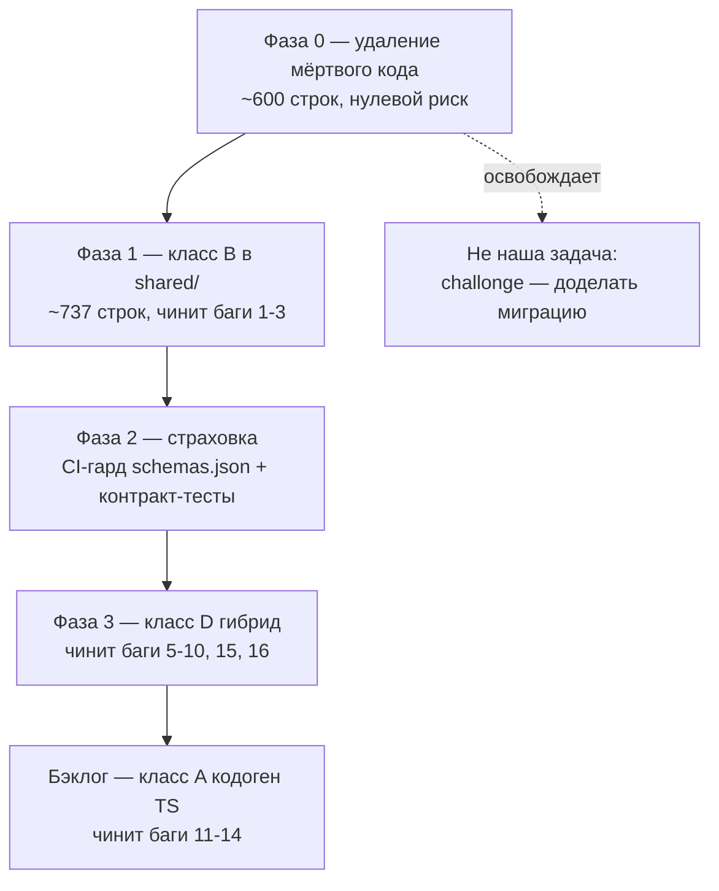

# Устранение зеркал — Design

**Статус:** дизайн согласован, к имплементации не приступали.
**Дата:** 2026-08-04
**Реестр зеркал:** [2026-08-04-code-mirrors-registry.md](./2026-08-04-code-mirrors-registry.md)

---

## Understanding Summary

- **Что делаем.** Триаж-программа устранения 62 зеркал кода, а не единый рефакторинг.
  Каждый из пяти классов зеркал лечится своим способом; классы делаются
  последовательно, потому что каждый следующий опирается на страховку предыдущего.
- **Зачем.** Из 62 зеркал **~17 уже разошлись**, и это дало **16 живых багов** —
  от 500 вместо 401 на неаутентифицированном read до тупика драфта на часах.
  Расхождение зеркала не падает, а тихо меняет результат.
- **Для кого.** Разработчики репозитория. Пользовательских изменений быть не должно:
  внешний контракт API остаётся байт-совместимым.
- **Ключевое ограничение.** Бэкенд-сервисы headless: вся REST-поверхность объявлена в
  Go-гейтвее как `[]edge.RouteSpec`. Любое перемещение кода не должно менять ни одного
  RPC-субъекта, иначе ломается роут.
- **Не-цели.** Дедупликация `challonge/sync.py` (у неё уже есть владелец —
  см. D6); слияние `team/{service,flows}.py` (расхождение содержательное); кодоген
  TS-типов (класс A — отдельная программа, D7).

## Допущения

1. Направление `shared/` → сервисы здоровое, обратных копий нет (проверено: 0
   ORM-классов в `src/` всех семи сервисов). Значит `shared/` — правильный адресат.
2. Байт-идентичные копии можно переносить механически без анализа семантики. Копии с
   расхождением требуют решения, какая версия каноническая.
3. `schemas.json` регенерируется за 9.5с — приемлемо для CI на каждый PR.
4. Мёртвый код удаляется вместе с его тестами. Тест, покрывающий недостижимый код, —
   не аргумент за сохранение.
5. Внешний контракт API не меняется ни на байт. Проверяется существующим
   `backend/scripts/app_parity_check.py` там, где он применим.

---

## Decision Log

### D1. Фаза 0 — удаление мёртвого кода идёт первой, до любого переноса

Хотя выбранный первый рычаг — класс B, исследование класса C нашло строго более дешёвый
первый шаг: **удаление**. Оно не требует ни анализа семантики, ни страховки, и уменьшает
объём работы всех последующих фаз.

Отвергнуто: «сначала класс B, удаление потом» — тогда мы рискуем перенести в `shared/`
код, который надо было удалить, и потратить ревью на мёртвые ветки.

### D2. `parser-service/src/services/admin/team.py` — удалить, а не чинить

274 строки, живой `AttributeError` внутри. Пройдены все проверки достижимости: нет
импортёров кроме двух тестов через `importlib`, нет `services/admin/registry.py` в
parser вовсе, нет ни одного `rpc.parser.*team*`, нет планировщика, ни один из 8
подписчиков `serve.py` не ведёт туда, динамического импорта в сервисе нет вовсе
(значит статический обход исчерпывающ), кросс-сервисного клиента нет.

Отвергнуто: починить null-guard (баг №4). Он в недостижимом коде — починка добавит
строку в файл, который надо удалить.

Прецедент в репозитории: решение D12 в
`docs/plans/2026-08-03-admin-match-surfaces-design.md:162` — parser-копия `finalize.py`
**удаляется**, а не обобщается.

### D3. Класс B — начинать с `core/auth.py` и `core/db.py`, не с `rpc/_common.py`

Скаут назвал `rpc/_common.py` крупнейшим зеркалом. AST-проверка это опровергла: там
**159** избыточных строк из 647, а не «~360». Настоящий объём — в `core/auth.py`
(**379** строк, из них пара analytics ≡ parser **100% идентична**) и `core/db.py`
(**170** строк, 7 копий файла по 24-36 строк, две пары по 100%).

Порядок: сначала два зеркала с байт-идентичными парами (нулевой риск, нужен только
перенос), потом `rpc/_common.py`, где перенос требует решений.

### D4. `rpc/_common.py` — ценность не в строках, а в корректности

159 строк — мало. Но `tournament-service/src/rpc/_helpers.py` это **пятая копия под
переименованными символами** (`_q`, `_q1`, `_payload`, `_dump`, `_run`, `_read`), из-за
чего `grep _detail_message` её не находит. Именно в ней живут три бага:

- `:122` `_read` не ловит `MissingIdentityError` → **500 вместо 401**;
- `:103,122` `str(exc.detail)` вместо `_detail_message` → **утечка Python-repr**;
- `:48` `_payload` без `isinstance(dict)`.

Складывание `_helpers.py` в общий `shared/rpc/envelope.py` чинит все три структурно, а
не заплаткой. Это и есть обоснование фазы, а не экономия 159 строк.

Отвергнуто: починить три бага точечно и оставить пятую копию. Через полгода она
разойдётся снова — ровно так она и разошлась.

### D5. `envelope` не унифицируется целиком — только его каркас

`envelope` совпадает лишь в одной паре из четырёх: balancer сериализует `dict`-detail в
JSON (`_common.py:148-151`), tournament не ловит `MissingIdentityError`, у остальных
разный набор `except`. Различие в маппинге ошибок **содержательное**, а не случайное.

Решение: в `shared/rpc/envelope.py` переносится параметризуемый каркас (сессия →
`rpc_ok(dump(...))` → маппинг исключений через передаваемую таблицу), а не готовая
функция. Сервис-специфичные ветки (`require_admin_panel` балансера,
`gate_tournament`/`optional_actor` app-service) остаются в сервисах.

### D6. `challonge/sync.py` — не наша задача, у неё есть владелец

1677 из ~1700 строк идентичны, но обе копии живые, и tournament — строгое надмножество
по side-effects. Причина двух копий задокументирована трижды:

- `backend/docs/tournament-service-write-path-inventory.md` — Target owner =
  tournament-service, Action = «Move Challonge writers»;
- `docs/plans/2026-08-03-admin-match-surfaces-design.md:35,503` — дедупликация объявлена
  **explicit non-goal**, решение D13 (`:163`) называет техническую причину:
  tournament-копия тянет сервис-локальный realtime через `veto_session.py`;
- `docs/plans/2026-08-03-admin-match-surfaces-plan.md:228-241` — задача T4 велит править
  **обе** копии идентично.

Правильное действие — **доделать миграцию** (перенести
`rpc.parser.encounter.create_challonge` в tournament-service, в гейтвее меняется одно
поле `Queue` на `parser/routes.go:69`, parser-копия удаляется), а не выносить в
`shared/`. Это отдельная задача с уже назначенным владельцем.

Побочно и независимо, в фазе 0: удалить мёртвый `close_redis`
(`parser .../sync.py:140`, утечка Redis-клиента при shutdown) и осиротевший пакет
`parser-service/src/worker/`.

Заодно: `docs/architecture.md:127-128` расходится с кодом (отдаёт Challonge только
tournament-service). Документ описывает целевое состояние. Пометить это в документе,
чтобы следующий читатель не принял его за описание реальности.

### D7. Класс A (кодоген TS) — отдельная программа, но CI-гард нужен сейчас

Пайплайн Pydantic → `schemas.json` → OpenAPI 3.1 существует, работает и **в синхроне**
(проверено запуском: md5 совпал, 9.5с). Но CI его не проверяет, и он уже дрейфовал
(`+724/-175`).

Решение: **CI-гард на `schemas.json` ставим в фазу 2** — 9.5 секунды за прекращение
целого класса тихого дрейфа. Сам кодоген TS-типов — в бэклог: требует полноты
`OPERATIONS`-таблиц (докстринг `openapi_schemas.py` сам признаёт неполноту: «ad-hoc
dicts / None (204) are intentionally omitted»), а отсутствующая запись деградирует до
generic `object` молча.

### D8. Класс D — гибрид, и приоритет внутри него задаёт наличие готового API

Три подхода по ситуации:

1. **Server-driven — когда бэкенд уже отдаёт данные, а фронт их игнорирует.** Самый
   дешёвый случай, и он есть: баг №16 — `frontend/src/lib/balancer-statuses.ts` держит
   построчный порт `BUILTIN_STATUS_META` с 4 разошедшимися описаниями, **хотя бэкенд уже
   отдаёт каталог** по `rpc.tournament.regstatus_catalog`. Это удаление файла, не
   рефакторинг. Эталон правильного устройства в репозитории:
   `schemas/encounter_report_form.py:32,64`.
2. **Единственный источник — когда правило вычислимо на бэке и его результат можно
   положить в ответ.** Правило флекса: канон `is_flex_computed`
   (`shared/models/registration/registration.py:200`), 4 копии, одна уже разошлась
   (баг №5, порог `>=1` против `>=2`). Отдавать `is_flex` в ответе и убрать три копии.
3. **Контракт-тест — когда дедуп невозможен.** Python↔Rust (discomfort, командные
   агрегаты, ключи конфига). Жанр в репозитории уже есть:
   `shared/tests/test_gateway_raw_sql_matches_models.py` + три
   `test_*_migration_matches_models.py` сравнивают рукописный артефакт с каноном.

Отвергнуто: только контракт-тесты для всего класса D. Тест фиксирует расхождение, но
оставляет N копий — цена поддержки не падает. Отвергнуто: только server-driven. Для
Python↔Rust это физически неприменимо.

### D9. Внутри класса D первым идёт конфиг балансера — 10 списков одних ключей

Один параметр перечислен в десяти местах (`defaults.py`, `public_contract.py`,
`provider.py` ×3, `schemas/balancer.py`, `presets.py`, `moo_backend.py`,
`tournament_balancer/src/lib.rs`, фронт ×2). Это уже дало два бага: фронт потерял
`team_max_pain_weight` и `time_limit_ms` и тащит два мёртвых ключа (№8), драфт вообще
не читает конфиг (№9). Третий (№7, `team_crossover_share`) при проверке **снят**: поле
имеет `#[serde(default)]` и его Rust-докстринг объявляет неэкспонирование намеренным.

Существующий `tests/test_config_consistency.py` покрывает только Python-внутренние
списки и **не смотрит** ни в `moo_backend._serialize_native_request`, ни в Rust
`ConfigSpec`, ни в `PUBLIC_CONFIG_KEYS`, ни во фронт. Расширение этого теста до полного
кольца — самый дешёвый способ запереть все три бага сразу.

### D10. `team/{service,flows}.py` — вынести 7 функций, модули не сливать

Обе копии живые и делают разное: parser — write-сторона с синхронными писателями для
матч-лог-парсера, tournament — read-сторона с Redis-кэшем `@cache`. **Дрейф сигнатур уже
произошёл**: `get_by_tournament` берёт `int` в parser и `models.Tournament` в tournament.

Выносится только дословно совпадающее и без side-effects: `team_entities`,
`player_entities`, `resolve_team_placement`, `to_pydantic`, `to_pydantic_player`,
`get_by_name_and_tournament`, `get_by_tournament_challonge_id`,
`get_player_by_user_and_tournament` — после согласования сигнатуры `get_by_tournament`.

Отвергнуто: полное слияние. Кэш, синхронная сессия и дрейф сигнатур делают наивное
слияние источником регрессии.

---

## Программа работ

### Фаза 0 — удаление (нулевой риск, ~600 строк)

| Что | Строк | Доказательство |
|---|---|---|
| `parser-service/src/services/admin/team.py` + 2 теста | 274 | D2 |
| `parser-service/src/worker/` целиком | ~80 | Пакет без импортёров; внутри второй мёртвый путь к challonge-импорту и `bulk_create_from_challonge`, который сразу `raise RuntimeError` |
| `parser .../challonge/sync.py:140 close_redis` | 5 | Не вызывается; `serve.py:197` зовёт одноимённую из `overwatch_rank/tasks.py:49`. **Утечка Redis-клиента при shutdown** |
| `parser .../team/service.py:309 construct_player` | 13 | Само-документирован как без вызывающих |
| `frontend/src/types/registration.types.ts:263` | ~20 | Второе объявление `StatusMeta` |
| Проверить остальные 7 модулей `parser-service/src/services/admin/` | ? | Живы только `settings` и `stage`; остальные проверить методом D2 |

### Фаза 1 — класс B в `shared/`

Порядок по возрастанию риска:

| Шаг | Зеркало | Адресат | Риск |
|---|---|---|---|
| 1.1 | `core/db.py` ×7 | `shared/core/db.py` (уже существует) | Нулевой: две пары 100%, все пары ≥94.7% |
| 1.2 | `core/auth.py`: analytics ≡ parser | `shared/rbac/` | Нулевой: **100% идентичны**, 218 строк |
| 1.3 | `core/auth.py`: tournament (76%) | то же | Низкий: свести 161 общую строку, оставить `get_registration_workspace_id` в сервисе |
| 1.4 | `core/workspace.py::workspace_filter` ×4 | `shared/tenancy/` | Нулевой: 4 строки, докстринг уже признаётся зеркалом |
| 1.5 | `rpc/_clients.py` ×2 | `shared/clients/` | Низкий |
| 1.6 | `rpc/_common.py` ×4 → каркас | `shared/rpc/envelope.py` | Средний: см. D5, `envelope` параметризуется |
| 1.7 | `_helpers.py` складывается туда же | то же | Средний: **чинит баги 1-3** |
| 1.8 | Шестая копия `_detail_message` в `shared/rpc/crud.py:64` | то же | Нулевой |

`core/auth.py` у app-service (30 строк) и balancer-service (316 строк) — **не зеркала**,
не трогаем.

### Фаза 2 — страховка

| Что | Стоимость | Что запирает |
|---|---|---|
| CI-гард: `export_openapi_schemas.sh` + `git diff --exit-code schemas.json` | 9.5с на PR | Весь класс тихого дрейфа Pydantic → OpenAPI |
| Расширить `tests/test_config_consistency.py` до полного кольца: `AlgorithmConfig` ↔ `CONFIG_LIMITS` ↔ `CONFIG_FIELD_DEFINITIONS` ↔ `PUBLIC_CONFIG_KEYS` ↔ `moo_backend._serialize_native_request` ↔ Rust `ConfigSpec` | Один тест | Баги 7, 8 и весь класс «новый ключ забыли в одном из 10 мест» |
| Контракт-тест discomfort: общие фикстуры → Python `Player.discomfort_map` == Rust `discomfort` == draft `role_discomfort` | Один тест ×2 языка | Расхождение условий (не чисел) — источник бага 10 |
| Контракт-тест правила флекса: 4 реализации на общей таблице | Один тест | Баг 5 |

### Фаза 3 — класс D, гибрид

| Правило | Подход | Действие | Чинит |
|---|---|---|---|
| Статусы регистрации | Server-driven | **Удалить** `frontend/src/lib/balancer-statuses.ts`, читать `rpc.tournament.regstatus_catalog` (бэкенд уже отдаёт) | 16 |
| Флекс | Единственный источник | Отдавать `is_flex` в ответе; убрать `serializers.py:87`, `sheet_parsing.py:460`, `workspace-helpers.ts:428` | 5 |
| Off-role | Единственный источник | `balance_analytics.py:132-137` вызывает канон из `result_serializer` | 6 |
| Playable-роль | Единственный источник **внутри драфта** | Свести `feasibility.py:139` и `rpc/draft.py:419-422` к `selection._playable_roles` | 10 |
| Конфиг балансера | Контракт-тест (сделан в фазе 2) + правки | Синхронизировать фронт-список ключей, передать конфиг в `FitConfig` драфта | 8, 9 |
| Discomfort, командные агрегаты | Контракт-тест | Дедуп невозможен (Python↔Rust) | — |
| Правило подписок | Контракт-тест на общих фикстурах вместо двух параллельных сюит | Добавить `deferred` и дедупликацию в TS-порт | 15 |
| Division grid, OW2 mapping, регексы, `MAX_AVATAR_SIZE`, `DEFAULT_MAX_TOP_HEROES` | Server-driven | Отдавать значением, а не переписывать формулу | — |

### Бэклог — класс A

Кодоген TS из `/api/openapi.json`. Предпосылки: полнота `OPERATIONS`-таблиц (сейчас
докстринг признаёт неполноту), CI-гард из фазы 2 как обязательное условие. Чинит баги
11-14 структурно.

---

## Инварианты, которые нельзя нарушить

1. **Ни один RPC-субъект не меняется.** Субъект — это `Queue` в
   `[]edge.RouteSpec`; смена ломает роут. Перемещение кода внутри сервиса безопасно,
   перемещение обработчика — нет.
2. **Ответы API байт-идентичны.** `dump(obj, exclude_none)` по умолчанию
   `exclude_none=False` — это воспроизведение дефолта FastAPI. Любая унификация
   `envelope` обязана сохранить per-service значение `exclude_none`.
3. **Сообщения ошибок сохраняются дословно.** Тексты 403 в `core/auth.py` различаются
   между сервисами; при переносе в `shared/` они становятся параметром, а не константой.
4. **Мёртвый код удаляется вместе с тестами.** Тест на недостижимый код — не аргумент.

## План верификации

| Фаза | Проверка |
|---|---|
| 0 | `uv run pytest` затронутых сервисов; `bunx tsc --noEmit`; ручной поиск ссылок на удалённое |
| 1 | Тесты всех 5 сервисов; `backend/scripts/app_parity_check.py` там, где применим; ручная проверка 401/403-путей (баги 1-3) |
| 2 | CI-гард должен **упасть** на искусственно внесённом дрейфе — иначе он бесполезен |
| 3 | Смоук: запуск баланса с изменённым `tank_impact_weight` — драфт должен согласиться с балансером (баг 9); драфт не должен предлагать нелегальный пик (баг 10) |

## Открытые вопросы

1. Фаза 0, пункт «остальные 7 модулей `parser-service/src/services/admin/`» — нужен ли
   отдельный проход методом D2, или достаточно удалить подтверждённое?
2. Кто владелец задачи «доделать миграцию challonge» (D6) — эта работа или отдельный
   тикет?
3. Порог для класса D: браться за все ~25 правил или только за те, что уже разошлись
   (13 из 25)?
