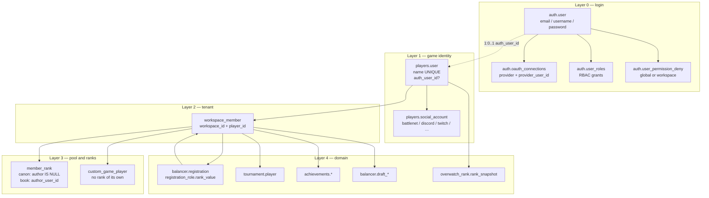
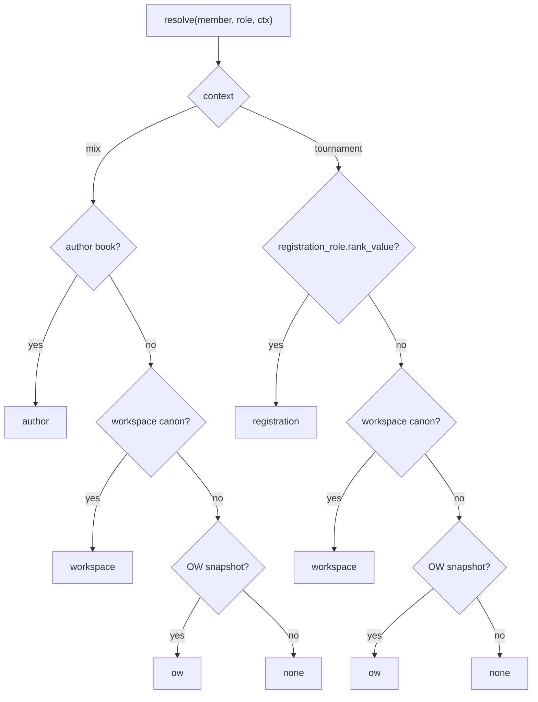
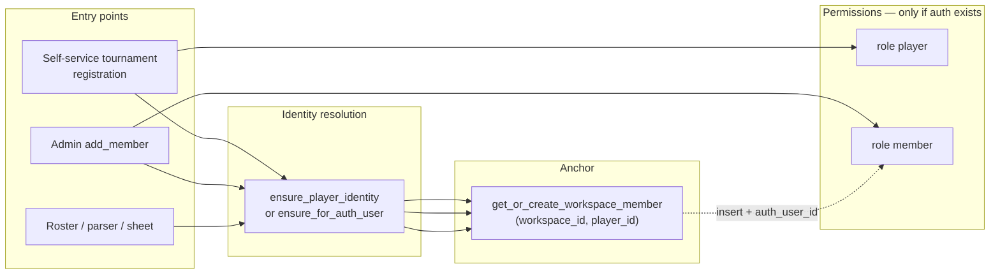
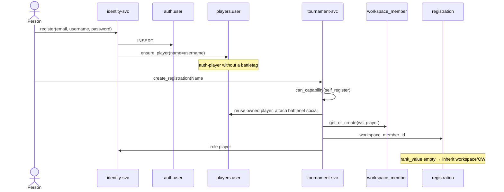
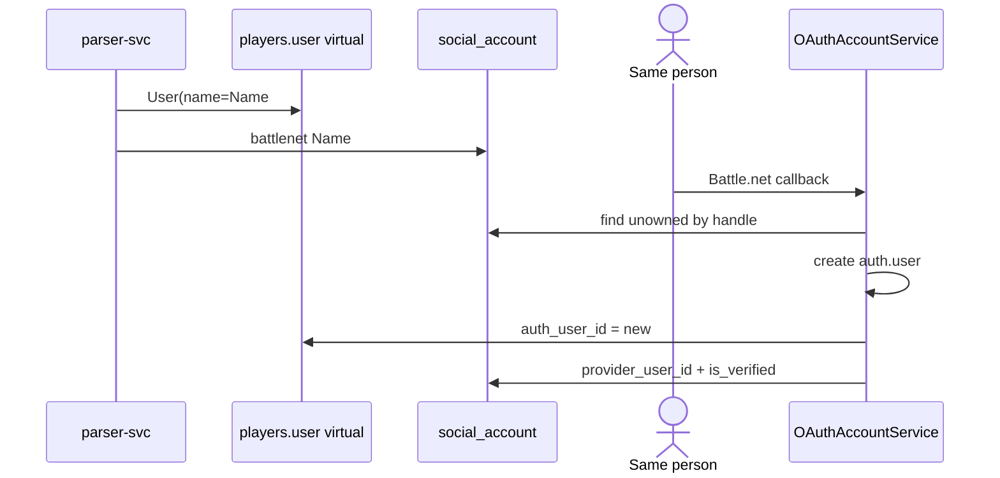
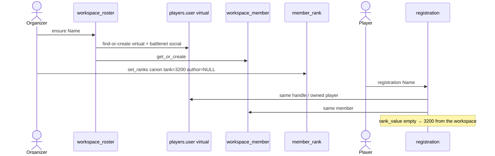

# Users, players, and workspace membership

The canonical OWT identity reference: who a "user" is, how `auth.user` differs from `players.user`, what a virtual player and an auth-player are, how a person enters a workspace, and how an account is linked to a game profile.

State: the current code after the identity/workspace refactor and the rank rework (`balancer.member_rank`). The historical design spec (`docs/superpowers/specs/2026-07-01-identity-workspace-refactor-design.md`) explains *why* identity looks like this; this document describes *how it is*.

**Related documents**

- System overview: [`docs/architecture.md`](./architecture.md)
- ERD: [`docs/database_erd.md`](./database_erd.md)
- Mix roster reference: [`docs/plans/2026-08-24-workspace-players-and-custom-games.md`](./plans/2026-08-24-workspace-players-and-custom-games.md)

**Reading paths**

| Who | What to read |
|---|---|
| New developer | §1 → §2 → §3 → §8 |
| Architect / reviewer | §1 → §2 → §4 → §7 |
| Touching login / OAuth / link | §5 → §6 → §10 |
| Touching registration / roster / achievements | §3.3 → §8.3 → §9 |
| Touching balancer / custom games / ranks | §3.4 → §3.5 → §8.3 |
| Operations / support | §10 → §11 → glossary |

---

## 1. Executive summary

There is no single "user" entity in the system. There are **four independent layers** that sometimes converge on one person and sometimes live apart for years.

| Layer | Table | Question it answers |
|---|---|---|
| Login | `auth.user` | Who can sign in, and what may this session do? |
| Game identity | `players.user` | Who is this person across tournaments, logs, and statistics? |
| Tenant membership | `public.workspace_member` | Does this player exist *in this* workspace? The mix roster is the same set of rows. |
| Ranks | `balancer.member_rank` + `registration_role.rank_value` | What SR does a member have in a role: author book, workspace canon, registration, OW snapshot. |

The invariant all of this separation exists for:

> A player can exist without an account. An account without a player is a hole: you cannot hang a `workspace_member` on it. That is why every signup immediately creates a bare `players.user`.

The account-to-player link is a **1:0..1 bijection**:

```
auth.user  1 ────── 0..1  players.user
                          ▲
                          │ auth_user_id UNIQUE NULL
```

- `players.user.auth_user_id IS NULL` — a **virtual player**: an identity from match logs, CSV, a sheet import, or being added to the mix roster. Cannot sign in.
- `players.user.auth_user_id = N` — an **auth-player**: the same game profile, owned by a specific `auth.user`. An account cannot have two players.

`workspace_member` is anchored on `player_id`, not on `auth_user_id`. That is why a virtual player can sit in a roster and carry registrations and achievements without ever logging in. RBAC (`user_roles`) stays on `auth.user`: permissions appear only after linking.

The mix roster is not a separate table. An organizer adds a BattleTag through `workspace_roster.ensure_member_for_battle_tag`: a virtual `players.user` plus a `workspace_member`. No RBAC is granted (there is no `auth_user_id`).

---

## 2. Architecture overview



**Ownership boundaries**

| Service | What it writes |
|---|---|
| `identity-service` | `auth.user`, OAuth, RBAC, self-service / admin player link, signup provisioning of `players.user` |
| `app-service` | CRUD for `players.user` and social accounts, CSV import, user merge, `workspace.add_member` |
| `tournament-service` | `ensure_player_identity`, `get_or_create_workspace_member` on registration, tournament rank resolution |
| `parser-service` | Creating / reusing `players.user` from match logs, anchoring the roster through `workspace_member` |
| `balancer-service` | Workspace roster, `member_rank`, custom games |

One PostgreSQL, one SQLAlchemy metadata. Schemas: `auth`, `players`, `public` (`workspace` / `workspace_member`), `balancer`.

---

## 3. Mental model

"Virtual player" and "auth-player" are not class names in the code. They are conversational labels on top of columns. The canonical vocabulary follows.

### 3.1. `players.user` — the global backbone

Model: `backend/shared/models/identity/user.py`. Table `players.user`.

```
id              BigInteger PK
name            UNIQUE          — display name; at signup = username/email
avatar_url
stream_visible  bool default true
auth_user_id    UNIQUE NULL FK auth.user(id) ON DELETE SET NULL
```

This is **not** an account. This is the person as a platform player: social handles, match statistics, OpenSkill, and the public profile `/users/:id` all hang off it.

| State | Name used in this document | How it appears |
|---|---|---|
| `auth_user_id IS NULL` | **virtual player** | CSV, sheet, log parser, admin-created profile, a non-primary link carried over from `auth.user_player` during migration |
| `auth_user_id = N` | **auth-player** | Signup (`ensure_player`), OAuth reconciliation onto an existing virtual player, self-service / admin link |

Invariants:

1. One `auth.user` owns **at most one** `players.user` (`UNIQUE(auth_user_id)`).
2. One `players.user` belongs to **at most one** account.
3. Deleting an account does **not** delete the player: `ON DELETE SET NULL` turns the player virtual and the history survives.
4. `name` is globally unique. On collision `UserRepository.ensure_for_auth_user` suffixes the hint with the auth id instead of failing.

### 3.2. `auth.user` — the login

Model: `backend/shared/models/identity/auth_user.py`. Table `auth.user`.

```
id, email UNIQUE, username UNIQUE
hashed_password     NULL for pure OAuth accounts
is_active, is_superuser, is_verified
first_name, last_name, avatar_url
```

Relationships:

- `player: User | None` — `uselist=False`, the reverse side of `players.user.auth_user_id`
- `oauth_connections` — proven external subjects
- `roles` through `auth.user_roles` — grants, not membership
- `refresh_tokens`

JWT issuance and `/validate` put an RBAC cache on the instance (`set_rbac_cache`): roles, permissions, workspaces, workspace_rbac, denies. `has_workspace_permission`, `can_capability`, and `is_denied` read that cache, not the ORM.

`is_workspace_member(workspace_id)` means superuser **or** the workspace id is present in the role cache. That is **not** the same as having a `workspace_member` row. A virtual tournament participant is "not a member" in this sense.

### 3.3. `workspace_member` — the anchor for entering a workspace

Model: `backend/shared/models/tenancy/workspace.py`. Table `public.workspace_member`.

```
id
workspace_id   FK workspace.id CASCADE
player_id      FK players.user.id CASCADE
display_name   NULL = fall back to players.user.name
UNIQUE (workspace_id, player_id)
UNIQUE (id, workspace_id)          — for composite FKs from the domain
```

There are **no** `auth_user_id` and `role` columns. The role lives in `auth.user_roles`. Membership is the fact that "this `players.user` exists in this workspace".

`workspace_member.id` is referenced by:

| Table | NULL? | Meaning |
|---|---|---|
| `balancer.registration.workspace_member_id` | yes | NULL = sheet/CSV without an identity, or a main+smurf collision |
| `balancer.member_rank.workspace_member_id` | no | Workspace canon and the host's personal book |
| `balancer.custom_game_player.workspace_member_id` | no | Mix lineup; carries no rank of its own |
| `tournament.player.workspace_member_id` | no | A roster slot always belongs to a member |
| `draft_team` / `draft_player` / `draft_pick` | — | Draft |
| `achievements.evaluation_result` / `override` | no | Achievements are scoped to a member, not to a global player |

Created **idempotently** through `get_or_create_workspace_member` (`INSERT … ON CONFLICT DO NOTHING` on `uq_workspace_member_workspace_player`). Concurrent registrations do not catch `IntegrityError`.

On a **real INSERT**, if the `player` already has an `auth_user_id`, the system role `member` is granted automatically — but only if the account has no role at all in that workspace yet (`assign_default_member_role_if_roleless`). This is additive: `player` / `admin` / custom roles are never downgraded.

The admin member list (`list_by_workspace`) filters on `auth_user_id IS NOT NULL`. A virtual `workspace_member` exists but is **not visible** as an RBAC member and is not manageable through auth-keyed `get_member`.

### 3.4. The mix roster is the same `workspace_member`

There is no separate `workspace_player` table any more. The pool the balancer sees is `workspace_roster`: member + BattleTag + `display_name`.

`ensure_member_for_battle_tag` (`backend/shared/services/workspace_roster.py:159`):

1. Find a `players.user` by battlenet handle.
2. Otherwise create a virtual `players.user(name=tag)` and an unverified battlenet social account.
3. `get_or_create_workspace_member`. The RBAC role `member` is not granted — the new player has no `auth_user_id`.

`display_name` on `workspace_member` is the workspace-local nickname; otherwise `players.user.name` is used.

### 3.5. Ranks

A single table, `balancer.member_rank`, replaced `workspace_player_rank`, `host_player_rank`, and the per-game pin on `custom_game_player`. The subject is a `workspace_member`, not a separate "roster row".

Model: `backend/shared/models/member_rank/member_rank.py`.

```
workspace_id
workspace_member_id     FK workspace_member CASCADE
author_user_id          NULL = workspace canon; otherwise the personal book of an auth.user
role                    tank / damage / support
rank_value              NOT NULL
```

Two partial unique indexes (Postgres treats NULLs in a unique index as distinct, so a plain constraint would allow two canons):

- `uq_member_rank_canon` — `(workspace, member, role) WHERE author_user_id IS NULL`
- `uq_member_rank_author` — `(workspace, author, member, role) WHERE author_user_id IS NOT NULL`

There is no `scope` column: the discriminator is the nullable `author_user_id`. A second source of truth is forbidden.

The fourth layer is **not** in this table:

| Layer (`RankScope`) | Where it lives | Who sees it |
|---|---|---|
| `author` | `member_rank.author_user_id = this account` | Only this host's mixes |
| `workspace` | `member_rank.author_user_id IS NULL` | Everyone in the workspace |
| `registration` | `registration_role.rank_value` | This tournament |
| `ow` | `overwatch_rank.rank_snapshot` on `players.user` | Fallback, normalized into the DivisionGrid |

Resolver: `pick_rank(layers)` (`backend/shared/domain/member_rank.py`). The first layer holding a **number** wins. `None` or a missing row falls through to the next layer. That is why "follow the canon" is the **absence** of a row, not a copy of the value. `clear` on a record **deletes** the role, it does not write 0.

The order is chosen by the caller — the two contexts disagree:

| Context | Order | Why |
|---|---|---|
| Mix (`MIX_ORDER`) | `author → workspace → ow` | Balance on the *host's reading*, not on the official canon |
| Tournament (`TOURNAMENT_ORDER`) | `registration → workspace → ow` | The number the organizer put on the registration |



An empty `registration_role.rank_value` **inherits** the canon/OW value. It used to read as unranked and dropped the player out of the balancer pool.

`custom_game_player` stores no rank. A host's correction goes into their `member_rank` layer and outlives the game.

Writing: `MemberRankService.set_ranks(..., author_user_id=)`. `author_user_id=None` writes the canon; anything else writes that account's book. The RPC `players.set_ranks` takes the author **only** from the actor: you cannot rewrite someone else's book over the wire. Reading someone else's book is allowed (`author_user_id` in the query) — it is the "what the host thinks" column.

Tournament entry point: `resolve_registration_ranks` (`backend/tournament-service/src/services/registration/rank_resolution.py`). Without a `workspace_member_id` or without a `workspace_id` only the registration layer answers — guessing the tenant is worse than not inheriting.

OW is pulled in only where the cheaper layers left a hole. Snapshots collapse into the best rank per role on `players.user`, then (if a grid was passed) are normalized into the DivisionGrid.


## 4. Design decisions

| Decision | Rejected | Why |
|---|---|---|
| Bijection `players.user.auth_user_id` | M2M `auth.user_player` + `is_primary` | The code already forbade "two players per account". The M2M was a dead crutch. |
| `workspace_member` on `player_id` | Anchoring on `auth_user_id` | Virtual players must appear in rosters and analytics without a login. |
| The role is not denormalized into `workspace_member` | A `role: str` column | It would drift from RBAC. The source of permissions is `user_roles`. |
| Signup creates `players.user` immediately | Lazy creation on the first registration | Otherwise `add_member` / `workspace_member.player_id NOT NULL` break for an organizer with no tournament history. |
| OAuth reuse only by `provider_user_id` | Matching by email | Email is not proof of ownership → account takeover. |
| Handle matching only against an **unowned** virtual player | Auto-linking any player by battletag/discord | A handle is attacker-controllable. Someone else's auth-linked player is a conflict for merge, not a case for a silent overwrite. |
| Identity collapse on registration ≠ full merge | Automatic `user_merge` on a tag collision | The virtual player's stats and achievements stay on the old id. A full transfer is a deliberate admin action. |
| Pool = `workspace_member`, ranks in `member_rank` | `workspace_player` + host book + per-game pin | One anchor shared with registration; mix and tournament impose different layer orders |
| An empty `registration_role.rank_value` inherits | An empty cell = unranked | Otherwise canon-ranked players fell out of the balancer pool |
| Unlink is blocked by `member+` roles, not by `player` | Blocking on any membership | The `player` role means tournament participant, not operational member. Otherwise you could not unlink a profile while an old registration is still around. |

---

## 5. Data models — details

### 5.1. Social identity

`players.social_account` (`backend/shared/models/identity/social.py`) replaced the separate battle_tag / discord / twitch / external_account tables.

```
user_id                 FK players.user CASCADE
provider                battlenet | discord | twitch | boosty | vk | youtube | …
username / username_normalized
url
provider_user_id        NULL until proven by an OAuth subject
is_verified             true after a completed OAuth flow
is_primary
```

Uniqueness:

- `(user_id, provider, username_normalized)` — one handle per player
- partial unique `(provider, provider_user_id) WHERE provider_user_id IS NOT NULL` — one external subject across the whole platform
- partial unique on `lower(btrim(username))` when `username_normalized IS NULL` — closes the NULL bypass

`social_account_visibility`: the presence of a row means visible in that scope. `workspace_id IS NULL` means the global profile; otherwise it is a specific workspace surface.

Normalization and upsert live in `backend/shared/services/social_identity.py`. A handle conflict raises `SocialHandleConflict`.

### 5.2. OAuth connection vs social account

Two tables about "an external account", with different owners:

| | `auth.oauth_connections` | `players.social_account` |
|---|---|---|
| Owner | `auth.user` | `players.user` |
| Key | `(provider, provider_user_id)` unique | handle + optional subject |
| Purpose | Sign in / attach a provider to the session | Show the battletag on the profile, match log rows |
| Tokens | yes | no |

OAuth does **not** treat a handle as sufficient proof. Player auto-link on login:

1. `find_player_by_subject(provider, provider_user_id)` — a cryptographically confirmed subject.
2. Otherwise `_find_unowned_player_by_handle` — exactly one `players.user` with that handle **and** `auth_user_id IS NULL`.
3. Otherwise a new `auth.user` plus a bare `ensure_player`.

Email plays **no part** in reuse (fail-closed, review C1/C2).

One account may link **several** accounts of the same provider (two Battle.net accounts). There is no `(auth_user_id, provider)` uniqueness. The only thing blocked is "this `provider_user_id` already sits on another `auth.user`".

### 5.3. RBAC next to identity

Workspace system roles (`WORKSPACE_SYSTEM_ROLE_NAMES`): `owner`, `admin`, `host`, `member`, `player`.

| Role | Permissions | How it appears | Blocks player unlink? |
|---|---|---|---|
| `player` | empty | self-service registration (`assign_workspace_system_role(..., "player")`) | no |
| `member` | member catalog | `add_member` / autofill when an auth-linked `workspace_member` is created | yes |
| `host` | member catalog + full `custom_game` CRUD | explicit assignment (mix creators: membership alone no longer opens mixes, see `_require_mix`) | yes |
| `admin` / `owner` | catalog | explicit assignment | yes |
| custom | its own | admin | yes |

`registration.self_register` is an allow-by-default capability. A workspace ban is `user_permission_deny(user_id, permission=self_register, workspace_id=…)`. A global deny (`workspace_id IS NULL`) cuts everywhere.

A deny beats even the superuser/admin bypass for *that* `(resource, action)`.

The JWT carries denies. A legacy token whose deny entry has no `workspace_id` is treated as a global deny.

### 5.4. Other entities tied to auth, not to the player

These stay on `auth.user.id` because they belong to a session or an operator, not to a game identity:

- `auth.api_key` — `(auth_user_id, workspace_id)`
- `auth.refresh_token`
- `subscriptions.entitlement`
- `tournament.preview_access`, `scrim_room.created_by_auth_user_id`
- `draft_session.captain_auth_user_id`, audit `actor_auth_user_id`
- `favorite_player` — `(auth_user_id, player_id)`: an account bookmarks someone else's game profile
- `encounter_saved_view`

`overwatch_rank.rank_snapshot` stays on `players.user.id` (it is a fact about a battletag, not about membership). It is the resolver's `ow` layer, not the workspace canon.

---

## 6. Linking an account to a player

The only storage for the link is the `players.user.auth_user_id` column. The `auth.user_player` table is gone. The `is_primary` parameter on the RPC is a shim: always `true`, ignored.

Service: `backend/identity-service/src/services/players.py` (`PlayerLinkService`).

### 6.1. Provisioning at account creation

**Password signup** (`AuthUserService.register`, `backend/identity-service/src/services/auth_users.py:116`):

1. Create the `auth.user`.
2. Grant the global role `user` if it exists in this deployment.
3. `ensure_player` → `UserRepository.ensure_for_auth_user(name_hint=username|email)`.
4. There is no battletag yet. Reconciliation happens on the first registration or on an OAuth link.

**OAuth signup** (`OAuthAccountService.find_or_create_user`):

```
oauth_connections(provider, subject) exists?
  → sign in to that auth.user, refresh tokens, _attach_verified_social_account
otherwise _find_existing_auth_user:
  1. player by verified provider_user_id
  2. otherwise exactly one unowned player by handle
  → if the player already has an auth_user_id — reuse that account
  → if the player has no owner — create an AuthUser and _link_player_if_unowned
otherwise create an AuthUser + ensure_player (bare)
create oauth_connections
```

`_link_player_if_unowned` **never** overwrites someone else's `auth_user_id`. A conflict is left to an admin merge.

### 6.2. Self-service link

RPC: the user is already signed in and picks an existing `players.user`.

Preconditions:

1. The account has an OAuth Discord **or** Battle.net connection. Otherwise 400: *"Link Discord or Battle.net OAuth account before linking a player"*.
2. Ownership: a normalized intersection between the OAuth connection's handles and the player's `social_account` handles (discord username/global_name/email **or** battletag). Otherwise 403.
3. The player is free or already belongs to this account. Another owner → 409.

After a successful `UPDATE players.user SET auth_user_id = …`:

- `_autofill_member_roles`: in every workspace that already has a `workspace_member` for this player, grant `member` if there are no roles yet. Tournament participation that happened *before* the account becomes a visible RBAC member.

### 6.3. Admin link / unlink

`admin_link` / `admin_unlink` skip the ownership check. They go through the same `_link_to_auth_user` / `_unlink_from_auth_user`. The `auth_user_id` in the unlink signature is compatibility ballast; what actually gets cleared is the player's column.

### 6.4. Unlink

Idempotent if the column is already `NULL`.

Blocked (409 plus a list of workspace names) if the account holds any role **other than** `player` (`workspace_names_blocking_player_unlink`). The reason: the `workspace_member` would stay, `list_by_workspace` would hide it (`auth_user_id IS NOT NULL`), and auth-keyed management would break.

The `player` role does **not** block unlink: that is a tournament participant, not an operational member.

After unlink the player is virtual again. History, roster slots, and registrations stay on `player_id`.

### 6.5. Authenticated OAuth link (attaching a provider)

Not to be confused with a player link. `OAuthAccountService.link_to_user` attaches `oauth_connections` to an already known `auth.user`.

- Same subject on the same account → refresh the tokens.
- Same subject on another account → 409, and the UI offers no way out: sign in with that provider, remove the connection in settings, link again.
- New subject → insert plus `_attach_verified_social_account(..., claim_subject=True)`.

`claim_subject=True` releases a stale verification/pin from a *different* `players.user` (a deleted account, an admin unlink, an unmerged profile) and attaches the verified social account to *this* auth user's player. Without that release the link "succeeds" while the linker's profile stays empty.

On a custom domain the link is not performed in the apex callback: a one-time ticket is issued and redeemed on the workspace's own domain from *its* session (`OAuthService.link` / `link_complete`). Otherwise the apex cookie and the custom-domain cookie are two different people.

### 6.6. What a link does **not** do

- It does not merge statistics, achievements, or past registrations. That is `UserMergeService` (`backend/app-service/src/services/admin/user_merge.py`).
- It does not create a `workspace_member`. Membership comes from a registration, `add_member`, or a roster import.
- It does not write `member_rank`. The canon and the host book go through the separate RPC `players.set_ranks`.

---

## 7. How the entities of joining a workspace fit together

"Joining a workspace" is not a single operation. There are three independent entry points that converge on `workspace_member`.



### 7.1. Self-service tournament registration

`RegistrationService.create_registration` (`backend/tournament-service/src/services/registration/service.py:526`).

1. Capability `registration.self_register` in this workspace. A deny → 403.
2. Create the `balancer.registration` (the row carries no `auth_user_id` / `workspace_id`; both were dropped in dbarch02).
3. `ensure_player_identity(..., auth_user_id, workspace_id)`:
   - resolves the `players.user`;
   - `get_or_create_workspace_member`;
   - writes `registration.workspace_member_id`.
4. `assign_workspace_system_role(..., "player")` — idempotent.
5. The registration is anchored on the `workspace_member`. Registration ranks live in `registration_role.rank_value` (empty = inherit the canon/OW).
6. Commit. A "this member already has a live registration in this tournament" collision hits the unique index → 409.

Without a battle_tag, `ensure_player_identity` may return `None` (except when anchoring an owned player). In that case the `player` role auto-enroll is skipped.

### 7.2. An admin adds a member

`WorkspaceService.add_member(workspace_id, auth_user_id)` (`backend/app-service/src/services/workspace/service.py:357`).

The signature still takes an `auth_user_id`. Internally:

1. `ensure_for_auth_user` — in case of a legacy account with no player.
2. `get_or_create_workspace_member`.
3. On INSERT of an auth-linked player — the `member` role.

`add_member_with_roles` then calls `replace_user_workspace_roles`. The last `owner` cannot be removed.

`get_member_auth_user_id` is the bridge back: a member only has a `player_id`, while RBAC lives on auth. If the player is virtual → 500: that row cannot be managed as an account.

### 7.3. Sheet / parser / admin roster

There is no player session. `ensure_player_identity` is called with `auth_user_id=None`:

- dedup by normalized battletag;
- otherwise a new virtual `players.user(name=battle_tag)`;
- anchor a `workspace_member`;
- on a member collision inside the same tournament (main + smurf) the anchor is **skipped** with a warning — one broken row does not fail the whole sync (`defer_member_collision_to_db=False`).

The parser and admin player CRUD use `resolve_workspace_member_id(tournament_id, player_id)`: the workspace comes from the tournament, then the same `get_or_create`.

### 7.4. `ensure_player_identity` — resolution priority

Source: `backend/tournament-service/src/services/registration/service.py:382`.

```
1. registration.workspace_member_id is already set
     → that player_id. Do not replay.
2. The registering auth_user already has a players.user
     → take it.
     If ANOTHER virtual player owns this battletag
       → _move_battle_tag_identity (battlenet social rows only).
         The virtual player's stats/achievements do NOT move.
3. Otherwise find a player by battletag (historical dedup).
4. Otherwise create User(name=battle_tag, auth_user_id=?).
Then upsert the battlenet social account for the main + smurfs.
Then anchor the workspace_member if it is not the right one yet.
```

`known_handles` is the sheet-sync cache: if the anchor exists and every tag is already known for this player, **zero** queries (`session.get` hits the identity map). Do not replace it with a repository get.

### 7.5. Registration and the mix roster

Registration no longer creates a separate roster row. The identity already sits on `workspace_member`. The effective rank of a cell comes from `resolve_registration_ranks` under `TOURNAMENT_ORDER`.

---

## 8. End-to-end flows

### 8.1. A new person signs up with a password and enters a tournament



Result: one `auth.user`, one `players.user`, one `workspace_member`, the `player` role, and a registration anchored on the member.

### 8.2. A virtual player from the logs later signs in with Battle.net



The next sign-in goes through `oauth_connections` / the verified subject — the fast path. Handle matching is no longer needed.

If someone has already linked that virtual player to a different account, the new OAuth flow does **not** steal the player: a second `auth.user` plus a bare `ensure_player` is created. An admin merge takes it from there.

### 8.3. An organizer adds a player to the pool, who later registers



Two registrations or two tags for the same `player_id` in the same workspace converge on one `workspace_member` (`UNIQUE(workspace_id, player_id)`). There is no separate roster merge.

### 8.4. An admin merges two `players.user` rows

`UserMergeService` repoints references from source to target:

- `workspace_member` is repointed per workspace (the target workspace may already have a member, or one may need to be created).
- `tournament.player`, achievements, and `balancer.registration` move through `workspace_member_id`, not through the old `user_id`.
- Direct FKs to `players.user` (statistics, kill feed, captain, …) go through `REFERENCE_CONFIG`.
- Audited in `user_merge_audit`.

This is the only legitimate way to say "these two people turned out to be one". Auto-link and identity collapse on registration **deliberately** do not do this.

---

## 9. Integrations and API shapes

### 9.1. Token / `/me`

The access token still returns `linked_players` as an array of length 0 or 1 (`LinkedPlayer`: `player_id`, `player_name`, `is_primary=true`, `linked_at`). The `is_primary` field and the list shape are frontend compatibility until the multi-link UI is removed.

`WorkspaceMembership` in the token: `workspace_id`, `slug`, `rbac_roles`, `rbac_permissions`. There is no `role` row in the database any more; where the contract still returns a single name, it is **derived** from the role set rather than read from `workspace_member`.

### 9.2. Workspace members (app-service)

`WorkspaceMemberRead`: `auth_user_id`, username/email/name, `rbac_roles`. Virtual rows never reach this read model.

`WorkspaceMemberCreate`: `auth_user_id` plus an optional `role` (`owner|admin|member`) or `role_ids`.

### 9.3. Public player (app-service)

`UserRead` = `players.user` plus social accounts (plus visibility in the admin UI). This is the `/users/:id` page, not the account.

### 9.4. Gateway

`gateway/internal/auth` resolves a JWT or an API key into an `AuthUser`. An API key is scoped to `(auth_user_id, workspace_id)`. Domain services receive an already rehydrated auth user with its RBAC cache.

---

## 10. Security model

| Threat | Defense |
|---|---|
| Taking over an account through the same email on OAuth | Email is not used for reuse. Only `provider_user_id` or an explicit authenticated link. |
| Taking over someone's auth-player through a matching discord/battletag | Auto-link on login only for `auth_user_id IS NULL`. Another account's link is never overwritten. |
| Self-service link to someone else's profile | Requires OAuth Discord/BN **and** an intersection of handles. Otherwise 403. |
| Two accounts, one Battle.net subject | Unique `(provider, provider_user_id)` on `oauth_connections` and on the verified social subject. |
| A custom-domain OAuth link binding the apex session | The ticket carries only the provider identity; it is redeemed on the domain from that domain's cookie. |
| A registration ban | `user_permission_deny` + `can_capability`; a deny beats a grant. |
| Unlink leaving a "ghost" RBAC member | 409 while `member+` roles are still held. Leave first. |
| Rewriting someone else's rank book | `players.set_ranks` takes `author_user_id` from the actor only, never from the wire |
| A superuser bypassing an avatar/social/self_register deny | No: `is_denied` is checked first. |


---

## 11. Troubleshooting

| Symptom | Where to look |
|---|---|
| A second `/users/id` appeared after login while the old virtual player is still alive | The handle did not match (normalization, or a different tag) **or** the virtual player was already owned. This needs an admin merge, not another login attempt. |
| The registration went through but the person is not in Members | Only the `player` role was granted. The Members screen shows auth-linked users with roles that make them RBAC members. Add through `add_member` or wait for the autofill on link. |
| `Cannot unlink … member of workspace(s): X` | Remove `member`/`admin`/`owner` or leave X first. The `player` role is not in the way. |
| OAuth says "account linked" but the profile is empty | A stale verified subject sits on another player. An explicit link now calls `release_foreign_subject`; older login paths without `claim_subject` can swallow the conflict (`SocialHandleConflict` → rollback, the login itself survives). |
| A sheet row without a `workspace_member_id` | Most likely main+smurf: two tags resolve to one player and the second live registration is in the same tournament. Check the `ensure_player_identity` warning in the log. |
| A player with a canon rank dropped out of the tournament pool | An empty `rank_value` is supposed to inherit. Look at `resolve_registration_ranks` / `TOURNAMENT_ORDER`, not at the raw `registration_role`. |
| The host sees a rank other than the canon | A mix reads `author` above `workspace`. The book is only written by that host's own `set_ranks(scope=author)`. |
| 500 `workspace_member N has no linked auth user` | An admin triggered an RBAC operation on a virtual member. Link player↔auth first, roles after. |
| Signup 409 "OAuth email already belongs…" | `auth.user.email` is unique and either the synthetic `id@provider.oauth` or the real email is taken. Sign in to the existing account and link the provider. |
| Two `players.user` rows with the same visible tag | Different `username_normalized`, or one of the tags is a smurf. Dedup looks at the normalized battlenet handle, not at `user.name`. |

Verification SQL (the same invariants as in the design spec):

```sql
-- Bijection: one auth → at most one player
SELECT auth_user_id, COUNT(*) FROM players."user"
WHERE auth_user_id IS NOT NULL
GROUP BY auth_user_id HAVING COUNT(*) > 1;          -- 0 rows

-- A member without an identity
SELECT COUNT(*) FROM workspace_member WHERE player_id IS NULL;  -- 0

-- A roster slot without an anchor
SELECT COUNT(*) FROM tournament.player WHERE workspace_member_id IS NULL;  -- 0

-- Two canons for the same member+role
SELECT workspace_member_id, role, COUNT(*) FROM balancer.member_rank
WHERE author_user_id IS NULL
GROUP BY workspace_member_id, role HAVING COUNT(*) > 1;          -- 0 rows
```

---

## 12. Evolution history

1. **Before the refactor.** `auth.user_player(auth_user_id, player_id, is_primary)` was a nominal M2M. `workspace_member(auth_user_id, role:str)`. Registrations and rosters mixed `auth_user_id` and `players.user.id`. `players.user` was created lazily on registration.
2. **Phase A.** The `players.user.auth_user_id` column, signup provisioning, workspace-scoped deny. Non-primary links became virtual players.
3. **Phase B.** `workspace_member` moved to `player_id`, the `role` column died, the system role `player` and the `self_register` capability appeared.
4. **Phase C / dbarch02+.** `balancer.registration` and `tournament.player` (plus achievements and draft) anchor on `workspace_member_id`.
5. **Workspace roster.** The mix pool became `workspace_member` + `workspace_roster`. The `workspace_player` table was removed.
6. **Ranks (`member_rank`).** One table instead of `workspace_player_rank` / `host_player_rank` / the per-game pin. A resolver with a layer order: mix `author → workspace → ow`, tournament `registration → workspace → ow`. An empty registration cell inherits.

Old names in the code that must not be mistaken for the model:

| Name | Reality |
|---|---|
| `is_primary` on the link RPC | Always true, a no-op |
| `linked_players: list` | 0 or 1 element |
| `User` in shared.models | This is `players.user`, not the account |
| `AuthUserPlayer` / `user_player` | Removed |
| `registration.auth_user_id` / `registration.workspace_id` | Removed |
| `tournament.player.user_id` | Removed, read `workspace_member.player_id` |
| `workspace_player` / `workspace_player_rank` / `host_player_rank` | Removed; the pool is the member, the ranks are `member_rank` |
| `pick_rank(override, host, canon, ow)` | Removed; `pick_rank([(scope, value), …])` |

---

## Appendix A. Glossary

| Term | Definition |
|---|---|
| **Auth user / account** | An `auth.user` row. Session, JWT, RBAC. |
| **Player / `players.user`** | The global game identity. May have no account. |
| **Auth-player** | A `players.user` with `auth_user_id` set. |
| **Virtual player** | A `players.user` without `auth_user_id`. Logs, CSV, imports, being added to the mix roster. |
| **Workspace member** | A `(workspace_id, player_id)` row. The mix pool and the anchor for ranks, registrations, and rosters. |
| **Canon / workspace rank** | A `member_rank` with `author_user_id IS NULL`. Visible to everyone. |
| **Author book / author rank** | A `member_rank` with a concrete `author_user_id`. Only that host's mixes. |
| **`player` role** | The system RBAC role for "tournament participant". Empty permissions. Does not make the person a visible operational member. |
| **`member` role** | The baseline operational member. Autofilled on INSERT of an auth-linked member and on a player link onto already existing anchors. |
| **Social account** | A handle on a `players.user`. Verified means proven by an OAuth subject. |
| **OAuth connection** | A proven external account on an `auth.user`. Required to sign in and for a self-service link to pass the ownership check. |
| **Identity collapse** | Moving the battlenet social account from a virtual player to an owned player during registration. Not a merge. |
| **User merge** | The admin transfer of every domain reference from source to target. |
| **Capability** | An allow-by-default permission (`registration.self_register`, `account.avatar`, `account.social`) that can only be denied. |

In code comments and logs a virtual player is often called a `shadow` player. Same thing, not a second kind.

---

## Appendix B. File map

| Topic | Path |
|---|---|
| `players.user` | `backend/shared/models/identity/user.py` |
| `auth.user` | `backend/shared/models/identity/auth_user.py` |
| Social | `backend/shared/models/identity/social.py`, `backend/shared/services/social_identity.py` |
| OAuth connection | `backend/shared/models/identity/oauth.py` |
| `workspace_member` | `backend/shared/models/tenancy/workspace.py` |
| `get_or_create_workspace_member` | `backend/shared/repository/workspace.py:425` |
| Workspace roster | `backend/shared/services/workspace_roster.py` |
| Ranks (model) | `backend/shared/models/member_rank/member_rank.py` |
| Ranks (resolver) | `backend/shared/domain/member_rank.py`, `backend/shared/services/member_rank.py` |
| Tournament ranks | `backend/tournament-service/src/services/registration/rank_resolution.py` |
| Player link | `backend/identity-service/src/services/players.py` |
| Signup + `ensure_player` | `backend/identity-service/src/services/auth_users.py` |
| OAuth match / link | `backend/identity-service/src/services/oauth_accounts.py` |
| OAuth HTTP/state/tickets | `backend/identity-service/src/services/oauth.py` |
| Registration + identity | `backend/tournament-service/src/services/registration/service.py` |
| `add_member` | `backend/app-service/src/services/workspace/service.py` |
| User merge | `backend/app-service/src/services/admin/user_merge.py` |
| RBAC catalog / autofill / unlink guard | `backend/shared/rbac/catalog.py`, `backend/shared/rbac/bootstrap.py` |
| Link tests | `backend/identity-service/tests/test_player_link_service.py` |
| OAuth match tests | `backend/identity-service/tests/test_oauth_account_matching.py` |
| Registration reconciliation tests | `backend/tournament-service/tests/test_ensure_player_identity_reconciliation.py` |
| Member anchor tests | `backend/shared/tests/test_workspace_member_player_anchor.py` |
| Rank resolution tests | `backend/balancer-service/tests/test_member_rank_resolve.py`, `backend/tournament-service/tests/test_registration_rank_resolution.py` |

---

## Appendix C. Invariants that must not be "simplified"

1. **Two User layers.** `auth.user` and `players.user` cannot be collapsed: a virtual player's history and the public profile outlive account deletion.
2. **Member on the player, RBAC on auth.** Any code that writes `workspace_member.auth_user_id` or reads `member.role` is looking at a schema that no longer exists.
3. **Do not match logins by email and do not auto-link an owned player by handle.** Both paths are takeover.
4. **Do not replace identity collapse with a full merge** on the hot registration path. A silent stats transfer is irreversible and breaks other people's tournament pages.
5. **Do not anchor a registration directly on `players.user.id`.** The only identity column on a registration is `workspace_member_id`.
6. **No rank row means inherit.** Do not write 0 "to clear it". `clear` deletes the layer. Do not hardcode `override > host > canon > ow`.
